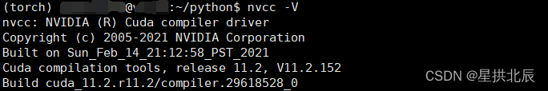

# 深度学习用到的常用术语

- 特征(*feature*)：预测时使用的输入变量
- 特征集(*feature set*)：训练深度学习模型时采用的一组特征
- 标签(*label*)：监督学习中样本的“标准答案”
- 类别(*class*)：为标签枚举的一组目标值中的一个
- 样本(*example*)/输入(*input*)：数据集的一行，分为有标签样本和无标签样本
- 权重(*weight*)：线性模型中特征的系数，或者深度网络中的边
- 偏差(*bias*)：距离原点的截距或偏移
- 激活函数(*activation function*)：一种用于对上一层所有输入加权求和后生成输出值以传递给下一层的函数
- 反向传播(*back propagation*)：在神经网络上执行梯度下降法的主要算法，先前向传播计算并存储每个结点的输出值，再反向传播遍历图去计算损失函数值相对每个参数的偏导数
- 批次(*batch*)：模型训练的一次迭代(一次梯度更新)中使用的样本集
- 批次大小(*batch size*)：一个批次中的样本数
- 轮次(*epoch*)：在训练时，整个数据集的一次完整遍历
- 层(*layer*)：一组神经网络中负责处理一组输入特征或一组神经元的输出的神经元
- 全连接层(*fully connected layer*)：又称密集层，一种每个节点均与下一隐藏层中每个节点相连的隐藏层
- 输入层(*input layer*)：神经网络的第一层
- 隐藏层(*hidden layer*)：神经网络中的合成层，介于输入层和输出层之间
- 输出层(*output layer*)：神经网络的最后一层
- 学习率(*learning rate*)：训练模型时用于梯度下降的一个标量，学习率×梯度＝梯度步长
- 指标(*metric*)：可能在机器学习系统中得到优化的重点关注的指标
- 神经网络(*neural network*)：一种模型，灵感来自脑部结构，由多个层构成，每个层都包含简单相连的单元或神经元(非线性关系)
- 神经元(*neuron*)：神经网络中的节点，接受多个输入，应用激活函数将输入值加权处理后生成输出值
- 过拟合(*overfitting*)：创建的模型与训练数据过于匹配，以致模型无法根据新数据进行正确的预测
- 参数(*parameter*)：深度学习自行训练的模型的变量
- 预测(*prediction*)/输出(*output*)：模型在收到输入样本后的输出
- 回归模型(*regression model*)：一种能够将输入的连续的值映射到输出的离散的值的模型
- 分类模型(*classification model*)：一种用于区分两种或多种离散类别的模型
- 序列模型(*sequence model*)：一种输入有序列依赖性的模型

# 深度学习环境搭建

推荐阅读：[连接远程Linux服务器](https://blankspace.blog.csdn.net/article/details/126098882)

推荐阅读：[Conda安装TensorFlow和PyTorch的GPU支持包](https://blankspace.blog.csdn.net/article/details/126534763)

推荐阅读：[VSCode连接远程Linux服务器](https://blankspace.blog.csdn.net/article/details/127764676)

推荐阅读：[VSCode通过虚拟环境运行Python程序](https://blankspace.blog.csdn.net/article/details/127766482)

## TensorFlow安装

可以选择conda安装和pip安装，个人推荐pip安装。

conda搜索TensorFlow的GPU版本：

```shell
conda search tensorflow-gpu
```

conda安装TensorFlow的GPU版本：

```shell
conda install tensorflow-gpu==2.2.0
```

pip安装TensorFlow的GPU版本：

```shell
pip install tensorflow-gpu
```

## PyTorch安装

可以选择conda安装和pip安装，个人推荐pip安装。

conda搜索PyTorch的GPU版本：
```shell
conda search torch-gpu
```

conda安装PyTorch的GPU版本(版本1.2.0)：
```shell
conda install torch-gpu==1.2.0
```

CUDA版本查看：
```shell
nvcc -V
```



pip安装PyTorch的GPU版本：
```shell
pip install torch torchvision torchaudio
```

pip安装PyTorch的命令应该去[官网](https://pytorch.org)查看：


pip安装不顺可以直接下载[.whl](http://download.pytorch.org/whl)文件，本地`pip install`。
