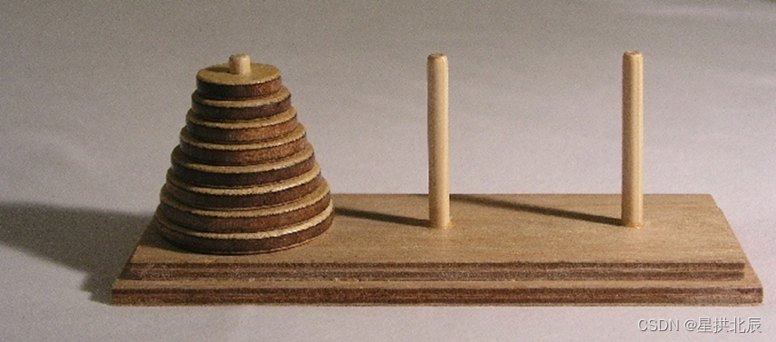

---
title: 分治算法解决汉诺塔问题
date: 2019-10-05 16:57:00
summary: 本文基于分治法解决汉诺塔问题，用Java编程实现。
mathjax: true
tags:
- 算法
categories:
- 算法分析与设计
---

# 汉诺塔

汉诺塔，又称河内塔，是一个源于印度古老传说的益智玩具。大梵天创造世界的时候做了三根金刚石柱子，在一根柱子上从下往上按照大小顺序摞着64片黄金圆盘。大梵天命令婆罗门把圆盘从下面开始按大小顺序重新摆放在另一根柱子上。并且规定，在小圆盘上不能放大圆盘，在三根柱子之间一次只能移动一个圆盘。



# TOH问题

汉诺塔问题（TOH）可以用分治算法范型来递归求解：

```java
public class TOH {

    public int hanoi(int ringNum, int startRod, int endRod) {
        int moveNum = 0;
        if (ringNum > 0) {
            moveNum += hanoi(ringNum-1, startRod, 6-startRod-endRod);
            System.out.println("将" + ringNum + "圆盘从" + startRod + "杆移动到" + endRod + "杆");
            moveNum++;
            moveNum += hanoi(ringNum-1, 6-startRod-endRod, endRod);
        }
        return moveNum;
    }

    public static void main(String[] args) {
        TOH hanoi = new TOH();
        hanoi.hanoi(3, 1, 3);
    }

}
```

运行结果：

```text
将1圆盘从1杆移动到3杆
将2圆盘从1杆移动到2杆
将1圆盘从3杆移动到2杆
将3圆盘从1杆移动到3杆
将1圆盘从2杆移动到1杆
将2圆盘从2杆移动到3杆
将1圆盘从1杆移动到3杆
```

# ATOH问题

如果我们增强限制条件，成为相邻汉诺塔问题（ATOH）：不允许在最左侧和最右侧桩子之间移动，只能在相邻桩子之间移动；也不允许将圆环移动到中间桩子上，因为大圆环不能压在小圆环上。

```java
public class ATOH {

    public int aHanoi(int ringNum, int startRod, int endRod) {
        int moveNum = 0;
        if (ringNum == 1) {
            System.out.println("将" + ringNum + "圆盘从" + startRod + "杆移动到" + (6-startRod-endRod) + "杆");
            System.out.println("将" + ringNum + "圆盘从" + (6-startRod-endRod) + "杆移动到" + endRod + "杆");
            moveNum+=2;
        } else {
            moveNum += aHanoi(ringNum-1, startRod, endRod);
            System.out.println("将" + ringNum + "圆盘从" + startRod + "杆移动到" + (6-startRod-endRod) + "杆");
            moveNum++;
            moveNum += aHanoi(ringNum-1, endRod, startRod);
            System.out.println("将" + ringNum + "圆盘从" + (6-startRod-endRod) + "杆移动到" + endRod + "杆");
            moveNum++;
            moveNum += aHanoi(ringNum - 1, startRod, endRod);
        }
        return moveNum;
    }

    public static void main(String[] args) {
        ATOH hanoi = new ATOH();
        hanoi.aHanoi(3, 1, 3);
    }

}
```

运行结果：

```text
将1圆盘从1杆移动到2杆
将1圆盘从2杆移动到3杆
将2圆盘从1杆移动到2杆
将1圆盘从3杆移动到2杆
将1圆盘从2杆移动到1杆
将2圆盘从2杆移动到3杆
将1圆盘从1杆移动到2杆
将1圆盘从2杆移动到3杆
将3圆盘从1杆移动到2杆
将1圆盘从3杆移动到2杆
将1圆盘从2杆移动到1杆
将2圆盘从3杆移动到2杆
将1圆盘从1杆移动到2杆
将1圆盘从2杆移动到3杆
将2圆盘从2杆移动到1杆
将1圆盘从3杆移动到2杆
将1圆盘从2杆移动到1杆
将3圆盘从2杆移动到3杆
将1圆盘从1杆移动到2杆
将1圆盘从2杆移动到3杆
将2圆盘从1杆移动到2杆
将1圆盘从3杆移动到2杆
将1圆盘从2杆移动到1杆
将2圆盘从2杆移动到3杆
将1圆盘从1杆移动到2杆
将1圆盘从2杆移动到3杆
```

# 算法复杂度分析

 ***TOH*** 问题的递推式为：$T_{n}=2T_{n-1}+1$

$T_{0}=0$（没有圆盘不需要移动）
$T_{1}=1$（一个圆盘直接移动过去）
$T_{2}=3$
$T_{3}=7$
$T_{4}=15$
$……$
$T_{n}=2^{n}-1$

其中$T_{n}$是解决圆环TOH所需的移动次数，指数级复杂度。

***ATOH*** 问题的递推式为：$A_{n}=3A_{n-1}+2$

$A_{0}=0$
$A_{1}=2$
$A_{2}=8$
$A_{3}=26$
$A_{4}=80$
$……$
$A_{n}=3^{n}-1$

该问题是指数级复杂度，更加复杂

验证：上述测试的输出中，TOH问题有7次移动，ATOH需要26次，符合预期。

# TOH问题与格雷码

格雷码(RBC/GrayCode)是一种二进制系统，连续的两个值只差一个二进制位或者比特，被广泛应用于数字通信中的纠错工作。其实，**格雷码与TOH问题也有着某种关联**。

位值1的格雷码就是{0, 1}，叫做L1.通过反转1位编码就可以构造出位值2的格雷码{1, 0}，叫做L2。把L1的所有项加上前缀0，同时把L2的所有项加上前缀1，就得到了L1‘ = {00, 01}和L2' = {11, 10}。把L1‘和L2’拼接起来就得到了2位的格雷码{00, 01, 11, 10}。

通过这种方式，就可以由2位格雷码生成3位格雷码{000, 001, 011, 010, 110, 111, 101, 100}，接着生成4位的格雷码{0000, 0001, 0011, 0010, 0110, 0111, 0101, 0100, 1100, 1101, 1111, 1110, 1010, 1011, 1001, 1000}，依此类推。

如果TOH问题带有n个圆环，就需要n位格雷码，然后**格雷码会表明需要进行的移动操作**。在TOH中有$2^n - 1$次，对应$2^n$长度的格雷码中的$2^n - 1$次移位。最小圆环对应最右侧的最低有效位，最大的圆环对应最左侧的最高有效位。移动的圆环对应变动的位数。例如，000->001就是移动最小的圆环。可是要移动到哪个桩子上呢？如果桩子可以选择，这就有很大的关系了。

对于最小的圆环，总有两个桩子可供移入。
对于其他圆环，则只有一种可能。
如果圆环数量是奇数，则最小的圆环会按照以下顺序移动： ==**起始桩->终止桩->中间桩->起始桩->终止桩->中间桩->……**== 依此类推。
如果圆环数是偶数，则顺序必须是： ==**起始桩->中间桩->终止桩->起始桩->中间桩->终止桩->……**== 依此类推。

所谓4圆环、5圆环，思想类似。
