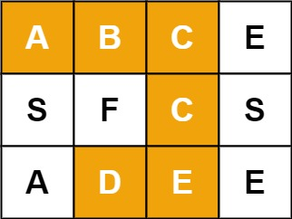

# 题目描述

给定一个 m x n 二维字符网格 board 和一个字符串单词 word 。如果 word 存在于网格中，返回 true ；否则，返回 false 。

单词必须按照字母顺序，通过相邻的单元格内的字母构成，其中“相邻”单元格是那些水平相邻或垂直相邻的单元格。同一个单元格内的字母不允许被重复使用。

例如，在下面的 3×4 的矩阵中包含单词 "ABCCED"（单词中的字母已标出）。



示例 1：
输入：board = [["A","B","C","E"],["S","F","C","S"],["A","D","E","E"]], word = "ABCCED"
输出：true

示例 2：
输入：board = [["a","b"],["c","d"]], word = "abcd"
输出：false
 
提示：
$\rm m = board.length$
$\rm n = board[i].length$
$\rm 1 ≤ m, n ≤ 6$
$\rm1 ≤ word.length ≤ 15$
$\rm board$ 和 $\rm word$ 仅由大小写英文字母组成

来源：力扣（LeetCode）
链接：[https://leetcode.cn/problems/ju-zhen-zhong-de-lu-jing-lcof](https://leetcode.cn/problems/ju-zhen-zhong-de-lu-jing-lcof)
著作权归领扣网络所有。商业转载请联系官方授权，非商业转载请注明出处。

# 算法设计

本题可以用回溯算法深度优先遍历矩阵求解，本算法可以递归实现。

推荐阅读：[递归与非递归](https://blankspace.blog.csdn.net/article/details/102224364)
推荐阅读：[DFS与BFS](https://blankspace.blog.csdn.net/article/details/115131649)

## 基本结构

对于涉及递归的算法，我们一般要将递归部分与入口分开，因此可以定义为：

```java
class Solution {
    public boolean exist(char[][] board, String word) {
        // TODO
    }
    private boolean dfs() {
        // TODO
    }
}
```

`dfs()`方法的入参列表暂不定义，在设计中慢慢明确。

为了方便处理字符串，我们将Java字符串先转为char[]：

```java
char[] wordChars = word.toCharArray();
```

## 选择初始状态

本题的基本求解思路是：遍历矩阵的每一个数据元素尝试作为起始点，向四周寻找符合要求的下一个数据元素，直至达到目标长度。

为此，需要先遍历此矩阵，尝试寻找适合作为起始点的数据元素。什么是合适的起始数据元素？当然是`board[][]`中与`wordChars[0]`相等的数据元素。

```java
for (int i = 0; i < m; i++) {
    for (int j = 0; j < n; j++) {
        if (board[i][j] == wordChars[0]) {
            // TODO
        }
    }
}
```

符合起始条件的数据元素可以被当做DFS的初始状态。`//TODO`处是我们调用递归函数的起点。

## 设计递归方法

递归树的深度应该是`word`字符串的长度，因此递归的终止条件也与此有关。可以返回true的情况是：在`wordChars[][]`中选出了长度等于`word`长度的序列，并且此序列与`word`字符串序列的每个元素的值一一对应相等。这两个条件中，前者适合作为递归的终止条件，而后者更适合作为每一次继续递归的准入条件。

递归函数的返回值的boolean。我们想要的是存在一个符合要求的序列，因此要把结果求或，因为或运算的规则是：**有真即为真**。

推荐阅读：[布尔逻辑](https://blankspace.blog.csdn.net/article/details/129391439)

考虑到遍历应该是四个方向的，因此`dfs()`的程序结构应该是：
```java
private boolean dfs() {
    if (wordChars.length == length) {
        return true;
    }
    if (board[x - 1][y] == wordChars[length]) {
        // TODO
        boolean result = dfs(board, length + 1, x - 1, y);
        // TODO
        if (result) {
            return true;
        }
    }
    if (board[x][y - 1] == wordChars[length]) {
        // TODO
        boolean result = dfs(board, length + 1, x, y - 1);
        // TODO
        if (result) {
            return true;
        }
    }
    if (board[x + 1][y] == wordChars[length]) {
        // TODO
        boolean result = dfs(board, length + 1, x + 1, y);
        // TODO
        if (result) {
            return true;
        }
    }
    if (board[x][y + 1] == wordChars[length]) {
        // TODO
        boolean result = dfs(board, length + 1, x, y + 1);
        // TODO
        if (result) {
            return true;
        }
    }
    return false;
}
```

我们仍然没有添加`dfs()`的参数，但此时可以考虑一下了。
`dfs()`需要的参数是当前的坐标（一个$\rm x$、一个$\rm y$）、`board`二维数组、字符串的字符数组序列`wordChars`、当前新序列的长度（要与`wordChars.length`比较）。
`wordChars`可以以成员变量的形式充当全局变量，无需反复传递；`x`、`y`、`length`是不断改变状态的，没必要作为全局变量；`board`作为全局变量的话还需要额外开辟一块空间，没有必要，因此可以当做参数传递。

因此，`dfs()`的函数头是：

```java
private boolean dfs(char[][] board, int length, int x, int y)
```

对于数组、矩阵的问题，至关重要的问题是越界检查。上下左右四个边界不能越界。因此四个判断条件分别修改为：

```java
if (x > 0 && board[x - 1][y] == wordChars[length]) {
    // TODO
}
if (y > 0 && board[x][y - 1] == wordChars[length]) {
    // TODO
}
if (x < m - 1 && board[x + 1][y] == wordChars[length]) {
    // TODO
}
if (y < n - 1 && board[x][y + 1] == wordChars[length]) {
    // TODO
}
```

至此，还缺少了对“回头路”的检查。通常，解决方法是单独开辟一个二维`visited`数组。`visited`被定义为成员变量，其元素是布尔类型的，在每次访问前后发生状态改变。

至此，我们完成了程序设计的过程。

```java
class Solution {
    private boolean[][] visited;
    private char[] wordChars;
    private int m, n;

    public boolean exist(char[][] board, String word) {
        m = board.length;
        n = board[0].length;
        visited = new boolean[m][n];
        wordChars = word.toCharArray();
        for (int i = 0; i < m; i++) {
            for (int j = 0; j < n; j++) {
                if (board[i][j] == wordChars[0]) {
                    visited[i][j] = true;
                    if (dfs(board, 1, i, j)) {
                        return true;
                    }
                    visited[i][j] = false;
                }
            }
        }
        return false;
    }

    private boolean dfs(char[][] board, int length, int x, int y) {
        if (wordChars.length == length) {
            return true;
        }
        if (x > 0 && board[x - 1][y] == wordChars[length] && !visited[x - 1][y]) {
            visited[x - 1][y] = true;
            boolean result = dfs(board, length + 1, x - 1, y);
            visited[x - 1][y] = false;
            if (result) {
                return true;
            }
        }
        if (y > 0 && board[x][y - 1] == wordChars[length] && !visited[x][y - 1]) {
            visited[x][y - 1] = true;
            boolean result = dfs(board, length + 1, x, y - 1);
            visited[x][y - 1] = false;
            if (result) {
                return true;
            }
        }
        if (x < m - 1 && board[x + 1][y] == wordChars[length] && !visited[x + 1][y]) {
            visited[x + 1][y] = true;
            boolean result = dfs(board, length + 1, x + 1, y);
            visited[x + 1][y] = false;
            if (result) {
                return true;
            }
        }
        if (y < n - 1 && board[x][y + 1] == wordChars[length] && !visited[x][y + 1]) {
            visited[x][y + 1] = true;
            boolean result = dfs(board, length + 1, x, y + 1);
            visited[x][y + 1] = false;
            if (result) {
                return true;
            }
        }
        return false;
    }
}
```


即便能够通过，但这段代码仍然是臃肿的，我们还可以进一步完善它。

遗憾的是，想要改变就必须从整体结构改变。

# 实现代码

```java
class Solution {
    private boolean[][] visited;
    private char[] wordChars;
    int m, n;

    public boolean exist(char[][] board, String word) {
        m = board.length;
        n = board[0].length;
        visited = new boolean[m][n];
        wordChars = word.toCharArray();
        for (int i = 0; i < m; i++) {
            for (int j = 0; j < n; j++) {
                if (dfs(board, 0, i, j)) {
                    return true;
                }
            }
        }
        return false;
    }

    private boolean dfs(char[][] board, int length, int x, int y) {
        if (x < 0 || x >= m || y < 0 || y >= n || board[x][y] != wordChars[length] || visited[x][y]) {
            return false;
        }
        if (length == wordChars.length - 1) {
            return true;
        }
        visited[x][y] = true;
        boolean result = dfs(board, length + 1, x - 1, y) || dfs(board, length + 1, x, y - 1) || dfs(board, length + 1, x + 1, y) || dfs(board, length + 1, x, y + 1);
        visited[x][y] = false;
        return result;
    }
}
```


