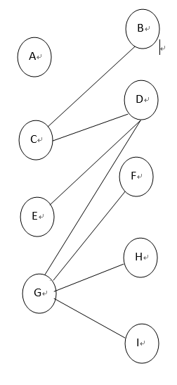

---
title: 图的着色问题
date: 2019-10-13 21:13:28
summary: 本文分享图的着色问题算法设计，用Python编程实现。
mathjax: true
tags:
- 算法
- Python
categories:
- 算法分析与设计
---

# 图的字典表示

下面的字典代表一个图：


```python
graph = {'B': ['C'],
         'C': ['B', 'D'],
         'D': ['C', 'E', 'F'],
         'E': ['D'],
         'F': ['D', 'G', 'H', 'I'],
         'G': ['F'],
         'H': ['F'],
         'I': ['F']}
```
字典代表图的顶点和边。字符串表示图的顶点，B就是'B'。
每个顶点都是图graph的一个键。每一行对应一个键值对，值就是顶点连接的边的列表。
每条边都可以简单地用其目标顶点表示。
当然，我们这里构造的是无向图。

# 图的着色算法及实现代码

如果是二分图则遵守“邻接约束”，或者明确其不是二分图。
一种颜色对应集合U，另一种颜色对应集合V。
下面是一种运用了“深度优先遍历”技术的实现算法的描述：

 1. color = 阴影， vertex = 起始顶点w
 2. 如果w尚未着色，用color对w进行着色
 3. 如果w已用不同color的颜色进行着色，则不是二分图。返回False
 4. 如果w已经正确着色，则返回True和其未作改动的着色结果
 5. 反转color的值，阴影变为网格线，网格线则变为阴影
 6. 对w的所有相邻顶点v递归调用过程，参数是v和color，也就是让w=v并跳转到第2步。只要有一次递归返回False，就返回False
 7. 当前图为二分图，返回True和着色结果

下面是Python的具体实现：

```python
def bipartiteGraphColor(graph, start, coloring, color):
    if start not in graph:
        return False, {}    
    if start not in coloring:
        coloring[start] = color
    elif coloring[start] != color:
        return False, {}
    else:
        return True, coloring
    if color == 'Sha':
        newcolor = 'Hat'
    else:
        newcolor = 'Sha'
    for vertex in graph[start]:
        val, coloring = bipartiteGraphColor(graph, vertex, coloring, newcolor)
        if val == False:
            return False, {}
    return True, coloring
```

# 测试

```python
print (bipartiteGraphColor(gra3, 'A', {}, 'Sha'))
print (bipartiteGraphColor(graph, 'B', {}, 'Sha'))
print (bipartiteGraphColor(graph2, 'B', {}, 'Sha'))
print (bipartiteGraphColor(grap, 'A', {}, 'Sha'))
```

结果：

```python
(False, {})
(True, {'B': 'Sha', 'C': 'Hat', 'D': 'Sha', 'E': 'Hat', 'F': 'Hat', 'G': 'Sha', 'H': 'Sha', 'I': 'Sha'})
(True, {'B': 'Sha', 'C': 'Hat', 'D': 'Sha', 'E': 'Hat', 'F': 'Hat', 'I': 'Sha', 'G': 'Sha', 'H': 'Sha'})
(True, {'A': 'Sha', 'B': 'Hat', 'C': 'Sha', 'D': 'Hat'})
```
