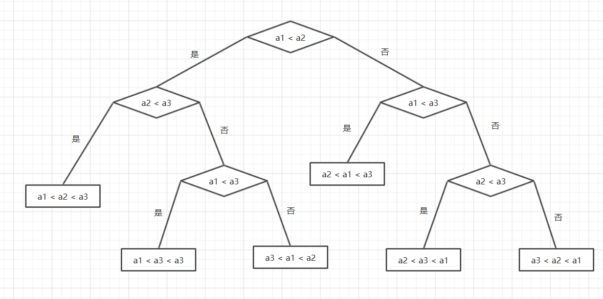

---
title: 常见的排序算法
date: 2019-10-10 11:49:21
summary: 本文分享常见的内排序算法，用Java编程实现。
mathjax: true
tags:
- 算法
- Java
categories:
- 算法分析与设计
---

# 排序

排序算法十分重要，种类繁多。

常见的排序算法主要有：
- 插入排序
   - 直接插入排序
   - 希尔排序
 - 交换排序
   - 冒泡排序
   - 鸡尾酒排序
   - 快速排序
- 选择排序
   - 简单选择排序
   - 堆排序
 - 归并排序

还有一些有趣但实用性有限的排序方法：
- 计数排序
- 桶排序
- 基数排序
- ……

人们为何热衷于研究排序算法呢？
- 排序在数据处理中的地位太重要了，往往是系统的核心部分，好的系统根本离不开优质的排序算法。
- 排序不是一个非常简单的过程，难以有“万金油”式的简单算法，各种算法各有优劣，人们根据不同的问题需要更加适合、更加优化的算法（实际上整体上或者某些其他情况这种算法甚至可以很糟糕，但只要它在某方面有绝对的优势，就不能否认它是一种优秀的排序算法），需要人们不断探索、不断优化。

# 排序的基本概念

下面对一些核心概念进行简略的描述：
- 记录（record）：数据元素。
- 关键码和排序码：关键码是排序的依据；排序码不一定是关键码，选取哪个数据项作为关键码应该依据实际问题情况而定。如果排序码不是关键码，就可能多个记录有相同排序码，结果可能不唯一。
  **通常可以将关键码作为排序码以简化初学复杂度**。
- 排序（sort）：将一个记录的任意序列重新排列成一个按**关键码有**序的序列。
- 排序算法分类：
具体分类有下面几种依据：
  - 待排数据是否都被放置在内存中：
**内排序**：整个排序过程的数据全部存放在内存中。
**外排序**：整个过程中一部分数据在内存，一部分数据在外存，排序过程依赖于内外存数据的多次数据交换。
  - 排序算法是否建立在关键码比较的基础上：
    - **基于比较的排序**：关键码比较+数据移动。
      基于比较的排序还可分为：
      - **插入排序**
        每一次将一个待排序的记录按其关键码的大小插入已经排好序的有序序列中，直到全部序列排好序。
        - **直接插入排序**（基本算法）
          依次将排序序列中的每一个记录插入已排好序的序列中，直到全部记录都排好序。
        - **希尔排序**（改进算法）
          将整个待排序列分割成若干个子序列，在子序列内分别进行直接插入排序，待整个序列基本有序的时候，再对全体记录再进行一次直接插入排序。
          希尔排序改进着眼点：
          - 若待排序列基本有序，直接插入排序效率很高。
          - 由于直接插入排序算法简单，则在待排序记录个数较少时效率也很高。
      - **交换排序**
        在待排序列中选取两个记录，如果反序则交换其位置。所有的反序对交换完成的时候排序完成。
        - **冒泡排序**（基本算法）
          两两比较相邻记录，如果反序就交换，直到没有反序的记录为止。每次都是记录大的向后移、下沉。
        - **鸡尾酒排序**
          对于冒泡排序的简单优化。从左到右比较移动一轮后，从右到左再移动一轮，如此往复。移动的形式像是“钟摆”，可以将轮数减少一半。
        - **快速排序**（改进算法）
          首先选取一个轴值（比较的基准），将待排序记录划分为两部分，左侧记录均小于或等于轴值，右侧记录均大于或等于轴值，然后分别对这两部分重复上述过程，直到整个序列有序。
          理论上讲，快排是一个递归的过程。
          快排是迄今为止所有内排序里平均时间性能最好的排序算法，在UNIX的qsort函数就是用了快排。
          快排也是面试经常考到的知识。
          快排改进的着眼点：
          在冒泡排序中，记录的比较和移动是在相邻位置上进行的，记录的每一次交换位置只能后移一段位置，因而总的比较次数和移动次数较多。（快排记录的移动和比较从两端向中间进行，较大元素可以一次性从前面移动到后面，后面的元素也可以一次性从后面移动到前面）。
      - **选择排序**
        每趟排序在当前排序序列中选取出较小的记录，添加到有序序列中。
        这种方法减少了移动次数，但是扫描、比较可能会增加。
        - **简单选择排序**
          在第i趟排序中，在待排序列r[i]~r[n] (1 <= i <= n-1) 中选取最小的记录，并和第i个元素交换作为有序序列的第i个记录。
        - **堆排序**（基本算法）
          先将待排序列构造成一个堆，此时选出了堆中所有记录的最大者即堆顶记录；然后将堆顶记录移走，并将剩余的记录再调整成堆，这样又找出了最大的纪录；以此类推，直到堆中只有一个记录。
          堆排序改进的着眼点：
          如何减少简单选择排序中记录繁多的比较次数。
      - **归并排序**（改进算法）
        将若干个有序序列逐步合并，最终归并为一个有序序列。
        二路的归并是最简单的，我们这里只讨论二路的。
        归并排序用到了分治法的思想，可以递归/非递归的实现。
        归并排序的思想：
        将待排序列划分为两个长度相等的子序列，分别对这两个子序列进行排序，得到两个子序列，再将这两个子序列合并。
    - **不基于比较的排序**：根据待排数据的特点采取其他方法，通常没有大量关键码的比较和数据移动。
  - ……
- 排序算法稳定性：关键码相同的序列经过排序依然相对关系不变就是**稳定**的（stable），反之**不稳定**（unstable）。
需要强调的是，排序算法的稳定性由具体算法决定，不是一成不变的。稳定的算法在某种条件下可能不稳定；反之亦然。
- 正序和逆序：排好序就是正序（exact order），与排好的顺序恰好相反则是逆序（inverse order）/ 反序（anti-order）。
- 趟（pass）：将待排记录序列扫一遍就是一趟。这个概念很重要，要认真的理解实际运用中的“趟”。

# 各种基本排序算法的比较

| 排序算法 | 平均时间复杂度 | 最好时间复杂度 |最坏时间复杂度 | 空间复杂度 | 稳定与否 |
|:----:|:----:|:----:|:----:|:----:|:----:|
| 直接插入排序 | $O(n^2)$ | $O(n)$ | $O(n^2)$ | $O(1)$ | 稳定 |
| 希尔排序 | $O(n\log{n})\sim{}O(n^2)$ | $O(n^{1.3})$ | $O(n^2)$ | $O(1)$ | 不稳定 |
| 冒泡排序 | $O(n^2)$ | $O(n)$ | $O(n^2)$ | $O(1)$ | 稳定 |
| 鸡尾酒排序 | $O(n^2)$ | $O(n)$ | $O(n^2)$ | $O(1)$ | 稳定 |
| 快速排序 | $O(n\log{n})$ | $O(n\log{n})$ | $O(n^2)$ | $O(\log{n})\sim{}O(n)$ | 不稳定 |
| 简单选择排序 | $O(n^2)$ | $O(n^2)$ | $O(n^2)$ | $O(1)$ | 不稳定 |
| 堆排序 | $O(n\log{n})$ | $O(n\log{n})$ | $O(n\log{n})$ | $O(1)$ | 不稳定 |
| 归并排序 | $O(n\log{n})$ | $O(n\log{n})$ | $O(n\log{n})$ | $O(n)$ | 稳定 |
| 计数排序 | $O(n+m)$ | $O(n+m)$ | $O(n+m)$ | $O(m)$ | 稳定 |
| 桶排序 | $O(n)$ | $O(n)$ | $O(n\log{n})$ | $O(n)$ | 稳定 |

Q：基于比较的内排序算法能不能比$O(N\log{N})$更加优化？

这个问题的关键其实是排序问题的时间下界问题。

这里的研究可以借助**判定树**来进行。

判定树（首先是一个二叉树）：
 - 每一个内部结点对应一个形如$x≤y$的比较，如果关系成立，则控制转移到该结点的左子树，否则转移到该结点的右子树。
 - 每一个叶子结点表示问题的一个结果。

判定树模型可以求解问题的时间下界。我们通常忽略问题的所有算术运算，只考虑执行分支的转移次数。

下面是一个三元素排序的判定树，判定树的每一个内部结点代表一次比较，每一个叶子结点代表一次输出。
显然，最坏情况的时间复杂度不超过判定树的高度。



对于一个问题规模为$n$的输入实例，排序算法可以沿着判定树的一条从根结点到叶子结点的路径来完成，比较次数等于该叶子结点在判定树中的层数。

至少具有$n!$个叶子结点的判定树的高度的求解有下面这样一个定理：
若$T$至少具有$n!$个叶子结点的二叉树，则树$T$的高度至少是$n\log_{2}{n}-1.5n$。

这说明了： 任何基于比较的对n个元素进行排序的算法，其判定树的高度都不会大于$O(N\log_{2}{N})$。
 
 因此，这些算法的时间下界是：$O(N\log{N})$

## 时间复杂度

对于基于比较的内排序，其算法的执行时间主要消耗在以下两种基本操作上：
 - **比较**：关键码之间的比较。
 - **移动**：记录从一个位置移动到另一个位置。

由于排序算法的时间性能经常与**数据集合的起始排列**密切相关，如**随机排列**、**基本有序**、**正序**、**逆序**等等，因此需要分析**最好情况**、**最坏情况**和**平均情况**的时间复杂度。

 - $O(n^2)$
   - 冒泡排序
   - 鸡尾酒排序
   - 简单选择排序
   - 直接插入排序
 - $O(n\log{n})\sim{}O(n^2)$
   - 希尔排序
 - $O(n\log{n})$
   - 快速排序：平均最快，但有可能退化到$O(n^2)$
   - 归并排序
   - 堆排序
 - $O(n)$
   - 计数排序
   - 桶排序
   - 基数排序
 - 奇葩算法
   - 睡眠排序
   - 猴子排序
   - 面条排序

## 空间复杂度

这里的空间开销主要是算法实现所需要的**辅助存储空间**。
辅助存储空间是指除了存放排序记录占据的存储空间之外，算法在执行过程中所需要的其他的存储空间。
另外，**算法本身的复杂度**也对此有影响。

- $O(n)$
    - 归并排序
- $O(\log{n})\sim{}O(n)$
    - 快速排序
- $O(1)$
    - 直接插入排序
    - 希尔排序
    - 冒泡排序
    - 鸡尾酒排序
    - 简单选择排序
    - 堆排序

## 稳定性

- 稳定算法
    - 直接插入排序
    - 冒泡排序
    - 归并排序
- 不稳定算法
    - 希尔排序
    - 鸡尾酒排序
    - 快速排序
    - 简单选择排序
    - 堆排序

涉及元素 **“跳跃”** 从而减少直接交换次数的做法容易导致不稳定。

## 复杂性

- 简单算法：
    - 直接插入排序
    - 简单选择排序
    - 冒泡排序
- 改进算法
    - 希尔排序
    - 鸡尾酒排序
    - 快速排序
    - 堆排序
    - 归并排序

## 数据规模

对于本文探讨的几种算法：
 - $n$很小的时候，简单的排序算法反而更合适、简洁。
 - $n$很大的时候，复杂的改进算法能够取得较好的效果。

## 信息量

记录本身信息量越大，占用的存储空间越多，移动元素的开销越大，对大量移动元素的算法不利。
三种简单算法中，数据量大对简单选择排序有利，对冒泡排序特别是直接插入排序不利。
这种因素对改进算法影响不大。

## 原始数据分布分布

当排序序列为正序的时候，直接插入排序和冒泡排序能达到$O(n)$的时间复杂度，但对于快速排序，这是最糟糕的情况，时间复杂度退化到$O(n^2)$。
简单选择排序、堆排序、归并排序的时间性能不随序列中的记录分布而改变。

# Java接口定义

从操作的角度看，排序是针对线性结构的一种操作，待排序记录可以用顺序存储结构或者链式存储结构。
实际上，排序的对象绝非仅仅是整型int数据，但我们在刚接触的时候建议还是采用顺序存储+int整型数据+关键码唯一数据项+排序结果均为升序，以进行简化。**一维整形数组**可以作为理想的存储结构。

```java
public interface SortInterface {

    /**
     * 直接插入排序
     *
     * @param record 待排序的数据
     */
    void insertSort(int[] record);

    /**
     * 希尔排序
     *
     * @param record 待排序的数据
     */
    void shellSort(int[] record);

    /**
     * 冒泡排序
     *
     * @param record 待排序的数据
     */
    void bubbleSort(int[] record);

    /**
     * 鸡尾酒排序
     *
     * @param record 待排序的数据
     */
    void cocktailSort(int[] record);

    /**
     * 快速排序
     *
     * @param record 待排序的数据
     */
    void quickSort(int[] record);

    /**
     * 简单选择排序
     *
     * @param record 待排序的数据
     */
    void selectSort(int[] record);

    /**
     * 堆排序
     *
     * @param record 待排序的数据
     */
    void heapSort(int[] record);

    /**
     * 归并排序
     *
     * @param record 待排序的数据
     */
    void mergeSort(int[] record);

    /**
     * 计数排序
     *
     * @param record 待排序的数据
     */
    void countingSort(int[] record);

    /**
     * 桶排序
     *
     * @param record 待排序的数据
     */
    void bucketSort(double[] record);

}
```

# Java实现代码

```java
import java.util.ArrayList;
import java.util.Collections;
import java.util.LinkedList;
import java.util.List;
import java.util.Random;

public class SortService implements SortInterface {

    private static SortService service = new SortService();
    
    private SortService (){}
    
    public static SortService getInstance() {
        return service;
    }

    /**
     * 插入排序
     *
     * @param record 待排序的数据
     */
    @Override
    public void insertSort(int[] record) {
        int temp, position, length = record.length;
        // 排序进行length-1趟
        for (int i = 1; i < length; i++) {
            // 暂存待插记录
            temp = record[i];
            // 寻找插入位置
            for (position = i; position > 0 && temp < record[position - 1]; position--) {
                // 符合循环条件的依次右移一位
                record[position] = record[position - 1];
            }
            // 插入元素
            record[position] = temp;
        }
    }

    /**
     * 希尔排序
     *
     * @param record 待排序的数据
     */
    @Override
    public void shellSort(int[] record) {
        int temp, position, length = record.length;
        // 增量为d时直接插入排序
        for (int d = length / 2; d >= 1; d /= 2) {
            for (int i = d; i < length; i++) {
                // 暂存待插记录
                temp = record[i];
                for (position = i; position - d >= 0 && temp < record[position - d]; position -= d) {
                    // 记录后移d位
                    record[position] = record[position - d];
                }
                record[position] = temp;
            }
        }
    }

    /**
     * 冒泡排序
     *
     * @param record 待排序的数据
     */
    @Override
    public void bubbleSort(int[] record) {
        // 第一趟冒泡排序的区间是r[0]~r[length-1]
        int position, bound, temp, length = record.length, exchange = length - 1;
        // 当上一趟排序有记录交换的时候
        while (exchange != 0) {
            bound = exchange;
            exchange = 0;
            for (position = 0; position < bound; position++) {
                if (record[position] > record[position + 1]) {
                    temp = record[position];
                    record[position] = record[position + 1];
                    record[position + 1] = temp;
                    // 记载每一次记录交换的位置
                    exchange = position;
                }
            }
        }
    }

    /**
     * 鸡尾酒排序
     *
     * @param record 待排序的数据
     */
    public void cocktailSort(int[] record) {
        int temp, length = record.length;
        for (int i = 0; i < length / 2; i++) {
            // 有序标记，每一轮初始值都是true
            boolean isSorted = true;
            // 奇数轮，从左向右比较和交换
            for (int j = i; j < length - i - 1; j++) {
                if (record[j] > record[j + 1]) {
                    temp = record[j];
                    record[j] = record[j + 1];
                    record[j + 1] = temp;
                    // 所有元素交换，所以不是有序的，标记变为false
                    isSorted = false;
                }
            }
            if (isSorted) {
                break;
            }
            // 在偶数轮之前，将isSorted重新标记为true
            isSorted = true;
            // 偶数轮，从右向左比较和交换
            for (int j = length - i - 1; j > i; j--) {
                if (record[j] < record[j - 1]) {
                    temp = record[j];
                    record[j] = record[j - 1];
                    record[j - 1] = temp;
                    // 因为有元素进行交换，所以不是有序的，标记变为false
                    isSorted = false;
                }
            }
            if (isSorted) {
                break;
            }
        }
    }

    /**
     * 一次划分的算法
     *
     * @param record 待排序的数据
     * @param left   左端点
     * @param right  右端点
     * @return 划分后的中轴下标
     */
    private int partition(int[] record, int left, int right) {
        // 初始化一次划分区间
        int i = left, j = right, temp;
        while (i < j) {
            // 右侧扫描
            while (i < j && record[i] <= record[j]) {
                j--;
            }
            // 将较小记录交换到前面
            if (i < j) {
                temp = record[i];
                record[i] = record[j];
                record[j] = temp;
                i++;
            }
            // 左侧扫描
            while (i < j && record[i] <= record[j]) {
                i++;
            }
            // 将较大记录交换到后面
            if (i < j) {
                temp = record[i];
                record[i] = record[j];
                record[j] = temp;
                j--;
            }
        }
        // i为轴值记录的最终位置
        return i;
    }

    /**
     * 快速排序的递归部分
     *
     * @param record 待排序的数据
     * @param left   左端点
     * @param right  右端点
     */
    private void quickSort(int[] record, int left, int right) {
        if (left >= right) {
            return;
        } else {
            // 一次划分
            int pivot = partition(record, left, right);
            // 对左侧子序列快速排序
            quickSort(record, left, pivot - 1);
            // 对右侧子序列快速排序
            quickSort(record, pivot + 1, right);
        }
    }

    /**
     * 快速排序
     *
     * @param record 待排序的数据
     */
    @Override
    public void quickSort(int[] record) {
        quickSort(record, 0, record.length - 1);
    }

    /**
     * 选择排序
     *
     * @param record 待排序的数据
     */
    @Override
    public void selectSort(int[] record) {
        int index, temp, length = record.length;
        // n-1趟的简单排序
        for (int i = 0; i < length; i++) {
            index = i;
            // 在无序区查找最小记录，并置于新有序区最后一位
            for (int scan = i + 1; scan < length; scan++) {
                if (record[scan] < record[index]) {
                    index = scan;
                }
            }
            if (index != 1) {
                temp = record[i];
                record[i] = record[index];
                record[index] = temp;
            }
        }
    }

    /*
     * 左右子树都是大根堆，实现指定节点调整
     */
    private void sift(int[] record, int key, int last) {
        // 暂存变量
        int temp;
        // siftNode为待调整结点
        int siftNode = key;
        // max初始化为siftNode的左孩子
        int max = 2 * siftNode + 1;
        while (max <= last) {
            // 选取左右孩子较大者
            if (max < last && record[max] < record[max + 1]) {
                max++;
            }
            // 已经是堆
            if (record[siftNode] > record[max]) {
                break;
            } else {
                // 待调整结点与max互换
                temp = record[siftNode];
                record[siftNode] = record[max];
                record[max] = temp;
                // siftNode、max重新赋值，准备下一趟调整
                siftNode = max;
                max = 2 * siftNode + 1;
            }
        }
    }

    /**
     * 堆排序
     *
     * @param record 待排序的数据
     */
    @Override
    public void heapSort(int[] record) {
        int temp, length = record.length;
        // 从最后一个分支节点至根结点
        for (int index = length / 2 - 1; index >= 0; index--) {
            sift(record, index, length - 1);
        }
        for (int i = 1; i < length; i++) {
            // 暂存最大元素
            temp = record[0];
            // 最右叶子放到根结点
            record[0] = record[length - i];
            record[length - i] = temp;
            // 对 r[0]~r[length-i-1]建堆
            sift(record, 0, length - i - 1);
        }
    }

    /*
     * 合并
     */
    private void merge(int[] record, int length, int left, int mid, int right) {
        // 设置两个待合并的起止区间
        int i = left, j = mid + 1, index = left;
        // 定义辅助数组temp
        int[] temp = new int[length];
        // 依次取两序列中小者放入temp
        while (i <= mid && j <= right) {
            if (record[i] <= record[j]) {
                temp[index++] = record[i++];
            } else {
                temp[index++] = record[j++];
            }
        }
        // 对第一个子序列进行收尾处理
        while (i <= mid) {
            temp[index++] = record[i++];
        }
        // 对第二个子序列进行收尾处理
        while (j <= right) {
            temp[index++] = record[j++];
        }
        // 将合并后的结果传回数组record
        for (index = left; index <= right; index++) {
            record[index] = temp[index];
        }
    }

    /**
     * 归并排序递归实现
     *
     * @param record 待排序的数据
     */
    public void mergeSortRecursively(int[] record, int left, int right) {
        // 待排序的序列只有一条记录，递归结束
        if (left != right) {
            int mid = (left + right) / 2;
            int length = record.length;
            // 归并排序前半个序列
            mergeSortRecursively(record, left, mid);
            // 归并排序后半个序列
            mergeSortRecursively(record, mid + 1, right);
            // 将已排序的两个序列合并
            merge(record, length, left, mid, right);
        }
    }

    /**
     * 归并排序递归实现
     *
     * @param record 待排序的数据
     */
    private void mergeSortRecursively(int[] record) {
        if (record.length > 1) {
            int first = 0, last = record.length - 1, mid = (first + last) / 2;
            int length = record.length;
            // 归并排序前半个序列
            mergeSortRecursively(record, first, mid);
            // 归并排序后半个序列
            mergeSortRecursively(record, mid + 1, last);
            // 将已排序的两个序列合并
            merge(record, length, first, mid, last);
        }
    }

    private void mergePass(int[] record, int length, int h) {
        int i = 0;
        // 有两个长度为h的子序列
        while (i <= length - 2 * h + 1) {
            merge(record, length, i, i + h - 1, i + 2 * h - 1);
            i += 2 * h;
        }
        // 子序列有一个长度小于h
        if (i < length - h + 1) {
            merge(record, length, i, i + h - 1, length - 1);
        }
    }

    /**
     * 归并排序非递归实现
     *
     * @param record 待排序的数据
     */
    public void mergeSortNonRecursively(int[] record) {
        // 初始时子序列长度为1
        int h = 1, length = record.length;
        while (h < length) {
            // 一趟排序
            mergePass(record, length, h);
            h *= 2;
        }
    }

    /**
     * 归并排序
     *
     * @param record 待排序的数据
     */
    @Override
    public void mergeSort(int[] record) {
        Random random = new Random();
        if (random.nextInt(2) == 0) {
            mergeSortRecursively(record);
        } else {
            mergeSortNonRecursively(record);
        }
    }

    /**
     * 计数排序
     *
     * @param record 待排序的数据
     */
    @Override
    public void countingSort(int[] record) {
        // 得到数组的最大值和最小值，并计算出差值d
        int max = record[0], min = record[0], length = record.length;
        for (int i = 1; i < length; i++) {
            if (record[i] > max) {
                max = record[i];
            }
            if (record[i] < min) {
                min = record[i];
            }
        }
        int d = max - min;
        // 创建数组
        int[] countArray = new int[d + 1];
        // 遍历数组，填充统计数组
        for (int k : record) {
            countArray[k - min]++;
        }
        // 统计数组做变形，后面的元素等于前面的元素之和
        for (int i = 1; i < countArray.length; i++) {
            countArray[i] += countArray[i - 1];
        }
        // 倒序遍历原始数组，从统计数组找到正确的位置，输出结果到数组
        int[] sortedArray = new int[length];
        for (int i = length - 1; i >= 0; i--) {
            for (int j = 0; j < countArray[i]; j++) {
                sortedArray[countArray[record[i] - min] - 1] = record[i];
                countArray[record[i] - min]--;
            }
        }
        System.arraycopy(sortedArray, 0, record, 0, length);
    }

    /**
     * 桶排序
     *
     * @param record 待排序的数据
     */
    @Override
    public void bucketSort(double[] record) {
        // 得到数组的最大值和最小值并计算出差值
        double max = record[0], min = record[0];
        int length = record.length;
        for (int i = 1; i < length; i++) {
            if (record[i] > max) {
                max = record[i];
            }
            if (record[i] < min) {
                min = record[i];
            }
        }
        double d = max - min;
        // 初始化桶
        List<List<Double>> bucketList = new ArrayList<>(length);
        for (int i = 0; i < length; i++) {
            bucketList.add(new LinkedList<>());
        }
        // 遍历原始数组，将每个元素放入桶中
        for (double v : record) {
            int num = (int) ((v - min) * (length - 1) / d);
            bucketList.get(num).add(v);
        }
        // 对每个桶内部的元素进行排序
        for (List<Double> doubles : bucketList) {
            Collections.sort(doubles);
        }
        // 输出全部元素
        double[] sortedArray = new double[length];
        int index = 0;
        for (List<Double> list : bucketList) {
            for (double element : list) {
                sortedArray[index] = element;
                index++;
            }
        }
        System.arraycopy(sortedArray, 0, record, 0, length);
    }

}
```
