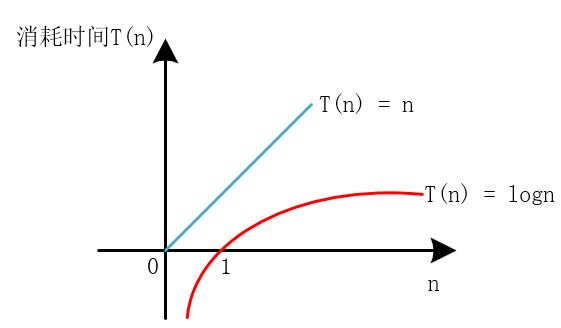
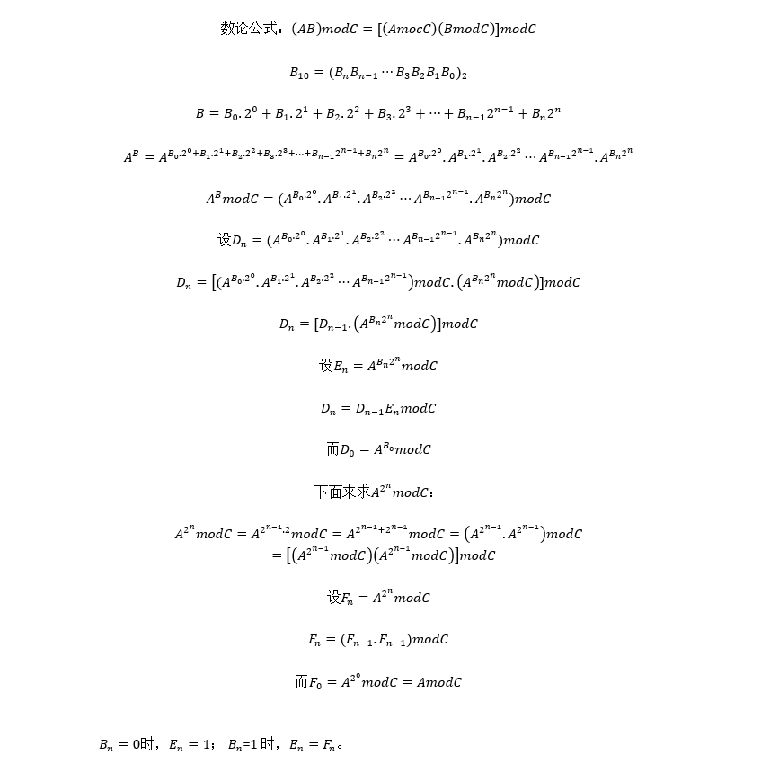

---
title: 快速幂算法与快速幂取模算法
date: 2020-01-28 11:22:29
summary: 本文分享快速幂算法、快速幂取模算法，用Java编程实现。
mathjax: true
tags:
- 算法
- Java
categories:
- 算法分析与设计
---

# 快速幂算法

众所周知，指数的朴素求法是这样的：
比如我们求$10^5$，就是等价于求解$10\times10\times10\times10\times10$，五连乘。

朴素算法的代码如下：
```java
public static long pow1(int a, int b) {
    long result = 1;
    while (b > 0) {
        b--;
        result *= a;
    }
    return result;
}
```

对于$a^n$的求解，时间复杂度为$O(n)$，即线性的。
线性的时间复杂度还有可优化的空间，于是有了快速幂算法。

顾名思义，快速幂就是快速算底数为$a$的$n$次幂（即$a^n$）的算法。

快速幂算法的时间复杂度是$O(\log{n})$，效率比朴素算法大大提高。



## 算法分析

对于$a^n$，指数$n$是可以拆成二进制的，根据$a^{m+n}=a^{m}a^{n}$，我们就可以据此拆分$a^n$了。

$a^{13}$为例，$13_{10}=1101_{2}$，$a^{13}$自然就得到了表示，最终会转化成$a^{1}+a^{4}+a^{8}$。
……

## 算法实现

递归实现：
```java
public static long recursivePow(int a, int b) {
    if(b == 1) {
        return a;
    }
    long temp = recursivePow(a, b/2);
    return (b % 2 == 0 ? 1 : a) * temp * temp;
}
```

非递归实现：
```java
public static long pow2(int a, int b) {
    long result = 1, base = a;
    while(b != 0) {
        if(b % 2 != 0) {
            result *= base;
        }
        base *= base;
        b /= 2;
    }
    return result;
}
```

## 位运算优化

位运算说明：
- $\&$运算：通常用于二进制取位操作，例如一个数$b\&1$的结果就是取二进制的最末位的值。还可以判断这个数的奇偶性，如果$b\&1==0$，则$b$为偶数；如果$b\&1==1$，则$b$为奇数。这种判法比用$b\%2$要高效.
- $>>$运算：在这里是作为除法来使用，例如一个数$b$，$b>>=1$就表示$b$右移一位，相当于除以$2$。这种判法比$b/=2$要高效。

```java
public static long pow3(int a, int b) {
    if (b == 0) {
        return 1;
    }
    while ((b & 1) == 0) {
        b >>= 1;
        a *= a;
    }
    long result = a;
    b >>= 1;
    while (b != 0){
        a *= a;
        if ((b & 1) != 0) {
            result *= a;
        }
        b >>= 1;
    }
    return result;
}
```

## BigInteger支持

`public BigInteger pow​(int exponent)`

# 快速幂取模算法

数论有这样一个引理：积的取余等于取余的积的取余。
即：`(AB)modC = [(AmodC)(BmodC)]modC`

基于此条引理，对指数型数据进行拆分以及合并，即得到我们所需要的快速幂取模算法。

## 算法优点

快速幂取模算法的优点不仅仅是快速，更重要的是不要直接把AB求出来，有时候AB很大，乘积会爆掉long（C里的longlong），但取模结果显然不会爆，这就要求我们使用快速幂取模算法，不断减小A和B的规模，从而求解。

因此，拆指数就显得十分重要，这方面可以参考上面的算法。

## 算法推导



## 算法实现

```java
public static long quickMode(int a,int b,int c) {
    long result = 1;
    long temp = a % c;
    while(b != 0) {
        if((b & 1) != 0) {
            result = ( result * temp ) % c;
        }
        b >>= 1; 
        temp = (temp * temp) % c; 
    }
    return result;
}
```

## BigInteger支持

`public BigInteger modPow​(BigInteger exponent, BigInteger m)`

# 本文完整代码实现（Java语言描述）

```java
import java.math.BigInteger;

public class QuickPower {

    public static long pow1(int a, int b) {
        long result = 1;
        while (b != 0) {
            b--;
            result *= a;
        }
        return result;
    }

    public static long pow2(int a, int b) {
        long result = 1, base = a;
        while(b != 0) {
            if(b % 2 != 0) {
                result *= base;
            }
            base *= base;
            b /= 2;
        }
        return result;
    }

    public static long recursivePow(int a, int b) {
        if(b == 1) {
            return a;
        }
        long temp = recursivePow(a,b/2);
        return (b % 2 == 0 ? 1 : a) * temp * temp;
    }

    public static long pow3(int a, int b) {
        if(b == 0) {
            return 1;
        }
        while((b & 1) == 0) {
            b >>= 1;
            a *= a;
        }
        long result = a;
        b >>= 1;
        while(b != 0){
            a *= a;
            if((b & 1) != 0) {
                result *= a;
            }
            b >>= 1;
        }
        return result;
    }

    public static long quickPower(long a, long b) {
        long result = 1, temp = a;
        while(b != 0) {
            if((b & 1) != 0) {
                result *= temp;
            }
            temp *= temp;
            b >>= 1;
        }
        return result;
    }

    public static long quick(int a,int b,int c) {
        long result = 1;
        long temp = a % c;
        while(b != 0) {
            if((b & 1) != 0) {
                result = ( result * temp ) % c;
            }
            b >>= 1;
            temp = (temp * temp) % c;
        }
        return result;
    }

}
```
