---
title: 算法分析与设计习题分享
date: 2021-02-04 09:19:50
summary: 本文分享算法分析与设计习题。
mathjax: true
tags:
- 算法
categories:
- 算法分析与设计
---

# 算法概述

1.算法的复杂度即算法在计算机上的运行时间。
$×$

2.时间复杂度是衡量算法性能的最重要标准。
$×$

3.能够在计算机上运行的计算过程即是算法。
$×$

4.计算机无法解决的问题的数量远多于计算机可以解决问题的数量。
$√$

5.通过算法分析可以为计算任务选择有效的计算设备。
$√$

6.选择
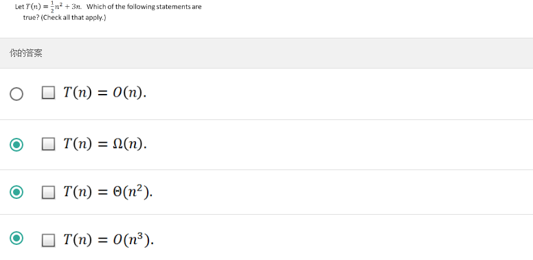

7.填空
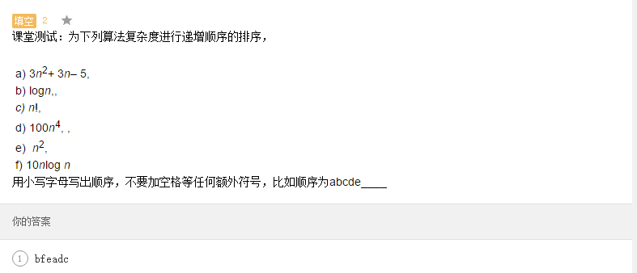

8.简答
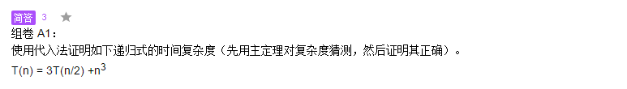

9.选择
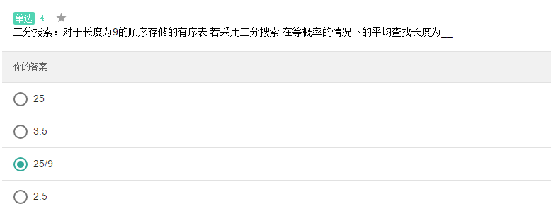

10.选择
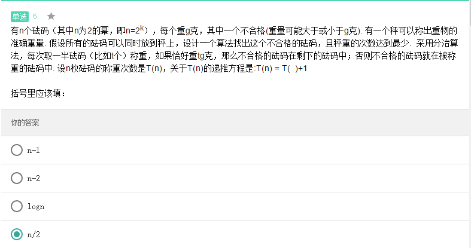

11.选择
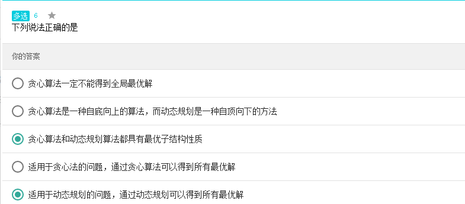

12.判断
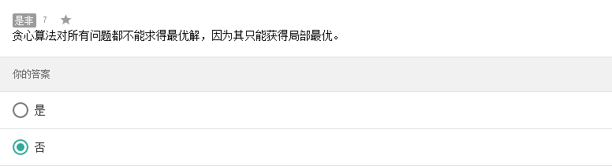

13.选择
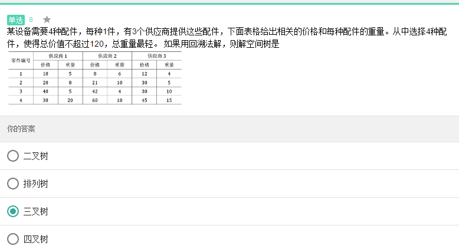

14.判断
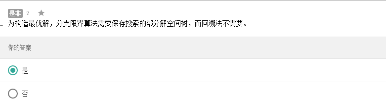

15.简答
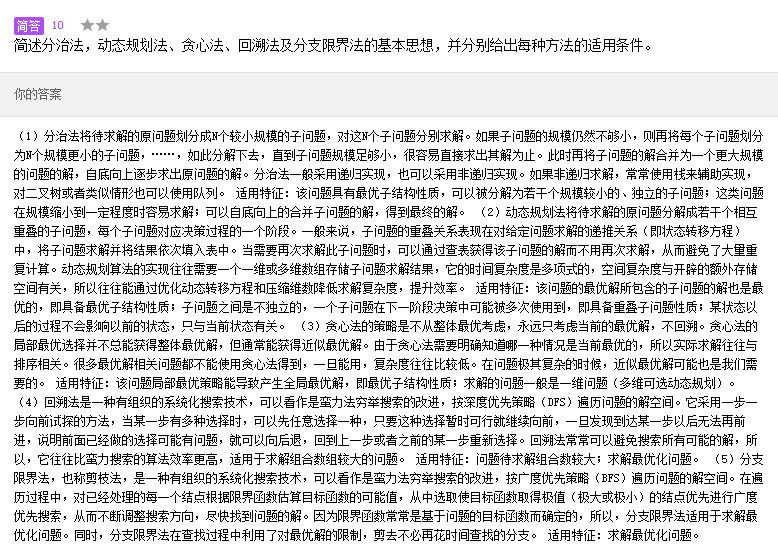

16.简答
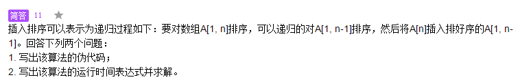

17.简答
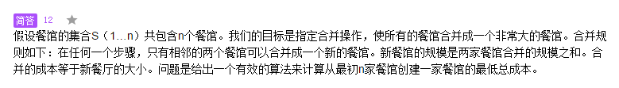

18.判断
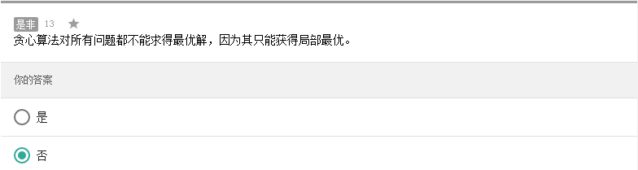

19.选择
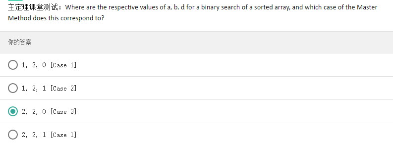

20.填空
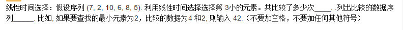

21.填空
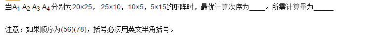

22.简答
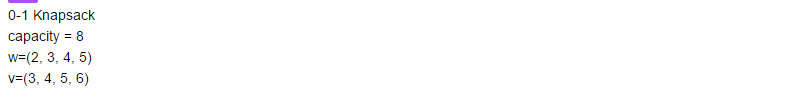

23.简答
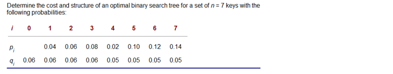

24.简答
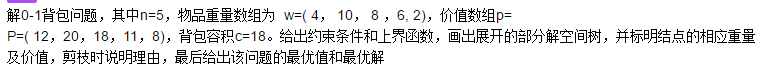

25.简答
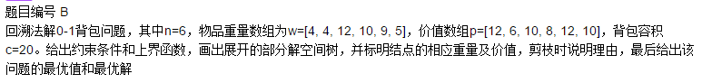
