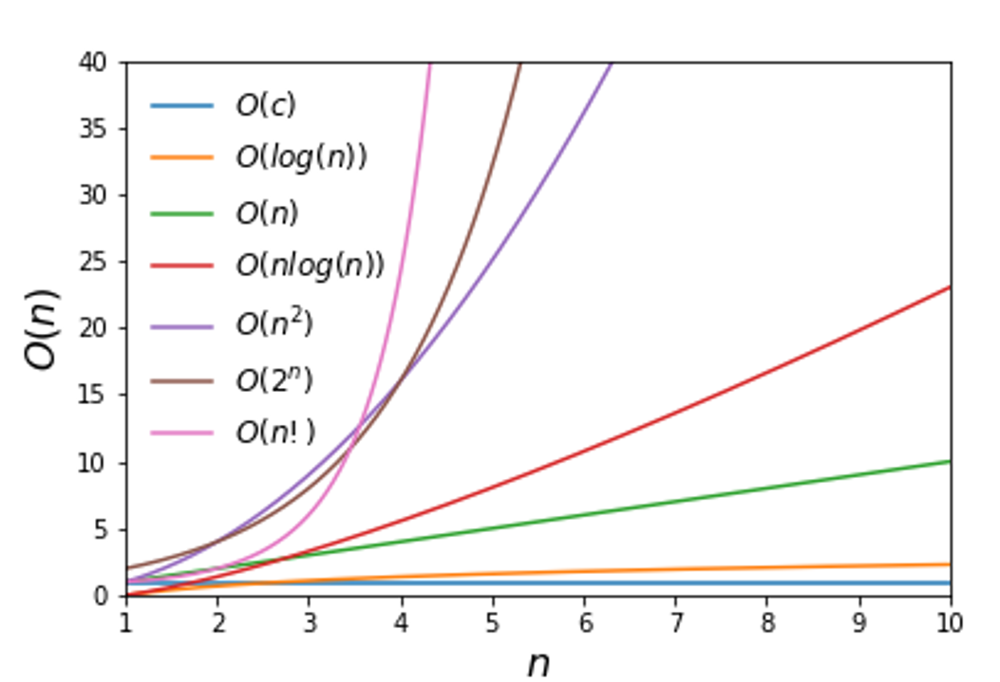

# 算法复杂度

算法效率的度量是通过其时间复杂度和空间复杂度来描述的。

算法复杂度可以用$O(T(n))$、$Ω(T(n))$、$o(T(n))$、$Θ(T(n))$来衡量，常用大O表示法$O(T(n))$。

$O(T(n))$表示算法复杂度小于等于$T(n)$

$Ω(T(n))$表示算法复杂度大于等于$T(n)$

$o(T(n))$表示算法复杂度小于$T(n)$

$Θ(T(n))$表示算法复杂度等于$T(n)$

上面几种表示法都是比阶，而且忽略常数项和常数系数。

对于几百这样的输入量，三次算法$O(N^3)$不可行。

对于几千这样的输入量，二次算法$O(N^2)$不可行。

$O(N)$、$O(N\log{N})$、$O(N^2)$ 、$O(N^3)$较为常见，其中$O(N)$的线性算法更加优秀。

基本上可能用的算法复杂度：（从简单到复杂）
$O(1)<O(\log{N})<O((\log{N})^2)<O(N)<O(N\log{N})<O(N^2)<O(N^3)<O(2^N)$



算法的时间复杂度通常表示为$T(n)$，空间复杂度通常表示为$S(n)$。

# 算法复杂度的求和计算方法

算法复杂度的简单计算往往涉及求和，下面的六个公式可作参考

$$\sum\limits_{i=1}^{n}{i}=\frac{n(n+1)}{2}$$

$$\sum\limits_{i=1}^{n}{(n-i)}=\frac{n(n-1)}{2}$$

$$\sum\limits_{i=1}^{n}{i^{2}}=\frac{n(n+1)(2n+1)}{6}$$

$$\sum\limits_{i=1}^{\log_{2}{n}}{n}=n\log_{2}{n}$$

$$\sum\limits_{i=1}^{n}{2^{i}}=2(2^{n}-1)$$

$$\sum\limits_{i=1}^{\log_{2}{n}}{2^{i}}=2(n-1)$$

# 算法复杂度的组合

处于同一层级串行执行的两个算法组合要采用$+$，处于嵌套关系的两个算法要采用$×$。

$$O(g1(n)) + Θ(g2(n)) → O(max{g1(n), g2(n)})$$
$$Ω(g1(n)) + Ω(g2(n)) → Ω(max{g1(n), g2(n)})$$
$$Θ(g1(n)) + Θ(g2(n)) → Θ(max{g1(n), g2(n)})$$

$$O(g1(n)) × O(g2(n)) → O(g1(n) × g2(n))$$
$$Ω(g1(n)) × Ω(g2(n)) → Ω(g1(n) × g2(n))$$
$$Θ(g1(n)) × Θ(g2(n)) → Θ(g1(n) × g2(n))$$

# 递归算法复杂度的计算方法

方法一：
递推扩展，最终求和得到一个求和式，用大O表示即可。

方法二：
数学归纳，比如斐波那契数列递归求解的$O((\frac{5}{3})^n)$就是这么得到的。

方法三：
先将递归算法的运算抽象成数学上的递推式：
$T(n)=\begin{cases}c, & n=1 \\ aT(\frac{n}{b})+cn^{k}, & n>1 \end{cases}$

这样的一个分治递推式往往存在并可求，然后我们按照下面的结论可以得到答案：
$T(n)=\begin{cases}O(n^{\log_{b}{a}}), & a>b^{k} \\ O(n^k\log_{b}{n}), & a=b^{k} \\ O(n^k), & a<b^{k} \end{cases}$

说明：公式编辑Word可用 $Alt$ + $=$，Markdown可以引入LaTeX数学表达式。

# 证明斐波那契数列递归求解复杂度
$F_{0}=1$
$F_{1}=1$
$F_{2}=2$
$F_{3}=3$
$F_{4}=5$
$……$
$F_{i}=F_{i-1}+F_{i-2}$

$证：对于i≥1，有F_{i}＜(\frac{5}{3})^{n}$

$易证，F_{1}=1<\frac{5}{3}，F_{2}=2<(\frac{5}{3})^{2}=\frac{25}{9}$

$假设F_{k}<(\frac{5}{3})^{k}$

$下面只需要证明F_{k+1}<(\frac{5}{3})^{k+1}$

$F_{k+1}=F_{k}+F_{k-1}$

$F_{k+1}<(\frac{5}{3})^{k}+(\frac{5}{3})^{k-1}=(\frac{3}{5})(\frac{5}{3})^{k+1}+(\frac{3}{5})^{2}(\frac{5}{3})^{k+1}=(\frac{15}{25})(\frac{5}{3})^{k+1}+(\frac{9}{25})(\frac{5}{3})^{k+1}=(\frac{24}{25})(\frac{5}{3})^{k+1}<(\frac{5}{3})^{k+1}$

$得证$

# 算法复杂度分析案例

案例1：

```c
void function(int n) {
    int i = 1;
    while (i <= n) {
        i = i * 2;
    }
}
```

分析：
${2}^{i}≤n$，$i≤\log_{2}{n}$，$T(n)=O(\log_{2}{n})$

案例2：

```c
void function(int n) {
    int x = 2;
    while (x < n/2) {
        x = x * 2;
    }
}
```

分析：
${2}^{x+1}≤\frac{n}{2}$，$x≤\log_{2}{\frac{n}{2}}-1=\log_{2}{n}-2$，$T(n)=O(\log_{2}{n})$

案例3：

```c
int fact(int n) {
    if (n <= 1) {
        return 1;
    }
    return n * fact(n-1);
}
```

分析：
$T(n)=O(n)$

案例4：

```c
int function(int n) {
    int cnt = 0;
    for (int i = 1; i <= n; i*=2) {
        for (int j = 1; j <= n; j++) {
            cnt++;
        }
    }
    return cnt;
}
```

分析：
外层：${2}^{i}≤n$，$i≤\log_{2}{n}$，$T(n)=O(\log_{2}{n})$
内层：$T(n)=O(n)$
$T(n)=O(n\log_{2}{n})$

案例5：

```c
int function(int n) {
    int i = 0, sum = 0;
    while (sum < n) {
        sum += ++i;
    }
    return i;
}
```

分析：
$sum=\frac{k(k+1)}{2}$，$T(n)=O(\sqrt{n})$


案例6：

```c
void function(int n) {
    int i = 0;
    while (i * i * i <= n) {
        i++;
    }
}
```

分析：
${t}^{3}≤n$，$t≤\sqrt[3]{n}$，$T(n)=O(\sqrt[3]{n})$

# 拓展思考

1. $O(N^2)$的算法实际不一定比$O(N^3)$的算法简单，原因有二：大O表示法只能表示算法规模的上界；常数项和系数也不能忽略，不能撇开数据规模谈复杂性。
