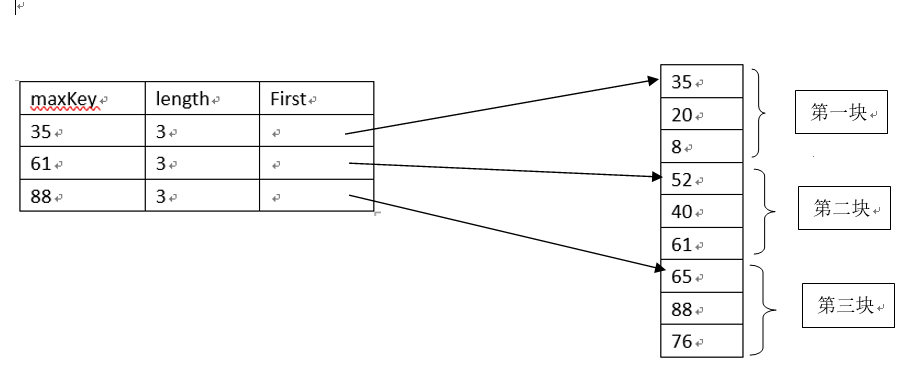

---
title: 顺序存储结构的搜索算法
date: 2019-10-11 09:56:49
summary: 本文分享顺序存储结构的搜索算法：顺序查找、二分查找、分块查找、插值查找，用Java编程实现。
mathjax: true
tags:
- 算法
- Java
categories:
- 算法分析与设计
---

# 顺序查找和二分查找

```java
public class LinearSearch {
    
    /**
     * 定义查找记录集合
     */
    private int[] record;
    
    /**
     * 查找集合元素个数
     */
    private int length;

    public LinearSearch(int[] record, int length) {
        super();
        this.record = record;
        this.length = length;
    }
    
    public int seqSearch(int[] r, int n, int k) {
    	//从数组高端开始比较
        int i = n;
        //哨兵值，放在查找的尽头，省却判断越界的步骤，节省时间
        r[0] = k;
        while (r[i] != k) {
            i--;
        }
        return i;
    }
    
    /**
     * 二分查找非递归实现
     * 待查集合储存在r[0]~r[length-1]
     * @param k
     * @return
     */
    public int binSearch1(int k) {
        //初始查找区间[0, n-1]
        int mid, low = 0, high = length-1;
        //确保区间存在
        while (low <= high) {
            mid = high + (low - high)/2;
            if (k < record[mid]) {
                high = mid - 1;
            } else if (k > record[mid]) {
                low = mid+1;
            } else {
                //查找成功返回元素序号
                return mid;
            }
        }
        //查找失败
        return -1;
    }
    
    /**
     * 二分查找递归实现
     * @param low
     * @param high
     * @param k
     * @return
     */
    public int binSearch2(int low, int high, int k) {
        int mid;
        if (low > high) {   //递归边界条件
            return -1;
        } else {
            mid = high + (low - high)/2;
            if (k < record[mid]) {
                return binSearch2(low, mid-1, k);
            } else if (k > record[mid]) {
                return binSearch2(mid+1, high, k);
            } else {
                //查找成功，返回元素序号
                return mid;
            }
        }
    }

}
```

# 哨兵值

注意：顺序查找用到了 ==**“哨兵”**==。哨兵就是待查值，存放在查找方向的尽头处，在查找过程中的每一次比较后，不用判断查找位置是否越界，从而提高了查找速度。

实际上，一切为简化边界条件而引入的附加结点（或记录）可以称之为哨兵，比如：
- 单链表的头结点
- 中缀表达式计算求值用`#`作为表达式定界符
- 字符串用`'\0'`作为结束定界符
- 迷宫增加的边界墙
- 顺序查找将待查元素放在查找尽头
- ……

# 时间复杂度总结

顺序查找时间效率$O(n)$，二分查找效率$O(\log_{2}{n})$。
相比较而言，二分查找比较简单，但是需要有序（经过排序维护）。

# 顺序查找的改进-分块查找

分块查找又称为索引顺序查找，查找性能介于顺序查找和二分查找之间。
它的使用条件是将线性表进行分块，并使其分块有序。
所谓分块有序是指将线性表划分为若干个块，块内不要求有序（可以无序），但是块间有序（某一个指定方向上块的整体中最小元素大于另一个块整体中最大元素）……以此类推。
这种方式需要建立一个索引表，每个块对应一个索引项，各索引项按照关键码进行有序排序，索引项一般包含每块的最大关键码以及块首的地址：


分块查找需要分两步进行。
第一步在索引表中确定待查关键码所在的块；
第二步在相应块中查找关键待查码。

由于索引表是按照关键码有序排列，可以使用顺序查找也可以使用二分查找；
块内查找时，由于块内无序，只能使用顺序查找。

$n$个元素分$m$块，每个块有t个记录，$n = m × t$ 。
设$Lb$为查找索引表确定关系所在块的平均查找长度，$Lw$为块内查找关键码的平均查找长度，则分块查找的平均查找长度为：
$ASL = Lb + Lw$

若采用顺序查找对索引表进行查找，则分块查找的平均查找长度为：
$ASL = Lb + Lw = \frac{m+1}{2}+\frac{t+1}{2}=\frac{1}{2}(\frac{n}{t}+t)+1$


可见，分块查找的平均查找长度不仅仅与线性表中记录的元素个数$n$有关，还与每个块中的记录个数$t$有关。
这种结构就可以用高中数学讲过的“**[对勾函数](https://wenku.baidu.com/view/cfd99a3752ea551811a68704.html)**”来分析：
对于上式，当$t$取$\sqrt{n}$时，$ASL$取得最小值$\sqrt{n}+1$。


下图是一个分块查找的图示：


# 二分查找的改进——插值查找

在待查连续区间[low,high]中，假设元素的值是线性均匀增长的，待查元素值为k，可以通过如下公式求取分割点：$mid=low+\frac{k-r[low]}{r[high]-r[low]}(high-low)$

其中low和high分别是查找区间两个端点的下标。

将待查值k与分割点记录的关键码r[mid]进行比较，有如下三种情况：
 - $k < r[mid] → high = mid-1$， 在左半区继续查找
 - $k > r[mid] → low  = mid+1$， 在右半区继续查找
 - $k = r[mid] →$ 查找成功

当查找区间不存在或者$mid$的值不再变化时查找失败。

插值查找类似于二分查找，其查找性能在关键码分布比较均匀的情况下优于二分查找。
一般的，设待查序列有$n$个元素，插值查找的关键码比较次数要小于$\log_{2}\log_{2}{n}+1$次。
这个函数的增长极其缓慢 ，对于所有可能的实际输入，其关键码的比较次数很小，但最坏情况下，插值查找将达到O(n)。
对于较小的查找表，二分查找（折半查找）较好，对于较大线性表，建议可以在情况合适的情况下选择插值查找。
