# ChatGPT

ChatGPT自我介绍：
> 您好！我是ChatGPT，一个基于GPT-3.5架构训练的大型语言模型，由OpenAI开发。我可以使用自然语言处理技术进行对话，回答您的问题，提供建议，生成文本等。我使用的模型架构具有深度学习和神经网络的技术，经过数百万条文本的训练，可以自动推断语言的意义和上下文，并生成与之相关的响应。我被训练来处理多种语言，可以为您提供各种类型的信息和帮助，但是我不是完美的，有时可能会出现错误或不完整的信息。

# 账号注册方法

ChatGPT的账号注册教程，网络上资料充足。为了避免提及不恰当话题，我会省略那些部分，并分享常见网络教程没有提到的部分。

打开ChatGPT官网 [https://chat.openai.com](https://chat.openai.com/) 。如果你有OpenAI账号，直接登录即可；如果你没有，需要新注册账号。

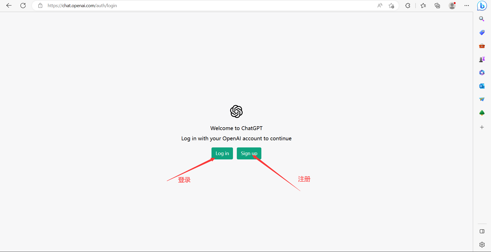

注册账号时，网络教程一般会让新手直接用邮箱开始注册。博主前段时间刚刚替朋友操作过，不推荐这样注册。博主个人建议直接通过谷歌账号或微软账号注册。邮箱最好不要选网易邮箱等，谷歌账号选择Gmail邮箱，微软账号选择Outlook邮箱。
顺便一提，现在注册谷歌账号难度较大，如果没有现成的谷歌账号，推荐采用微软账号和Outlook邮箱。

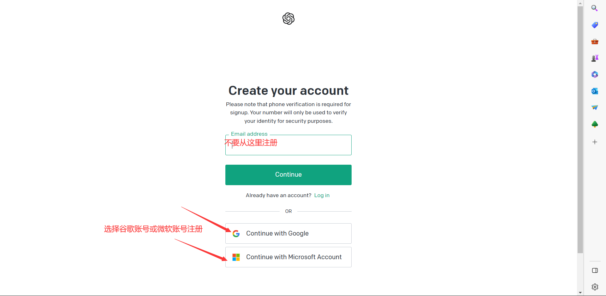

# 网页版使用方法

登录ChatGPT，进入聊天首页。

在底部输入聊天内容，`Enter`发送即可开启新聊天，不需要点击左侧的`New Chat`。

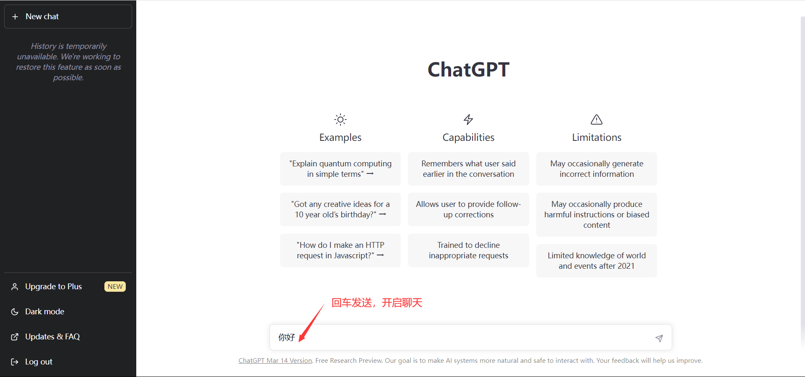

ChatGPT会对用户输入的内容输出反馈。对于一个新对话，ChatGPT会根据第一组聊天的内容分析归纳聊天主题，显示在左侧栏。

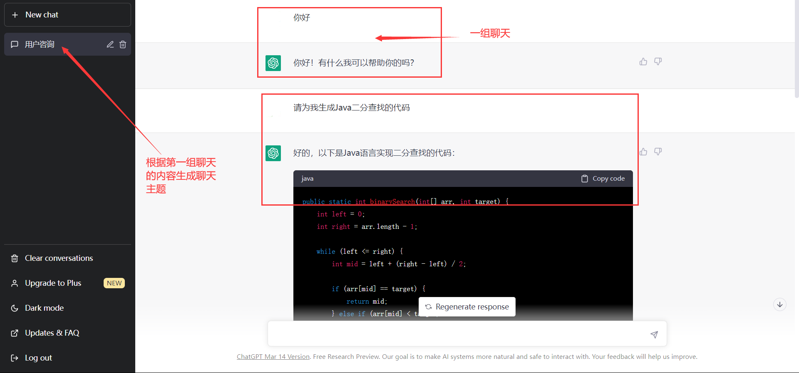

ChatGPT不仅能生成自然语言，还能生成代码等内容。生成的过程可能很快，也可能比较慢，不完全取决于网速，也跟语义有关。生成过程中，如果用户不满意，可以点击`Stop generating`终止本次ChatGPT的内容生成。

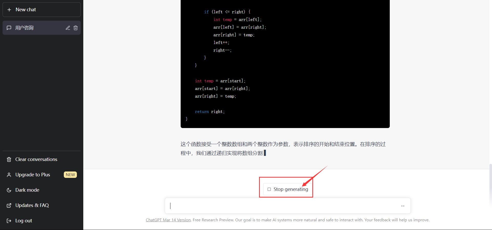

对于被打断的生成，可以点击`Regenerate response`重新生成回答。回答可以重新生成，但不能继续生成。值得一提的是，对于一次生成未输出完全的情况，可以继续输入`请继续`类似文本，即可让ChatGPT在下一次回复中继续生成。

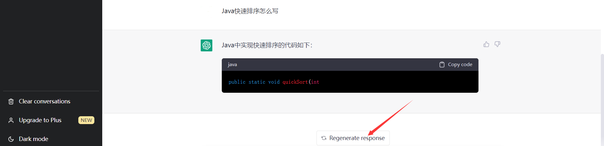

对于已有聊天对话，左侧可以修改对话主题或删除对话。

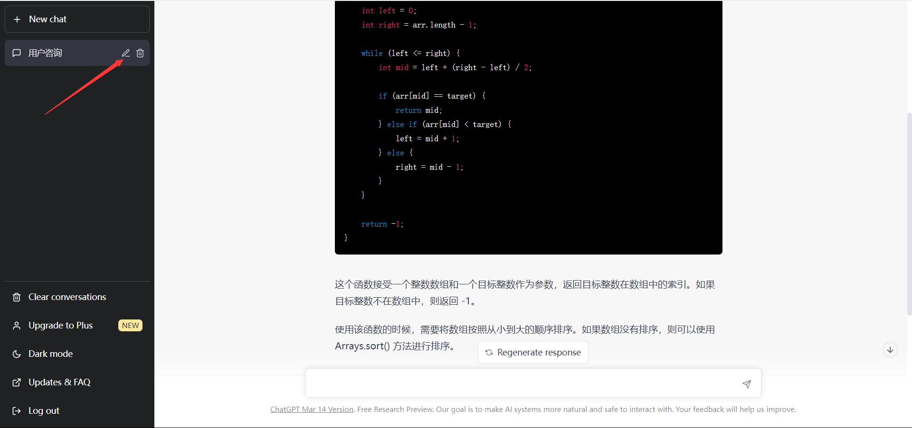

修改对话主题后，点击确认即可。

修改主题后：

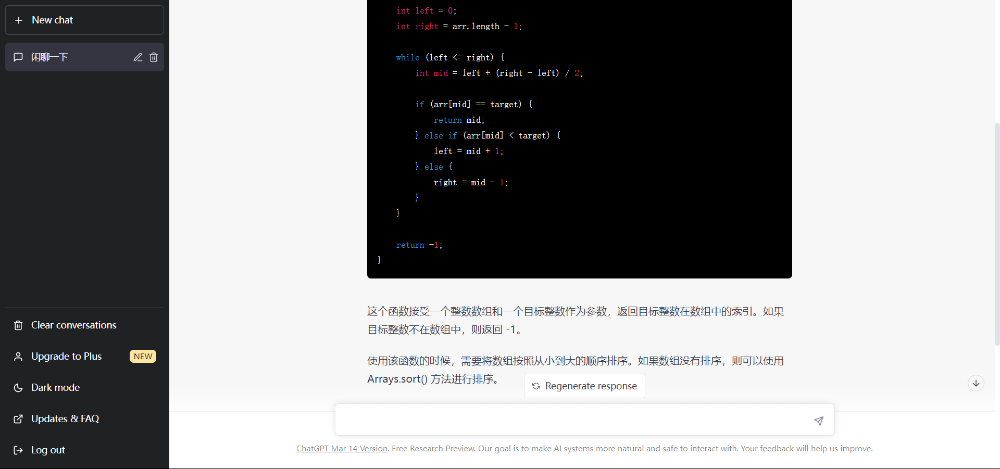

不需要的对话可以删除。

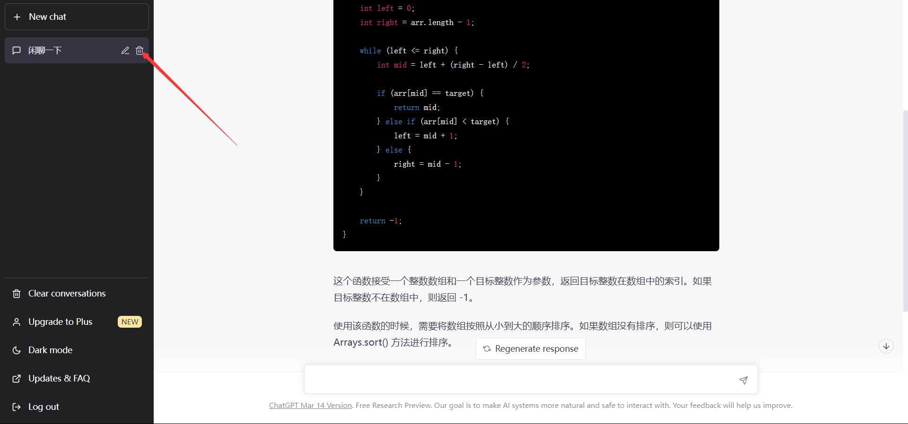

确认是需要删除的对话后，点击确认即可。

删除后的对话会从左侧历史对话中移除。

ChatGPT还支持切换暗黑模式，点击左下方的`Dark mode`即可。

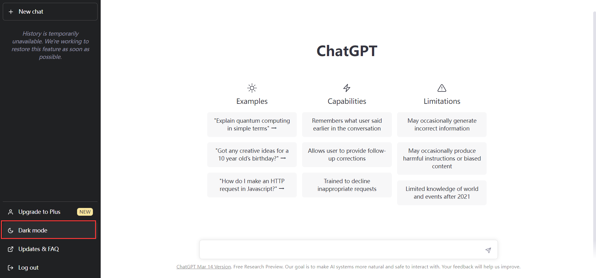

切换后的暗黑效果如下图所示，这是很多开发者都喜欢的模式。

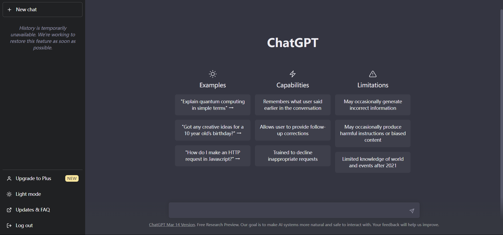

主页左下角的`Upgrade to Plus`提供升级到GPT-4的链接。

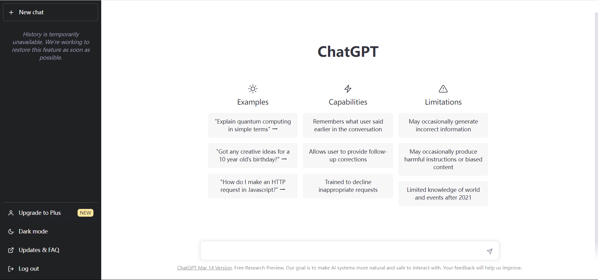

只需支付每月20美元即可升级到ChatGPT Plus。

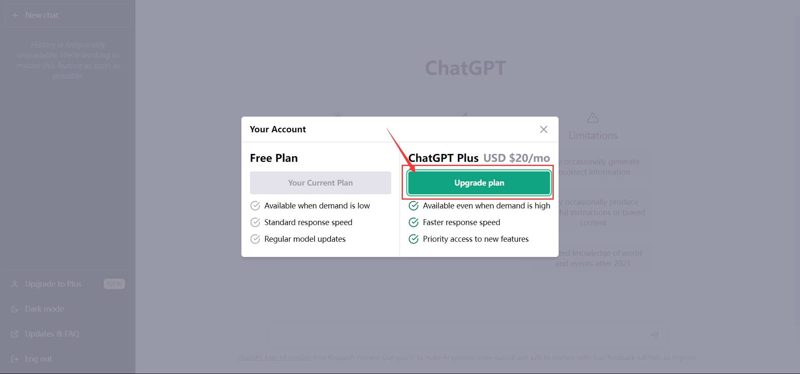

# 申请个人版秘钥

前往OpenAI官网 [https://platform.openai.com](https://platform.openai.com) ，登录后点击右上角头像旁的`Personal`。

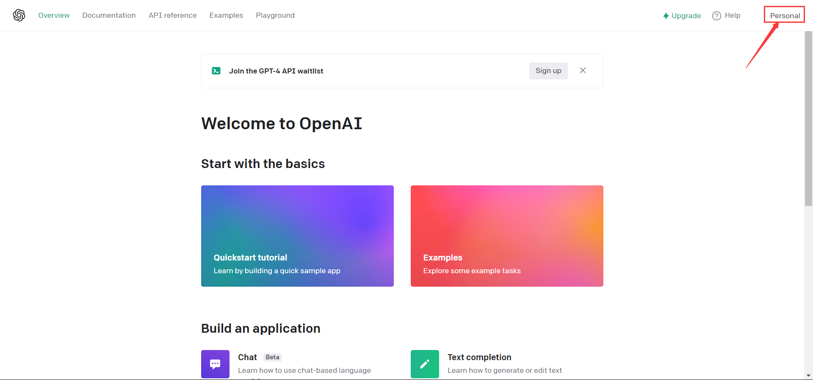

在`Personal`下拉列表框中选择`View API keys`。

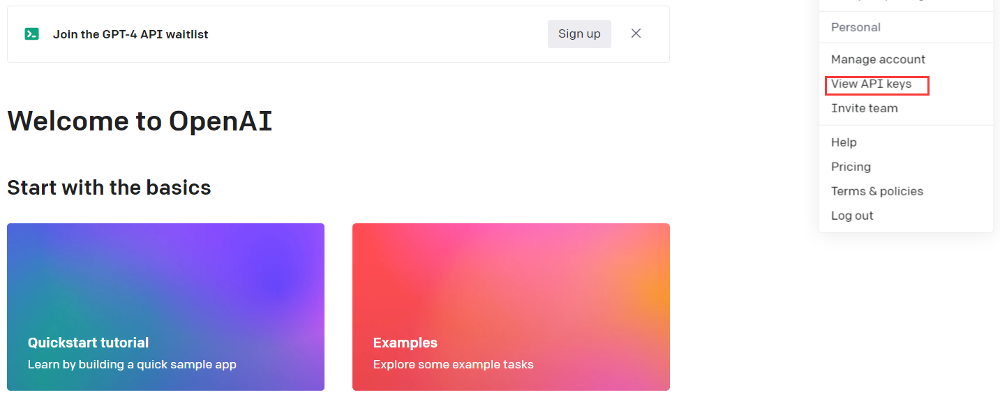

生成一个新的 secret OpenAI API key。

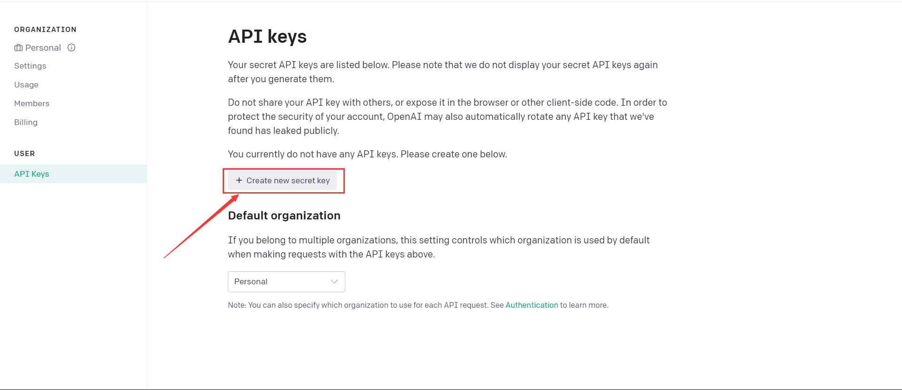

记住这个新生成的key，以后不能再查看。

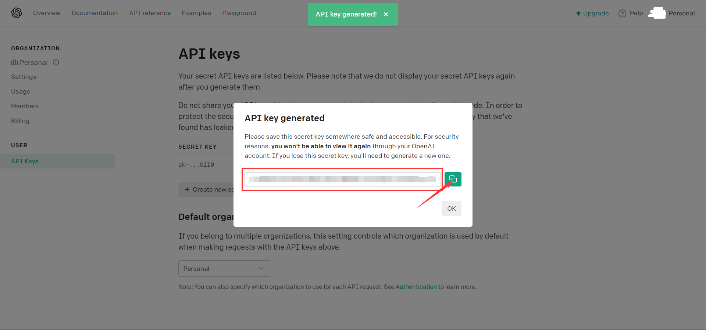

# 不间断接入ChatGPT

网页版ChatGPT的问题是：短时间不继续Chat或高频率Chat会出现NetworkError，必须重新刷新才能继续使用。为了解决这个问题，我们可以借助VSCode开源插件工具`chatgpt-vscode`，它的开源地址是[https://github.com/ai-genie/chatgpt-vscode](https://github.com/ai-genie/chatgpt-vscode)。

我们在VSCode左侧边栏找到`扩展`，如果找不到可以使用`Ctrl+Shift+X`快捷键组或鼠标右键左侧边栏选择扩展显示出来。

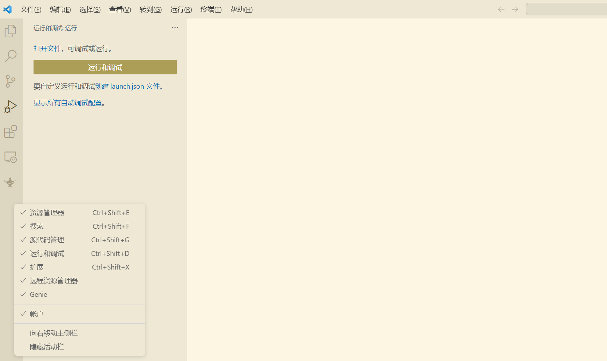

在扩展商店中搜索`GENIE`，选择图示的`ChatGPT - Genie AI`，点击安装。

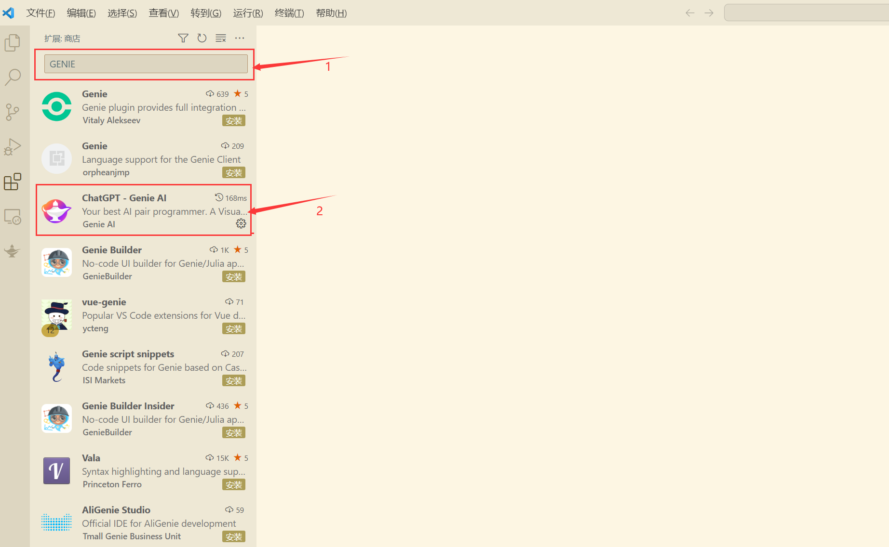

安装插件后，我们可以简单浏览一下插件预留的说明文档。

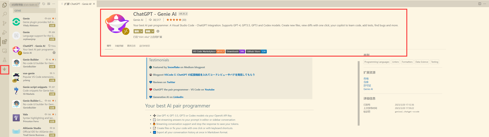

打开左侧的`Genie`侧边栏选项，发送信息，右下角选择`Store in secrets`。

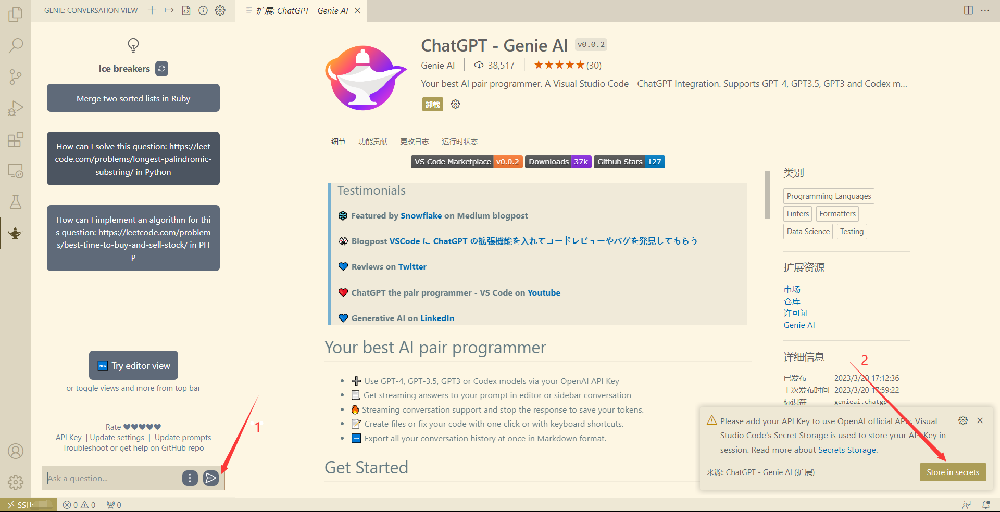

输入OpenAI的key，按`Enter`确认。

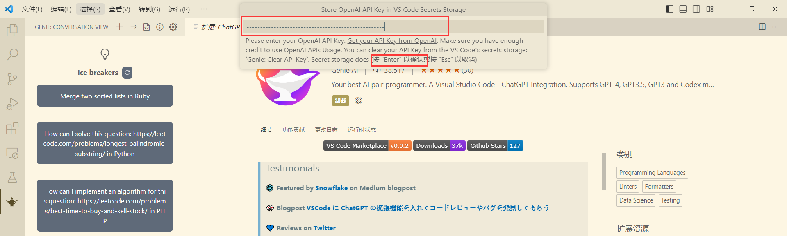

即享流畅Chat服务。

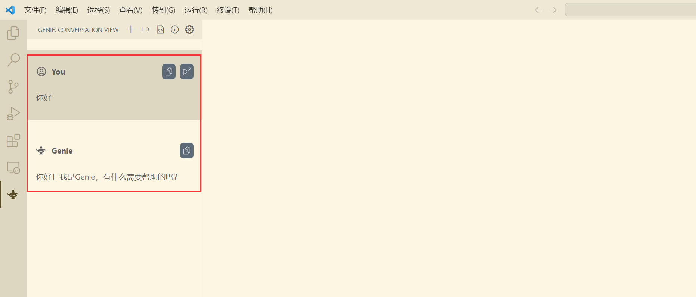
