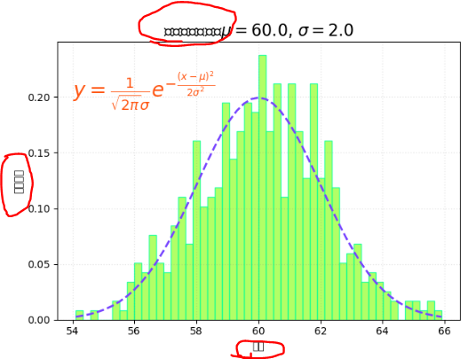
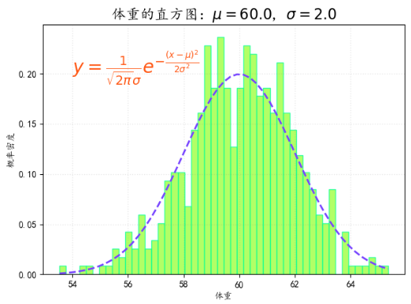
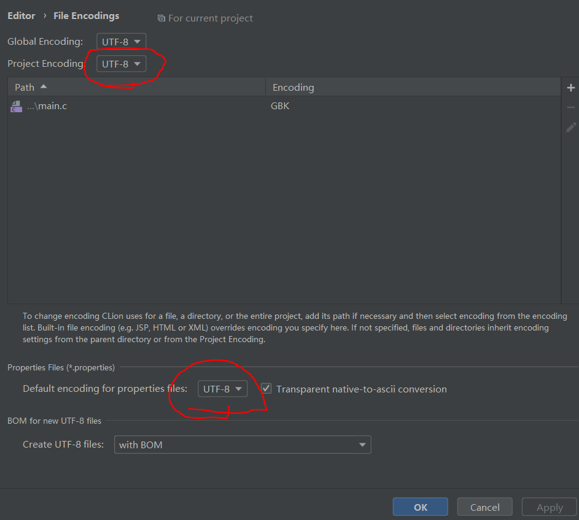
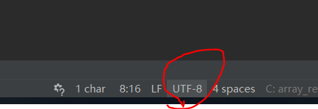
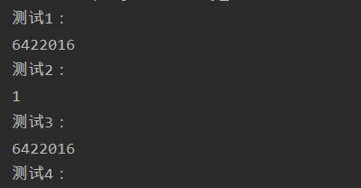

---
title: Unicode与UTF-8
date: 2020-02-17 22:58:37
summary: 本文介绍Unicode与UTF-8的相关内容，顺便分享一些乱码问题的解决方法。
tags:
- 编码格式
- Unicode
- UTF-8
categories:
- 计算机科学基础
---

# Unicode

Unicode 联盟开发了 Unicode 标准，并与领先的标准开发组织（如 ISO、W3C 和 ECMA）开展了合作。。他们的目标是用标准的 Unicode 转换格式（UTF）替换现有的字符集。

由于 ISO-8859 中的字符集大小有限，在多语言环境中不兼容，因此 Unicode 联盟制定了 Unicode 标准。Unicode 标准涵盖了（几乎）世界上所有的字符、标点和符号。

Unicode 支持独立于平台和语言的文本处理、存储和传输。

Unicode 标准已经成功实现，并且以 HTML、XML、Java、JavaScript、电子邮件、ASP、PHP 等实现。在许多操作系统和所有现代浏览器中也支持 Unicode 标准。

# Unicode字符集

Unicode 可以通过不同的字符集来实现。最常用的编码是 UTF-8 和 UTF-16：

|字符集 |	描述|
|--|--|
|UTF-8 	|UTF8 中的字符长度可以是 1 到 4 个字节。 UTF-8 可以代表 Unicode 标准中的任何字符。 UTF-8 向后兼容ASCII。 | UTF-8 是电子邮件和网页的首选编码。|
|UTF-16 	|16 位 Unicode 转换格式是 Unicode 的可变长度字符编码，能够编码整个 Unicode 编码。 UTF-16 用于主要的操作系统和环境，如 Microsoft Windows、Java 和 .NET。|

提示：Unicode 的前 128 个字符（与 ASCII 一一对应）使用与 ASCII 相同的二进制值的单个八位字节进行编码，使得有效的 ASCII 文本使用有效的 UTF-8 编码 Unicode。

如上所述，在存储和网络传输中，通常使用更为节省空间的变长编码方式 UTF-8，UTF-8 代表 8 位一组表示 Unicode 字符的格式，使用 1 - 4 个字节来表示字符。

其实还有UTF-32，我们让一个字符使用四个字节存储，也就是 32 位，这样就能涵盖现有 Unicode 包含的所有字符。但UTF-32浪费空间，比如使用 UTF-32 和 ASCII 分别对一个只有西文字母的文档编码，前者需要花费的空间是后者的四倍（ASCII 每个字符只需要一个字节存储，而UTF-32是四个字节）。

# Unicode和UTF-8的区别

Unicode 是一个字符集。 UTF-8 属于编码。
Unicode 是具有唯一十进制数字（代码点）的字符列表。 A = 65，B = 66，C = 67，....
这个十进制数字表示字符串“hello”：104 101 108 108 111
编码指的是如何将这些数字转换成存储在计算机中的二进制数字：
UTF-8 编码将像这样存储“hello”（二进制）：01101000 01100101 01101100 01101100 01101111
编码将数字转换为二进制。字符集将字符转换为数字。

# UTF-8的编码规则

UTF-8 的编码规则如下（U+ 后面的数字代表 Unicode 字符代码）：

U+&nbsp;&nbsp;0000 ~ U+&nbsp;&nbsp;007F: `0XXXXXXX`
U+&nbsp;&nbsp;0080 ~ U+&nbsp;&nbsp;07FF: `110XXXXX 10XXXXXX`
U+&nbsp;&nbsp;0800 ~ U+&nbsp;&nbsp;FFFF: `1110XXXX 10XXXXXX 10XXXXXX`
U+10000 ~ U+1FFFF: `11110XXX 10XXXXXX 10XXXXXX 10XXXXXX`

可以看到，UTF-8 通过开头的标志位位数实现了变长。对于单字节字符，只占用一个字节，实现了向下兼容 ASCII，并且能和 UTF-32 一样，包含 Unicode 中的所有字符，又能有效减少存储传输过程中占用的空间。

# HTML中的Unicode编码

HTML4只支持UTF-8，而HTML5支持UTF-8和UTF-16。

|字符码 |	十进制 	|十六进制|
|--|--|--|
|C0 控制和基本拉丁语 	|0-127 	|0000-007F|
|C1 控制和 Latin-1| 补充 	|128-255 	0080-00FF|
|拉丁文扩展-A 	|256-383 	|0100-017F|
|拉丁文扩展-B 	|384-591 	|0180-024F|
|间距修饰符| 	688-767| 	02B0-02FF|
|变音符号 |768-879 	|0300-036F|
|希腊和科普特 	|880-1023 	|0370-03FF|
|西里尔文基本 	|1024-1279 	|0400-04FF|
|西里尔文补充 |	1280-1327 	|0500-052F|
|一般标点符号| 	8192-8303 	|2000-206F|
|货币符号 	|8352-8399 	|20A0-20CF|
|类字母符号 	|8448-8527 	|2100-214F|
|箭头| 	8592-8703 	|2190-21FF|
|数学运算符 	|8704-8959 	|2200-22FF|
|框绘制 	|9472-9599 	|2500-257F|
|块元素 	|9600-9631 	|2580-259F|
|几何形状 	|9632-9727 	|25A0-25FF|
|杂项符号| 	9728-9983 |	2600-26FF|
|装饰符号| 	9984-10175 	|2700-27BF|

# Unicode编码与乱码

## Servlet乱码

在进行请求参数传递时，经常会遇到请求数据为中文时的乱码问题，当Form表单的文本域中输入中文时会产生乱码问题，出现乱码的原因与客户端的请求编码方式（GET请求或POST请求）以及服务器的处理编码方式有关。

### POST请求乱码

浏览器会按当前显示页面所采用的字符集对请求的中文数据进行编码，而后再以报文体的形式传送给服务器，Servlet在调用getParameter()方法获取参数时，会以HttpServletRequest对象的getCharacterEncoding()方法返回的字符集对其进行解码，而该方法的返回值在未经过setCharacterEncoding(charset)方法设置编码的情况下为null，这时getParameter()方法将以服务器默认的“ISO-8859-1”字符集对参数进行解码，而“ISO-8859-1”字符集并不包含中文，于是造成中文参数的乱码问题。

解决办法：
在调用getParameter()方法前先调用setCharacterEncoding(charset)方法设定与页面请求编码相同的解码字符集。

### GET请求乱码

GET请求参数以“?”或“&”为连接字符附加在URL地址后，根据网络标准RFC1738规定，只有字母和数字以及一些特殊符号和某些保留字才可以不经过编码直接用于URL，因此在请求参数为中文时必须先由浏览器进行编码后才能发送给服务器，服务器端对GET请求参数依照服务器本身默认的字符集进行解码。

在服务器端，由于GET请求参数是作为请求行发送给服务器的，因此Servlet在通过getParameter()获取请求参数时，并不能使用setCharacterEncoding(charset)方法指定的字符集进行解码，而是依照服务器本身默认的字符集进行解码。

Tomcat服务器各版本中默认的URIEncoding字符集并不完全相同，例如，Tomcat6和Tomcat7都默认为“ISO-8859-1”，这类版本中，对于GET请求的中文参数必须经处理后才会避免乱码问题，因此在实际开发中尽量避免使用GET请求来传递中文参数。

## Matplotlib乱码

原版代码如下：
```python
import numpy as np
import matplotlib.pyplot as plt
import matplotlib as mpl

mu = 60.0
sigma = 2.0
x = mu + sigma*np.random.randn(500)
bins = 50

fig, ax = plt.subplots(1, 1)
n, bins, patches = ax.hist(x, bins, density=True, histtype="bar", facecolor="#99FF33", edgecolor="#00FF99", alpha=0.75)
y = ((1/(np.power(2*np.pi, 0.5)*sigma))*np.exp(-0.5*np.power((bins-mu)/sigma, 2)))

ax.plot(bins, y, color="#7744FF", ls="--", lw=2)
ax.grid(ls=":", lw=1, color="gray", alpha=0.2)
ax.text(54, 0.2, r"$y=\frac{1}{\sqrt{2\pi}\sigma}e^{-\frac{(x-\mu)^2}{2\sigma^2}}$", {"color":"#FF5511", "fontsize":20})

ax.set_xlabel("体重")
ax.set_ylabel("概率密度")
ax.set_title(r"体重的直方图：$\mu=60.0$, $\sigma=2.0$", fontsize=16)

plt.show()
```

接下来就会出现异常情况，绘图如下：



修复方法：加上utf-8题头的注释。

```python
# -*- coding:utf-8 -*-
```

随后，加入如下两行代码：

```python
mpl.rcParams["font.sans-serif"] = ["KaiTi"]
mpl.rcParams["axes.unicode_minus"] = False
```

修复结果：



## CLion乱码

乱码情况：


### 修改编辑器编码类型

打开 File → Settings...：


选择 Editor，再选中 File Encodings：


调为UTF-8，完成设置，然后点OK：



底部还有UTF-8：



改成GBK：


还有个弹窗，点Convert即可完成设置。

重新运行：



该方法适用于其他JetBrains公司的IDE。

### 修改Registry配置

文件是UTF-8格式，对于CLion命令行输出中文乱码的问题，解决方法是输入`Ctrl+Shift+Alt+/`：


修改后即可在命令行看到正确不乱码的输出！


