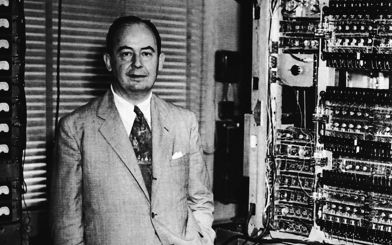
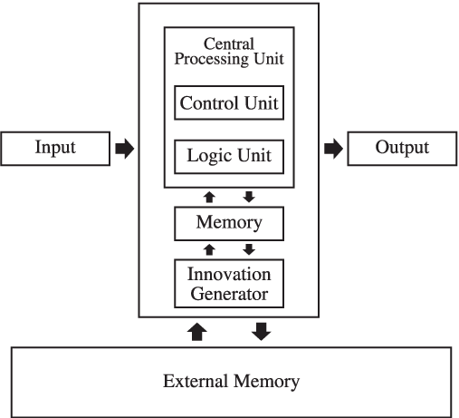
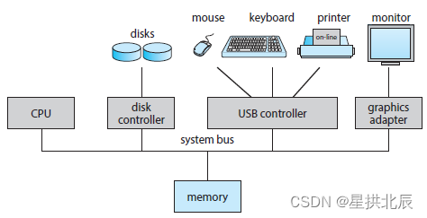
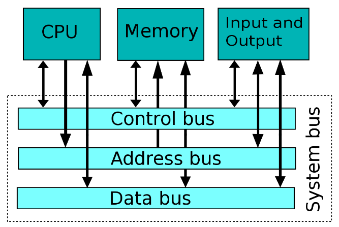
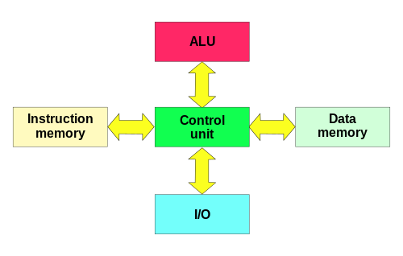

---
title: VonNeumann体系结构和存储程序原理
date: 2021-03-30 11:18:51
summary: 本文介绍冯诺依曼体系结构和存储程序原理。
tags:
- 计算机组成原理
categories:
- 计算机科学基础
---

# VonNeumann体系结构

直到现在，几乎所有的通用计算机都遵循冯诺依曼的设计，即一个具有CPU、存储器和I/O设备组成的架构，把指令和数据放在一个存储器中，取指令和传送数据使用一个总线。



**冯诺依曼体系结构**的特点：
- 由三部分硬件组成：一个带有控制单元、算术逻辑单元ALU、寄存器和程序计数器的CPU，一个主存储器系统，一个I/O系统。
- 执行顺序指令处理的能力。
- 在主存储器系统和CPU的控制单元之间包含一条单一路径，既可以是物理上的也可以是逻辑上的，强制交替指令周期和执行周期。这一单一路径被称为冯诺依曼瓶颈。



下图为现代通用计算机组成所包含的组件：



冯诺依曼执行周期：
1. 控制单元从存储器中取下一条程序指令，使用程序计数器确定指令所在的位置。
2. 指令解码为ALU能理解的语言。
3. 从存储器取出执行这条指令所需要的任何操作数，并且放到CPU的寄存器中。
4. ALU执行这条指令并且把结果放到寄存器或存储器中。

即<kbd>取址$→$译码$→$执行</kbd>：
- 取指
    ```
    (PC)->MAR;
    M(MAR)->MDR;
    (MDR)->IR;
    ```
- 分析指令
    ```
    OP(IR)->CU;
    ```
- 执行指令
    ```
    Ad(IR)->MAR;
    M(MAR)->MDR;
    (MDR)->ACC;
    ```

可以将存储在访问速度慢的存储介质中的程序和数据复制到访问速度快、易失性的存储介质执行。据此，冯诺依曼体系结构可以简化为**系统总线模型**。

系统总线可以响应计算机内部的所有数据传送。
- 数据总线：把数据在主存储器和CPU寄存器之间移动。
- 地址总线：保存数据总线正在访问数据的地址。
- 控制总线：传送信息传输时必要的控制信号。



冯诺依曼体系结构的其他增强方法包括使用索引寄存器寻址、增加浮点数据、使用中断和异步I/O、增加虚拟存储器以及增加通用寄存器等。

早期冯诺依曼体系结构要点：
1. 计算机硬件系统由运算器、存储器、控制器、输入设备、输出设备组成。
2. 指令和数据以同等地位存于存储器内，并可按地址寻址。
3. 指令和数据均用二进制代码表示。
4. 指令由操作码和地址码组成。
    - 操作码表示操作的性质。
    - 地址码表示操作数在存储器中的位置。
5. 指令在存储器内按顺序存放。
6. 早期的冯诺伊曼以运算器为中心，输入/输出设备通过运算器与存储器传送数据。

现代计算机的组织结构：以存储器为中心。

补充：
- 冯诺依曼体系结构的基本工作方式是**控制流驱动方式**。
- 冯诺依曼体系结构中，CPU区分指令和数据的依据是**指令周期的不同阶段**。

# 存储程序原理

存储程序原理是冯·诺依曼于1946年提出的将程序像数据一样存储到计算机内部存储器中的一种设计原理。

存储程序原理：将为解决特定问题而编写的程序存放在计算机存储器中，然后按存储器存储程序的首地址执行程序的第一条指令。以后就按照该程序的规定顺序执行其他指令，直至程序结束执行。

存储程序思想：多种类型的指令和数据均以数字形式存在于存储器中，存储器中既可以存放编辑器程序的源代码，也可以存放相应的编译后的机器码、编译后的程序需要使用的文本，甚至生成机器码的编译器。

只需将程序和数据加载到存储器中并告诉计算机从给定的存储器地址开始执行即可。将指令和数据以相同的方式处理，极大地简化了计算机系统的存储器硬件和软件。

该思想导致了存储程序型计算机的诞生。

计算机采取事先编制程序、存储程序、自动连续运行程序的工作方式，称为存储程序方式。

# 突破VonNeumann体系结构

毫无疑问，冯诺依曼体系结构的提出对计算机科学的发展是跨时代的。时至今日，几乎所有的通用计算机都遵循冯诺依曼体系结构，它们由CPU、存储器和I/O设备组成，它们具有用于指令和数据的单一存储，以及用于获取指令和传输数据的单一总线。遵循冯诺依曼体系结构的计算机顺序执行指令，因此非常适合顺序处理。

然而，冯诺依曼瓶颈继续困扰着工程师寻找方法来构建快速系统，这些系统既便宜又与大量商用软件兼容。当工程师不必须考虑兼容冯诺依曼体系结构时，他们可以自由使用许多不同的计算模型来完成预期目标。**非冯诺依曼体系结构**是指计算模型与冯诺依曼体系结构所列特征不同的架构。例如，不在内存中存储程序和数据，不按顺序处理程序，具有多条总线。

**哈佛体系结构**是经典的非冯诺依曼体系结构。此类计算机有两条总线，一条用于数据，一条单独用于指令，因此允许数据和指令同时传输。此外，它们的数据和指令也单独存储。许多现代通用计算机使用哈佛体系结构的修改版本，它们具有单独的数据和指令路径但没有单独的存储。纯哈佛体系结构通常用于微控制器(芯片上的完整计算机系统)，例如嵌入式系统、电器、玩具和汽车中的微控制器。



许多非冯诺依曼体系结构的计算机都是为特殊目的而设计的。第一个公认的非冯诺依曼体系结构处理芯片专为图像处理而设计。规约机也是不遵循冯诺依曼体系结构的代表，它是一种面向函数式语言的非冯诺依曼体系结构的计算机。数字信号处理器DSP和媒体处理器也不遵循冯诺依曼体系结构，它们可以对一组(多个)数据执行单个指令，而不是对单个数据执行单个指令。

许多不同的子领域属于非冯诺依曼类别，包括在硅中实现的神经网络、元胞自动机、认知计算机(通过经验而不是通过编程学习的机器、量子计算机、数据流计算机、并行计算机。它们的共同特点是：计算分布在并行运行的不同处理单元中。它们的不同之处在于：各个组件之间的连接强弱程度并不相同。其中，并行计算机目前最为流行。

# 对VonNeumann体系结构的认识

计算机出现早期，计算机只是辅助计算的机器。随着计算机变得越来越复杂，计算机变成了通用机器，这就需要将每个系统视为一个层次结构，而不是一个巨大的机器。这样层次结构中，每一层都有特定的用途，所有级别都有助于最大限度地减少高级编程语言或应用程序与构成物理硬件的门和线之间的语义差距。作为程序员，对我们影响最为深远的还是冯诺依曼体系结构下的存储程序原理。尽管还有许多其他的体系结构模型，但冯诺依曼体系结构在当今的通用计算机中仍然稳居主导地位。因此，理解冯诺依曼体系结构和冯诺依曼提出的存储程序原理，是入门计算机的必修课。


