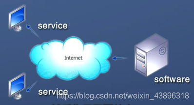
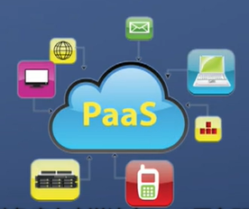
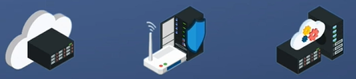
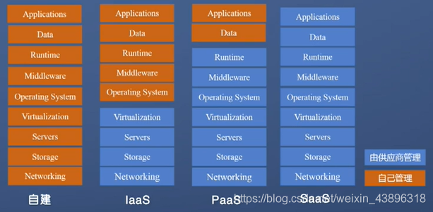

---
title: XaaS
date: 2021-08-11 10:32:57
summary: 本文介绍云计算中XaaS的概念，着重介绍SaaS、PaaS、IaaS。
tags:
- 云计算
categories:
- 计算机科学基础
---

# 云计算

云计算是一种按使用量付费的模式，这种模式提供可用的、便捷的、按需的网络访问，进入可配置的计算资源共享池（资源包括网络、服务器、存储、应用软件、服务），这些资源能够被快速提供，只需投入很少的管理工作，或与服务提供商进行很少的交互。

# XaaS
与云计算相匹配的是**XaaS**，X指代各种计算资源，XaaS意为anything as a Service 或者everything as a Service，一切皆服务。
XaaS强调的是下游对上游按照契约提供服务，隐藏实现的细节，并且通常是通过网络的形式来提供服务。

# 典型XaaS

## SaaS

SaaS，Software as a Service，软件即服务，软件分发方式中心化，供用户订阅。

软件安装在中央服务器上，通过网络远程访问，即可使用软件的功能。

## PaaS

PaaS，Platform as a Service，平台即服务，服务提供商提供开发的整体环境。

## IaaS

IaaS，Infrastructure as a Service，基础设施即服务，虚拟化，用户需要配置和部署中间件和应用服务。

## 比较

# 其他XaaS

- 存储即服务：(storage as a service)
- 安全即服务：SECaaS(security as a service)
- 数据库即服务：DaaS(database as a service)
- 监控/管理即服务：MaaS(monitoring/management as a service)
- 通信、内容和计算即服务：CaaS(communications, content and computing as a service)
- 身份即服务：IDaaS(identity as a service)
- 备份即服务：BaaS(backup as a service)
- 桌面即服务：DaaS(desktop as a service)
