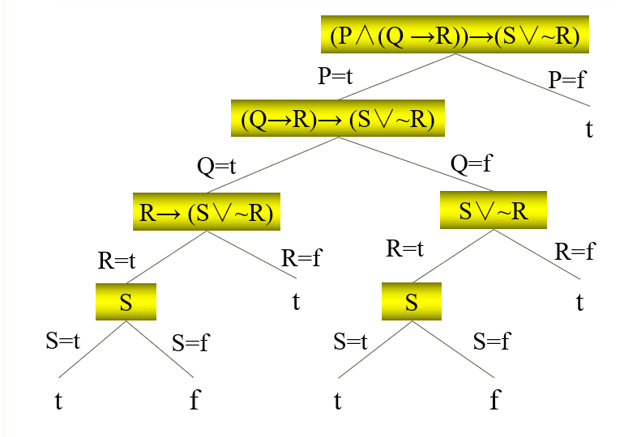

---
title: 人工智能基础
date: 2021-02-13 12:09:51
summary: 本文分享智能Agent理论、四道命题逻辑测验题、基于线性神经网络迭代求解线性方程组等内容。
mathjax: true
tags:
- 人工智能
categories:
- 计算机科学基础
---

# 智能Agent

**Agent**是可以感知环境并在环境中行动的事物，它通过传感器感知环境并对所处环境产生影响。

**感知**表示任何给定时刻Agent的感知输入，感知序列表示该Agent所收到的所有输入数据的完整历史。
一般地，Agent在任何给定时刻的行动选择依赖于到那个时刻为止该Agent的整个感知序列，而不是那些它感知不到的东西。

**Agent函数**指定了Agent响应任何感知序列所采取的行动，它将任意给定感知序列映射为行动。

**人造Agent**的Agent函数通过**Agent程序**实现。

Agent函数是抽象的数学表述；而Agent程序则是具体的实现，它运行在一些物理系统的内部。

**理性Agent**是能把事情做对的Agent。对理性的判断基于以下四方面：
- 定义成功标准的性能度量。
- Agent对环境的先验知识。
- Agent可以完成的行动。
- Agent截止到此时的感知序列。

**性能度量**评价Agent在环境中的行为表现。给定Agent的感知序列，理性Agent行动值追求性能度量的预期值最大化。

理性Agent不仅应该**收集信息**，还要从它所感知的信息中尽可能多地**学习**。
所有的Agent都可以通过学习来改进它们的性能。

如果Agent依赖于设计人员的先验知识而不是它自身感知的知识，则Agent是缺乏**自主性**的。

**全知Agent**明确地知道它的行动产生的实际结果并做出相应的动作，这在现实生活中是不可能存在的。

**任务环境**的规范包括性能度量、外部环境、执行器和传感器。
设计Agent时，第一步总要把任务空间定义的尽可能完全。
任务环境从不同的维度看有很多变化，它们可能是完全或部分可观察的，单人Agent或多Agent的，确定性的或随机的，片段式的或延续式的，静态的或动态的，离散的或连续的，已知的或未知的。

$$Agent=体系结构+程序$$

四种基本的Agent程序是：
- **简单反射Agent**直接对感知信息做出反应。
- **基于模型的反射Agent**保持内部状态，追踪记录记录当前感知信息中反映不出来的世界各方面。
- **基于目标的反射Agent**的行动是为了达到目标。
- **基于效用的Agent**试图最大化它期望的性能。

这些Agent都应该被转换为**学习Agent**，以提高性能以便更好地行动。

**基于知识的Agent**不依靠反射机制而是对知识的内部表示进行操作的推理，它的核心部件是其**知识库**(KB)。知识库是一个语句集合，这些语句使用知识表达语言表达，表示了对世界的某些断言。当某些语句是直接给定的而不是推导得到的时候，我们称其为**公理**。

# 命题逻辑

## 题目

1. 用二叉树方法给出$(P\wedge(Q→R))→(S\vee{\sim{R}})$的所有指派。
2. 将$(P\wedge(Q→R))→S$化成合取范式。
3. 设$\alpha$有四个原子命题$P_{1}$、$P_{2}$、$P_{3}$、$P_{4}$，其所有成假指派为$xtxt$、$ftfx$、$txtf$，写出命题公式$\alpha$。
4. 将$(∀xA(x)→∃xB(x))\vee(Q→R)$化为子句形式。

## 参考答案

1.将$P$用$t$代入作为左分支，$f$代入作为右分支，依次代入$Q$、$R$、$S$得：



- 成真指派：$fxxx$、$txfx$、$txtt$
- 成假指派：$txfx$

**说明：这个图我画的不是很好，分完$P$再分最多的$R$会更好一些。**

2.化简过程如下：
$$(P\wedge(Q→R))→S\\⇔(P\wedge(¬Q\vee{R}))→S\\⇔¬(P\wedge(¬Q\vee{R}))\vee{S}\\⇔(¬P\vee¬(¬Q\vee{R}))\vee{S}\\⇔(¬P\vee(Q\wedge{¬R}))\vee{S}\\⇔((¬P\vee{Q})\wedge(¬P\vee{¬R}))\vee{S}\\⇔(¬P\vee{Q}\vee{S})\wedge(¬P\vee{¬R}\vee{S})$$

3.可以直接写出命题公式如下：
$$¬((P_{2}\wedge{P_{4}})\vee(¬P_{1}\wedge{P_{2}}\wedge{¬P_{3}})\vee(P_{1}\wedge{P_{3}}\wedge{¬P_{4}}))$$

化简过程如下：
$$¬((P_{2}\wedge{P_{4}})\vee(¬P_{1}\wedge{P_{2}}\wedge{¬P_{3}})\vee(P_{1}\wedge{P_{3}}\wedge{¬P_{4}}))\\⇔¬(P_{2}\wedge{P_{4}})\wedge¬(¬P_{1}\wedge{P_{2}}\wedge{¬P_{3}})\wedge¬(P_{1}\wedge{P_{3}}\wedge{¬P_{4}})\\⇔(¬P_{2}\vee{¬P_{4}})\wedge(P_{1}\vee{¬P_{2}}\vee{P_{3}})\wedge(¬P_{1}\vee{¬P_{3}}\vee{P_{4}})$$

4.子句形式需要化简出前束合取范式，化简过程如下：
$$(∀xA(x)→∃xB(x))\vee(Q→R)\\⇔(∀xA(x)→∃yB(y))\vee(Q→R)\\⇔(¬∀xA(x)\vee{∃yB(y)})\vee(¬Q\vee{R})\\⇔(∃xA(x)\vee{∃yB(y)})\vee(¬Q\vee{R})\\⇔(∃x∃y(A(x)\vee{B(y))})\vee(¬Q\vee{R})\\⇔∃x∃y(A(x)\vee{B(y)\vee¬Q\vee{R}})$$

所以子句形式为：$A(a)\vee{B(b)\vee¬Q\vee{R}}$

# 基于线性神经网络迭代求解线性方程组

## 题目

已知如下的线性方程组：

$\begin{bmatrix} 1 & 0 & -1 & 0 \\ -1 & 0 & 0 & 1 \\ 0 & -1 & 1 & -1 \\ -1 & -1 & -1 & 0 \end{bmatrix} \begin{bmatrix} W_{1} \\ W_{2} \\ W_{3} \\ W_{4} \end{bmatrix}=\begin{bmatrix} 1 \\ 2 \\ 3 \\ 4 \end{bmatrix}$

要求基于简单的线性神经网络模型求解，并将训练得到的$(W1,W2,W3,W4)$与求解方程组得到的$(W1,W2,W3,W4)$进行对比，分析差别。

## 实现要点

实现要点：
- 网络学习规则采用$Delt$规则：$\Delta{w_{ij}} =\eta(t_{i}-a_{i})\cdot{a_{j}}$
- 随机置初始权重：$W_{1}=W_{2}=W_{3}=W_{4}=0$
- 置一个较小的学习率：$η=0.5$
- 判断网络学习的准确程度，利用目标值与实际输出误差指标函数：$E=\sqrt{(\sum(t_{ie}-a_{ie})^2)}$
- 迭代到偏差小于$1\times{10^{-10}}$或者迭代$500$轮即停止迭代

## Python编程实现

```python
from math import sqrt


def get_output(a, weights):
    return a[0] * weights[0] + a[1] * weights[1] + a[2] * weights[2] + a[3] * weights[3]


def get_lr(input):
    max = 0.0
    for i in range(4):
        row = input[i]
        len2 = row[0] * row[0] + row[1] * row[1] + row[2] * row[2] + row[3] * row[3]
        if len2 > max:
            max = len2
    return 2.0 / max


def optimizer(a, weights, loss, lr):
    eta = 0.5
    for i, weight in enumerate(weights, 0):
        weights[i] = weight + eta * loss * lr * a[i]


def get_loss(output, label):
    return label - output


if __name__ == "__main__":
    inputs = [[1.0, 0.0, -1.0, 0.0], [-1.0, 0.0, 0.0, 1.0], [0.0, -1.0, 1.0, -1.0], [-1.0, -1.0, -1.0, 0.0]]
    label = [1.0, 2.0, 3.0, 4.0]
    ilr = get_lr(inputs)
    weights = [0.0, 0.0, 0.0, 0.0]
    for epoch in range(500):
        total_loss = 0.0
        for i, row in enumerate(inputs, 0):
            output = get_output(row, weights)
            a_label = label[i]
            loss = get_loss(output, a_label)
            optimizer(row, weights, loss, ilr)
            total_loss += loss * loss
        total_loss = sqrt(total_loss)
        print("第{}轮的loss为：{}".format(epoch+1, total_loss))
        if total_loss < 1e-10:
            break
    print(weights)
```
