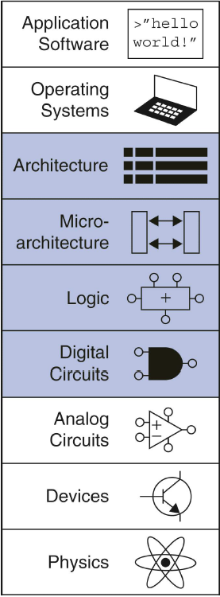
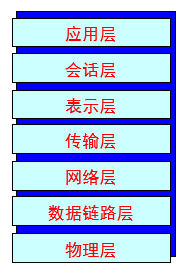
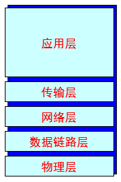
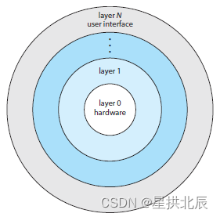
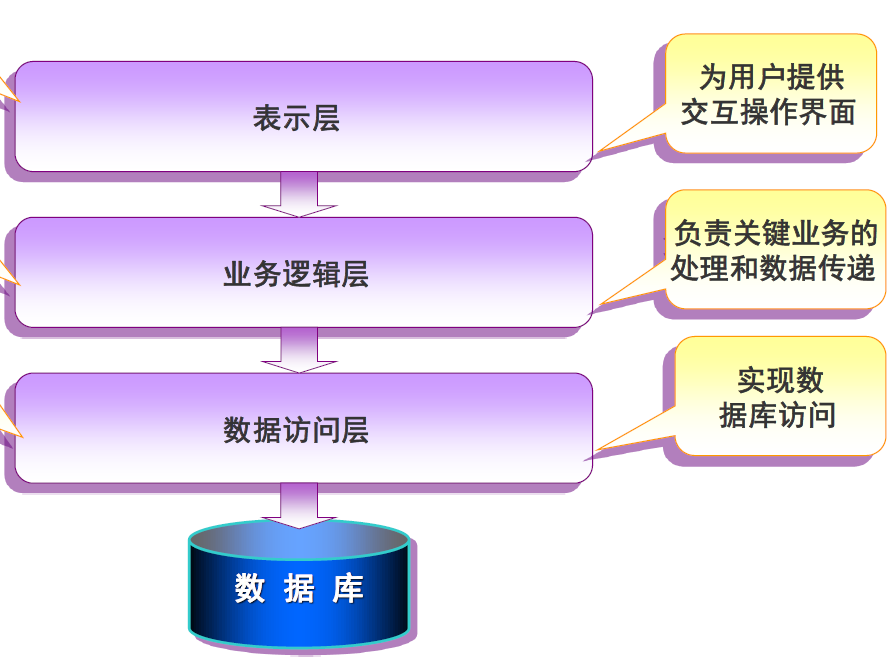
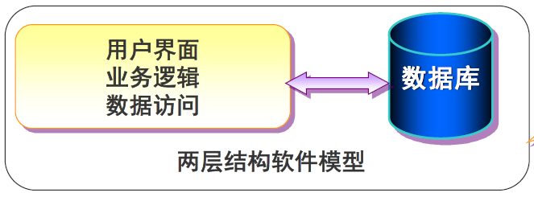
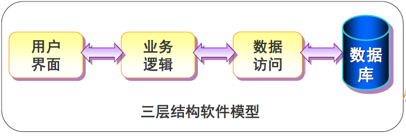
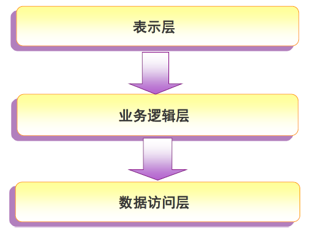
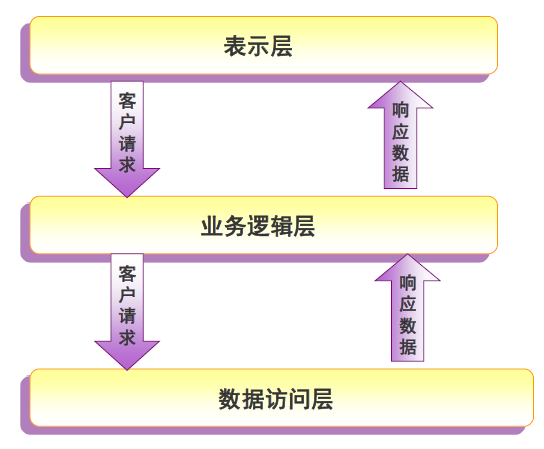
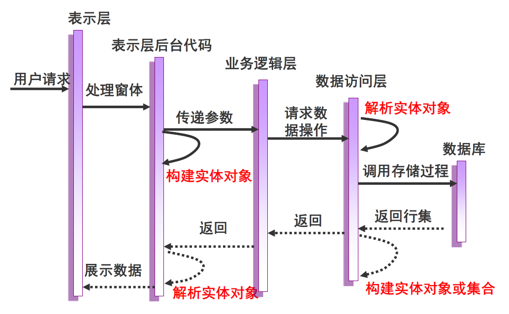

---
title: 分层抽象
date: 2021-02-07 01:55:37
tags:
- 计算机科学基础
categories:
- 计算机科学基础
---

# 分层抽象

分层抽象是计算机科学和软件工程的重要思想，是[控制复杂性的重要手段](https://blankspace.blog.csdn.net/article/details/113634653)。

# 电子计算机的分层抽象

推荐阅读：[电子计算机的分层抽象](https://blankspace.blog.csdn.net/article/details/113634653)

下图是对电子计算机的分层抽象，这里将计算机分为九层：应用程序层、操作系统层、体系结构层、微结构层、逻辑层、数字电路层、模拟电路层、器件层、物理层。

下面自顶向下地介绍电子计算机的每一层：
1. 应用软件基于操作系统实现多种多样的应用功能。
2. 操作系统是和硬件最为密切的程序，既是资源分配器，又控制各着种I/O设备和用户程序的需求。
3. 体系结构描述的是程序员观点的计算机抽象。
4. 微结构层将逻辑组件组合在一起以实现体系结构中定义的指令。
5. 逻辑层关注的是由数字电路层的逻辑门构成的逻辑组件，如加法器等。
6. 数字电路层关注的是逻辑门，电压被控制为离散的值表示为0和1。
7. 模拟电路层关注的是器件组合在一起构成的放大器等组件，输入输出都是连续的电压值。
8. 器件层关注的是晶体管、真空管等电子元器件，这些器件都有明确的外部连接点terminal，建立起了每个terminal上电压与电流之间的关系模型。
9. 物理层关注的是电子运动，由麦克斯韦方程组、量子力学等支持。

# 网络通信的分层抽象

推荐阅读：[计算机网络核心知识归纳总结](https://blankspace.blog.csdn.net/article/details/105528356)

OSI七层参考模型：

TCP/IP五层参考模型：

计算机网络中：
- 实体表示任何可发送或接收信息的硬件或软件进程。 
- 协议是控制两个对等实体进行通信的规则的集合。 
    - 在协议的控制下，两个对等实体间的通信使得本层能够向上一层提供服务。
    - 要实现本层协议，还需要使用下层所提供的服务。 
    - 本层的服务用户只能看见服务而无法看见下面的协议。
    - 下面的协议对上面的服务用户是透明的。 
    - 协议是“水平的”，即协议是控制对等实体之间通信的规则。
- 接口定义了下层向上层提供的原语操作和服务。
- 服务是“垂直的”，即服务是由下层向上层通过层间接口提供的。
- 同一系统相邻两层的实体进行交互的地方，称为服务访问点 SAP(Service Access Point)。  

下面自顶向下地介绍TCP/IP五层模型的每一层：
- 应用层：应用层为用于通信的应用程序和用于消息传输的底层网络提供接口，是应用层协议得以存在和网络应用得以实现的地方。
- 传输层：传输层为两个不同主机上的进程提供逻辑上的通信，又称为端到端的通信。所谓“逻辑通信”的意思是：运输层之间的通信好像是沿水平方向传送数据，但事实上这两个运输层之间并没有一条水平方向的物理连接。运输层的一个很重要的功能就是复用和分用。应用层不同进程的报文通过不同的端口向下交到运输层，再往下就共用网络层提供的服务。
- 网络层：网络层将报文段从发送端主机传送到接收端主机。在发送端，将报文段封装成数据报；在接收端，将报文段传输到传输层。路由器检查每个到达的IP数据报的首部，进行路由选择和转发。
- 数据链路层：数据链路层提供帧同步、寻址、流量控制、差错控制、数据和控制信息的识别、透明传输、链路管理等服务。
- 物理层：物理层为数据端设备提供传送数据通路、传输数据。

# 操作系统的分层抽象

推荐阅读：[操作系统](https://blankspace.blog.csdn.net/article/details/128744560)

基于适当的硬件支持，操作系统可分成许多块。分块后的操作系统能更好地控制计算机并使用计算机的应用程序，在改变系统的内部工作和创建模块操作系统时，开发人员也能有更多自由。因此，操作系统的设计者可以采用自顶向下的方法，可先确定总的功能和特征，再划分成模块。信息隐藏也很重要，因为它在保证程序接口不变和程序执行功能不变的前提下，允许程序员自由实现低层程序。

操作系统的模块化有许多方法，其中之一就是分层法。所谓分层法，即操作系统分成若干层(级)。最低层是硬件，最高层是[用户接口](https://blankspace.blog.csdn.net/article/details/113446238)。而中间的各个操作系统层采用抽象对象类型ADT，包括数据结构和一组可为更高层所调用的程序集，该层可调用更低层的操作。

分层法构造操作系统的主要优点在于简化了构造和调试。所选的层次要求每层只能调用更低层的功能和服务，大大简化了系统的调试和验证。第一层可先调试而无需考虑系统其他部分，这是因为根据定义，它只使用了基本硬件(假设硬件是正确的)，以便实现功能。一旦第一层调试后，可认为它能正确运行，这样就可调试第二层，如此向上逐层调试。如果在调试某层时发现错误，那么错误可以定位到这一层。

分层操作系统的每层的实现都只是利用更低层所提供的操作，且只需知道这些操作做了什么，而并不需要知道这些操作是如何实现的。因此，每层要为更高层隐藏一定的数据结构、操作和硬件。

分层法的主要难点在于合理定义各层。由于每层只能利用更低层的功能，因此有必要仔细规划。

分层实现的主要问题之一是效率较低。例如，当一个用户程序执行I/O操作时，它执行系统调用并陷入IO层，IO层会调用内存管理层，内存管理层接着调用CPU调度层,最后传递到硬件。在每一层，参数可能会被修改，数据可能需要传递，这些操作都会降低执行效率、增加额外开销。

# 软件架构的分层抽象

## 三层架构

三层架构每一层的职能如下：
- 表示层：表示层为用户提供了一种交互式操作界面。
- 业务逻辑层：业务逻辑层是表示层与数据访问层的桥梁，负责数据的处理和传递，执行复杂业务逻辑。
- 数据访问层：数据访问层实现了对数据的增删改查操作。

比起三层架构，更简单的两层架构是这样的：数据访问和业务逻辑混在一起；用户界面直接调用数据访问；整个系统功能放在同一个项目中实现。

这是很多不熟悉三层架构的初学者喜欢的模式，它的问题主要是：难以适应需求的变化、不易维护、安全性差。

而对于三层架构，当数据库或用户界面发生改变时，不需要完全重新开发，只需做简单调整即可。

## 三层架构的层间关系

层间依赖关系：

层间数据流向：

## 三层架构与实体类

三层架构的层与层之间传递的是实体对象。实体对象是实体类的实例化，是完全受控制的对象。实体对象消除了关系数据和对象之间的差异，具有OOP的基本特征，可以自定义行为。

软件工程实践中，实体类有很多种，例如BO、DAO、DO、DTO、PO、POJO、VO，其中最常经典的是DAO、PO、VO。

DAO通常和PO结合使用，用于访问数据库，包含了各种数据库的操作方法，这些方法能实现功能；配合VO，提供数据库的CRUD操作。

PO是在O/R映射的时候出现的概念，如果没有O/R映射，就没有这个概念存在了。PO通常对应数据模型(数据库表)，本身还有部分业务逻辑的处理。可以看成是与数据库中的表相映射的Java对象。最简单的PO就是对应数据库中某个表中的一条记录，多个记录可以用PO的集合。PO中应该不包含任何对数据库的操作。

VO通常用于业务层之间的数据传递，和PO一样也是仅仅包含数据而已。VO抽象出的业务对象，可以和表对应，也可以不对应，可根据业务的需要自己选择。VO主要对应界面显示的数据对象。对于一个Web页面，或者Swing等的一个界面，用一个VO对象对应整个界面的值。

## 三层架构和MVC模式

- MVC是一种设计模式，我们可以用它来创建在域对象和UI表示层对象之间的区分。
- 同样是架构级别的，相同的地方在于二者都有一个表现层，但是他们不同的地方在于其他的两个层。
- 三层架构中没有定义Controller的概念，这是两者最不同的地方。而MVC也没有把业务的逻辑访问看成两个层，这是采用三层架构或MVC搭建程序最主要的区别。
- 三层架构中也提到了Model，但是三层架构中Model的概念与MVC中Model的概念是不一样的。三层架构中典型的Model层是以实体类构成的；而MVC里Model则是由业务逻辑与访问数据组成的。

