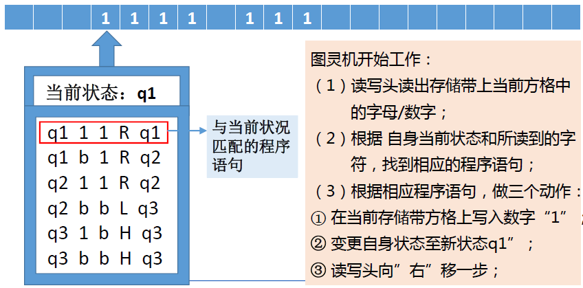
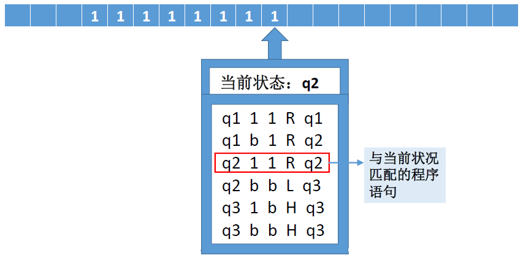

# 图灵机的组成
- 一条存储带
  - 双向无限延长上有一个个小方格
  - 每个小方格可存储一个数字/字母
- 一个控制器
  - 包含一个读写头，可以读、写、更改存储带上每一格的数字/字母
  - 可以接受设定好的程序语句
  - 可以存储当前自身的状态
  - 可以根据读到的字母/数字变换自身的状态
  - 可以沿着存储带一格一格地左移/右移


# 图灵机的工作步骤
- 准备
  - 存储带上符号初始化
  - 控制器设置好自身当前状态（初始化状态）
  - 读写头置于起始位置
  - 准备好工作程序;
- 反复执行以下工作直到停机
  - 读写头读出存储带上当前方格中的字母/数字
  - 根据自身当前状态和所读到的字符，找到相应的程序语句
  - 根据相应程序语句，做三个动作
    - 在当前存储带方格上写入一个相应的字母/数字
    - 变更自身状态至新状态
    - 读写头向左或向右移一步


# 图灵机的运行机理示例








至此，成功停机。

整个过程，完成了一个4+3=7的过程。

# 图灵机的停机

图灵机的停机问题：判断任意一个程序是否会在有限的步骤之内结束运行的程序是否存在?

图灵机的停机意味着：
- 给定符号序列$A$，如果能找到一个图灵机，得出对应的符号序列$B$，那么从$A$到$B$就是可计算的。
- 也就是说：
  - 对于一个问题的输入$A$，问：$A$能否推证出$B$？
  - 如果能找到一个图灵机，得出对应的符号序列$B$，那么从$A$到$B$就是可计算的。
  - 否则，该问题不可计算。

图灵认为：不存在这样的程序。

证明：采用**反证法**
假设存在这样的程序，即，存在程序$H(P,I)$可以给出程序$P$在输入$I$时是否停机的判断：若$P$在输入$I$时可停机，$H$输出“停机”，反之输出“不停机（死循环）”（注：停机与死循环是对立的），即可导出下面的矛盾：
根据假设，可以设计一个调用程序$H$的主程序$K$如下：
首先，它调用$H(P,P)$，如果$H(P,P)$，输出“死循环”，则$K(P)$停机，反之$K(P)$死循环。即$K(P)$做与$H(P,P)$的输出相反的动作。
$K(P)$的程序如下：
```c
int H(P,I); // 这里的H函数有两种返回值：死循环或停机

int K(P) {
    if (H(P,P) == 死循环) { // 程序本身可以被视作数据
        return 停机;  // 主程序K停机
    } else { // H(P,P) == 停机
        while(1){} // 这里K会死循环
    }
}
```
视$K$程序为参数$P$，观察$K(K)$的运行：若$H(K , K)$输出死循环，实际观察到$K(K)$停机，但由$H$的定义知二者矛盾。反之，$H(K, K)$输出停机，$K(K)$实际死循环，两者仍然矛盾。
因此，假设程序$H$存在引发不可避免的矛盾，表明开始的假设不成立。
结论是：不存在这样的程序。
证明结束。
又称：“$H$是不可计算函数”、“停机问题不可解”。

以停机问题为基础，发现了大量不可计算问题，如“铺砖问题”等。

# 图灵机的优势

- 强大
- 简单
- 可实现

# 图灵机的理论意义

- 给出了一个可实现的通用计算模型
- 引入了通过“读写符号”和“状态改变”进行运算的思想
- 证实了基于简单字母表完成复杂运算的能力
- 引入了存储区、程序、控制器等概念的原型

# 图灵机模拟器

[图灵机模拟器网址](http://morphett.info/turing/turing.html)


