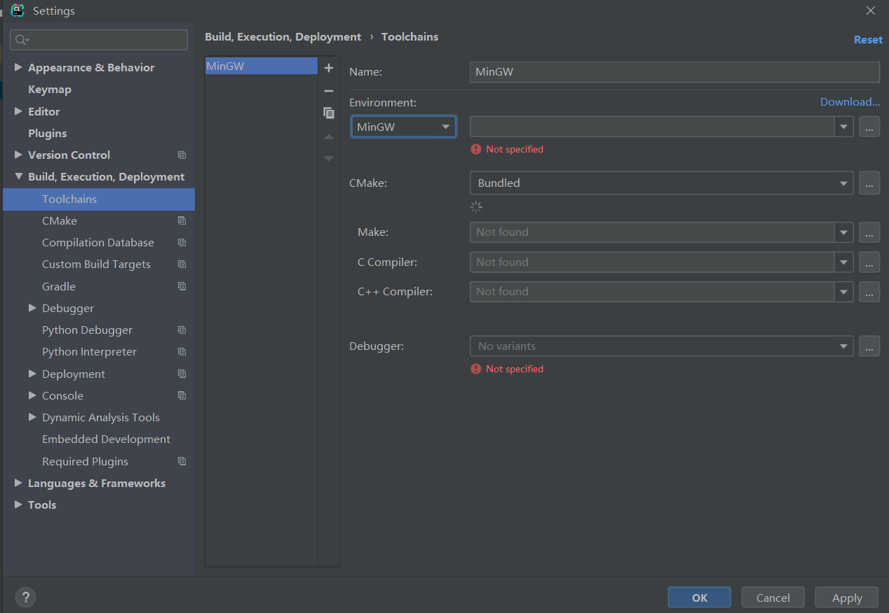

# 编程

C语言源程序要依据语法规则编写。

C语言源程序主要包括以下部分：
- 预处理器指令
- 函数
- 变量
- 语句和表达式
- 注释

C语言源程序样板：
```c
#include <stdio.h>
 
int main()
{
   printf("Hello, World!\n");
   return 0;
}
```

推荐阅读：[菜鸟教程 - C语言教程](https://www.runoob.com/cprogramming/c-tutorial.html)

推荐阅读：[程序设计的基本理论和常识](https://blog.csdn.net/weixin_43896318/category_11653076.html)

开发流程：
1. 打开文本编辑器或集成开发工具，创建C语言工程和C程序源文件，编写C语言代码。
2. 保存C程序源文件。
3. 打开命令终端，进入到保存文件所在的目录。
4. 键入`gcc main.c`，输入回车，编译代码。
5. 如果代码中没有错误，命令提示符会跳到下一行，并生成`a.out`可执行文件，通过`-o`选项可以改编可执行文件名称。
6. 键入可执行文件的名称，例如`./main`或`./a.out`。
7. 看到屏幕上显示输出结果。


# 搭建开发环境

常用编辑器：Visual Studio Code

常用IDE：Code Blocks、Dev C++、Visual Studio、CLion

## CLion


建议从[官网](https://www.jetbrains.com/clion/)下载程序，或者通过ToolBox安装。

刚刚安装的CLion需要配置后才能Run程序：



我们可以下载并安装MinGW编译器：


如上图，点击download，会跳转网页，这里推荐另一个网页可[下载MinGW](https://sourceforge.net/projects/mingw-w64/)：


不要直接点击绿色的Download，而是往下找：


选上图这个版本即可。然后开始下载：


然后找到需要的位置，解压：


此时需要找到文件路径添加到CLion的Settings里（注意：路径要写到mingw64，建议直接复制粘贴）：


稍作等待，待全部出现上图的绿色对勾就OK了，点击“OK”这个Button：


等配置完成，Run一下HelloWorld试试吧：


## CentOS

想要更好地学习和掌握C语言，还是要掌握Linux操作系统。

推荐阅读：[VMware安装CentOS7系统](https://blankspace.blog.csdn.net/article/details/104792128)

# 编译

推荐阅读：[翻译、编译、解释、汇编](https://blankspace.blog.csdn.net/article/details/119749522)

推荐阅读：[C语言源程序的编译与执行](https://blankspace.blog.csdn.net/article/details/102681464)

推荐阅读：[Makefile使用总结 ](https://www.cnblogs.com/wang_yb/p/3990952.html)

通常，程序以二进制可执行文件的形式驻留在磁盘上。例如，`a.out`或`hello.exe`。为了在CPU上运行，程序必须进入内存并置于进程的上下文中。

C语言源文件将被**编译器(compiler)** 编译成目标文件，这些目标文件旨在加载到任何物理内存位置，这种格式称为**可重定位目标文件**。

# 链接

**链接器(linker)** 将这些可重定位目标文件整合成一个**二进制可执行文件**。在链接阶段，也可能包含其他目标文件或库，通过-lm指定。

实际上，不见得所有库都链接到可执行文件并加载到内存中，大多数操作系统都允许程序在加载程序时动态链接库。例如，Windows支持动态链接库(DLL)。这种方法的好处是它避免了链接和加载可能最终不会被用于可执行文件的库。动态链接库是有条件地链接的，如果在程序运行时需要它，它就会被加载。链接器会插入重定向信息，允许它在程序加载时动态链接和加载。

目标文件和可执行文件通常具有标准格式，包括编译后的机器代码和符号表，其中包含有关程序中引用的函数和变量的元数据。对于UNIX和Linux系统，这种标准格式称为可执行和可链接格式(ELF)。可重定位文件和可执行文件有不同的ELF格式。可执行文件的ELF文件中有一条信息是程序的入口点，它包含程序运行时要执行的第一条指令的地址。Windows系统使用PE(Portable Executable)格式，MacOS使用Mach-O格式。

**动态链接**类似于下文提到的动态加载，通常用于系统库，如语言的子程序库。动态链接库为系统库，可链接到用户程序，以便运行。有的操作系统只支持静态链接，它的系统库与其他目标模块一样，通过加载程序，被整合到二进制程序映像。如果不支持动态链接，系统内的所有程序都需要一份语言库的副本或那些被程序所引用的子程序，极大地浪费了磁盘空间和内存空间。

如果支持动态链接，在二进制映像内，每个库程序的引用都有一个存根(stub)。该存根是一小段代码，用来指出如何定位适当的内存驻留库程序，或者当程序不在内存里时应如何加载库。当执行存根时，它首先检查所需程序是否已在内存中。如果不在，就将程序加载到内存。不管如何，存根会用程序地址来替换自己，并开始执行程序。因此，下次再执行该程序代码时，就可以直接进行，而不会因动态链接产生任何开销。采用这种方案，使用语言库的所有进程只需要一个库代码副本就可以了。

动态链接也可用于库的更新。一个库可以被新的版本所替代，而且使用该库的所有程序会自动使用新的版本。没有动态链接，所有这些程序应当重新链接以便访问新的库。为了不让程序意外执行新的、不兼容版本的库，版本信息包括在程序和库中。一个库的多个版本可以都加载到内存，程序将通过版本信息来确定使用哪个库的副本。版本更迭会导致版本号的增加。因此，只有采用新库编译的程序才会受新库的不兼容改动的影响。在新库安装之前链接的其他程序将继续使用较旧的库。这种系统也称为共享库。

与动态加载不同，动态链接通常需要操作系统的帮助。如果内存中的进程是彼此保护的，那么只有操作系统才可以检查所需程序是否在某个进程的内存空间内，或是允许多个进程访问同样的内存地址。

# 加载

**加载器(loader)** 用于将二进制可执行文件加载到内存中，使其有资格在CPU上运行。链接和加载需要经过**重定向**，它将实际地址分配给程序部分并调整程序中的代码和数据以匹配这些地址。例如，代码可以调用库函数并在执行时访问其变量。

如果一个进程的整个程序和所有数据都应在物理内存中，进程的大小受限于内存的大小。为了获得更高的内存空间利用率，可以使用**动态加载**。采用动态加载时，一个程序只有在调用时才会加载。所有程序都以可重定位加载格式保存在磁盘上，等到主程序被加载到内存即可执行。

当一个程序需要调用另一个程序时，调用程序首先检查另一个程序是否已加载。如果没有加载，可重定位链接程序会加载所需的程序到内存，并更新程序的地址表以反映这一变化。接着，控制传递给新加载的程序。

动态加载的优点是，当程序被需要时，它才会被加载。当大多数代码需要用来处理异常情况时，这种方法特别有效。在这种情况下，虽然整个程序可能很大，但是所用到的和加载的部分可能很小。

与动态链接不同，动态加载不需要操作系统提供特别支持。用户只需要认真设计程序以利用这种方法的优点，而操作系统可以通过实现动态加载的程序库来帮助程序员更好地编程。

# 执行

推荐阅读：[程序在内存中运行的奥秘](https://www.cnblogs.com/chip/articles/4289623.html)

推荐阅读：[操作系统](https://blankspace.blog.csdn.net/article/details/128744560)

推荐阅读：[操作系统的进程管理](https://blankspace.blog.csdn.net/article/details/128746107)

推荐阅读：[操作系统的内存管理](https://blankspace.blog.csdn.net/article/details/128747625)

完成上述过程后，如果想要运行程序，只需在命令行中输入可执行文件的名称即可，例如`./main`。

利用UNIX/Linux系统执行程序的可执行文件，可以通过命令终端或GUI界面。
在终端中输入程序名称运行程序时，Shell首先**创建一个新进程**以使用fork()系统调用运行该程序。然后Shell使用exec()系统调用**调用加载程序**，将可执行文件的名称传递给 exec()。加载程序然后使用新创建的进程的地址空间将指定的程序加载到内存中。
在GUI界面操作时，**双击**与可执行文件关联的图标会使用类似的机制调用加载程序。

多个进程可以共享动态链接库，从而显著节省内存使用。

printf()的执行也要执行系统调用。


