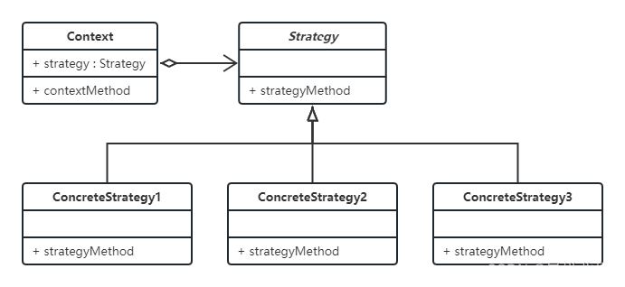

---
title: 策略和机制分离
date: 2023-06-25 17:00:00
summary: 本文以操作系统和策略模式为例，分享策略和机制分离的思想。
tags:
- 计算机科学基础
categories:
- 计算机科学基础
---

# 策略和机制

计算机科学和软件工程实践中，“策略和机制分离”是一条重要经验。为了弄明白这句话的含义，首先要理解什么是策略，什么是机制。

想要做一件事达成一个目标，要知道为什么做(Why)，做什么(What)，如何做(How)。研究目的或工程需求明确了“为什么做”，策略决定了“做什么”，机制决定了“如何做”。

策略与机制的分离对于灵活性的保持很重要。在实际操作中，明确了“为什么做”以后，就该明确“做什么”，此后的“如何做”可能有多种方案；而对于明确的“为什么做”，前期开发出充足的底层机制，可以为后续提供更多的策略选择。例如，面对给定的任务目标和输入输出需求，我们可以更换许多可选的模型去尝试调参，我们可以尝试更换许多不同的算法实现去比较，算法的可替换性就显得十分重要。如果不能实现低成本的替换，则不利于任务目标的达成。

对于固定的顶层策略，底层实现应该提供多种选择，并且做到低成本切换和替换。对于固定的底层机制，策略可能随时间或地点而改变，对策略改变不敏感的通用底层机制将是更可取的。

# 操作系统中的策略和机制

推荐阅读：[操作系统](https://blankspace.blog.csdn.net/article/details/128744560)

例如，操作系统存在某种机制，可赋予某些类型的程序相对更高的优先权。如果这种机制能与策略分离开，那么它可用于支持I/O密集型程序应比CPU密集型程序具有更高优先级的策略，或者支持相反策略。

微内核操作系统也是一个典型的例子。微内核操作系统通过实现一组基本且简单的模块，将机制与策略的分离用到了极致。这些模块几乎与策略无关，通过用户创建的内核模块或用户程序本身，可以增加更高级的机制与策略。

# 软件工程中的策略模式

策略模式是GoF23种设计模式中的一种，是软件工程的重要实践。通过策略模式，借助委托，我们可以更方便地替换算法，甚至是动态替换算法。

策略模式涉及三个角色：
- **Strategy**：该角色负责决定实现策略所必需的接口。
- **ConcreteStrategy**：该角色负责实现Strategy角色所定义的接口。
- **Context**：该角色保存了ConcreteStrategy角色的实例，并调用ConcreteStrategy的角色去实现需求。

基于[ProcessOn](https://www.processon.com)绘制的策略模式的类图如下所示：



## 策略模式的排序应用

Maven依赖：
```xml
    <dependencies>
        <dependency>
            <groupId>org.junit.jupiter</groupId>
            <artifactId>junit-jupiter-api</artifactId>
            <version>5.9.0</version>
            <scope>test</scope>
        </dependency>
        <dependency>
            <groupId>org.junit.jupiter</groupId>
            <artifactId>junit-jupiter-engine</artifactId>
            <version>5.9.0</version>
            <scope>test</scope>
        </dependency>
        <dependency>
            <groupId>org.junit.jupiter</groupId>
            <artifactId>junit-jupiter-params</artifactId>
            <version>5.9.0</version>
            <scope>test</scope>
        </dependency>
    </dependencies>
```

Strategy类定义为`SortStrategy.java`：
```java
public interface SortStrategy<T extends Comparable<T>> {

    void sort(T[] data);

}
```

提供选择排序实现机制`InsertSortStrategy.java`：
```java
public class InsertSortStrategy<T extends Comparable<T>> implements SortStrategy<T> {

    public void sort(T[] data) {
        int position, length = data.length;
        T temp;
        for (int i = 1; i < length; i++) {
            temp = data[i];
            for (position = i; position > 0 && temp.compareTo(data[position - 1]) < 0; position--) {
                data[position] = data[position - 1];
            }
            data[position] = temp;
        }
    }

}
```

提供冒泡排序实现机制`BubbleSortStrategy.java`：
```java
public class BubbleSortStrategy<T extends Comparable<T>> implements SortStrategy<T> {

    public void sort(T[] record) {
        int position, bound, length = record.length, exchange = length - 1;
        T temp;
        while (exchange != 0) {
            bound = exchange;
            exchange = 0;
            for (position = 0; position < bound; position++) {
                if (record[position].compareTo(record[position + 1]) > 0) {
                    temp = record[position];
                    record[position] = record[position + 1];
                    record[position + 1] = temp;
                    exchange = position;
                }
            }
        }
    }

}
```


单元测试`SortStrategyTest .java`（省略Context角色）：
```java
import org.junit.jupiter.api.Assertions;
import org.junit.jupiter.api.Test;

import com.blankspace.csdn.pattern.strategy.sort.BubbleSortStrategy;
import com.blankspace.csdn.pattern.strategy.sort.InsertSortStrategy;
import com.blankspace.csdn.pattern.strategy.sort.SortStrategy;

public class SortStrategyTest {

    @Test
    public void insertSortStrategyTest() {
        SortStrategy<Integer> strategy = new InsertSortStrategy<>();
        Integer[] actualData = new Integer[]{3, 4, 2, 6, 1, 5};
        Integer[] expectedData = new Integer[]{1, 2, 3, 4, 5, 6};
        strategy.sort(actualData);
        Assertions.assertArrayEquals(expectedData, actualData);
    }

    @Test
    public void bubbleSortStrategyTest() {
        SortStrategy<Integer> strategy = new BubbleSortStrategy<>();
        Integer[] actualData = new Integer[]{3, 4, 2, 6, 1, 5};
        Integer[] expectedData = new Integer[]{1, 2, 3, 4, 5, 6};
        strategy.sort(actualData);
        Assertions.assertArrayEquals(expectedData, actualData);
    }

}
```
