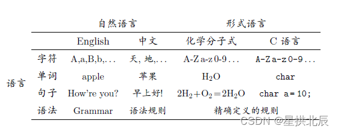
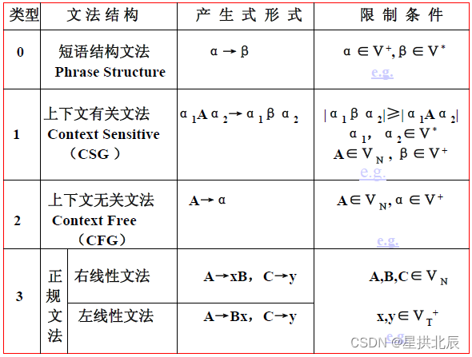

---
title: 计算理论基础
date: 2021-03-22 00:30:12
summary: 本文分享计算理论的基本知识。
tags:
- 计算理论
categories:
- 计算机科学基础
---

计算理论是研究计算模型的一门学科，是研究理论计算机的科学。

理论计算机是研究计算机的理论模型，研究计算机的本质，也就是把计算机看成一个数学系统。这是因为，计算机科学的基本思想和模型在本质上是数学(离散)的。

计算机的基本能力和限制是什么?
- 究竟哪些问题, 可通过计算解决？ $→$ 可计算性理论
- 解决可计算的问题，究竟需要多少资源？ $→$ 计算复杂性理论
- 为了研究计算, 要使用哪些计算模型？ $→$ 形式语言与自动机理论

计算理论是学习编译原理的基础。

核心内容：
- 正则语言
    - 有穷自动机
    - 正则表达式
    - 正则语言的性质
- 上下文无关语言
    - 上下文无关文法
    - 下推自动机
    - 上下文无关语言的性质
- 计算导论
    - 图灵机及其扩展
    - 不可判定性

自动机理论：研究抽象机器及其所能解决问题的理论。

形式语言：经数学定义的语言。

字母表：符号(字符)的非空有穷集。
$\Sigma_{1}=\{0,1\}$
$\Sigma_{2}=\{a,b,c,d,...,z\}$
$\Sigma_{3}=\{x|x是一个汉字\}$

字符串：由某字母表中符号组成的有穷序列。
若$\Sigma_{1}=\{0,1\}$，那么$0,1,00,111001$为$\Sigma_{1}$上的字符串。
若$\Sigma_{2}=\{a,b,c,d,...,z\}$，那么$ab,cdef$为$\Sigma_{2}$上的字符串。

空串：记为$\varepsilon$，有$0$个字符的串。
字母表$\Sigma$可以是任意的，但都有$\varepsilon\notin\Sigma$。

符号使用的一般约定：
- 字母表：$\Sigma,\Gamma,...$
- 字符：$a,b,c,...$
- 字符串：$...,w,x,y,z$
- 集合：$A,B,C,...$

文法：一个文法$G$是个有序四元组，记作$G=(V_{N},V_{T},P,S)$。
- $V_{N}$：非终极符(变元)集合，用大写英文字母表示。
- $V_{T}$：终极符集合，这里$V_{N}\cap{V_{T}}=\Phi$，有时记作$V_{N}\cup{V_{T}}=V$。
- $P$：生成式(产生式)的集合。
- $S$：开始变元，$S\in{V_{N}}$。

文法中使用的符号通常作如下约定：
- 用大写英文字母表示变元。S通常表示开始变元。
- 用小写的$a,b,c,…$表示终极符。
- 用$x,y,z,…$表示终极符串，即$x,y,z,…∈V_{T}^{*}$。
- 用$α,β,γ,…$希腊字母表示既含有终极符，也含有非终极符的符号串，即$α,β,γ,…\in(V_{N}\cup{V_{T}})^{*}$。

设文法$G=(V_{N},V_{T},P,S)$，则：
- $S$是个句型。
- 若$αβγ$是个句型，且$β→δ$是$P$中的一个产生式，则$αδγ$也是一个句型。

按此定义，对于文法$G_{2}$来说，$P=\{S→0S1|01\}$。
$S$，$0S1$，$00S11$，$000111$都是句型。

| 文法 | 产生的语言 | 自动机 |
|:----:|:----:|:----:|
| 0型语言 | 递归可枚举集(r.e) (recursively enumerable set) | 图灵机 |
| 1型语言 | 上下文有关语言(CSL) (Context Sensitive Language) | 线性界限自动机 |
| 2型语言 | 上下文无关语言(CFL) (Context Free Language) | 下推自动机 |
| 3型语言 | 正规集(regular set) | 有限自动机 | 

可以看出，各类文法之间有向上兼容性，即：3型语言 $\subseteq$ 2型语言 $\subseteq$ 1型语言 $\subseteq$ 0型语言

算术公理的相容性：
- 完备性：所有能从该形式化系统推导出来的命题，都可以从这个形式化系统推导出来。
- 一致性：一个命题不可能同时为真或为假。
- 可判定性：算法可以在有限步内判定命题的真伪。

哥德尔不完全性定理：任何表达力足够强（递归可枚举）的系统都不可能同时具有一致性和完备性。

判定性问题是无法解决的，即有些数学问题是不可求解的，也就是说[图灵机](https://blankspace.blog.csdn.net/article/details/113730669)是不可停机的。

| 计算载体 | 提出学者 | 计算角度 |
|--|--|--|
| 原始递归函数 | Godel | 数学的 |
| $\lambda-$演算 | Church | 数理逻辑的 |
| 图灵机 | Turing | 机械的 |

图灵论题：凡是可计算的函数都可以用图灵机。

丘奇论题：任何计算，如果存在一个有效的过程，它就能被图灵机实现。
