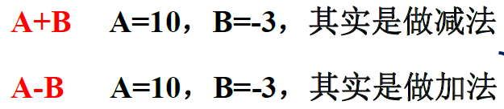
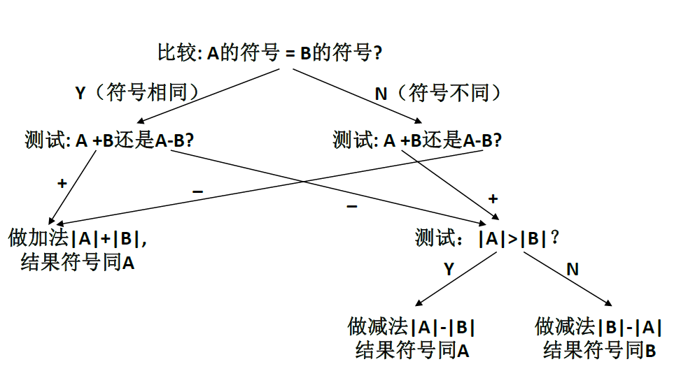

---
title: 进制、进制转换和数据运算
date: 2021-02-04 13:00:12
summary: 本文介绍二进制、进制转换、数据运算的基础知识。
mathjax: true
tags:
- 计算机科学基础
categories:
- 计算机科学基础
---

# 二进制

## 进制规则

我们可以用这样的方式来表示一个十进制数：将每个阿拉伯数字乘以一个以该数字所处位置为指数，以$10$为底数的幂之和的形式。例如$123$可表示为$1\times{10}^{2}+2\times{10}^{1}+3\times{10}^{0}$ 这样的形式。

与之相似的，对二进制数来说，也可表示成每个二进制数码乘以一个以该数字所处位置为指数，以$2$ 为底数的幂之和的形式。  

一般说来，任何一个正整数$R$都可以被选来作为一个数制系统的基数。至于负整数$-R$，算法题中可能会人为定义这样的数制系统。

例如当$R=7$时，所需用到的数码是$0,1,2,3,4,5,6$。如果作为基数的数绝对值超过$10$，则为了表示这些数码，通常使用英文字母来表示那些大于$9$的数码。例如对$16$进制数来说，用$A$表示$10$，用$B$表示$11$，用$C$表示$12$，以此类推。

## 二的幂次

下面列出$2$的常见幂次：
- ${2}^{0}=1$
- ${2}^{1}=2$
- ${2}^{2}=4$
- ${2}^{3}=8$
- ${2}^{4}=16$
- ${2}^{5}=32$
- ${2}^{6}=64$
- ${2}^{7}=128$
- ${2}^{8}=256$
- ${2}^{9}=512$
- ${2}^{10}=1024$
- ${2}^{11}=2048$
- ${2}^{12}=4096$
- ${2}^{13}=8192$
- ${2}^{14}=16384$
- ${2}^{15}=32768$
- ${2}^{16}=65536$
- $……$
- ${2}^{31}=2147483648$
- ${2}^{32}=4294967296$
- $……$
- ${2}^{63}=9223372036854775808$
- ${2}^{64}=18446744073709551616$
- $……$

## 有符号数、无符号数

有符号数是针对二进制来讲的，其最高位作为符号位，$0$代表$+$，$1$代表$-$，其余数位用作数值位，代表数值。

计算机中的有符号数用二进制表示，其符号也只用$0$或$1$表示。一般用最高有效位(MSB)来表示数的符号，正数用0表示，负数用1表示。

无符号数是相对于有符号数而言的，其整个机器字长的全部二进制位均表示数值位，相当于数的绝对值。

实际的数值总位数只能是$2$的整数幂次，一般是$8$、$16$、$32$、$64$，其对应的有符号数数值范围分别是$-({2}^{7}-1)\sim({2}^{7}-1)$、$-({2}^{15}-1)\sim({2}^{15}-1)$、$-({2}^{31}-1)\sim({2}^{31}-1)$、$-({2}^{63}-1)\sim({2}^{63}-1)$，无符号数数值范围分别是$-({2}^{8}-1)\sim({2}^{8}-1)$、$-({2}^{16}-1)\sim({2}^{16}-1)$、$-({2}^{32}-1)\sim({2}^{32}-1)$、$-({2}^{64}-1)\sim({2}^{64}-1)$。

## 原码、反码、补码

原码是一种计算机中对数字的二进制定点表示方法。原码表示法的数值最高一位是符号位，若数值为正数则该位为$0$，若数值为负数则该位为$1$，数值$0$有$+0$和$-0$两种表示；其余位表示数值的大小。

反码通常是用来由原码求补码或者由补码求原码的过渡码。原码为正数时，反码跟原码相同；原码为负数时，反码就是原码符号位保留后，其他位按位取反。
反码是数值存储的一种，多应用于系统环境设置，如Linux平台的目录和文件的默认权限的设置umask，就是使用反码原理。

正整数的补码是其二进制表示，与原码相同；负整数的补码是其原码除符号位外的所有位取反后加1的结果。补码涉及“怪异数”问题，详见下节介绍。

补码是计算机把减法运算转化为加法运算的关键编码。在计算机系统中，数值一律用补码来表示和存储，有如下两个原因：
- 可以将符号位和数值域统一处理
- 加法和减法也可以统一处理（详见下文）。

移码通常用于表示浮点数的阶码。移码的表示形式与补码相似，只是其符号位用$1$表示正数，用$0$表示负数，数值部分与补码相同。

## 二进制“怪异数”

根据上文所述，无符号K位二进制取值范围：$[0, 2^K-1]$，有符号的二进制补码取值范围：$[-2^{K-1}, 2^{K-1}-1]$。

为什么不是$[-2^{K-1}+1, 2^{K-1}-1]$呢？为什么能取到$-2^{K-1}$呢？
其实这个$-2^{K-1}$被称为“怪异数”，也确实很诡异。

其实如果精通原理，也不难理解：
以$4$位二进制数为例，取值范围$[-8,7]$
$-8$怎么表示？
$-8_{10}=1000_{2}$

补码$1000-1=0111$得到补码，按位取反得到$1000$，还是这个数，所以用它表示$-8$。

怪异数的存在其实还化解了$±0$的问题。
因为按理说，$1000$表示$-0$，$0000$表示$+0$，但这就很离谱，所以让$1000$表示$-8$是合理的。

## 比特

计算机的组织在很大程度上取决于它如何表示数字、字符和控制信息。

数字计算机中最基本的信息单位称为**比特**(bit)，是二进制数字的缩写。具体而言，比特无非是计算机电路中“开”或“关”(或者“高”或“低”)的状态。1964年，IBM System/360大型计算机的设计者制定了使用8位组作为可寻址计算机存储基本单元的约定。他们称这个8位的集合为一个**字节**。计算机字由两个或多个相邻字节组成，这些字节有时被寻址并且几乎总是被共同操作。**字**大小表示特定体系结构最有效处理的数据大小。字可以是16位、32位、64位或在计算机组织上下文中有意义的任何其他大小，甚至不是8的倍数也可以。一个8位字节可以分为两个4位的一半，称为**半字节**。因为一个字节的每一位在位置编号系统中都有一个值，所以包含最小值二进制数字的半字节称为**低位半字节**，另一半称为**高位半字节**。


# 进制转换

## 整数进制转换

### 十进制数转X进制数
以二进制数为例：
$$22_{10}=1\times2^4+1\times2^2+1\times2^1=10110_{2}$$

以三进制为例：
$$32_{10}=1\times3^3+1\times3^1+2\times3^0=1012_{3}$$

一个比较直观有效的方式是列出从$X^0$到$X^m$的所有十进制数据，从小于当前的最大值开始取，特别注意的是最低位对应的是$X^0$而不是$X^1$。

八进制和十六进制既可以单独算也可以先算二进制再转换。

### X进制数转十进制数
以二进制数为例：
$$10111011_{2}=1\times2^7+1\times2^5+1\times2^4+1\times2^3+1\times2^1+1\times2^0=187_{10}$$


以十六进制数为例：
$$54D_{16}=5\times16^2+4\times16^1+13\times16^0=1357_{10}$$

求解的关键在于数清楚数位，$X$进制第$m$位对应$X^{m-1}$，将各个数位加权累加起来，就是十进制。

例如[洛谷 P2084 进制转换](https://www.luogu.com.cn/problem/P2084)：

> 请你编程实现，将一个$M$进制的数$N$转换成十进制表示的式子。

实现代码：
```java
import java.util.Scanner;

public class Main {
    public static void main(String[] args) {
        Scanner scanner = new Scanner(System.in);
        int radix = scanner.nextInt();
        char[] num = scanner.next().toCharArray();
        scanner.close();
        StringBuilder result = new StringBuilder();
        for (int i = 0; i < num.length; i++) {
            int temp = num[i] - 48;
            if (temp != 0) {
                result.append("+").append(temp).append("*").append(radix).append("^").append(num.length-1-i);
            }
        }
        System.out.println(result.toString().substring(1));
    }
}
```

### X进制转Y进制
一个比较笨的方法就是以十进制为桥梁，$X$进制→十进制→$Y$进制。

当然，复杂的进制转化一般只有算法题才会涉及。例如[洛谷 P1143 进制转换](https://www.luogu.com.cn/problem/P1143)：

>请你编一程序实现两种不同进制之间的数据转换。
>输入数据共三行，第一行是一个正整数，表示需要转换的数的进制$n(2≤n≤16)$，第二行是一个n进制数，若$n>10$则用大写字母$A-F$表示数码$10-15$，并且该$n$进制数对应的十进制的值不超过$1000000000$，第三行也是一个正整数，表示转换之后的数的进制$m(2≤m≤16)$。


实现代码：
```java
import java.util.Scanner;

public class Main {
    public static void main(String[] args) {
        Scanner scanner = new Scanner(System.in);
        int origin_radix = Integer.parseInt(scanner.nextLine());
        String num = scanner.nextLine();
        int now_radix = Integer.parseInt(scanner.nextLine());
        scanner.close();
        System.out.println(Integer.toString(Integer.parseInt(num, origin_radix), now_radix).toUpperCase());
    }
}
```

### 负进制
常用的一般只有二进制、十进制、十六进制。负进制一般都是人为定义的。例如[洛谷 P1017 \[NOIP2000 提高组\] 进制转换](https://www.luogu.com.cn/problem/P1017)：

> 我们可以用这样的方式来表示一个十进制数：将每个阿拉伯数字乘以一个以该数字所处位置为指数，以$10$为底数的幂之和的形式。例如$123$可表示为$1\times{10}^{2}+2\times{10}^{1}+3\times{10}^{0}$ 这样的形式。
与之相似的，对二进制数来说，也可表示成每个二进制数码乘以一个以该数字所处位置为指数，以$2$ 为底数的幂之和的形式。
一般说来，任何一个正整数$R$或一个负整数$-R$都可以被选来作为一个数制系统的基数。如果是以$R$或$-R$为基数，则需要用到的数码为$0,1,....R-1$。  
例如当$R=7$时，所需用到的数码是$0,1,2,3,4,5,6$，这与其是$R$或$-R$无关。如果作为基数的数绝对值超过$10$，则为了表示这些数码，通常使用英文字母来表示那些大于$9$的数码。例如对$16$进制数来说，用$A$表示$10$，用$B$表示$11$，用$C$表示$12$，以此类推。
在负进制数中是用$-R$作为基数，例如$(-15)_{2}$相当于$(110001)_{-2}$，并且它可以被表示为 $2$ 的幂级数的和数：$110001=1\times (-2)^5+1\times (-2)^4+0\times (-2)^3+0\times (-2)^2+0\times (-2)^1 +1\times (-2)^0$

实现代码：
```java
import java.util.Scanner;

public class Main {

    private static StringBuilder result = new StringBuilder();

    private static void toString(int num, int radix) {
        if (num==0) {
            return;
        }
        int remainder = num % radix;
        if (remainder < 0) {
            remainder -= radix;
            num += radix;
        }
        if (remainder >= 10) {
            remainder += 'A'-10;
        } else {
            remainder += '0';
        }
        toString(num/radix, radix);
        result.append((char)remainder);
    }

    public static void main(String[] args) {
        Scanner scanner = new Scanner(System.in);
        int origin_num = scanner.nextInt();
        int radix = scanner.nextInt();
        scanner.close();
        result.append(origin_num).append("=");
        toString(origin_num, radix);
        result.append("(base").append(radix).append(")");
        System.out.println(result);
    }

}
```


## 小数进制转换

以二进制为例，先说二进制小数转十进制小数，再说十进制小数转二进制小数。

关于二进制转十进制，定点小数可以用负指数理解，如$2^{-2}=0.25$，加起来就行。

例如：
$$0.0101_{2}=1\times2^{-2}+1\times2^{-4}=0.3125_{10}$$

关于十进制转二进制，小数部分可以×2再取整。

例如：
$$0.8125×2=1.625\\0.625×2=1.25\\0.25×2=0.5\\0.5×2=1$$

即
$$0.8125_{10}=0.1101_{2}$$

# 数据运算

## 逻辑运算
**逻辑运算**是指那些应用于模式中的一个二进制位，或在两个模式中相应的两个二进制位的相同基本运算。

### 位层次上的逻辑运算
- 非运算
- 与运算
- 或运算
- 异或运算

### 模式层次上的逻辑运算
上述四个运算可以被应用到$n$位模式。

- 置位操作：对应位或$1$，其余位或$0$。
- 复位操作：对应位与$0$，其余位与$1$。
- 反转操作：对应位异或$1$，其余位异或$0$。

## 移位运算
移动模式中的位，改变位的位置。

### 逻辑移位运算
应用于无符号整数。

- 逻辑右移：最右位丢弃，最左位填$0$。
- 逻辑左移：最左位丢弃，最右位填$0$。
- 循环右移：最右位被移动，成为最左位。
- 循环左移：最左位被移动，成为最右位。

### 算术移位运算
应用于以补码表示的带符号整数。

- 算术右移：保留符号位，并且复制符号位，放入相邻的右边的位中。
- 算术左移：丢弃符号位，接受右边的位为符号位，与逻辑左移相同；如果新的符号位与原先相同，运算成功；否则，发生上溢或下溢。

### 逻辑移位与算术移位的区别

二者的左移是相同的，不同体现在算术右移与逻辑右移。

- 算术右移：保留并复制符号位。
- 逻辑右移：最左位填$0$。

## 算术运算
适用于整数和浮点数的加、减、乘、除。

请注意：这里不是`算数运算`，而是算术运算。

对于二进制补码整数的加法进位，最左边一列的进位被舍去，发生溢出。想要避免溢出，获得准确解，就应该扩增位数或使用双符号位表示法。

不同指数的浮点数的加法调整，应该比较阶码，如果不同，则将较小的数的尾数移位，使阶码对齐。

算法题中可能涉及非常见进制的算术运算，例如[洛谷 P1604 B进制星球](https://www.luogu.com.cn/problem/P1604)：

> 话说有一天，小$Z$乘坐宇宙飞船，飞到一个美丽的星球。因为历史的原因，科技在这个美丽的星球上并不很发达，星球上人们普遍采用$B$（$2≤B≤36$）进制计数。星球上的人们用美味的食物招待了小$Z$，作为回报，小$Z$希望送一个能够完成$B$进制加法的计算器给他们。 现在小$Z$希望你可以帮助他，编写实现$B$进制加法的程序。

实现代码：
```java
import java.util.Scanner;

public class Main {

    public static void main(String[] args) {
        Scanner sc = new Scanner(System.in);
        int radix = Integer.parseInt(sc.nextLine());
        System.out.println(sc.nextBigInteger(radix).add(sc.nextBigInteger(radix)).toString(radix).toUpperCase());
        sc.close();
    }

}
```

### 加法算术运算溢出问题

Java语句`System.out.println(Integer.MAX_VALUE+1);`获得的输出是`-2147483648`，显然是遇到了溢出问题。

下面用二进制的基础知识解析这一过程。

首先明确`Integer.MAX_VALUE`的值是$2^{31}-1$，也就是$+2147483647$。

| 0 | 1 | 1 | 1 | 1 | 1 | 1 | 1 | 1 | 1 | 1 | 1 | 1 | 1 | 1 | 1 | 1 | 1 | 1 | 1 | 1 | 1 | 1 | 1 | 1 | 1 | 1 | 1 | 1 | 1 | 1 | 1 |
|--|--|--|--|--|--|--|--|--|--|--|--|--|--|--|--|--|--|--|--|--|--|--|--|--|--|--|--|--|--|--|--|

该数值是正数，因此原码、反码、补码相同。

其反码是：
| 0 | 1 | 1 | 1 | 1 | 1 | 1 | 1 | 1 | 1 | 1 | 1 | 1 | 1 | 1 | 1 | 1 | 1 | 1 | 1 | 1 | 1 | 1 | 1 | 1 | 1 | 1 | 1 | 1 | 1 | 1 | 1 |
|--|--|--|--|--|--|--|--|--|--|--|--|--|--|--|--|--|--|--|--|--|--|--|--|--|--|--|--|--|--|--|--|

其补码是：
| 0 | 1 | 1 | 1 | 1 | 1 | 1 | 1 | 1 | 1 | 1 | 1 | 1 | 1 | 1 | 1 | 1 | 1 | 1 | 1 | 1 | 1 | 1 | 1 | 1 | 1 | 1 | 1 | 1 | 1 | 1 | 1 |
|--|--|--|--|--|--|--|--|--|--|--|--|--|--|--|--|--|--|--|--|--|--|--|--|--|--|--|--|--|--|--|--|

使其补码与$1$相加得到以下补码：

| 1 | 0 | 0 | 0 | 0 | 0 | 0 | 0 | 0 | 0 | 0 | 0 | 0 | 0 | 0 | 0 | 0 | 0 | 0 | 0 | 0 | 0 | 0 | 0 | 0 | 0 | 0 | 0 | 0 | 0 | 0 | 0 |
|--|--|--|--|--|--|--|--|--|--|--|--|--|--|--|--|--|--|--|--|--|--|--|--|--|--|--|--|--|--|--|--|

显然，这是上文提到过的“怪异数”，其真实值为$-2^{31}=-2147483648$。

### 二进制加减法不用原码的原因

原因一：不易确定加法还是减法。



原因二：最终结果的符号不易确定。



### 加法器的构建

- [Logisim构建四位行波进位加法/减法器](https://blankspace.blog.csdn.net/article/details/102710189)
- [Logisim构建四位行波进位加法器](https://blankspace.blog.csdn.net/article/details/102709660)
- [Logisim构建全加器](https://blankspace.blog.csdn.net/article/details/102709061)

### 计算机不需要整数减法器的原因

如上探讨，我们明确了二进制加减法不用原码的原因，也清楚了二进制原码运算对于加减法是比较不好直接确定的，解决方法是什么呢？

其实大家所熟知的补码正是为了**消灭减法**产生的。
理由是：正数的补码正是自身，而负数的补码是一个减法的差，所以求一个数的补码正是一次减法过程。

基于补码的机制，减法可以转化为加法，计算机只需拥有加法器，不许要减法器。

### 逻辑运算和算术运算的区别

- 逻辑运算用于二进制位和模式，类型包括与、或、非、异或等。
- 算术运算用于整数和浮点数，类型包括加、减、乘、除等。


