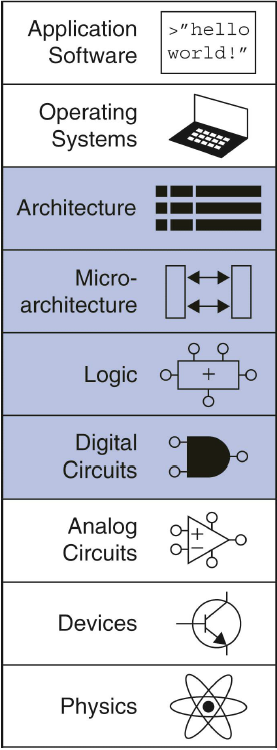

# 透明性

自然科学里，透明性是物体透过可见光并散射较少的性质。
生活里，我们通常强调“公开透明”，所谓看得见摸得着。

这种认识会对计算机初学者带来不小的困扰，“XX对XXX是透明的”这种论调经常出现却不能被理解。

其实，在计算机领域，在某一类人眼中，如果**感受不到**某个事物或属性的存在，则对该类人而言，该事物是**透明**的。

计算机科学中存在着大量的抽象，特别是对于分层的体系结构，下层对上层屏蔽复杂性并向上层提供服务接口，下层用户知道的某些实现细节对上层隐藏，故上层用户不必知晓某些下层的实现细节，这就是一种下层对上层用户来说的透明性。

对于高级语言程序员来说，计算机体系结构的复杂内容不是他们关注的内容，他们要基于他们的“跨平台”编程语言完成应用程序的开发，即便不知道底层的复杂性，此时，体系结构对于这些程序员来说就是透明的。

当然，现实情况是，封装好的东西，应用者不了解其背后的实现原理，也很难达到深刻的理解和掌握。[抽象泄漏](https://blankspace.blog.csdn.net/article/details/115191951)自然很难被避免，因为不懂底层，我们也很难走得很远，虽然不是必须懂。

# 案例

## 计算机网络

协议是控制两个对等实体进行通信的规则的集合，是“水平的”，是控制对等实体之间通信的规则。

在协议的控制下，两个对等实体间的通信使得本层能够向上一层提供服务。要实现本层协议，还需要使用下层所提供的服务。
本层的服务用户只能看见服务而无法看见下层的协议。下层的协议对上层的服务用户是透明的。

数据链路层支持**透明传输**：不管所传输数据是什么样的比特组合，都能在链路上传输（哪怕数据中恰好出现了与帧定界符相同的比特组合）。

## 计算机体系结构

[电子计算机的分层抽象](https://blankspace.blog.csdn.net/article/details/113634653)，可以将计算机分为九层：应用程序层、操作系统层、体系结构层、微结构层、逻辑层、数字电路层、模拟电路层、器件层、物理层。

**自底向上**各层情况是：
- 物理层关注的是电子运动，由麦克斯韦方程组、量子力学等支持。 
- 器件层关注的是晶体管、真空管等电子元器件，这些器件都有明确的外部连接点terminal，建立起了每个terminal上电压与电流之间的关系模型。 
- 模拟电路层关注的是器件组合在一起构成的放大器等组件，输入输出都是连续的电压值。 
- 数字电路层关注的是逻辑门，电压被控制为离散的值表示为0和1。 
- 逻辑层关注的是由数字电路层的逻辑门构成的逻辑组件，如加法器等。 
- 微结构层将逻辑组件组合在一起以实现体系结构中定义的指令。 
- 体系结构描述的是程序员观点的计算机抽象。 
- 操作系统是和硬件最为密切的程序，既是资源分配器，又控制各着种I/O设备和用户程序的需求。 
- 应用软件基于操作系统实现多种多样的应用功能。

例如：
- 对于器件层，物理层的电子运动是透明的，不可见。 
- 对于操作系统层，体系结构的内容是透明的，不可见。
- ……

