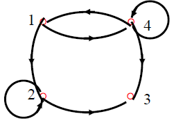
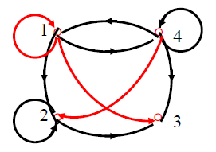

---
title: 二元关系传递闭包的Warshall算法
date: 2021-02-11 21:52:30
summary: 本文介绍求解二元关系传递闭包的Warshall算法。
mathjax: true
tags:
- 离散数学
categories:
- 计算机科学的数学基础
---

# 定义

$|X|=n$，$R⊆X\times{X}$，令$M_{R}=A$，$R^{2}$的矩阵为$A^{(2)}$，……，$R^{k}$的矩阵为$A^{(k)}$，$t(R)$的矩阵记作为$M_{R+}=A+A^{(2)}+...+A^{(k)}+...$（此处$+$表示逻辑加）。

# 算法步骤

1. 置新矩阵$A:=M_{R}$
2. 置$i=1$
3. 对所有的$j$，如果$A[j,i]=1$，则对$k=1,2,...,n$，$A[j,k]:=A[j,k]+A[i,k]$
4. $i:=i+1$
5. 如果$i≤n$，回到第3步，否则停止。

注意此处矩阵元素的加法是逻辑加。

# 实例

令$X={1,2,3,4}$，$X$中关系$R$图如下所示，用**Warshall**算法求$t(R)$的矩阵。

- $n=4$，下面的下标索引值从$1$开始
- $i=1$，$\begin{bmatrix} 0 & 1 & 0 & 1 \\ 0 & 1 & 1 & 0 \\ 0 & 0 & 0 & 0 \\ 1 & 0 & 1 & 1  \end{bmatrix}$，$j=4$符合要求
    - $j=4$，$A[j,i]=1$，第$1$行加到第$4$行，$\begin{bmatrix} 0 & 1 & 0 & 1 \\ 0 & 1 & 1 & 0 \\ 0 & 0 & 0 & 0 \\ 1 & 1 & 1 & 1  \end{bmatrix}$
- $i=2$，$\begin{bmatrix} 0 & 1 & 0 & 1 \\ 0 & 1 & 1 & 0 \\ 0 & 0 & 0 & 0 \\ 1 & 1 & 1 & 1  \end{bmatrix}$，$j=1$、$j=2$、$j=4$符合要求
  - $j=1$，$A[j,i]=1$，第$2$行加到第$1$行，$\begin{bmatrix} 0 & 1 & 1 & 1 \\ 0 & 1 & 1 & 0 \\ 0 & 0 & 0 & 0 \\ 1 & 1 & 1 & 1  \end{bmatrix}$
  - $j=2$，$A[j,i]=1$，第$2$行加到第$2$行，$\begin{bmatrix} 0 & 1 & 1 & 1 \\ 0 & 1 & 1 & 0 \\ 0 & 0 & 0 & 0 \\ 1 & 1 & 1 & 1  \end{bmatrix}$，不变
  - $j=4$，$A[j,i]=1$，第$2$行加到第$4$行，$\begin{bmatrix} 0 & 1 & 1 & 1 \\ 0 & 1 & 1 & 0 \\ 0 & 0 & 0 & 0 \\ 1 & 1 & 1 & 1  \end{bmatrix}$，不变
- $i=3$，$\begin{bmatrix} 0 & 1 & 1 & 1 \\ 0 & 1 & 1 & 0 \\ 0 & 0 & 0 & 0 \\ 1 & 1 & 1 & 1  \end{bmatrix}$，$j=1$、$j=2$、$j=4$符合要求
  - $j=1$，$A[j,i]=1$，第$3$行加到第$1$行，$\begin{bmatrix} 0 & 1 & 1 & 1 \\ 0 & 1 & 1 & 0 \\ 0 & 0 & 0 & 0 \\ 1 & 1 & 1 & 1  \end{bmatrix}$，不变
  - $j=2$，$A[j,i]=1$，第$3$行加到第$2$行，$\begin{bmatrix} 0 & 1 & 1 & 1 \\ 0 & 1 & 1 & 0 \\ 0 & 0 & 0 & 0 \\ 1 & 1 & 1 & 1  \end{bmatrix}$，不变
  - $j=4$，$A[j,i]=1$，第$3$行加到第$4$行，$\begin{bmatrix} 0 & 1 & 1 & 1 \\ 0 & 1 & 1 & 0 \\ 0 & 0 & 0 & 0 \\ 1 & 1 & 1 & 1  \end{bmatrix}$，不变
- $i=4$，$\begin{bmatrix} 0 & 1 & 1 & 1 \\ 0 & 1 & 1 & 0 \\ 0 & 0 & 0 & 0 \\ 1 & 1 & 1 & 1  \end{bmatrix}$，$j=1$、$j=4$符合要求
  - $j=1$，$A[j,i]=1$，第$4$行加到第$1$行，$\begin{bmatrix} 1 & 1 & 1 & 1 \\ 0 & 1 & 1 & 0 \\ 0 & 0 & 0 & 0 \\ 1 & 1 & 1 & 1  \end{bmatrix}$
  - $j=4$，$A[j,i]=1$，第$4$行加到第$4$行，$\begin{bmatrix} 1 & 1 & 1 & 1 \\ 0 & 1 & 1 & 0 \\ 0 & 0 & 0 & 0 \\ 1 & 1 & 1 & 1  \end{bmatrix}$，不变
- 结束，得到矩阵$\begin{bmatrix} 1 & 1 & 1 & 1 \\ 0 & 1 & 1 & 0 \\ 0 & 0 & 0 & 0 \\ 1 & 1 & 1 & 1  \end{bmatrix}$

得到下面的有向关系图：

