---
title: 二元关系基础理论
date: 2021-02-11 11:25:07
summary: 本文介绍序偶和关系的相关内容。
mathjax: true
tags:
- 离散数学
categories:
- 计算机科学的数学基础
---

# 序偶

**序偶**，也称**有序二元组**，是由两个对象$x$、$y$组成的序列，记作$<x,y>$。称$x$、$y$分别为序偶$<x,y>$的第一元素和第二元素。

序偶$<x,y>$与集合$\{x,y\}$不同。序偶$<x,y>$的元素$x$和$y$是有次序的；而集合$\{x,y\}$的元素$x$和$y$的次序是无关紧要的。

设$<x,y>$、$<u,v>$是两个序偶，如果$x=u$和$y=v$，则称$<x,y>$和$<u,v>$相等，记作$<x,y>=<u,v>$。

## 序偶的推广

有序三元组是一个序偶，其第一个元素也是个序偶。有序三元组$<< a,b>,c>$可以简记成$<a,b,c>$。注意，$<a,<b,c>>$不是有序三元组。

有序$n$元组是一个序偶，其第一个元素本身是个有序$n-1$元组,记作$<<x_{1}, x_{2}, ..., x_{n-1}>, x_{n}>$。且可以简记成$<x_{1}, x_{2},..., x_{n-1}, x_{n}>$。

$<x_{1}, x_{2}, ..., x_{n}>=<y_{1}, y_{2}, ..., y_{n}>⇔(x_{1}=y_{1})∧(x_{2}=y_{2})∧...∧(x_{n}=y_{n})$

## 集合的笛卡尔积

设$A$、$B$是集合，由$A$的元素为第一元素，$B$的元素为第二元素组成序偶的集合，称为$A$和$B$的笛卡尔积，记作$A×B$，即$A×B=\{<x,y>|x\in{A}∧y\in{B}\}$。

## 序偶的性质

1. 如果$A$、$B$都是有限集，且$|A|=m$，$|B|=n$，则$|A\times{B}|=mn$
2. $A\times{\Phi}=\Phi\times{B}=\Phi$
3. $\times$对$\cup$和$\cap$满足分配律。设$A$、$B$、$C$是任意集合，则
    1. $A\times{(B\cup{C})}=(A\times{B})\cup{(A\times{C})}$
    2. $A\times{(B\cap{C})}=(A\times{B})\cap{(A\times{C})}$
    3. $(A\cup{B})\times{C}=(A\times{C})\cup{(B\times{C})}$
    4. $(A\cap{B})\times{C}=(A\times{C})\cap{(B\times{C})}$
4. 若$C≠\Phi$，则$A⊆B⇔A\times{C}⊆B\times{C}⇔C\times{A}⊆C\times{B}$
5. 设$A$、$B$、$C$、$D$为非空集合，则$A\times{B}⊆C\times{D}⇔A⊆C\wedge{B⊆D}$

# 关系

设$A$、$B$是集合，如果$R⊆A×B$，则称$R$是一个从$A$到$B$的二元关系。

如果$R⊆A×A$，则称$R$是$A$上的**二元关系**，简称**关系**。

任何序偶的集合，都是一个二元关系。

## 关系的定义域与值域

定义域(domain)：设$R⊆A×B$，由所有$<x,y>\in{R}$的第一个元素组成的集合，称为$R$的定义域，记作$dom R$，即
$dom R=\{x|∃y(<x,y>\in{R})\}$

值域(range)：设$R⊆A×B$，由所有$<x,y>\in{R}$的第二个元素组成的集合，称为$R$的值域，记作$ran R$，即$ran R={y|∃x(<x,y>\in{R})}$

## 关系的表示方法

- 枚举法
- 谓词公式法
- 有向图法
- 矩阵表示法

## 特殊的关系

因为$Φ⊆A×B$(或$Φ⊆A×A$)，所以$Φ$也是一个从$A$到$B$(或$A$上)的关系，这个关系是**空关系**。空关系是没有任何元素的关系，它的关系图中只有结点而没有任何边，它的关系矩阵中全是$0$。

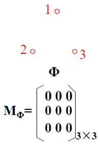

$A×B$(或$A×A$)本身也是一个从$A$到$B$(或$A$上)的关系，这个关系是**完全关系**。完全关系是含有全部序偶的关系，它的关系矩阵中全是$1$。

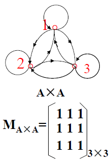

$I_{A}⊆A×A$，且$I_{A}=\{<x,x>|x∈A\}$，这个关系是$A$上的恒等关系。

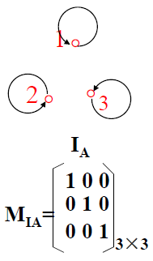

### 等价关系

设$R$是$A$上的关系，如果$R$是**自反**的、**对称**的和**传递**的，则称$R$是$A$上的**等价关系**。

等价关系求等价类示例：

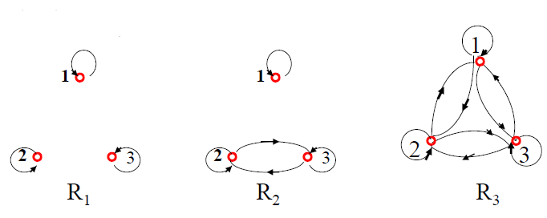

- $R_{1}$存在$1$个等价关系、$3$个等价类（$\{1\}$，$\{2\}$，$\{3\}$），商集为$\{ \{1\},\{2\},\{3\} \}$
- $R_{2}$存在$3$个等价关系、$2$个等价类（$\{1\}$，$\{2,3\}$），商集为$\{ \{1\},\{2,3\} \}$
- $R_{3}$存在$1$个等价关系、$1$个等价类（$\{1,2,3\}$），商集为$\{ \{1,2,3\} \}$

### 相容关系

设$R$是$A$上的关系，如果$R$是**自反**的和**对称**的，则称$R$是$A$上的**相容关系**。

相容关系的有向关系图和关系矩阵可以简化：
- 将相容关系的有向关系图简化，不画环、两条对称边用一条无向直线代替
- 将相容关系的关系矩阵简化，只保留下三角矩阵，这是因为此矩阵是对称矩阵且对角线元素全为$1$

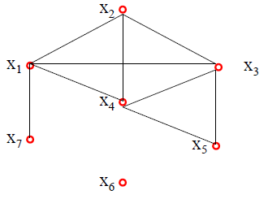 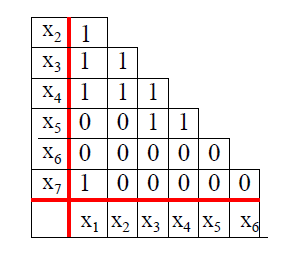

简化图找最大相容类的方法：找**最大完全正多边形**（所有结点之间都连起来，包括对角线，$n$个结点有$C_{n}^{2}$条边，$1$个结点和$2$个结点也算）。

上图的$\{x_{1},x_{2},x_{3},x_{4}\}$，$\{x_{3},x_{4},x_{5}\}$，$\{x_{1},x_{7}\}$，$\{x_{6}\}$都是最大相容类。

新的例子：
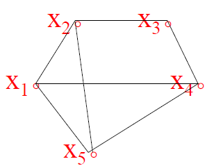

上图的$\{x_{1},x_{2},x_{5}\}$，$\{x_{1},x_{4},x_{5}\}$，$\{x_{2},x_{3}\}$，$\{x_{3},x_{4}\}$都是最大相容类。

【感想】**最大完全正多边形**这是关键，一定要悟透，其实不难，可惜我第一次学的时候没弄明白QAQ。

### 偏序关系

设$R$是$A$上的关系，如果$R$是**自反**的、**反对称**的和**传递**的，则称$R$是$A$上的**偏序关系**，称$<A,R>$是**偏序集**。

典型的偏序关系：
- $≤$
- $≥$
- $⊆$

规定，用$≤$代指偏序关系，此处的$≤$有了更广泛的含义。

假设$R_{1}$是$S_{1}$上的偏序，$R_{2}$是$S_{2}$上的偏序，可以用$R_{1}$和$R_{2}$在$S_{1}\times{S_{2}}$上定义一个关系$R$为$(a_{1},a_{2})R(b_{1},b_{2})$当且仅当下列条件之一为真：
1. $a_{1}≠a_{2}$且$a_{1}R_{1}b_{1}$
2. $a_{1}=a_{2}$且$a_{2}R_{2}b_{2}$

这种关系称为$S_{1}\times{S_{2}}$上的**字典序**，它是$S_{1}\times{S_{2}}$上的偏序关系。

$<A,≤>$是偏序集，$x,y\in{A}$，如果要么$x≤y$，要么$y≤x$，则称$x$和$y$是可比较的。

偏序关系中有一个**全序关系**的概念，它在偏序集的基础上要求任意不同的两个元素之间都是**可比较的**。
全序关系一定是偏序关系，偏序关系不一定是全序关系。

构造某一个给定偏序的全序的过程称为**拓扑排序**。
对有限集$S$上任意给定的偏序$R$，拓扑排序算法可以产生一个全序$T$，使得$xRy$蕴含$xTy$：
1. 初始化：令$k=1$，$S'=S$
2. 取下一个元素循环直至$S'$为空集：
    1. 关于$R$在$S'$上诱导出来的偏序，选取任意一个极小元记为$s_{k}$
    2. 从$S'$中删去$s_{k}$
    3. 令k=k+1
3. 定义$S$上的全序$T$：$s_{i}Ts_{j}$当且仅当$i≤j$

如果$x≤y$，$x≠y$，且不存在$z\in{A}$使得$z≠x\wedge{z≠y}\wedge{x≤z}\wedge{z≤y}$，则称元素y盖住元素x。

$<A,≤>$是偏序集，如果对$A$的任何非空子集$B$，都有最小元，则称$≤$是$A$上的良序，并称$<A,≤>$为良序集。
所有良序集，一定是全序集。
有限的全序集，一定是良序集。

良序原理指出：每一个非空正整数集合都含有最小元素。

令$<A,≤>$是偏序集，绘制Hasse图的要点：
1. 用$\circ$表示$A$中的元素。
2. 如果$x≤y$且$x≠y$，则结点$y$要画在结点$x$上方。
3. 如果$x≤y$且$y$盖住$x$，$x$与$y$之间连一条直线。
4. 一般先从最下层结点（全是射出的边与之相连，不考虑环），逐层向上画，直到最上层结点（全是射入的边与之相连）。采用抓两头，带中间的方法。

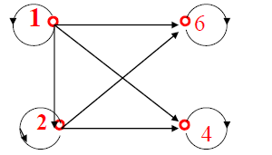 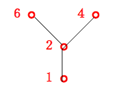

## 关系的运算

由于关系就是集合，所以集合的交运算$\cap$、并运算$\cup$、差运算$-$、绝对补集运算$\sim$、对称差运算$\oplus$也适用。

此外，关系还支持复合、求逆、闭包运算。

### 关系的复合

- $R⊆A\times{B}$
- $S⊆B\times{C}$
- $T_{1}⊆C\times{D}$
- $T_{2}⊆B\times{C}$

1. **不满足**交换律，$R\circ{S}=S\circ{R}$**不成立**
2. 满足结合律，$R\circ{(S\circ{T_{1}})}=(R\circ{S})\circ{T_{1}}$
3. 并集满足分配律，$R\circ{(S\cup{T_{2}})}=(R\circ{S})\cup{(R\circ{T_{2}})}$
4. 交集**不满足**分配律，$R\circ{(S\cap{T_{2}})}⊆(R\circ{S})\cap{(R\circ{T_{2}})}$
5. $R\circ{I_{B}}=I_{A}\circ{R}=R$
6. 由于复合运算满足结合律，所以同关系复合可以写成幂乘的形式，即：
    1. $R^{0}=I_{A}$
    2. $R^{1}=R^{1+0}=R\circ{R^{0}}=R\circ{I_{A}}=R$
    3. $R^{2}=R\circ{R}$
    4. ……
    5. $R^{m}\circ{R^{n}}=R^{m+n}$
    6. $(R^{m})^{n}=R^{mn}$

### 关系的求逆

- $R⊆A×B$
- $S⊆A×B$
- $T⊆B×C$

1. $(R^{C})^{C}=R$
2. ${(R\cup{S})}^{C}=R^{C}\cup{S^{C}}$
3. ${(R\cap{S})}^{C}=R^{C}\cap{S^{C}}$
4. ${(R-S)}^{C}=R^{C}-S^{C}$
5. ${(\sim{R})}^{C}=\sim{R^{C}}$
6. $R⊆S⇔R^{C}⊆S^{C}$
7. $(R\circ{T})^{C}=T^{C}\circ{R^{C}}$

### 关系闭包

给定$A$中的一个关系$R$，分别求得$A$上的另一个关系$R'$，使得它是包含$R$的序偶最少的分别具有自反性（对称性、传递性）的关系，$R'$被称为$R$的自反（对称、传递）闭包。

关系闭包的分类：
- 自反闭包，记作$r(R)$
- 对称闭包，记作$s(R)$
- 传递闭包，记作$t(R)$

关系闭包的计算方法：
- 自反闭包：$r(R)=R\cup{I_{A}}$
- 对称闭包：$s(R)=R\cup{R^{C}}$
- 传递闭包：
    - $t(R)=R\cup{R^{2}}\cup{R^{3}}\cup{...}$
    - $A$是有限集，$|A|=n$，$t(R)=R\cup{R^{2}}\cup{...}\cup{R^{n}}$
    - [Warshall算法](https://blankspace.blog.csdn.net/article/details/113791915)

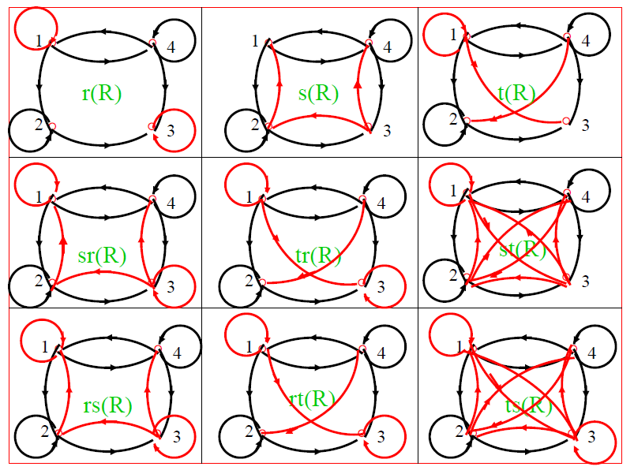

关系闭包的性质：
1. 二元关系$R$具有自反性/对称性/传递性的充要条件是$R$等于$R$的自反闭包/对称闭包/传递闭包
    1. $R是自反的⇔r(R)=R$
    2. $R是对称的⇔s(R)=R$
    3. $R是传递的⇔t(R)=R$
2. 自反性、对称性、传递性分别可以推出其他闭包的该性质
    1. $R是自反的⇒s(R)和t(R)也是自反的$
    2. $R是对称的⇒r(R)和t(R)也是对称的$
    3. $R是传递的⇒r(R)也是传递的$
3. $R_{1}$、$R_{2}$是$A$上的关系，如果$R_{1}⊆R_{2}$，则
    1. $r(R_{1})⊆r(R_{2})$
    2. $s(R_{1})⊆s(R_{2})$
    3. $t(R_{1})⊆t(R_{2})$
4. 具备多重性质的二元关系$R$
    1. $sr(R)=rs(R)$
    2. $tr(R)=rt(R)$
    3. $st(R)⊆ts(R)$

## 关系的性质

**二元关系的主要性质有：自反性、反自反性、对称性、反对称性、传递性。**

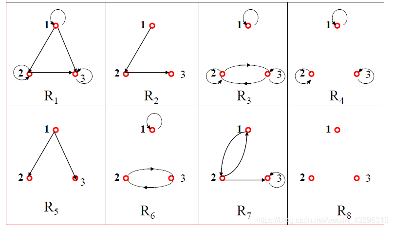

### 自反性
设$R$是集合$A$中的关系，如果对于任意$x\in{A}$都有$<x,x>\in{R(xRx)}$，则称$R$是$A$中的**自反关系**。

$$R是集合A中的自反关系⇔∀x(x\in{A}→xRx)$$

- **关系有向图**：每个结点都有环
- **关系矩阵**：主对角线都为1

自反关系举例：
- 实数集合的$≤$关系

$R_{1}$、$R_{3}$、$R_{4}$是自反的。

### 反自反性

设$R$是集合$A$中的关系，如果对于任意$x\in{A}$都有$<x,x>\notin{R}$，则称$R$是$A$中的**反自反关系**。

$$R是集合A中的反自反关系⇔∀x(x\in{A}→<x,x>\notin{R})$$

- **关系有向图**：每个结点都无环
- **关系矩阵**：主对角线都为0

反自反关系举例：
- 实数集合的$>$关系
- 父子关系

$R_{2}$、$R_{5}$、$R_{8}$是反自反的。

### 对称性

设$R$是集合$A$中的关系，如果对于任意$x,y\in{A}$，如果有$xRy$，就有$yRx$，则称$R$是$A$中的**对称关系**。

$$R是集合A中的对称关系⇔∀x∀y((x\in{A}\wedge{y\in{A}}\wedge{xRy})→yRx)$$

- **关系有向图**：两个不同的结点之间，如果有边，则有方向相反的两条边 **（没边也可以）**
- **关系矩阵**：对称矩阵

对称关系举例：
- 邻居关系
- 朋友关系

$R_{3}$、$R_{4}$、$R_{6}$、$R_{8}$是对称的。

### 反对称性

设$R$是集合$A$中的关系，如果对于任意$x,y\in{A}$，如果有$xRy$和$yRx$，就有$x=y$，则称$R$是$A$中的**反对称关系**。

$$R是集合A中的对称关系⇔∀x∀y((x\in{A}\wedge{y\in{A}}\wedge{xRy}\wedge{yRx})→x=y)$$

- **关系有向图**：两个不同的结点之间，最多有一条边 **（没边也可以）**
- **关系矩阵**：关于主对角线对称的两个元素最多有一个1

$R_{1}$、$R_{2}$、$R_{4}$、$R_{5}$、$R_{8}$是反对称的。

### 传递性

设$R$是集合$A$中的关系，如果对于任意$x,y,z\in{A}$，如果有$xRy$和$yRz$，就有$xRz$，则称$R$是$A$中的**传递关系**。

$$R是集合A中的传递关系⇔∀x∀y∀z((x\in{A}\wedge{y\in{A}}\wedge{z\in{A}}\wedge{xRy}\wedge{yRz})→xRz)$$

**关系有向图**和**关系矩阵**不易直接看出传递性，应该根据定义来检查：
- **关系有向图**：如果有边$<a,b>$、$<b,c>$，则有边$<a,c>$（或者前件为假）
- **关系矩阵**：如果$a_{ij}=1$、$a_{jk}=1$，则有边$a_{ik}=1$（或者前件为假）

传递关系举例：
- 实数集合的$≤$、$<$关系
- 集合的$⊆$、$⫋$关系

$R_{1}$、$R_{3}$、$R_{4}$、$R_{5}$、$R_{8}$是传递的。

### 对比自反性与反自反性

一个关系，如果不是自反的，也不一定是反自反的。

以有向关系图为例，自反性要求图中每个结点都有环，反自反性要求图中每个结点都无环，但显然可能会存在部分结点有环部分节点无环的情况，这就是我们所说的。

$R_{6}$、$R_{7}$既不是自反的也不是反自反的。

### 对比对称性与反对称性

一个关系，如果不是对称的，也不一定是反对称的；如果是对称的，还有可能是反对称的。

空关系和恒等关系既是对称的，还是反对称的。
关系有向图中，如果部分边满足对称性的条件，部分边满足反对称的条件，则该关系既不是对称的，也不是反对称的。

$R_{4}$、$R_{8}$既是对称的，还是反对称的。
$R_{7}$既不是对称的，也不是反对称的。
