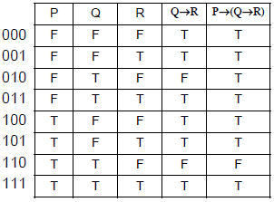
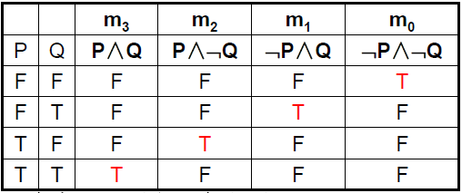
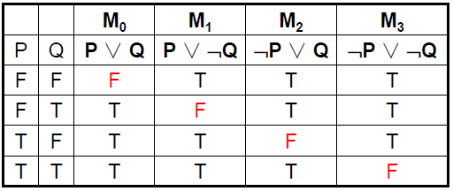

---
title: 命题逻辑基础理论
date: 2021-02-09 04:19:06
summary: 本文分享离散数学的命题逻辑相关内容。
mathjax: true
tags:
- 离散数学
categories:
- 计算机科学的数学基础
---

# 数理逻辑

逻辑是是研究人的思维的科学。逻辑包括辩证逻辑和形式逻辑。辩证逻辑是研究人的思维中的辩证法；形式逻辑是研究人的思维的形式和一般规律。离散数学只研究**形式逻辑**，数理逻辑正是用数学的方法研究形式逻辑。

形式逻辑主要研究推理。推理是由若干个已知的判断(前提)，推出新的判断(结论)的思维过程。推理可以分为类比推理、归纳推理、演绎推理。类比推理由个别事实推出个别结论；归纳推理由若干个别事实推出一般结论；演绎推理由一般规律推出个别事实。形式逻辑主要是研究**演绎推理**的。

数理逻辑的主要内容包括：逻辑演算、证明论、公理集合论、递归论、模型论。数理逻辑最基础的内容就是**命题逻辑**和**谓词逻辑**。

# 命题逻辑

**命题**是一个能确定是真的或是假的判断。命题的判断都是用陈述句表示的。

一个命题所作的判断有两种可能：是正确的判断或者是错误的判断。所以，一个命题的真值有两个：“**真**”或“**假**”。命题真值为真，即一个命题所作的判断与客观一致,则称该命题的真值为真，记作$T$(True)；命题真值为假，即一个命题所作的判断与客观不一致，则称该命题的真值为假，记作$F$(False)。

**简单命题**，也称原子命题，是由最简单的陈述句构成的命题。描述简单命题的陈述句不能分解成更简单的句子。简单命题通常用大写英文字母表示。

**复合命题**是用**联结词**将原子命题联结起来构成的。常见的六种逻辑联结词是：否定($¬$)、合取($\wedge$)、析取($\vee$)、异或($\overline\vee$)、蕴含($→$)、等价($↔$)。

# 联结词的自然语言表述

- **否定**：$¬$
  - ……不成立
  - 不……
- **合取**：$\wedge$
  - 并且
  - 不但……而且……
  - 既……又……
  - 尽管……还……
- **析取**：$\vee$
  - 或者（注意语义）
- **异或**：$\overline\vee$
  - 或者（注意语义）
- **蕴含**：$→$
  - 如果……则……
  - 只要……就……
  - 若……则……
  - 只有……才……
  - 仅当……，……
  - ……，仅当……
- **等价**：$↔$
  - 当且仅当
  - 充分且必要

## 逻辑蕴含

逻辑蕴含式$P→Q$中，$P$是$Q$的充分条件，$Q$是$P$的必要条件。

充分条件：只要条件成立，结论就成立。

自然语言中表示充分条件的词语：
- 如果……则……
- 只要……就……
- 若……则……

必要条件：如果该条件不成立，则结论就不成立。

自然语言中表示必要条件的词语：
- 只有……才……
- 仅当……，……
- ……，仅当……

例题：$P$：天气好，$Q$：我去公园。

1. 如果天气好，我就去公园：$P→Q$
2. 只要天气好，我就去公园：$P→Q$
3. 天气好，我就去公园：$P→Q$
4. 仅当天气好，我才去公园：$Q→P$
5. 只有天气好，我才去公园：$Q→P$
6. 我去公园，仅当天气好：$Q→P$

# 命题公式

**加粗样式**常值命题：即前面所说的命题，它是有具体含义(真值)的。

**命题变元**：用大写的英字母如$P$、$Q$等表示任何命题，这些字母为命题变元。
对命题变元作**指派**(给命题变元一个解释)：将一个常值命题赋予命题变元的过程，或者是直接赋给命题变元真值$T$或$F$的过程。
命题变元本身不是命题，只有给它作指派，才变成命题。

**合式公式**(wff)的定义是递归的，1是递归的基础，由1开始，使用2和3规则，可以得到任意的合式公式。
1. 单个命题变元是个合式公式。
2. 若$A$是合式公式，则$¬A$是合式公式。
3. 若$A$和$B$是合式公式，则$(A∧B)$，$(A∨B)$、$(A→B)$、$(A↔B)$都是合式公式。
4. 当且仅当有限次地应用1、2、3得到的含有命题变元、联结词和括号的符号串是合式公式。

这里所谓的合式公式可以解释为合法的命题公式之意，也称之为**命题公式**，有时也简称**公式**。按照合式公式的定义，最外层的括号必须写。方便起见，可以约定，最外层括号可以省略。一个命题公式不是复合命题，所以它没有真值，但是给其中的所有命题变元作指派以后它就有了真值。

由于对每个命题变元可以有两个真值$(T,F)$被指派，所以有$n$个命题变元的命题公式$A(P_{1},P_{2},…,P_{n})$的**真值表**有$2^n$行。
为有序地列出$A(P_{1},P_{2},…,P_{n})$的真值表，可将$F$看成$0$、$T$看成$1$，按二进制数次序列表。
真值表示例：

# 命题符号化

所谓命题符号化，就是用命题公式的符号串来表示给定的命题。

命题符号化的方法：
1. 首先要明确给定命题的含义。
2. 对于复合命题，找联结词，用联结词断句，分解出各个原子命题。
3. 设原子命题符号，并用逻辑联结词联结原子命题符号，构成给定命题的符号表达式。

## 例1

说离散数学无用且枯燥无味是不对的。

$P$：离散数学是有用的
$Q$：离散数学是枯燥无味的

$¬(¬P\wedge{Q})$

## 例2

如果小张与小王都不去，则小李去。

P：小张去
Q：小王去
R：小李去

$(¬P\wedge{¬Q})→R$

如果小张与小王不都去，则小李去。

$¬(P\wedge{Q})→R$

$(¬P\vee{¬Q})→R$

## 例3

仅当天不下雨且我有时间，才上街。
P：天下雨
Q：我有时间
R：我上街

$R→(¬P\wedge{Q})$

## 例4

人不犯我，我不犯人；人若犯我，我必犯人。

P：人犯我
Q：我犯人

$P↔Q$

## 例5

若天不下雨，我就上街；否则在家。

P：天下雨
Q：我上街
R：我在家

$\textcolor{red}{(¬P→Q)\wedge(P→R)}$

注意中间的联结词是$\wedge$，而不是$\vee$或者$⊻$。
因为原命题表示：“天不下雨时我做什么，天下雨我又做什么”的两种作法，其中有一种作法是假的，则我说的就是假话，所以中间的联结词一定是$\wedge$。
如果用$\vee$，就表明两种作法都是假的时候，我说的才是假话，这显然不对。而实际上此时表达式真值总是真的，这更不符合实际了。
如果用$⊻$，则“天没下雨而我没上街”时，即$P$、$Q$均假的时候，表达式为真，这不合实际。

# 重言式和重言蕴含式

不论$P$取什么真值，$¬P∨P$的真值总是为真，$¬P∨P$的真值总是为假。$¬P∨P$是重言式(永真式)，称$¬P∧P$为矛盾式(永假式)。

$A(P_{1},P_{2},…,P_{n})$是含有命题变元$P_{1},P_{2},…,P_{n}$的命题公式，如不论对$P_{1},P_{2},…,P_{n}$作任何指派，都使得$A(P_{1},P_{2},…,P_{n})$为真(假)，则称之为**重言式**(**矛盾式**), 也称之为**永真式** (**永假式**)。

重言式的证明方法：
- 列真值表。
- 利用公式作等价变换，化简成$T$。
- 用公式的主析取范式。

而对于重言式：
1. 如果$A$是永真式，则$¬A$是永假式。
2. 如果$A$、$B$是永真式，则$(A∧B)$、$(A∨B)$、$(A→B)$和$(A↔B)$也都是永真式。
3. 如果$A$是永真式，则$A$的置换例式也是永真式。

$A(P_{1},P_{2},…,P_{n})$是含有命题变元$P_{1},P_{2},…,P_{n}$的命题公式，如果用合式公式$X$替换某个$P_{i}$(如果$P_{i}$在$A(P_{1},P_{2},…,P_{n})$中多处出现，则各处均用X替换 )，其余变元不变，替换后得到新的公式$B$，则称$B$是$A(P_{1},P_{2},…,P_{n})$ 的**置换例式**。

如果可以断定给定公式是某个重言式的置换例式的话，则这个公式也是重言式。

如果公式$A→B$是重言式，则称$A$重言(永真)蕴涵$B$，记作$A⇒B$。
符号$⇒$不是联结词，它是表示公式间的重言蕴涵关系，也可以看成是推导关系。即$A⇒B$可以理解成由$A$可推出$B$，即由$A$为真，可以推出$B$也为真。

重言蕴涵式的证明方法：
- 列真值表。
- 假设前件为真，推出后件也为真。
- 假设后件为假，推出前件也为假。

重言蕴涵式的性质：
- 自反性：对任何命题公式$A$，有$A⇒A$。
- 传递性：若$A⇒B$且$B⇒C$，则$A⇒C$
- 反对称性：若$A⇒B$且$B⇒A$，则$A⇔B$(符号$⇔$表示等价)

推荐阅读：[重要等价公式和重言蕴含式](https://blankspace.blog.csdn.net/article/details/113780786)

# 等价公式

$A$、$B$是含有命题变元$P_{1},P_{2},…,P_{n}$的命题公式，如不论对$P_{1},P_{2},…,P_{n}$作任何指派，都使得$A$和$B$的真值相同，则称之为$A$与$B$等价，记作$A⇔B$。

等价公式的证明方法：
- 列真值表。
- 用公式的等价变换。

置换定律：$A$是一个命题公式，$X$是$A$中的一部分且也是合式公式，如果$X⇔Y$，用$Y$代替$A$中的$X$得到公式$B$，则$A⇔B$。
应用置换定律以及已知的等价公式可以对给定公式进行等价变换。

推荐阅读：[重要等价公式和重言蕴含式](https://blankspace.blog.csdn.net/article/details/113780786)

等价公式的性质：
- 有自反性：任何命题公式$A$，有$A⇔A$。
- 有对称性：若$A⇔B$，则$B⇔A$。
- 有传递性：若$A⇔B$且$B⇔C$，则$A⇔C$。
- 如果$A(P_{1},P_{2},…,P_{n})⇔B(P_{1},P_{2},…,P_{n})$，则$A(¬P_{1},¬P_{2},…,¬P_{n})⇔B(¬P_{1},¬P_{2},…,¬P_{n})$。

在一个只含有联结词$¬$、$∨$、$∧$的公式$A$中，将$∨$换成$∧$，$∧$换成$∨$，$T$换成$F$，$F$换成$T$，其余部分不变，得到另一个公式$A^{*}$，称$A$与$A^{*}$互为**对偶式**。

令$A(P_{1},P_{2},…,P_{n})$是一个只含有联结词$¬$、$∨$、$∧$的命题公式，则$¬A(P_{1},P_{2},…,P_{n})⇔A^{*}(¬P_{1},¬P_{2},…,¬P_{n})$。
推论：$A(¬P_{1},¬P_{2},…,¬P_{n})⇔¬A^{*}(P_{1},P_{2},…,P_{n})$。

对偶原理：令$A(P_{1},P_{2},…,P_{n})$、$B(P_{1},P_{2},…,P_{n})$是只含有联结词$¬$、$∨$、$∧$的命题公式，则如果$A(P_{1},P_{2},…,P_{n})⇔B(P_{1},P_{2},…,P_{n})$则$A^{*}(P_{1},P_{2},…,P_{n})⇔B^{*}(P_{1},P_{2},…,P_{n})$。

# 范式

范式就是命题公式形式的规范形式。约定在范式中只含有联结词$¬$、$∨$、$∧$。

合取式是用“∧”联结命题变元或变元的否定构成的式子。析取式是用“∨” 联结命题变元或变元的否定构成的式子。

析取范式以$\vee$连接的合取式组成。合取范式以$\wedge$连接的析取式组成。

小项要求n个命题变元的合取式中，每个变元出现且只出现一次。

小项的性质：
- 有$n$个变元，就有$2^{n}$个小项
- 每组指派有且只有一个小项为T

析取各个小项组成的析取范式被称为主析取范式。

大项要求n个命题变元的析取式中，每个变元出现且只出现一次。

大项的性质：
- 有$n$个变元，就有$2^{n}$个大项
- 每组指派有且只有一个小项为F

合取各个大项组成的合取范式被称为主合取范式。

# 命题逻辑推理

**推理**就是根据一个或几个已知的判断得出一个新的判断的思维过程。这些已知的判断为**前提**。得到的新的判断为前提的**有效结论**。

推理方法：
- 直接推理，从前提直接推出结论。要写明：步骤号、给定前提或得出的结论、推理时所用规则、此结论是从哪几步得到的以及所用公式。
    - 推理规则$P$(引入前提规则)：在推理过程中，可以随时引入前提。
    - 推理规则$T$(引入结论规则)：在推理过程中，如果前边有一个或几个公式永真蕴涵公式S，则可将S纳入推理过程中。
- 条件论证，如果$H_{1}∧H_{2}∧...∧H_{n}∧R⇒Ｓ$，则$H_{1}∧H_{2}∧...∧H_{n}⇒R→S$。
    - 推理规则$CP$(条件证明规则)：如果$H_{1}∧H_{2}∧...∧H_{n}∧R⇒Ｓ$，则$H_{1}∧H_{2}∧...∧H_{n}⇒R→S$。
    - P(附加前提)
- 反证法，若要证明相容的公式集合${H_{1},H_{2},... H_{n}}$可以推出公式$C$，只要证明$H_{1}∧H_{2}∧...∧H_{n}∧¬C$是个矛盾式即可。
    - P(假设前提)

# 联结词的全功能集

给定一个联结词集合，如果任何一个命题公式都可以用此集合中的联结词表示，则称为此联结词集合是**全功能集**。

如果一个联结词的全功能集中不含有冗余的联结词，则称它是**极小全功能集**。

除了常见的逻辑联结词$¬$、$\wedge$、$\vee$、$→$、$↔$，以外，还可以定义两个比较特殊的联结词：
- $↑$：$P↑Q⇔¬(P\wedge{Q})$
- $↓$：$P↓Q⇔¬(P\vee{Q})$

真正的极小全功能集有：$\{¬, \wedge\}$、$\{¬, \vee\}$、$\{↑\}$、$\{↓\}$。
