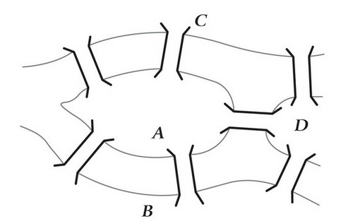
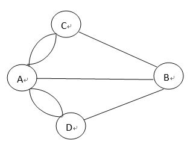

---
title: 图论欧拉回路的判定
date: 2021-03-01 20:14:14
summary: 本文归纳离散数学的基础理论。
mathjax: true
tags:
- 离散数学
categories:
- 计算机科学的数学基础
---

# 七桥问题

在18世纪，东普鲁士哥尼斯堡有一条大河，河中有两个小岛。全城被大河分割成四块陆地，河上架有七座桥，把四块陆地联系起来(如图)。当时许多市民都在思索一个问题:一个散步者能否从某一陆地出发，不重复地经过每座桥一次，最后回到原来的出发地。

七桥问题：



这就是历史上有名的哥尼斯堡七桥问题。

# 欧拉回路

这个问题似乎不难解决，所以吸引了许多人来尝试，但是日复一日谁也没有得出肯定的答案。于是有人便写信求教当时著名的数学家欧拉(1707~1783)。欧拉毕竟是数学家，他并没有去重复人们已失败了多次的试验，而是产生了一种直觉的猜想:人们千百次的失败，也许意味着这样的走法根本就不存在。于是欧拉把七桥问题进行了数学的抽象。用A、B、C、D四个点表示四块陆地，用两点间的一条线表示连接两块陆地之间的一座桥，就得到如下图所示的一个由四个点和七条线组成的图形。



于是，七桥问题就转化为一个抽象图形是否可以“一笔画”的问题。
这个一笔画，也是欧拉回路的判定方法是这样的：
- 连通多重图具有欧拉路当且仅当它有0个或2个度数为奇数的结点。
- 连通多重图具有欧拉路但无欧拉回路当且仅当它有2个度数为奇数的结点。
- 连通多重图具有欧拉回路当且仅当它只有度数为偶数的结点。

问题的再进一步抽象（用二维数组表示的矩阵）：

| | 0(A) | 1(B) | 2\(C\) | 3(D) |
|:----:|:----:|:----:|:----:|:----:|
| 0(A) | 0 | 1 | 2 | 2 |
| 1(B) | 1 | 0 | 1 | 1 |
| 2\(C\) | 2 | 1 | 0 | 0 |
| 3(D) | 2 | 1 | 0 | 0 |

# Java编程实现

下面是Java代码实现：
```java
public class EulerCircuit {

    // 定义二维数组实现图储存
    int[][] mat;

    // 定义顶点个数
    int vertexNum;

    // 构造方法初始化问题
    public EulerCircuit(int[][] mat, int vertexNum) {
        super();
        this.mat = mat;
        this.vertexNum = vertexNum;
    }
    
    public int getOddVertexNum() {
        // 累加器记录奇数顶点个数
        int count = 0;
        // 依次累加每一行元素
        for (int i = 0; i < vertexNum; i++) {
            // 记录通过顶点i的边数
            int degree = 0;
            for (int j = 0; j < vertexNum; j++) {
                degree += mat[i][j];
            }
            // 顶点度为奇数时
            if (degree % 2 != 0) {
                count++;
            }
        }
        // 结束函数，返回奇数顶点个数
        return count;
    }
    
    public static void main(String[] args) {
        // 七桥问题数组
        int[][] mat = {{0, 1, 2, 2}, {1, 0, 1, 1}, {2, 1, 0, 0}, {2, 1, 0, 0}};
        // 生成EulerCircuit对象
        EulerCircuit eulerCircuit = new EulerCircuit(mat, 4);
        // 根据函数获取奇数桥的个数
        int oddVertexNum = eulerCircuit.getOddVertexNum();
        if (oddVertexNum == 0) {
            System.out.println("有欧拉回路");
        } else {
            System.out.println("有" + oddVertexNum + "个顶点通奇数桥，无欧拉回路");
        }
    }

}
```

如果求欧拉路就可以设置条件判定的分叉点为2。
