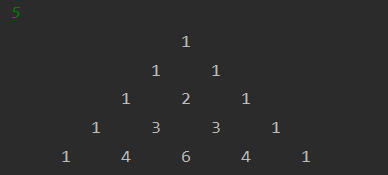
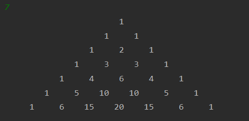
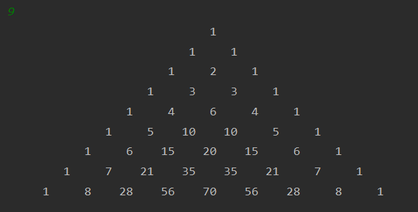

---
title: 帕斯卡三角形与二项式定理
date: 2021-03-10 16:08:39
summary: 本文介绍帕斯卡三角形与二项式定理。
mathjax: true
tags:
- 离散数学
categories:
- 计算机科学的数学基础
---

# 帕斯卡三角形

$C(n,r)=\frac{n!}{r!(n-r)!}$

帕斯卡三角形：
```
n=0                C(0,0)
n=1            C(1,0)  C(1,1)
n=2        C(2,0)  C(2,1)  C(2,2)
n=3    C(3,0)  C(3,1)  C(3,2)  C(3,3)
n=4 C(4,0)  C(4,1)  C(4,2)  C(4,3)  C(4,4)
```

规律是除了每行第一个元素和最后一个元素以外，帕斯卡三角形的任意一个元素都是上一行中最接近它的那两个元素之和。

如果$r$和$n$是满足$1≤r<n$的整数，那么$C(n,r)=C(n-1,r-1)+C(n-1,r)$

如果$r$和$n$是满足$0≤r≤n$的整数，那么$C(n,r)=C(n,n-r)$。

# 二项式定理

二项式定理：对于每个正整数$n$，有$(x+y)^{n}=C(n,0)x^{n}+C(n,1)x^{n-1}y+\cdots+C(n,n-1)xy^{n-1}+C(n,n)y^{n}$。其中，数值$C(n,r)$被称为二项式系数。

# C++编程实现

```cpp
#include <stdio.h>

int getNum(int i, int j) {
    if(i == j || j == 0) {
        return 1;
    } else {
        return (getNum(i-1, j-1) + getNum(i-1, j));
    }
}

void print(int row) {
    int i, j, k;
    for(i = 0; i < row; i++) {
        for(j = 0; j <= i; j++) {
            if(j == 0) {
                for(k = 0; k < row-i; k++) {
                    printf("   ");
                }
            } else {
                printf("   ");
            }
            printf("%3d", getNum(i, j));
        }
        printf("\n");
    }
}

int main() {
    int num;
    scanf("%d", &num);
    print(num);
    return 0;
}
```

打印示例：






