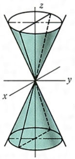
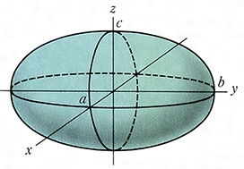
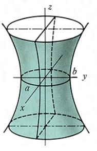
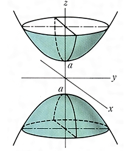
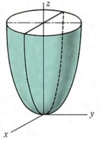
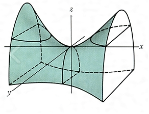
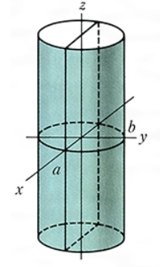
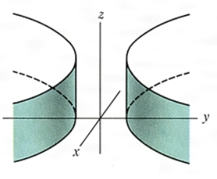
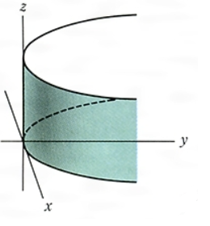

---
title: 微积分基础理论归纳
date: 2021-03-23 11:26:06
summary: 本文归纳高等数学(微积分)基础理论。
mathjax: true
tags:
- 微积分
categories:
- 计算机科学的数学基础
---

# 微积分基础理论归纳

1. [一元函数微分学](https://blankspace.blog.csdn.net/article/details/114372779)
2. [微分中值定理](https://blankspace.blog.csdn.net/article/details/114379662)
3. [一元函数积分表](https://blankspace.blog.csdn.net/article/details/114380568)
4. 定积分，又称黎曼积分，是求函数图形与x轴所形成的曲边图形面积，结果是数值。
5. 不定积分是求一个连续函数的原函数的过程. 结果是函数；有第一类间断点或无穷间断点的函数在包含该间断点的区间内没有原函数。
6. 变限积分：定积分的推广，上限或下限是变量的定积分。
7. 反常积分：定积分的推广。
8. 无穷积分：积分区间的上限或下限为无穷的积分。
9. 反常积分：被积函数在积分区间内含有间断点的积分。
10. 函数凹凸性：二阶导数为正，函数图像上凹；二阶导数为负，函数图像上凸。
11. [拉格朗日乘数法](https://blankspace.blog.csdn.net/article/details/114870930)
12. [九种二次曲面及其方程](https://blankspace.blog.csdn.net/article/details/114838354)
13. [曲线的切线与法平面和曲面的切平面与法线](https://blankspace.blog.csdn.net/article/details/114842328)

# 微分中值定理

## 费马引理

设函数$f(x)$在点$x_{0}$的某邻域$U(x_{0})$内有定义，并且在$x_{0}$处可导，如果对任意的$x\in{U(x_{0})}$，有$f(x)≤f(x_{0})$（或$f(x)≥f(x_{0})$），那么$f'(x_{0})=0$。

## 罗尔中值定理

如果函数$f(x)$在闭区间$[a,b]$上连续，在开区间$(a,b)$内可导，在区间端点处的值相等即$f(a)=f(b)$，那么在$(a,b)$内至少有一点$\xi$（$a<\xi<b$），使得$f'(\xi)=0$。

## 拉格朗日中值定理

如果函数$f(x)$在闭区间$[a,b]$上连续，在开区间$(a,b)$内可导，那么在$(a,b)$内至少有一点$\xi$（$a<\xi<b$），使得$f(b)-f(a)=f'(\xi)(b-a)$。

也可以用有限增量的方式表达此定理：$\Delta{y}=f(x+\Delta{x})-f(x)=f'(x+\theta\Delta{x})\Delta{x}$（$0<\theta<1$）。

如果函数$f(x)$在区间$I$上连续，在区间$I$内导数恒为$0$，那么$f(x)$在区间$I$上是一个常数。

## 柯西中值定理

如果函数$f(x)$和$F(x)$在闭区间$[a,b]$上连续，在开区间$(a,b)$内可导，对任意$x\in{(a,b)}$，$F'(x)≠0$，那么在$(a,b)$内至少有一点$\xi$，使得等式$\frac{f(b)-f(a)}{F(b)-F(a)}=\frac{f'(\xi)}{F'(\xi)}$成立。

## 泰勒中值定理

如果函数$f(x)$在$x_{0}$处具有$n$阶导数，那么存在$x_{0}$的一个邻域，对于该邻域内任意$x$，有$f(x)=f(x_{0})+f'(x_{0})(x-x_{0})+\frac{f''(x_{0})}{2!}(x-x_{0})^{2}+...+\frac{f^{(n)}(x_{0})}{n!}(x-x_{0})^{n}+R_{n}(x)$，其中$R_{n}(x)=o((x-x_{0})^{n})$。

如果函数$f(x)$在$x_{0}$的某个邻域$U(x_{0})$内具有$n+1$阶导数，那么对任意$x\in{U(x_{0})}$，有$f(x)=f(x_{0})+f'(x_{0})(x-x_{0})+\frac{f''(x_{0})}{2!}(x-x_{0})^{2}+...+\frac{f^{(n)}(x_{0})}{n!}(x-x_{0})^{n}+R_{n}(x)$，其中$R_{n}(x)=\frac{f^{(n+1)}(\xi)}{(n+1)!}(x-x_{0})^{n+1}$，$\xi$为介于$x_{0}$与$x$之间的某个值。

# 拉格朗日乘数法

找函数$z=f(x,y)$在附加条件$\varphi(x,y)=0$下的可能极值点，可以先做拉格朗日函数$L(x,y)=f(x,y)+\lambda\varphi(x,y)$，其中$\lambda$为参数，求其对$x$和$y$的一阶偏导数，并使之为$0$，然后与方程$\varphi(x,y)=0$相联立，得到： 
$$\begin{cases}f_{x}(x,y)+\lambda\varphi_{x}(x,y)=0 \\ f_{y}(x,y)+\lambda\varphi_{y}(x,y)=0 \\ \varphi(x,y)=0 \end{cases}$$
由此方程组解出$x$、$y$及$\lambda$，这样得到的$(x,y)$就是函数$f(x,y)$在附加条件$\varphi(x,y)=0$下的可能极值点。

要求函数$u=f(x,y,z,t)$在附加条件$\varphi(x,y,z,t)=0$和$\psi(x,y,z,t)=0$下的极值，可以先作拉格朗日函数$L(x,y,z,t)=f(x,y,z,t)+\lambda\varphi(x,y,z,t)+\mu\psi(x,y,z,t)$，其中$\lambda$和$\mu$为参数，求其一阶偏导数，并使之为$0$，然后与方程$\varphi(x,y,z,t)=0$和$\psi(x,y,z,t)=0$相联立求解，得出的$(x,y,z,t)$就是函数$f(x,y,z,t)$在附加条件$\varphi(x,y,z,t)=0$和$\psi(x,y,z,t)=0$下的可能极值点。

至于求得的点是不是极值点，应该在实际问题中根据问题本身的性质来判定。

推荐阅读：[如何理解拉格朗日乘子法？](https://www.zhihu.com/question/38586401)

# 曲线与曲面

## 曲线的切线与法平面

曲线$\Gamma:\begin{cases}x=\varphi(t) \\ y=\psi(t) \\ z=\omega(t) \end{cases}$，$t\in[\alpha,\beta]$

切线方程：$\frac{x-x_{0}}{\varphi'(t_{0})}=\frac{y-y_{0}}{\psi'(t_{0})}=\frac{z-z_{0}}{\omega'(t_{0})}$

法平面方程：$\varphi'(t_{0})(x-x_{0})+\psi'(t_{0})(y-y_{0})+\omega'(t_{0})(z-z_{0})=0$

## 曲面的切平面与法线

曲面$\Sigma:x=F(x,y,z)=0$

切平面方程：$F_{x}(x_{0},y_{0},z_{0})(x-x_{0})+F_{y}(x_{0},y_{0},z_{0})(y-y_{0})+F_{z}(x_{0},y_{0},z_{0})(z-z_{0})=0$

法线方程：$\frac{x-x_{0}}{F_{x}(x_{0},y_{0},z_{0})}=\frac{y-y_{0}}{F_{y}(x_{0},y_{0},z_{0})}=\frac{z-z_{0}}{F_{z}(x_{0},y_{0},z_{0})}$

## 九种二次曲面及其方程

1. 椭圆锥面：$\frac{x^{2}}{a^{2}}+\frac{y^{2}}{b^{2}}=z^{2}$

2. 椭球面：$\frac{x^{2}}{a^{2}}+\frac{y^{2}}{b^{2}}+\frac{z^{2}}{c^{2}}=1$

3. 单叶双曲面：$\frac{x^{2}}{a^{2}}+\frac{y^{2}}{b^{2}}-\frac{z^{2}}{c^{2}}=1$

4. 双叶双曲面：$\frac{x^{2}}{a^{2}}-\frac{y^{2}}{b^{2}}-\frac{z^{2}}{c^{2}}=1$

5. 椭圆抛物面：$\frac{x^{2}}{a^{2}}+\frac{y^{2}}{b^{2}}=z$

6. 双曲抛物面：$\frac{x^{2}}{a^{2}}-\frac{y^{2}}{b^{2}}=z$

7. 椭圆柱面：$\frac{x^{2}}{a^{2}}+\frac{y^{2}}{b^{2}}=1$

8. 双曲柱面：$\frac{x^{2}}{a^{2}}-\frac{y^{2}}{b^{2}}=1$

9. 抛物柱面：$x^{2}=ay$

