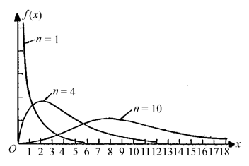
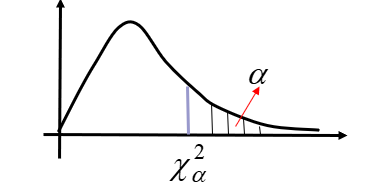
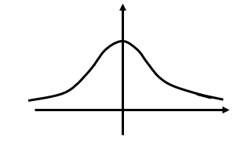
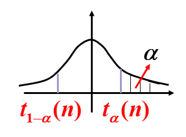
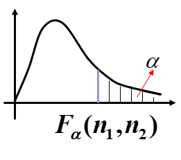

---
title: 数理统计基础理论归纳
date: 2021-03-23 11:33:04
summary: 本文归纳数理统计基础理论。
mathjax: true
tags:
- 数理统计
categories:
- 计算机科学的数学基础
---

# 数理统计基础理论归纳

1. 读本文前建议先温习[概率论基础理论归纳](https://blankspace.blog.csdn.net/article/details/114225067)。
2. 数理统计学是一门应用性很强的学科，它是研究怎样以有效的方式收集、 整理和分析带有随机性的数据，以便对所考察的问题作出推断和预测，直至为采取一定的决策和行动提供依据和建议。
数理统计不同于一般的资料统计，它更侧重于应用随机现象本身的规律性进行资料的收集、整理和分析。
由于大量随机现象必然呈现出它的规律性，因而从理论上讲，只要对随机现象进行足够多次观察，被研究的随机现象的规律性一定能清楚地呈现出来。只允许我们对随机现象进行次数不多的观察试验，也就是说,   我们获得的只是局部观察资料。
数理统计的任务就是研究怎样有效地收集、整理、分析所获得的有限的资料，对所研究的问题,  尽可能地作出精确而可靠的结论。
3. 概率论所研究的随机变量，都是已知分布去研究它的性质、特点和规律性，例如：求它的数字特征，讨论随机变量函数的分布，介绍常有的各种分布等等。而数理统计所研究的随机变量，它的分布是未知的或完全不知道的，人们通过对随机变量进行重复独立的观察，对这些数据进行分析，对所研究的随机变量的分布作出种种判断。
4. 数理统计主要研究的两类问题：**参数估计**和**假设检验**。
5. **总体**：研究对象的某项数量指标的全部可能的观察值，一般被看作随机变量。
6. **个体**：每一个可能观察值为个体。
7. **容量**：总体所包含的个体的个数称为总体的容量。
8. **有限总体**：容量有限的称为有限总体。
9. **无限总体**：容量无限的称为无 限总体。
10. **样本**：被抽取的部分个体叫做总体的一个样本。
11. **简单随机样本**：遵循独立同分布的样本，也称**样本**，其观察值为**样本值**。
12. $F^{*}(x_{1},x_{2},\cdots,x_{n})=\prod\limits_{i=1}^{n}{F(x_{i})}$
13. $f^{*}(x_{1},x_{2},\cdots,x_{n})=\prod\limits_{i=1}^{n}{f(x_{i})}$
14. 不含未知参数的**统计量**$g(X_{1},X_{2},\cdots,X_{n})$是随机变量。
15. 常用统计量：
    - 样本均值：$\bar{X}=\frac{1}{n}\sum\limits_{i=1}^{n}{X_{i}}$，观察值：$\bar{x}=\frac{1}{n}\sum\limits_{i=1}^{n}{x_{i}}$
    - 样本方差：$S^{2}=\frac{1}{n-1}\sum\limits_{i=1}^{n}{(X_{i}-\bar{X})^{2}}$，荐读[样本方差为何除以n-1](https://blog.csdn.net/Hearthougan/article/details/77859173)，观察值：$s^{2}=\frac{1}{n-1}\sum\limits_{i=1}^{n}{(x_{i}-\bar{x})^{2}}=\frac{1}{n-1}[\sum\limits_{i=1}^{n}{x_{i}^{2}-n\bar{x}^{2}}]$
    - 样本标准差：$S=\sqrt{S^{2}}=\sqrt{\frac{1}{n-1}\sum\limits_{i=1}^{n}{(X_{i}-\bar{X})^{2}}}$，观察值：$s=\sqrt{\frac{1}{n-1}\sum\limits_{i=1}^{n}{(x_{i}-\bar{x})^{2}}}$
    - 样本$k$阶原点矩：$A_{k}=\frac{1}{n}\sum\limits_{i=1}^{n}{X_{i}^{k}}$，观察值：$a_{k}=\frac{1}{n}\sum\limits_{i=1}^{n}{x_{i}^{k}}$
    - 样本$k$阶中心矩：$B_{k}=\frac{1}{n}\sum\limits_{i=1}^{n}{(X_{i}-\bar{X})^{k}}$，观察值：$b_{k}=\frac{1}{n}\sum\limits_{i=1}^{n}{(x_{i}-\bar{x})^{k}}$
16. 经验分布函数：$F_{n}(x)=\frac{1}{n}s(x)$
17. $P\{\lim\limits_{n\to\infty}\sup\limits_{-\infty<x<+\infty}|F_{n}(x)-F(x)|=0\}=1$
18. 统计量是样本的函数，它是一个随机变量，统计量的分布称为抽样分布。
19. 来自正态总体的几个常用统计量的分布
    - 自由度为$n$的$\chi^{2}$分布（$\chi^{2}\sim\chi^{2}(n)$）
        - $\chi^{2}=X_{1}^{2}+X_{2}^{2}+\cdots+X_{n}^{2}$
        - $f(x,n)=\begin{cases}\frac{1}{2^{\frac{n}{2}}\Gamma(\frac{n}{2})}x^{\frac{n}{2}-1}e^{-\frac{x}{2}}, & x≥0 \\ 0, & x<0 \end{cases}$
        - $\Gamma(x)=\int_{0}^{\infty}e^{-t}t^{x-1}dt$
        - $\Gamma(x+1)=x\Gamma(x)$
        - $\Gamma(n+1)=n!$
        - $\Gamma(\frac{1}{2})=\sqrt{\pi}$
        - 密度函数图像： 
        - 可加性
            - $X_{1},X_{2},\cdots,X_{n}$相互独立，服从正态分布$N(\mu,\sigma^{2})$，$\chi^{2}=\frac{1}{\sigma}\sum\limits_{i=1}^{n}(X_{i}-\mu)^{2}\sim\chi_{n}^{2}$
            - $X_{1}\sim\chi_{n_{1}}^{2}$，$X_{2}\sim\chi_{n_{2}}^{2}$，$X_{1}$和$X_{2}$相互独立，$X_{1}+X_{2}\sim\chi_{n_{1}+n_{2}}^{2}$
        - $E(\chi^{2})=n$
        - $D(\chi^{2})=2n$
        - 上$\alpha$分位点
            - $P\{\chi^{2}>\chi_{\alpha}^{2}(n)\}=\alpha$
            - $n$足够大时，$\chi_{\alpha}^{2}(n)≈\frac{1}{2}(z_{\alpha}+\sqrt{2n-1})^{2}$，$z_{\alpha}$是标准正态分布上的上$\alpha$分位点。
            - 图示： 
    - 自由度为$n$的$t$分布（$t\sim{t(n)}$）
        - $t=\frac{X}{\sqrt{\frac{Y}{n}}}$
        - $f(x,n)=\frac{\Gamma(\frac{n+1}{2})}{\Gamma(\frac{n}{2})\sqrt{n\pi}}(1+\frac{x^{2}}{n})^{-\frac{n+1}{2}}$
        - 密度函数关于$y$轴对称，$\lim\limits_{n\to\infty}{f(x,n)}=\frac{1}{\sqrt{2\pi}}e^{-\frac{x^{2}}{2}}$
        - 密度函数图像： 
        - 当$n$充分大时，t分布近似$N(0,1)$分布；但对于较小的$n$，t分布与$N(0,1)$分布相差很大。
        - 上$\alpha$分位点
            - $P\{t>t_{\alpha}(n)\}=\alpha$
            - $t_{1-\alpha}(n)=-t_{\alpha}(n)$
            - $n>45$时，$t_{\alpha}(n)≈z_{\alpha}$
            - 图示： 
    - 自由度为$(n_{1},n_{2})$的$F$分布（$F\sim{F(n_{1},n_{2})}$）
        - $F=\frac{\frac{U}{n_{1}}}{\frac{V}{n_{2}}}$
        - $\frac{1}{F}\sim{F(n_{2},n_{1})}$
        - 上$\alpha$分位点
            - $P\{F>F_{\alpha}(n_{1},n_{2})\}=\alpha$
            - $F_{1-\alpha}(n_{1},n_{2})=\frac{1}{F_{\alpha}(n_{2},n_{1})}$
            - 图示： 
    - 正态总体的样本均值与样本方差的分布
        - $E(\bar{X})=\mu$
        - $D(\bar{X})=\frac{\sigma^{2}}{n}$
        - 若$X\sim{N(\mu,\sigma^{2})}$，则$\bar{X}\sim{N(\mu,\frac{\sigma^{2}}{n})}$，$\frac{\bar{X}-\mu}{\frac{\sigma}{\sqrt{n}}}\sim{N(0,1)}$
        - $(n-1)\frac{S^{2}}{\sigma^{2}}\sim{\chi^{2}(n-1)}$，$\bar{X}$与$S^{2}$相互独立
        - 样本取自正态总体，$\frac{\bar{X}-\mu}{\frac{S}{\sqrt{n}}}\sim{t(n-1)}$
        - $X\sim{N(\mu_{1},\sigma^{2})}$，$X\sim{N(\mu_{2},\sigma^{2})}$，$\frac{\bar{X}-\bar{Y}-(\mu_{1}-\mu_{2})}{\sqrt{\frac{(n_{1}-1)S_{1}^{2}+(n_{2}-1)S_{2}^{2}}{n_{1}+n_{2}-2}}\sqrt{\frac{1}{n_{1}}+\frac{1}{n_{2}}}}\sim{t_{n_{1}+n_{2}-2}}$
        - $X\sim{N(\mu_{1},\sigma_{1}^{2})}$，$X\sim{N(\mu_{2},\sigma_{2}^{2})}$，$\frac{S_{1}^{2}/\sigma_{1}^{2}}{S_{2}^{2}/\sigma_{2}^{2}}\sim{F_{n_{1}-1,n_{2}-1}}$
20. **估计量**：用于基于观察数据计算给定量的估计的规则；是用来估计未知总体的参数。
21. **点估计**：用样本数据来估计总体参数，估计结果使用一个点的数值来表示最佳估计值。
22. **估计值**：由样本数据估计总体分布所含未知参数的真值，所得值称为估计值。
23. **矩估计**：估计总体参数的方法，首先推导目标参数的总体矩（随机变量的幂的期望值）的方程，然后取出一个样本，并从该样本估计总体矩，接着用样本矩取代未知的总体矩，解出目标参数。
24. **极大似然估计**：估计总体参数的方法，在参数的所有取值中寻找一个值，使得似然函数取得最大值，可能性最大的参数值即对参数的最大似然估计。
    - 离散型：$L(\theta)=L(x_{1},x_{2},\cdots,x_{n};\theta)=\prod\limits_{i=1}^{n}p(x_{i};\theta)$
    - 连续型：$L(\theta)=L(x_{1},x_{2},\cdots,x_{n};\theta)=\prod\limits_{i=1}^{n}f(x_{i};\theta)$
25. **参数区间估计问题**：给定置信度求未知参数置信区间的问题。
26. 置信区间
    - 展现的是这个参数的真实值有一定概率落在测量结果的周围的程度，其给出的是被测量参数的测量值的可信程度。
    - 给定置信度的置信区间并不是唯一的，置信区间的长度表示估计的精度，置信区间越短表示估计的精度越高。
    - 求解思路：
        - 选择总体统计量（要解决的实际问题）
        - 求出统计量的抽样分布（样本的平均值和标准误差）
        - 求出置信区间
        - 求出置信区间的上下限的值
    - 基本的置信区间可以查表
29. 实际推断原理：概率很小的随机事件（通常以$\alpha≤0.05$的概率为小概率）在一次试验中实际上几乎是不发生的。
30. 假设检验中，原假设为$H_{0}$，备择假设为$H_{1}$。
31. 假设检验的基本方法：先假定所要检验的假设$H_{0}$成立，在此前提下，根据给定的值$\alpha$，使用样本构造概率为$\alpha$的小概率事件。然后，根据一次试验的结果，即样本观测值，看上述小概率事件在此试验中是否发生。如果发生，我们就否定$H_{0}$；否则就接受$H_{0}$ 。$\alpha$称为检验水平或检验标准，通常$\alpha=0.05$或$0.01$。
32. 假设检验的两类错误：
    - 第一类错误（弃真）：如果原假设为真，按检验法则否定了原假设。
    - 第二类错误（取伪）：如果原假设非真，按检验法则接受了原假设。
33. 拒绝域与临界点
34. 双边检验、左边检验和右边检验
