---
title: 概率论基础理论归纳
date: 2021-03-04 10:29:26
summary: 本文归纳概率论基础理论。
mathjax: true
tags:
- 概率论
categories:
- 计算机科学的数学基础
---

# 概率论基础理论归纳

1. **概率论**是研究随机现象规律性的一门数学学科。
2. 在一定条件下可能出现也可能不出现的现象称为**随机现象**。
3. 随机现象的特征：条件不能完全决定结果。
4. 随机现象是通过随机试验来研究的。
5. 具有以下三个特征的试验被称为**随机试验**：
    1. 可以在相同的条件下重复地进行。
    2. 每次试验的可能结果不止一个, 并且能事先明确试验的所有可能结果。
    3. 进行一次试验之前不能确定哪一个结果会出现。
6. 随机试验$E$的所有可能结果组成的集合称为$E$的**样本空间**, 记为$S$。
7. 样本空间的元素，即试验E的每一个结果，称为**样本点**。
8. 试验不同，对应的样本空间也不同。
9. 同一试验，若试验目的不同，则对应的样本空间也不同。
10. 建立样本空间，事实上就是建立随机现象的数学模型。因此，一个样本空间可以概括许多内容大不相同的实际问题。
11. 随机试验E的样本空间S的子集称为E的**随机事件**，简称事件。
12. 随机试验、样本空间与随机事件的关系:

13. 随机事件的关系和运算与集合的关系和运算一一对应。
14. 概率具有**非负性**、**规范性**、**可加性**。
15. 频率与概率的关系：
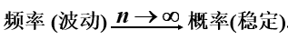
16. 古典概型与几何概型：
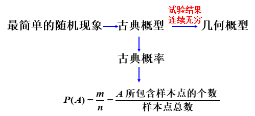
17. **条件概率公式**：$P(B|A)=\frac{P(AB)}{P(A)}$
18. **乘法定理**：$P(AB)=P(B|A)P(A)$
19. **全概率公式**：$P(A)=P(A|B_{1})P(B_{1})+P(A|B_{2})P(B_{2})+...+P(A|B_{n})P(B_{n})$
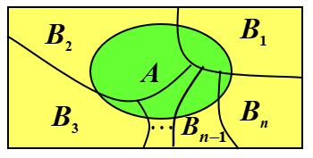
20. **贝叶斯公式**：$P(B_{i}|A)=\frac{P(A|B_{i})P(B_{i})}{\sum\limits_{j=1}^{n}P(A|B_{j})P(B_{j})}$，$i=1,2,...,n$
21. $A$，$B$ 两**事件独立** $⇔$ $P(AB)=P(A)P(B)$
22. $A$，$B$，$C$ 三事件独立 $⇔$ $P(AB)=P(A)P(B)\wedge{P(BC)=P(B)P(C)}\wedge{P(AC)=P(A)P(C)}\wedge{P(ABC)=P(A)P(B)P(C)}$
23. $A$，$B$ 两事件独立 $⇔$ $\overline{A}$ 与 $B$、$A$ 与$\overline{B}$、$\overline{A}$与$\overline{B}$相互独立
24. **随机变量**是定义在样本空间上的一种特殊的函数。
25. 随机变量与普通的函数不同，随机变量是一个函数，但它与普通的函数有着本质的差别，普通函数是定义在实数轴上的，而随机变量是定义在样本空间上的（样本空间的元素不一定是实数）。
26. 随机变量随着试验的结果不同而取不同的值，由于试验的各个结果的出现具有一定的概率，因此随机变量的取值也有一定的概率规律。
27. 随机事件包容在随机变量这个范围更广的概念之内。换而言之，随机事件是从静态的观点来研究随机现象，而随机变量则是从动态的观点来研究随机现象。
28. 随机变量主要类别是**离散型随机变量**和**连续型随机变量**。
29. **两点分布**(**0-1分布**)的分布律：
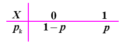
30. **等可能分布**的分布律：
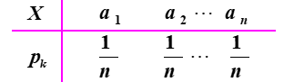
31. 将试验$E$重复进行$n$次，若各次试验的结果互不影响，即每次试验结果出现的概率都不依赖于其它各次试验的结果，则称这n次试验是**相互独立**的，或称为**n次重复独立试验**。
32. 设试验$E$只有两个可能结果：$A$及$\overline{A}$,则称$E$为**伯努利试验**。
设$P(A)=p(0< p<1)$，此时$P(A)=1-p$。
将$E$独立地重复地进行$n$次,则称这一串重复的独立试验为**n重伯努利试验**。
33. **二项分布**$X\sim{b(n,p)}$的分布律：
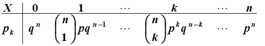
34. 二项分布与两点分布的关系：

35. **泊松分布**$X\sim{\pi(\lambda)}$的分布律：$P\{X=k\}=\frac{\lambda^{k}e^{-\lambda}}{k!}$，$k=1,2,...$
36. 二项分布和泊松分布的关系（$n>10$，$p<0.1$）：

37. **几何分布**的分布律（$p+q=1$）：
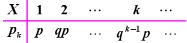
38. 随机变量的**分布函数**：$F(x)=P\{X≤x\}$
39. 随机变量的分布函数$F(x)$是$x$的一个普通实函数，主要研究随机变量在某一区间内取值的概率情况。
40. 随机变量的分布函数的重要性质和公式：
    1. $0≤F(x)≤1$，$x\in(-∞,+∞)$
    2. $x_{1}≤x_{2}$，$F(x_{1})≤F(x_{2})$
    3. $F(-∞)=\lim\limits_{x→-∞}F(x)=0$
    4. $F(+∞)=\lim\limits_{x→+∞}F(x)=1$
    5. $\lim\limits_{x→x_{0}^{+}}F(x)=F(x_{0})$，$x_{0}\in(-∞,+∞)$，任意分布函数处处右连续
    6. $P(a<X≤b)=F(b)-F(a)$
    7. $P(X>a)=1-F(a)$
41. 离散型随机变量的分布函数：$F(x)=P\{X≤x\}=\sum\limits_{x_{i}≤x}p_{k}$
42. 连续型随机变量的**概率密度**：$F(x)=\int_{-∞}^{x}f(t)dt$
43. 连续型随机变量的概率密度的重要性质和公式：
    1. $f(x)≥0$
    2. $\int_{-∞}^{+∞}f(x)dx=1$
    3. $P(x_{1}<X≤x_{2})=F(x_{2})-F(x_{1})=\int_{x_{1}}^{x_{2}}f(x)dx$
    4. 若$f(x)$在$x$处连续，则有$F(x)'=f(x)$
    5. 对于任意可能值$a$，连续型随机变量取$a$的概率等于零，即$P\{X=a\}=0$
    6. 连续型随机变量取值落在某一区间的概率与区间开闭无关，即$P(a≤X≤b)=P(a<X≤b)=P(a≤X<b)=P(a<X<b)=F(b)-F(a)$
44. 若$X$为离散型随机变量，则$\{X=a\}是不可能事件\leftrightarrow{P\{X=a\}=0}$
45. 若$X$为连续型随机变量，则$\{X=a\}是不可能事件→P\{X=a\}=0$，而$P\{X=a\}=0\nrightarrow{\{X=a\}是不可能事件}$
46. **均匀分布**$X\sim{U(a,b)}$的概率密度：$f(x)=\begin{cases}\frac{1}{b-a}, & a<x<b \\ 0, & 其他 \end{cases}$
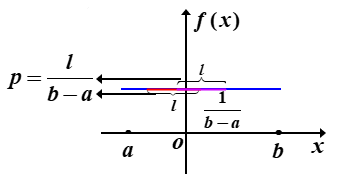
47. 均匀分布$X\sim{U(a,b)}$的分布函数：$F(x)=\begin{cases}0, & x < a\\ \frac{x-a}{b-a}, & a≤x<b \\ 1, & x≥b \end{cases}$
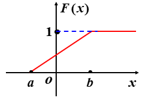
48. **指数分布**的概率密度：$f(x)=\begin{cases}\frac{1}{\theta}e^{-\frac{x}{\theta}}, & x>0 \\ 0, & x ≤0\end{cases}$
49. 指数分布的分布函数：$F(x)=\begin{cases}1-\frac{1}{\theta}e^{-\frac{x}{\theta}}, & x>0 \\ 0, & x ≤0\end{cases}$
50. **正态分布**$X\sim{N(\mu,\sigma^{2})}$的概率密度：$f(x)=\frac{1}{\sqrt{2\pi}\sigma}e^{-\frac{(x-\mu)^{2}}{2\sigma^{2}}}$
51. 正态分布$X\sim{N(\mu,\sigma^{2})}$的分布函数：$F(x)=\frac{1}{\sqrt{2\pi}\sigma}\int_{-∞}^{x}e^{-\frac{(t-\mu)^{2}}{2\sigma^{2}}}dt$
52. **标准正态分布**$X\sim{N(0,1)}$的概率密度：$f(x)=\frac{1}{\sqrt{2\pi}}e^{-\frac{x^{2}}{2}}$
53. 标准正态分布$X\sim{N(0,1)}$的分布函数：$F(x)=\frac{1}{\sqrt{2\pi}}\int_{-∞}^{x}e^{-\frac{t^{2}}{2}}dt$
54. 正态分布的重要性质和结论：
    1. 若$X\sim{N(\mu,\sigma^{2})}$，则$Z=\frac{X-\mu}{\sigma}\sim{N(0,1)}$
    2. $P\{c≤X≤d\}=\Phi(\frac{d-\mu}{\sigma})-\Phi(\frac{c-\mu}{\sigma})$
    3. $\Phi(-x)-1-\Phi(x)$
55. 正态分布是概率论中最重要的分布。
正态分布有极其广泛的实际背景，例如测量误差，人的生理特征尺寸如身高、体重等，正常情况下生产的产品尺寸：直径、长度、重量高度，炮弹的弹落点的分布等，都服从或近似服从正态分布。可以说，正态分布是自然界和社会现象中最为常见的一种分布，一个变量如果受到大量微小的、独立的随机因素的影响，那么这个变量一般是一个正态随机变量。
另一方面，有些分布（如二项分布、泊松分布）的极限分布是正态分布。所以，无论在实践中，还是在理论上，正态分布是概率论中最重要的一种分布。
56. 离散型随机变量的函数的分布：
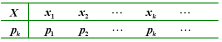
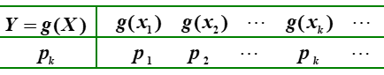
57. 二维连续型随机变量的函数的分布：先求$F_{Y}(y)=P\{Y≤y\}=P\{g(X)≤y\}=\int_{g(x)≤y}{f_{X}(x)dx}$，再求$\frac{dF_{Y}(y)}{dy}$。
58. 二维随机变量的分布函数：$F(x,y)=P\{X≤x,Y≤y\}$，也称随机变量$X$和$Y$的联合分布函数。
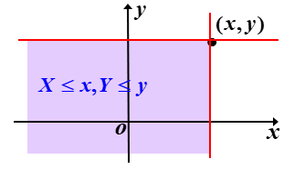
59. 二维随机变量的分布函数的性质：
    1. $F(x,y)$是随机变量$x$和$y$的单调不减函数
    2. $0≤F(x,y)≤1$
    3. $F(-∞,y)=\lim\limits_{x→-∞}F(x,y)=0$
    4. $F(x,-∞)=\lim\limits_{y→-∞}F(x,y)=0$
    5. $F(-∞,-∞)=\lim\limits_{x→-∞,y→-∞}F(x,y)=0$
    6. $F(+∞,+∞)=\lim\limits_{x→+∞,y→+∞}F(x,y)=1$
    7. $F(x,y)=F(x+0,y)$
    8. $F(x,y)=F(x,y+0)$
    9. $F(x_{2},y_{2})-F(x_{2},y_{1})+F(x_{1},y_{1})-F(x_{1},y_{2})≥0$，$x_{1}<x_{2}$，$y_{1}<y_{2}$
60. 二维离散型随机变量的分布律：$P\{X=x_{i},Y=y_{j}\}=p_{ij}$
61. 二维离散型随机变量的分布函数：$F(x,y)=\sum\limits_{x_{i}≤x}\sum\limits_{y_{j}≤y}p_{ij}$
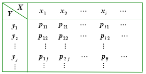
62. 二维连续型随机变量的概率密度：$F(x,y)=\int_{-∞}^{y}\int_{-∞}^{x}f(u,v)dudv$，也称随机变量$X$和$Y$的联合概率密度。
63. 二维连续型随机变量的概率密度的性质：
    1. $f(x,y)≥0$
    2. $\int_{-∞}^{+∞}\int_{-∞}^{+∞}f(x,y)dxdy=F(-∞,+∞)=1$
    3. $f(x,y)$在$(x,y)$上连续，$\frac{\partial^{2}F(x,y)}{\partial{x}\partial{y}}=f(x,y)$
    4. $P\{(X,Y)\in{G}\}=\iint\limits_{G}f(x,y)dxdy$
64. 二维均匀分布的概率密度：$f(x,y)=\begin{cases}\frac{1}{S}, & (x,y)\in{D} \\ 0, & 其他 \end{cases}$
65. 二维正态分布$(X,Y)\sim{N(\mu_{1},\mu_{2},\sigma_{1}^{2},\sigma_{2}^{2},\rho)}$的概率密度：$f(x,y)=\frac{1}{2\pi\sigma_{1}\sigma_{2}\sqrt{1-\rho^{2}}}e^{-\frac{1}{2(1-\rho^{2})}[\frac{(x-\mu_{1})^{2}}{\sigma_{1}^{2}}-\frac{2\rho(x-\mu_{1})(y-\mu_{2})}{\sigma_{1}\sigma_{2}}+\frac{(y-\mu_{2})^{2}}{\sigma_{2}^{2}}]}$，其两个边缘分布都是一维正态分布。
66. 二维随机变量的边缘分布函数：$F_{X}(x)=F(x,∞)=P\{X≤x\}$，$F_{Y}(y)=F(∞,y)=P\{Y≤y\}$
67. 二维离散型随机变量的边缘分布律：$p_{i.}=\sum\limits_{j=1}^{∞}{p_{ij}}=P\{X=x_{i}\}$，$p_{.j}=\sum\limits_{i=1}^{∞}{p_{ij}}=P\{Y=y_{j}\}$
68. 二维随机变量的联合分布与边缘分布的关系：

69. 二维离散型随机变量的边缘分布函数：$F_{X}(x)=F(x,∞)=\sum\limits_{x_{i}≤x}\sum\limits_{j=1}^{∞}p_{ij}$，$F_{Y}(y)=F(∞,y)=\sum\limits_{y_{j}≤y}\sum\limits_{i=1}^{∞}p_{ij}$
70. 二维连续型随机变量的边缘概率密度：$f_{X}(x)=\int_{-∞}^{+∞}f(x,y)dy$，$f_{Y}(y)=\int_{-∞}^{+∞}f(x,y)dx$
71. 二维连续型随机变量的边缘分布函数：$F_{X}(x)=F(x,∞)=\int_{-∞}^{x}[\int_{-∞}^{+∞}f(x,y)dy]dx$，$F_{Y}(y)=F(∞,y)=\int_{-∞}^{y}[\int_{-∞}^{+∞}f(x,y)dx]dy$
72. 二维离散型随机变量的条件分布律：$P\{X=x_{i}|Y=y_{j}\}=\frac{P\{X=x_{i},Y=y_{j}\}}{P\{Y=y_{j}\}}=\frac{p_{ij}}{p_{.j}}$，$P\{Y=y_{j}|X=x_{i}\}=\frac{P\{X=x_{i},Y=y_{j}\}}{P\{X=x_{i}\}}=\frac{p_{ij}}{p_{i.}}$
73. 二维连续型随机变量的条件概率密度：$f_{X|Y}(x|y)=\frac{f(x,y)}{f_{Y}(y)}$，$f_{Y|X}(y|x)=\frac{f(x,y)}{f_{X}(x)}$
74. 联合分布、边缘分布、条件分布的关系：

75. 随机变量$X$和$Y$是相互独立的$⇔F(x,y)=F_{X}(x)F_{Y}(y)$
76. 离散型随机变量$X$和$Y$是相互独立的$⇔P\{X=x_{i},Y=y_{j}\}=P\{X=x_{i}\}P\{Y=y_{j}\}$
77. 连续型随机变量$X$和$Y$是相互独立的$⇔f(x,y)=f_{X}(x)f_{Y}(y)$
78. 随机变量$X$和$Y$是相互独立的，则$f(X)$和$g(Y)$也相互独立。
79. $n$维随机变量的理论可以从二维随机变量推广得到，此处不再赘述。
80. 离散型随机变量函数$Z=g(X,Y)$的分布律：$P\{Z=z_{k}\}=P\{g(X,Y)=z_{k}\}=\sum\limits_{z_{k}=g(x_{i},y_{j})}p_{ij}$
81. 连续型随机变量函数$Z=X+Y$的概率密度：$f_{Z}(z)=\int_{-∞}^{+∞}f(x,z-x)dx=\int_{-∞}^{+∞}f(z-y,y)dy$
$X$和$Y$独立时，$f_{Z}(z)=\int_{-∞}^{+∞}f_{X}(x)f_{Y}(z-x)dx=\int_{-∞}^{+∞}f_{X}(z-y)f_{Y}(y)dy$
82. 连续型随机变量函数$Z=\frac{X}{Y}$的概率密度：$f_{Z}(z)=\int_{-∞}^{+∞}|y|f(yz,y)dy$
$X$和$Y$独立时，$f_{Z}(z)=\int_{-∞}^{+∞}|y|f_{X}(yz)f_{Y}(y)dy$
83. 随机变量函数$Z=\max(X,Y)$的分布函数：$F_{\max}(z)=F_{X}(z)F_{Y}(z)$
84. 随机变量函数$Z=\min(X,Y)$的分布函数：$F_{\min}(z)=1-[1-F_{X}(z)][1-F_{Y}(z)]$
85. 离散型随机变量$X$的数学期望：$E(X)=\sum\limits_{k=1}^{∞}x_{k}p_{k}$，要求此级数收敛。
86. 连续型随机变量$X$的数学期望：$E(X)=\int_{-∞}^{+∞}xf(x)dx$
87. 离散型随机变量函数$Y=g(X)$的数学期望：$E(g(X))=g(x_{k})p_{k}$
88. 连续型随机变量函数$Y=g(X)$的数学期望：$E(g(X))=\int_{-∞}^{+∞}g(x)f(x)dx$
89. 数学期望的性质：
    1. $E(C)=C$
    2. $E(CX)=CE(X)$
    3. $E(X+Y)=E(X)+E(Y)$
    4. $E(XY)=E(X)E(Y)$
90. 二维离散型随机变量$(X,Y)$的数学期望：$E(X)=\sum\limits_{i}\sum\limits_{j}x_{i}p_{ij}$，$E(Y)=\sum\limits_{i}\sum\limits_{j}y_{j}p_{ij}$
91. 二维连续型随机变量$(X,Y)$的数学期望：$E(X)=\int_{-∞}^{+∞}\int_{-∞}^{+∞}xf(x,y)dxdy$，$E(Y)=\int_{-∞}^{+∞}\int_{-∞}^{+∞}yf(x,y)dxdy$
92. 二维离散型随机变量函数$g(X,Y)$的数学期望：$E(g(X,Y))=\sum\limits_{i}\sum\limits_{j}g(x_{i},y_{j})p_{ij}$
93. 二维连续型随机变量函数$g(X,Y)$的数学期望：$E(g(X,Y))=\int_{-∞}^{+∞}\int_{-∞}^{+∞}g(x,y)f(x,y)dxdy$
94. 随机变量的方差：$D(X)=Var(X)=E\{[X-E(X)]^{2}\}=E(X^{2})-[E(X)]^{2}$
95. 离散型随机变量的方差：$D(X)=\sum\limits_{k=1}^{∞}[x_{k}-E(X)]^{2}p_{k}$
96. 连续型随机变量的方差：$D(X)=\int_{-∞}^{+∞}[x-E(X)]^{2}f(x)dx$
97. 方差的性质：
    1. $D(C)=0$
    2. $D(CX)=C^{2}D(X)$
    3. $D(X±Y)=D(X)+D(Y)$
    4. $D(X)=0⇔P\{X=C\}=1$
98. 随机变量的标准差：$\sigma(X)=\sqrt{D(X)}=\sqrt{E\{[X-E(X)]^{2}\}}$
99. 随机变量的协方差：$Cov(X,Y)=E\{[X-E(X)][Y-E(Y)]\}$
100. 协方差的性质： 
     1. $Cov(X,Y)=Cov(Y,X)$
     2. $Cov(aX,bY)=abCov(Y,X)$
     3. $Cov(X_{1}+X_{2},Y)=Cov(X_{1},Y)+Cov(X_{2},Y)$
101. 随机变量的相关系数：$|\rho_{XY}|=\frac{Cov(X,Y)}{\sqrt{D(X)}\sqrt{D(Y)}}$
102. 相关系数的性质：
     1. $|\rho_{XY}|≤1$
     2. $|\rho_{XY}|=1⇔P\{Y=a+bX\}=1$
103. 切比雪夫不等式：$P\{|X-E(X)|<\epsilon\}≥1-\frac{\sigma^{2}}{\epsilon^{2}}$，$P\{|X-E(X)|≥\epsilon\}≤\frac{\sigma^{2}}{\epsilon^{2}}$
切比雪夫不等式给出了在随机变量$X$分布未知的情况下，事件$\{|X-\mu|<\epsilon\}$概率的一种估计方法。
104. 切比雪夫大数定理：$\lim\limits_{n→∞}P\{|Y_{n}-\mu|<\epsilon\}=\lim\limits_{n→∞}P\{|\frac{1}{n}\sum\limits_{k=1}^{n}{X_{k}}-\mu|<\epsilon\}=1$
定理要求随机变量相互独立，有相同的数学期望和方差。
随机变量序列$Y_{1},Y_{2},...,Y_{n}$依概率收敛于$\mu$。
在所给的条件下，当$n$充分大时，$n$个随机变量的算术平均值与它们的数学期望有较小的偏差的可能性比较大，可以考虑用算术平均值作为所研究指标值的近似值。
105. 伯努利大数定理：$\lim\limits_{n→∞}P\{|\frac{n_{A}}{n}-p|<\epsilon\}=1$，$\lim\limits_{n→∞}P\{|\frac{n_{A}}{n}-p|≥\epsilon\}=0$
伯努利大数定理表明事件发生的频率依概率收敛于事件的概率。由实际推断原理，在实际应用中，当试验次数很多时，可以用事件发生的频率来代替事件的概率。
106. 辛钦大数定理：$\lim\limits_{n→∞}P\{|\frac{1}{n}\sum\limits_{k=1}^{n}{X_{k}}-\mu|<\epsilon\}=1$
定理要求随机变量独立同分布，有相同的数学期望。
伯努利大数定理是辛钦定理的特殊情况，$n$个随机变量的算术平均值以概率收敛于算术平均值的数学期望。
107. 在概率论中，习惯于把和的分布收敛于正态分布这一类定理都叫做中心极限定理。
108. 随机变量标准化：$Z_{n}=\frac{\sum\limits_{k=1}^{n}X_{k}-E(\sum\limits_{k=1}^{n}X_{k})}{\sqrt{Var(\sum\limits_{k=1}^{n}X_{k})}}$
109. 独立同分布的中心极限定理(列维—林德伯格中心极限定理)：$Y_{k}=\frac{\sum\limits_{k=1}^{n}X_{k}-E(\sum\limits_{k=1}^{n}X_{k})}{\sqrt{D(\sum\limits_{k=1}^{n}X_{k})}}=\frac{\sum\limits_{k=1}^{n}X_{k}-n\mu}{\sqrt{n}\sigma}$的分布函数$F_{n}(x)$对任意$x$满足$\lim\limits_{n→∞}F_{n}(x)=\lim\limits_{n→∞}P\{\frac{\sum\limits_{k=1}^{n}X_{k}-n\mu}{\sqrt{n}\sigma}≤x\}=\int_{-∞}^{x}\frac{1}{\sqrt{2\pi}}e^{-\frac{t^{2}}{2}}dt=\Phi(x)$
在所给的条件下，当$n$无穷大时，$n$个具有期望和方差的独立同分布的随机变量之和$Y_{n}$的分布函数近似服从标准正态分布为极限分布。
110. 李雅普诺夫中心极限定理：$B_{n}^{2}=\sum\limits_{k=1}^{n}\sigma_{k}^{2}$，$Z_{n}=\frac{\sum\limits_{k=1}^{n}X_{k}-E(\sum\limits_{k=1}^{n}X_{k})}{\sqrt{D(\sum\limits_{k=1}^{n}X_{k})}}=\frac{\sum\limits_{k=1}^{n}X_{k}-\sum\limits_{k=1}^{n}\mu_{k}}{B_{n}}$的分布函数$F_{n}(x)$对任意$x$满足$\lim\limits_{n→∞}F_{n}(x)=\lim\limits_{n→∞}P\{\frac{\sum\limits_{k=1}^{n}X_{k}-\sum\limits_{k=1}^{n}\mu_{k}}{B_{n}}≤x\}=\int_{-∞}^{x}\frac{1}{\sqrt{2\pi}}e^{-\frac{t^{2}}{2}}dt=\Phi(x)$
111. 棣莫佛—拉普拉斯中心极限定理：$\eta_{n}\sim{b(n,p)}$，$\lim\limits_{n→∞}F_{n}(x)=\lim\limits_{n→∞}P\{\frac{\eta_{n}-np}{\sqrt{np(1-p)}}≤x\}=\int_{-∞}^{x}\frac{1}{\sqrt{2\pi}}e^{-\frac{t^{2}}{2}}dt=\Phi(x)$
当$n$很大，$0<p<1$是一个定值时，二项变量$Y_{n}$的分布近似正态分布$N(np,np(1-p))$
