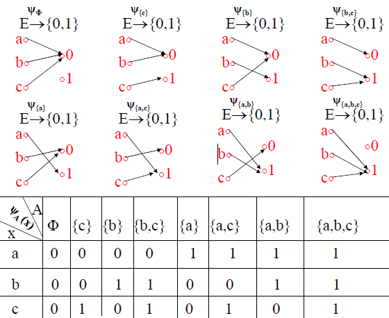

# 函数

函数的基本概念：
- 函数
- 自变元
- 函数值
- 定义域
- 值域
- 陪域

## 函数的表示方法

- 枚举法
- 有向图法
- 矩阵法
- 谓词描述法

## 特殊函数

- 常值函数
- 恒等函数

## 函数的类型

$R_{f}$表示值域，$f:X→Y$表示函数。

- 满射：$R_{f}=Y$
- 映内：$R_{f}⫋Y$
- 单射：$∀x_{1}∀x_{2}((x_{1}\in{X}\wedge{x_{2}\in{X}}\wedge{x_{1}≠x_{2}})→f(x_{1})≠f(x_{2}))$
- 双射：满射+入射

思考：“$f:X→X$是一个入射的函数，则它必然是满射的，所以$f$必然是双射的”，这句话对吗？
答案：不对。假设$f:N→N$，$f(n)=2n$，$f$是入射的，但并不是满射的函数，所以不是双射函数。

满射函数的证明思路：
- 任取$y\in{Y}$，推出存在$x\in{X}$，使得$y=f(x)$

入射函数的证明思路：
- 任取$x_{1},x_{2}\in{X}$，设$x_{1}≠x_{2}$，推出$f(x_{1})≠f(x_{2})$
- 任取$x_{1},x_{2}\in{X}$，设$f(x_{1})=f(x_{2})$，推出$x_{1}=x_{2}$

通俗描述：
- 满射：$R_{f}$是从$D_{f}$映射来的，但有可能只是$Y$的一个真子集，即还有一部分$Y$中的元素是$R_{f}$不含的。而满射要求这种元素不存在，即所有$Y$中的元素$R_{f}$中都有，二者重合。
- 单射：映射本身要求一个$x$只能对一个$y$，而一个$y$也能对应多个$x$。单射要求一个$y$也只能对一个$x$，这就要求$x$和$y$必须一一对应。
- 双射：满足满射和入射。

# 函数复合

设$f:X→Y$、$g:Y→Z$是函数，则定义$g\circ{f}=\{<x,z>|x∈X∧z∈Z∧∃y(y∈Y∧<x,y>∈f∧<y,z>∈g)\}$，则称$g\circ{f}$为$f$与$g$的复合函数(左复合)。

$g\circ{f}:X→Z$，即$g\circ{f}$是$X$到$Z$的函数。这样写是为了照顾数学习惯: $g\circ{f}(x)=g(f(x))$。

## 函数复合的性质

1. 可结合性：$f:X→Y$，$g:Y→Z$，$h:Z→W$是函数，则$(h\circ{g})\circ{f}=h\circ(g\circ{f})$
2. $f:X→Y$，$g:Y→Z$是两个函数，则
    1. 如果$f$和$g$是满射的，则$g\circ{f}$也是满射的
    2. 如果$f$和$g$是入射的，则$g\circ{f}$也是入射的
    3. 如果$f$和$g$是双射的，则$g\circ{f}$也是双射的
3. $f:X→Y$，$g:Y→Z$是两个函数，则
    1. 如果$g\circ{f}$是满射的，则$g$是满射的
    2. 如果$g\circ{f}$是入射的，则$f$是入射的
    3. 如果$g\circ{f}$是双射的，则$g$是满射的且$f$是入射的
4. $f:X→Y$是函数，则$f\circ{I_{X}}=f$且$I_{Y}\circ{f}=f$

# 逆函数

设$f:X→Y$是双射的函数，$f^{C}:Y→X$是$f$的逆函数。

可以用$f^{-1}$代替$f^{C}$ 。若$f^{-1}$存在，也称$f$可逆。

显然，$f^{-1}$也是双射函数。

## 逆函数的性质

1. $f:X→Y$是双射函数，则$(f^{-1})^{-1}=f$
2. $f:X→Y$是双射函数，则$f^{-1}\circ{f}=I_{X}$且$f\circ{f^{-1}}=I_{Y}$
3. $f:X→Y$，$g:Y→Z$是两个函数，如果$g\circ{f}=I_{X}$且$f\circ{g}=I_{Y}$，则$g=f^{-1}$
4. $f:X→Y$，$g:Y→Z$是两个双射函数，则$(g\circ{f})^{-1}=f^{-1}\circ{g^{-1}}$

# 集合的特征函数

令$E$是全集，$A$是$E$的子集，定义函数$\Psi_{A}:E→\{0,1\}$，对任何$x\in{E}$，有$\Psi_{A}(x)=\begin{cases}1, & x\in{A} \\ 0, & x\notin{A} \end{cases}$，称$\Psi_{A}:E→\{0,1\}$是子集$A$的特征函数。

## 集合特征函数的性质

令$A$、$B$是全集$E$的子集，则
1. $A=\Phi⇔∀x(\Psi_{A}(x)=0)$
2. $A=E⇔∀x(\Psi_{A}(x)=1)$
3. $A⊆B⇔∀x(\Psi_{A}(x)≤\Psi_{B}(x))$
4. $A=B⇔∀x(\Psi_{A}(x)=\Psi_{B}(x))$
5. $A⫋B⇔∀x(\Psi_{A}(x)≤\Psi_{B}(x))\wedge{∃x(\Psi_{A}(x)=0\wedge{\Psi_{B}(x)=1})}$
6. $\Psi_{A\cap{B}}(x)=\Psi_{A}(x)\Psi_{B}(x)$
7. $\Psi_{\sim{A}}(x)=1-\Psi_{A}(x)$
8. $\Psi_{A\cup{B}}(x)=\Psi_{A}(x)+\Psi_{B}(x)-\Psi_{A\cap{B}}(x)$
9. $\Psi_{A-B}(x)=\Psi_{A}(x)-\Psi_{A\cap{B}}(x)$

# 集合的基数

## 集合的等势

$A$、$B$是集合，如果存在双射$f:A→B$，则称$A$与$B$等势，记作$A\sim{B}$。

集合间的等势关系$\sim$是一种[等价关系](https://blankspace.blog.csdn.net/article/details/113792569)，满足自反性、对称性、传递性。

依据等势关系$\sim$对集合族$S$进行划分，得到商集$S/\sim$，进而可以得到基数类的概念。

## 基数类

$S$是集合族，$\sim$是$S$上的等势关系，相对$\sim$的等价类称为基数类。

给定集合$A$，$A$属于的基数类，称为$A$的基数，记作$K[A]$。
如$A=\{1,2\}$，$A\in[2]$，$K[A]=[2]$，简记成$K[A]=2$。
如$B=\{a,b,c\}$，$B\in[3]$，$K[B]=[3]$，简记成$K[B]=3$。

## 可数集合及其基数

凡是和某个自然数$n$等势的集合，都称之为有限集合，否则是无限集合。

$N$不可能与某个自然数$n$等势，所以$N$的基数不能是有限数，就用一个无限大的数$\aleph_{0}$表示，即$K[N]=\aleph_{0}$。

与自然数集合$N$等势的集合被称为可数集合。

以下三例均为可数集合：
$A=\{0,2,4,6,8,...\}$，$f:N→A$，$f(n)=2n$
$B=\{1,3,5,7,9,...\}$，$g:N→B$，$g(n)=2n+1$
$C=\{10^{0},10^{1},10^{2},10^{3},10^{4},...\}$，$h:N→C$，$h(n)=10^{n}$

集合$A$是可数集合，当且仅当可以将$A$的元素写成序列形式，即$A=\{a_{0},a_{1},a_{2},a_{3},...\}$。

有限集合和可数集合统称为至多可数集合。

## 不可数集合及其基数

实数轴上$(0,1)$区间内的实数是不可数的。

$(0,1)$区间的基数是一个比$N$的基数$\aleph_{0}$更大的无限大的数，用$\aleph$表示，即$\aleph>\aleph_{0}$。
整个实数集合$R\sim(0,1)$（说明：可以构造函数$f:(0,1)→R$，$f(x)=\tan(\pi{x}-\frac{\pi}{2})$，这是一个双射函数……）
实数轴上的任何一段连续区间$(a,b)$的基数都是$\aleph$，所以称之为连续统基数。

$K[A_{1}]=K[A_{2}]=...=K[A_{n}]=\aleph$，则$K[A_{1}\cup{A_{2}}\cup{...}\cup{A_{n}}]=\aleph$

$K[A]=K[B]=\aleph$，则$K[A\times{B}]=\aleph$

$K[A]=\aleph$，$K[B]=\aleph_{0}$（或$K[B]=n$），B是至多可数集，则$K[A-B]=\aleph$

## 基数的比较

基数的比较问题，是一个无限集合的次序问题。

在比较两个集合基数相等时，要看这两个集合之间是否存在双射，但是找双射可能并不简单，下面的内容有助于解决这个问题。

定理：如果集合$A$到$B$存在入射函数，则$K[A]≤K[B]$。

Zermelo定理：$A$和$B$是任何集合，则以下三条必有一条成立：
- $K[A]<K[B]$
- $K[B]<K[A]$
- $K[A]=K[B]$

Contor-Schroder-Bernstein定理：$A$和$B$是任何集合，如果$K[A]≤K[B]$且$K[B]≤K[A]$，则$K[A]=K[B]$。

定理：设$A$是有限集合，则$K[A]<\aleph_{0}<\aleph$。

定理：设$A$是无限集合，则$\aleph_{0}≤K[A]$。

连续统**假设**：$\aleph$是大于$\aleph_{0}$的最小基数，不存在集合$A$使得$\aleph_{0}<K[A]<\aleph$
