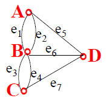
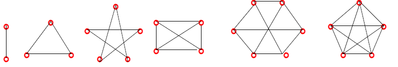
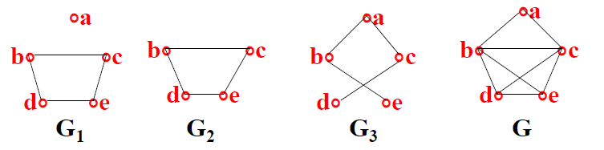
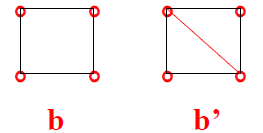

# 图

**图**可以定义为$G=V(G),E(G)$，其中$V(G)$是G的**结点的非空集合**，可简记成$V$；$E(G)$是G的**边的集合**，可简记成$E$。

图的**结点**(Vertices)用$\circ$表示，旁边表明该结点的名称。

图的**边**(Edges)可以分为有向边和无向边。

**有向边**用带箭头的弧线表示，从$u$到$v$的边可表示为$<u,v>$。

**无向边**用不带箭头的弧线表示，从$u$到$v$的边可表示为$(u,v)$。

图中结点相对位置不同不重要，边的区直和长短也不重要。

图的**邻接点**是与一条边关联的两个结点。 

图的**邻接边**是关联同一个结点的两条边。 

图的**环**是只关联一个结点的边。 

图的**平行边**是关联于同一对接点的若干条边。 

图可分为有向图和无向图。

**有向图**是只有有向边的图。 

**无向图**是只有无向边的图。 

图的**孤立结点**是不与任何边关联的结点。

**零图**是仅有一些孤立结点构成的图。 

**平凡图**是仅有一个孤立结点构成的零图，$|V(G)=1$，$|E(G)=0|$。 

**简单图**是不含有环和平行边的图。 

**多重图**是含有平行边的图。 

无向图中结点$v$的**度**是结点$v$所关联的边数，记作$deg(v)$或$d(v)$。
一个环带给结点的度是2。

无向图的**结点度序列**表示为$V=\{deg(v_{1}),deg(v_{2}),...,deg(v_{n})\}$。

无向图的**最大度**表示为$\Delta(G)=\max\{deg(v)|v\in{G}\}$。

无向图的**最小度**表示为$\delta(G)=\min\{deg(v)|v\in{G}\}$

每个无向图所有结点度的总和等于边数的2倍，即$\sum\limits_{v\in{V}}deg(v)=2|E|$。

**握手定理**：每个无向图中，奇数度的结点必为偶数个。

**K-正则图**是$\Delta(G)=\delta(G)=k$的无向简单图。 

有向图的**出度**是从结点$v$射出的边数，记作$deg^{+}(v)$或$dego(v)$。

有向图的**入度**是射入结点$v$的边数，记作$deg^{-}(v)$或$degi(v)$。

有向图所有结点的出度之和等于入度之和。

**无向完全图**是每对结点之间都有边相连的无向简单图，如果此图有$n$个结点则记作$K_{n}$。 

无向完全图$K_{n}$的边数为$\frac{n(n-1)}{2}$。

**有向简单完全图**是任何两个不同结点之间都有相互可达的边的有向简单图。 

有向简单完全图$K_{n}$的边数为$n(n-1)$。

**有向完全图**是任何两个结点之间都有相互可达的边的有向图。 

设$G=<V,E>$是图，如果$G'=<V',E'>$，$V'⊆V$，$V'=\Phi$，$E'⊆E$，则称$G'$是$G$的**子图**。

设$G=<V,E>$是图，$G'=<V',E'>$，$G'$是$G$的**子图**，如果$V'=V$，则称$G'$是$G$的**生成子图**。 

图$G$的**补图**是由$G$的所有结点和为使$G$变成完全图所需要添加的所有边组成的图，记作$\overline{G}$。

设$G_{1}=<V_{1},E_{1}>$是图$G=<V,E>$的子图，如果有$G_{2}=<V_{2},E_{2}>$使得$E_{2}=E-E_{1}$且$V_{2}$中仅包含$E_{2}$中的边所关联的结点，则称$G_{2}$是$G_{1}$相对$G$的补图。
相对补图没有相互性。
下图中$G_{2}$是$G_{3}$相对$G$的补图，$G_{3}$是$G_{1}$相对$G$的补图，$G_{1}$不是$G_{3}$相对$G$的补图。 

$G=<V,E>$和$G'=<V',E'>$是图，如果存在双射$f:V→V'$，对于任意$v_{i},v_{j}\in{V}$，若$(v_{i},v_{j})\in{E}$当且仅当$(f(v_{i}),f(v_{j}))\in{E'}$，或$<v_{i},v_{j}>\in{E}$当且仅当$<f(v_{i}),f(v_{j})>\in{E'}$，则称$G$与$G'$同构，记作$G\cong{G'}$。 

两个图同构的必要条件：
1. 结点个数相等
2. 边数相等
3. 度数相同的结点数相等
4. 对应的结点的度数相等

图中结点和边的交叉序列$v_{0}e_{1}v_{1}e_{2}v_{2}...e_{n}v_{n}$是连接$v_{0}$到$v_{n}$的**路**，$v_{0}$是此**路的起点**，$v_{n}$是此**路的终点**，路中含有的边数$n$称为此**路的长度**。
如果图是简单图，则路可以只用结点序列表示，如$abcd$。
如果图是有向图，则路可以只用边序列表示，如$e_{1}e_{3}e_{5}e_{6}$。

图中的**回路**是起点和终点重合的路。

图中的**迹**是所有边都不同的路。

图中的**闭迹**是所有边都不同的回路。

图中的**通路**是所有结点都不同的路。

图中的**圈**是除起点和终点外其余结点都不同的回路。

在一个有$n$个结点的图中，如果结点$v_{i}$到$v_{j}$存在一条路，则从$v_{i}$到$v_{j}$必存在一条长度不多于$n-1$的路。

在无向图中，如果结点$u$和$v$之间存在一条路，则称$u$和$v$是**连通**的。
规定，对于任意结点$u$，$u$和$u$是连通的。
图中结点间的连通关系是一个等价关系。

令$G=<G,V>$是无向图，$R$是$V$上的连通关系，设$R$对$V$的商集中有等价类$V_{1},V_{2},V_{3},...,V_{n}$，这$n$个类构成的$n$个子图分别记作$G(V_{1}),G(V_{2}),G(V_{3}),...,G(V_{n})$，并称它们为$G$的**连通分支**，并用$W(G)$表示$G$中连通分支数。

**连通图**是只有一个连通分支的图，$W(G)=1$。

图$G=<G,V>$是连通图，当且仅当对$V$的任何分成$V_{1}$和$V_{2}$的划分，恒存在一条边，使得它的两个端点分别属于$V_{1}$和$V_{2}$。

$G=<G,V>$是无向连通图，结点集合$V_{1}⊆V$，如果删去$V_{1}$所有的结点后，$G$就不再连通，而删去$V_{1}$的任何真子集中的所有结点后得到的子图仍然连通，则称$V_{1}$是$G$的一个**点割集**。
若点割集$V_{1}$中只有一个结点，则称此结点为**割点**。

一个连通图中结点$v$是割点的充分必要条件是存在两个结点$u$和$w$，使得从$u$到$w$的任何路都通过$v$。

**点连通度**$k(G)=\min\{|V_{1}||V_{1}是G的点割集\}$，$G$不是完全图。
点连通度表示的是使$G$不连通至少要删去的结点数。
具有割点的图的点连通度$k(G)=1$。

$G=<G,V>$是无向连通图，边集合$E_{1},E_{2}⊆E$，如果删去$E_{1}$所有的边后，$G$就不再连通，而删去$E_{1}$的任何真子集中的所有边后得到的子图仍然连通，则称$E_{1}$是$G$的一个**边割集**。
若边割集$E_{1}$中只有一条边，则称此边为**割边**，也称**桥**。

**边连通度**$\lambda(G)=\min\{|E_{1}||E_{1}是G的边集\}$，$G$不是平凡图。
边连通度表示的是使$G$不连通至少要删去的边数。
如果$G$不是连通图，则$k(G)=\lambda(G)=0$。

$G$是无向图，则$k(G)≤\lambda(G)≤\delta(G)$。

在有向图中，如果结点$u$和$v$之间存在一条路，则称从$u$到$v$是**可达**的。
显然，结点间的可达关系具有自反性和传递性。

在有向图中，如果从$u$到$v$是**可达**的，则可能存在多条路，其中最短路的长度被称作从$u$到$v$的**距离**。记作$d<u,v>$。

可达性的性质：
1. $d<u,v>≥0$
2. $d<u,u>=0$
3. $d<u,v>+d<v,w>≥d<u,w>$
4. 如果从$u$到$v$是不可达的，则$d<u,u>=∞$
5. 即使从$u$到$v$是可达的，从$v$到$u$也是可达的，$d<u,v>$也不一定等于$d<v,u>$。

有向图的**直径**$D=\max\limits_{u,v\in{V}}\{d<u,v>\}$。

简单有向图中，如果任意两个结点间互相可达，则称此图为**强联通图**。

简单有向图中，如果任意一对结点间至少有一个结点到另一个结点可达，则称此图为**单侧联通图**。

简单有向图中，如果将此图看做无向图后是连通的，则称此图为**弱联通图**。

有向图是强联通的，当且仅当此图中有一条至少包含每个结点一次的回路。

简单有向图的**强分图**是具有强联通的最大子图。

简单有向图的**单侧分图**是具有单侧联通的最大子图。

简单有向图的**弱分图**是具有弱联通的最大子图。

强分图、单侧分图、弱分图用结点的集合表示。

在有向图中，每个结点必位于一个且只位于一个强分图中。

设$G=<V,E,W>$是图，如果$G$的每条边$e$上都标有实数$c(e)$，$c(e)\in{W}$，则称这个数为边$e$的**权**，称此图为**带权图**。
带权图的性质：
1. $c(u,u)=0$
2. 如果结点$u$与$v$间无边相连，则$c(u,v)=∞$

带权图结点$u$和$v$之间的**路长**是指该路所包含的各边权的总和。

带权图结点$u$和$v$的**两点间距离**是指两结点之间的最短路的路长，记作$d(u,v)$或d<u,v>。

求带权图一个结点到另一个结点的最短路径算法有：**Dijkstra算法**、SPFA算法/Bellman-Ford算法、Floyd算法/Floyd-Warshall算法、Johnson算法、A*算法等。

## 欧拉图

在无孤立结点的图$G$中，如果存在一条经过图中每条边一次且仅一次的路，则称此路为**欧拉路**。

在无孤立结点的图$G$中，如果存在一条经过图中每条边一次且仅一次的回路，则称此路为**欧拉回路**。

**欧拉图**是含有欧拉回路的图。

欧拉路的判定：无向图$G$具有欧拉路，当且仅当$G$是连通的且有**零个或两个奇数度**的结点。

欧拉回路的判定：无向图$G$具有欧拉回路，当且仅当$G$是连通的且所有结点的度都是**偶数**。

求下图的欧拉回路： 

1. 判定所有结点度均为偶数，此图具有欧拉回路。
2. 以1位起点，选择闭迹$E_{1}=1261$。
3. $E_{1}$不包含所有边。
4. 在$G-E_{1}$中找新闭迹$E_{2}=6356$。
5. 以公共结点6为起点，对$E_{1}\cup{E_{2}}$中的边排序：$C=6356126$。
6. $E_{1}:=C$，$E_{1}=6356126$。
7. $E_{1}$不包含所有边。
8. 在$G-E_{1}$中找新闭迹$E_{2}=52345$。
9. 以公共结点5为起点，对$E_{1}\cup{E_{2}}$中的边排序：$C=52345612635$。
10.  $E_{1}:=C$，$E_{1}=52345612635$。
11. $E_{1}$包含所有边。
12. 打印$E_{1}=52345612635$。
13. 结束。

## 汉密尔顿图

在无向有限图$G$中，如果存在一条经过图中每个结点一次且仅一次的路，则称此路为**汉密尔顿路**。

在无向有限图$G$中，如果存在一条经过图中每个结点一次且仅一次的回路，则称此路为**汉密尔顿回路**。

**汉密尔顿图**是含有汉密尔顿回路的图。

目前尚无判定汉密尔顿图的充要条件。

充分条件1：$G$是完全图。

充分条件2：$G$是有$n$个结点的简单图，且$G$中每对结点度数之和大于等于$(n-1)$。
下图则是其不具有必要性的例子： 

必要条件1：若图$G=<V,E>$有汉密尔顿回路，则对$V$的任何非空有限子集$S$，均有$W(G-S)≤|S|$，其中$W(G-S)$是从$G$中删去$S$中所有结点及与这些结点关联的边所得到的子图的连通分支数。

已确定存在汉密尔顿回路的情况下，使用**最邻近法**求解汉密尔顿回路：
1. 任选任意结点$u$，找一个最近邻（边的权最小）的结点$x$。
2. 设$x$是新加到这条路中的结点，再从不在此路上的结点中找到一个$x$邻近的（边的权最小）的结点，加到此路中。
3. 重复第2步，直到$G$中所有结点都在此路上。
4. 回到起点，构成回路，找到汉密尔顿回路。

## 二部图

$G=<V,E>$是无向图，如果可以将$V$划分成两个子集$V_{1}$和$V_{2}$，使得任何边$(v_{i},v_{j})\in{E}$，$v_{i}\in{V_{1}}$，$v_{j}\in{V_{2}}$，则称$G$是**二部图**，也称**二分图**，并称$V_{1}$和$V_{2}$是$G$的互补的结点子集。

$G=<V,E>$是以$V_{1}$和$V_{2}$为互补的结点子集的二部图，如果$V_{1}$中的每个结点都与$V_{2}$中的每个结点相邻接，则称$G$是**完全二部图**，$|V_{1}|=m$，$|V_{2}|=n$，则$G$记作$K_{m,n}$。

二部图的判定定理：$G=<V,E>$是二部图，当且仅当它的所有回路的长度都是偶数。

$G=<V,E>$是以$V_{1}$和$V_{2}$为互补的结点子集的二部图，令$V_{1}=\{v_{1},v_{2},...,v_{k}\}$，$V_{1}$对$V_{2}$的一个**匹配**是$G$的一个子图，它由$k$条边$(v_{1},v_{1}'),(v_{2},v_{2}'),...,(v_{k},v_{k}')$组成，其中$v_{1}',v_{2}',...,v_{k}'$是$V_{2}$中$k$个不同元素。

如果$|V_{1}|=|V_{2}|$时，此匹配称为**完全匹配**。

匹配相当于一个入射，完全匹配相当于一个双射。

设$G_(0)=<V_{0},E_{0}>$是二部图，求一个匹配的算法：
1. 置初值，$V_{1}=V_{0}$，$E_{1}=\Phi$，$G_{1}=G_{0}$。
2. 如果$G_{1}$是零图，则结束，得$E_{1}$；否则在$V_{1}$中选取度最小的结点。设此节点为$u$，与之相邻接的一个结点为$v$，取边$(u,v)$，$E_{1}=E_{1}\cup\{(u,v)\}$。
3. 从图$G_{1}$中删去结点$u$和$v$，即$V_{1}=V_{1}-\{u,v\}$，更新图$G_{1}$
4. 转到第2步

在下面的二部图中验证该算法： 

1. 置初值，$V_{1}=V_{0}$，$E_{1}=\Phi$，$G_{1}=G_{0}$。
2. $G_{1}$不是零图，在$V_{1}$中选取度最小的结点$c$，$E_{1}=E_{1}\cup\{(B,c)\}=\{(B,c)\}$。

3. $V_{1}=V_{1}-\{B,c\}$。

4. $G_{1}$不是零图，在$V_{1}$中选取度最小的结点$d$，$E_{1}=E_{1}\cup\{(A,d)\}=\{(B,c),(A,d)\}$。

5. $V_{1}=V_{1}-\{A,d\}$。

6. $G_{1}$不是零图，在$V_{1}$中选取度最小的结点$a$，$E_{1}=E_{1}\cup\{(C,a)\}=\{(B,c),(A,d),(C,a)\}$。

7. $V_{1}=V_{1}-\{C,a\}$。

8. $G_{1}$不是零图，在$V_{1}$中选取度最小的结点$b$，$E_{1}=E_{1}\cup\{(D,b)\}=\{(B,c),(A,d),(C,a),(D,b)\}$。

9. $V_{1}=V_{1}-\{D,b\}$。

10. $G_{1}$是零图，结束匹配，得$E_{1}=\{(B,c),(A,d),(C,a),(D,b)\}$是一个匹配。

此算法可能得不到所有匹配，比如下图也是匹配： 

## 平面图

设$G$是无向图，如果能将$G$的所有结点和边都画在一个平面上，且使得任何两条边除了端点外没有其它交点，则称$G$是个**平面图**。

如果一个图表面上是个非平面图，通过改变边的位置就变成平面图，则称此图是**可平面化**的。 

两个重要的非平面图是$K_{5}$和$K_{3,3}$： 

设$G$是个平面图，图中边围成的区域，其内部不含有结点，也不含有边，称这样区域为$G$的一个**面**。

围成一个面$r$的所有边构成的回路，称之为这个$r$面的**边界**。此回路中的边数，称之为$r$面的**次数**，记作$deg(r)$。

面的面积有限称为**有限面**，反之称为**无限面**。
所有平面图的外侧都有一个无限面。

**欧拉公式**：$G$是个连通的平面图，设$v$、$e$、$r$分别表示$G$中结点数、边数、面数，则有$v-e+r=2$。

一个图是平面图的必要条件：若$v≥3$，$则 e≤3v-6$。

如果$G_{1}$和$G_{2}$是同构的,或者通过反复插入或删去度数为2的结点，使得它们变成同构的图，称$G_{1}$和$G_{2}$是**在2度结点内同构**（同胚）。

**Kuratowski定理**：一个图是平面图的充要条件是它不含有任何与$K_{5}$、$K_{3,3}$在2度结点内同构的子图。

设$G$是个简单图，令$u$、$v$是不邻接的结点，如果不能在$u$、$v$之间增加一条边而不破坏图的平面性时，则称$G$是极大平面图。
*理解：此时，如果再加一条边，就恰好不是平面图了。*

极大平面图的每个面都是由三条边围成。
这是因为如果含有四条或者四条以上的边围成的面，那么至少可以增加一条边，而不改变可平面性。 

设$G$是个极大平面图，且有$v$个结点，$e$条边，$r$个面，则$e=3v-6$，$r=2v-4$。

## 对偶图

着色问题起源于对地图着色。问题是使得相邻国家用不同颜色，需要多少种不同的颜色?

Guthrie提出四色猜想，最终于1976年被K.Appel和W.Haken归结为2000个不同的组合结构图形，利用计算机进行了证明，变成了四色定理。

给定平面图$G=<V,E>$, 具有平面$F_{1},F_{2},F_{3},…,F_{n}$。如果有图$G^{*}=<V^{*},E^{*}>$, 满足下面条件：
1. 对于$G$的任意平面$F_{i}$的内部有且仅有一个结点$v_{i}^{*}∈V^{*}$。
2. 对于图$G$的面$F_{i}$与$F_{j}$的公共边界$e_{k}$，有且仅有一条边$e_{k}^{*}\in{E^{*}}$，使得$e_{k}^{*}=(v_{i}^{*},v_{j}^{*})$，且$e_{k}^{*}$与$e_{k}$相交。（$v_{i}^{*}$在$F_{i}$内,$v_{j}^{*}$在$F_{j}$内）
3. 当且仅当$e_{k}$只是一个面$F_{i}$的边界 时，$v_{i}^{*}$上有一个环$e_{k}^{*}$与$e_{k}$相交。

则称图$G^{*}$是$G$的**对偶图**。 

$G^{*}$中的结点数等于$G$中的面数。

如果图$G$的对偶图$G^{*}$与$G$同构，则称$G$是自对偶图。 

对平面图的相邻面用不同颜色的着色问题，可以归结到对其对偶图的相邻接的结点着不同颜色。

对$G$的每个结点指定一种颜色，使得相邻接的两个结点着不同颜色。如果$G$着色用了$n$种颜色，称$G$是$n-色$的。

对$G$着色时，需要的最少颜色数，称为$G$的**着色数**,记作$\chi(G)$。

图的着色方法（韦尔奇.鲍威尔法）：
1. 将$G$中的结点按度数递减依次排序。
2. 用第一种颜色对第一个结点上色，并按照排序，对与前面着色点不相邻的每一个点着上相同颜色。此时需要注意同时与当前结点不相邻的结点中如果有相邻的，也要避免冲突。
3. 用另一种颜色对尚未着色的点重复执行第2步和第3步，直到所有结点都着上颜色为止。

色数的计算：
1. 如果$G$只有一个孤立结点，则$\chi(G)=1$。
2. $\chi(K_{n})=n$。
3. 如果$G$有偶数个结点的回路，则$\chi(G)=2$。
4. 如果$G$有奇数个结点的回路，则$\chi(G)=3$。
5. 如果$G$是结点数超过1的树，则$\chi(G)=2$。
6. 如果$G$是二部图，则$\chi(G)=2$。
7. 一般求法：设$v_{i}$和$v_{j}$不是邻接点，定义$\hat{G_{ij}}$为$G$上加边$(v_{i},v_{j})$所得到的图、$\dot{G_{ij}}$为把$v_{i}$和$v_{j}$缩为一点$z$所得到的图（即$G$图中反是与$v_{i}$、$v_{j}$关联的边都与$z$关联），$\chi(G)=\min\{\chi(\hat{G_{ij}}),\chi(\dot{G_{ij}})\}$。

# 树

**树**的定义：
1. 连通无回路的无向图。
2. 无回路且$e=v-1$。
3. 连通且$e=v-1$。
4. 无回路，但添加一条新边则得到唯一的一条回路。
5. 连通，但删去任意一条边就不连通。
6. 每对结点之间有且仅有一条路。

**叶结点**是树中度数为1的结点。

**分支结点**是树中度数大于1的结点。

**森林**是每个连通分支都是树的无向图。

如果图的生成子图是树，则称此树为此图的**生成树**。

**弦**：不在图的生成树里边的边。

**生成树的补**：所有弦的集合。

连通图至少有一棵生成树。 

$B_{k}$是连通图$G$的基本关联矩阵，则$G$的生成树的个数为$det(B_{k}B_{k}^{T})$。

$G$是一个连通图，$e\in{E(G)}$，则$\tau(G)=\tau(G-e)+\tau(G.e)$。
$\tau(G)$是生成树的个数，$\tau(G-e)$是不含边$e$的生成树个数，$\tau(G.e)$是含边$e$的生成树个数。

完全图$K_{n}$的生成树个数$\tau(K_{n})=n^{n-2}$。

一棵生成树的所有边的权之和称为该**生成树的权**。
具有最小权的生成树，称为**最小生成树**。

求解最小生成树的经典算法有Prim算法和Kruskal算法等。

## 根树

如果$G$是个有向图，在不考虑边的方向时是一棵树，则称$G$是**有向树**。

**根树**是恰有一个入度为0的结点且其他结点入度均为1的有向树。

根树中，**树根**是入度为0的结点。

根树中，**叶**是出度为0的结点。

根树中，**分支结点**是出度不为0的结点。

根树中，如果$<v_{i},v_{j}>$是根树中的一条边，则称$v_{i}$是$v_{j}$的**父结点**，$v_{j}$是$v_{i}$的**子结点**。

根树中，如果从$v_{i}$到$v_{j}$有路，则称$v_{i}$是$v_{j}$的**祖先结点**，$v_{j}$是$v_{i}$的**后裔结点**。

根树中，从根结点到某个结点的路径长度称为该结点的**层次**，同一层次的结点称为**兄弟结点**。

根树中，从树根到各个叶结点的路径中，最长路径的长度称为该树的**高度**。

**有序树**是规定了每一层上的结点的次序的有向树。

**m叉树**是每个结点出度最大为$m$的根树。

**完全m叉树**是每个结点出度都为$m$或$0$的根树。

**正则m叉树**是所有树叶层次相同的完全m叉树。

$T$是一棵完全m叉树，有$t$个叶结点和$i$个分支结点，则$(m-1)i=t-1$。

遍历二叉树可以有**先序遍历**、**中序遍历**、**后序遍历**、**层序遍历**的方式。

**最优二叉树**也称**哈夫曼树**，是带权树中权数最小的二叉树。
生成最优二叉树的算法是哈夫曼算法，这是一种贪心算法。

# 图与树

1. 不难看出，数据结构中的树并不是离散数学中的树，我认为二者的区别有两个方面：
    1. 数据结构的树指的是离散数学中的根树
    2. 数据结构的树考虑的是结点一对多的逻辑关系，图则是多对多的逻辑关系；离散数学的树则是图的一种特殊情况。当然，从这个角度深入思考其实二者没有本质矛盾。
2. 树本身就是递归定义的，与树相关的算法多为递归算法。鉴于递归的时空性能可能较差，可以使用栈和队列等数据结构辅助实现非递归的算法。
3. 如果实在记不住树里面边和结点的个数关系，那就画个简单的图，轻松易懂。
