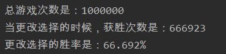

---
title: 蒙提霍尔问题
date: 2021-03-30 12:14:34
summary: 本文介绍计算机的基本组成、发展历程、国际标准组织。
mathjax: true
tags:
- 概率论
categories:
- 计算机科学的数学基础
---

# 三门问题

三门问题（Monty Hall problem）亦称为蒙提霍尔问题、蒙特霍问题、蒙提霍尔悖论，大致出自美国的电视游戏节目Let's Make a Deal。问题名字来自该节目的主持人蒙提·霍尔（Monty Hall）。参赛者会看见三扇关闭了的门，其中一扇的后面有一辆汽车，选中后面有车的那扇门可赢得该汽车，另外两扇门后面则各藏有一只山羊。当参赛者选定了一扇门，但未去开启它的时候，节目主持人开启剩下两扇门的其中一扇，露出其中一只山羊。主持人其后会问参赛者要不要换另一扇仍然关上的门。问题是：换另一扇门会否增加参赛者赢得汽车的机率？如果严格按照上述的条件，即主持人清楚地知道，自己打开的那扇门后是羊，那么答案是会。不换门的话，赢得汽车的几率是$\frac{1}{3}$。换门的话，赢得汽车的几率是$\frac{2}{3}$。

这个问题亦被叫做蒙提霍尔悖论：虽然该问题的答案在逻辑上并不自相矛盾，但十分违反直觉。这问题曾引起一阵热烈的讨论。

# Java模拟

这次也不能说是什么编程实现了，只能说做个随机化模拟吧，把数据量开的大一些，就$1000000$吧，问题不大。

这个模拟的思路就是我们用一个Set，装$0$、$1$、$2$三个数字，模拟三扇门，然后先随机生成一下$0\sim{2}$之间的一个随机数（也就是真正的汽车所在位置）。
接下来我们随机生成一个参赛者的选择（他没有任何场外信息，只能三猜一），由于我们模拟的是选手更改选择的情况，所以这个就没什么意义了，那就删去它。
然后还要随机生成一个主持人打开的门。主持人显然是知道车在哪里的，不论被没被参赛者第一次选中，主持人都只会打开一扇空门（也就是藏有山羊的门）。这个随机序号不能与真正的结果重合，也不能与选手选中的序号重合（这两种情况也可能重合）。这个序列也删去它。
一共只有三个数，删了两个，就只剩一个了。我们做的模拟是选手选择换门，所以剩下的门就是他选的答案，看一看与最初的随机答案一不一致就行。

最后概率竟是$\frac{2}{3}$。

```java
import java.util.HashSet;
import java.util.Random;
import java.util.Set;

public class Main {
    public static void main(String[] args) {
        int times = 1000000;
        int winNum = 0;
        Set<Integer> set = new HashSet<>();
        Random random = new Random();
        for (int i = 0; i < times; i++) {
            set.add(0);
            set.add(1);
            set.add(2);
            // 车在随机一个门后面
            int result = random.nextInt(3);
            // 从三个门里面猜一个门
            int guessNum = random.nextInt(3);
            // 剔除选项
            set.remove(guessNum);
            int removeNum = 3;
            while (removeNum == result || removeNum == guessNum) {
                removeNum = random.nextInt(3);
            }
            // 主持人再删一个
            set.remove(removeNum);
            if (set.contains(result)) {
                winNum++;
            }
        }
        System.out.println("总游戏次数是：" + times);
        System.out.println("当更改选择的时候，获胜次数是：" + winNum);
        System.out.printf("更改选择的胜率是：%.3f%%", (double)winNum/times*100);
    }
}
```

一则结果：



# 原理分析

不能只是知其然，更要知其所以然。
这个问题的分析还要回归到概率论上。

## 简易分析

先给一个不规范的分析，更好理解：
试想原先三蒙一，概率确实是$\frac{1}{3}$，但反过来考虑，不是第一次选中的概率是$\frac{2}{3}$，那在主持人帮我们排掉一个不可能情况的情况下，我们换成没人动过的门，成功的概率是$\frac{2}{3}$，是大于我们“坚持信仰”概率的。

## 详细分析

主持人其实没啥用，所以可以不看：
第一次选的空门（概率$\frac{2}{3}$），之后主持人开另一个空门，换门，得到汽车。
第一次选的汽车（概率$\frac{1}{3}$），之后主持人开另一个空门，不换门，得到汽车。

这里影响到结果的概率问题只发生在第一次选门上，如果条件如上设置，当一开始的门选定后，事件的结果也就决定了，所以这里不存在之后主持人是选择$1$号空门，还是$2$号空门的问题，所以在做概率计算是不考虑主持人的选择。

如果也要考虑主持人的话：
第一次选的空门$1$（概率$\frac{1}{3}$），之后主持人开另一个空门，换门，得到汽车。事件总概率$\frac{1}{3}$。
第一次选的空门$2$（概率$\frac{1}{3}$），之后主持人开另一个空门，换门，得到汽车。事件总概率$\frac{1}{3}$。
第一次选的汽车（概率$\frac{1}{3}$），之后主持人开另一个空门1（概率$\frac{1}{2}$），不换门，得到汽车 这个事件总概率。
第一次选的汽车（概率$\frac{1}{3}$），之后主持人开另一个空门2（概率$\frac{1}{2}$），不换门，得到汽车 这个事件总概率。
主持人选$1$号空门还是$2$号空门打开，这里有个主持人的选择概率，我假设的是主持人随机选择（抽签或者随意），所以各给了$\frac{1}{2}$的概率，如果主持人就是喜欢$1$号空门，必开$1$号，那么也就成了$1$号($100\%$)，$2$号($0\%$)了，最后结果并不影响。
所以开始选中汽车，最后换门不得奖的概率是$\frac{1}{3}$，开始选中空门，换门最后得奖的概率是$\frac{2}{3}$。

当然了，其实分析题意就知道主持人这边与概率根本没有关系，所以真的不必考虑他。
