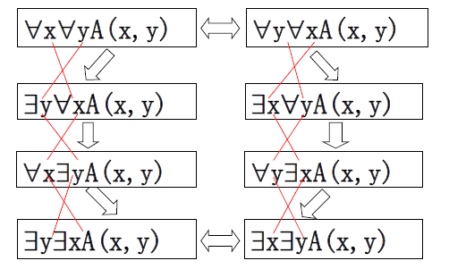

---
title: 谓词逻辑基础理论
date: 2021-02-10 15:01:34
summary: 本文分享谓词逻辑的相关内容。
mathjax: true
tags:
- 离散数学
categories:
- 计算机科学的数学基础
---

# 谓词逻辑

推荐阅读：[命题逻辑](https://blankspace.blog.csdn.net/article/details/113765513)

## 客体与客体变元

**客体**(个体)是能够独立存在的事物。客体可以是具体的事物，也可以是抽象的事物。客体通常用小写英文字母$a$、$b$、$c$、$...$表示。

用小写英文字母$x$、$y$、$z$、$...$表示任何客体，则称这些字母为**客体变元**。值得一提的是，客体变元本身不是客体。

## 谓词

**谓词**是用以表示客体的属性或者客体之间的关系的大写英文字母，字母右面有括号，括号内是若干个客体变元。
$n$元谓词是括号内有$n$个客体变元的谓词。
当命题函数$P(x_{1},x_{2},…,x_{n})$的$n=0$时，$n$元谓词即为$0$元谓词，表示不含有客体变元的谓词，它本身就是一个命题。

谓词本身并不是命题，只有谓词的括号内填入足够的客体，才变成命题。

## 命题函数

**命题函数**包括简单命题函数与复合命题函数。
**简单命题函数**是$n$元谓词$P(x_{1},x_{2},…,x_{n})$。
**复合命题函数**是将若干个简单命题函数用逻辑联结词联结起来构成的表达式。

## 论域

**论域**(个体域)是命题函数中客体变元的取值范围。
**全总个体域**是由所有客体构成的论域。全总个体域是“最大”的论域。
对于一个命题函数，如果没有给定论域，则假定该论域是全总个体域。

## 量词

**量词**是在命题中表示对客体数量化的词。
**存在量词**：记作$∃$，表示“有些”、“一些”、“某些”、“至少一个”等。
**全称量词**：记作$∀$，表示“每个”、“任何一个”、“一切”、“所有的”、“凡是”、“任意的”等。

量词后边要有一个客体变元，用以指明对哪个客体变元量化，称此客体变元是**量词后的指导变元**。

# 谓词公式

## 客体函数

客体函数与谓词是不同的，不可混淆。

例如：
- **所有的自然数都是整数。**
设$N(x)$：$x$是自然数，$I(x)$：$x$是整数
$∀x(N(x)→I(x))$
- **有些自然数是偶数。**
设$N(x)$：$x$是自然数，$E(x)$：$x$是偶数
$∃x(N(x)\wedge{E(x)})$
- **每个人都有一个生母。**
设$P(x)$：$x$是人，$M(x,y)$：$y$是$x$的生母
$∀x(P(x)→∃y(P(y)\wedge{M(x,y)}))$
- **如果x是奇数，则2x是偶数。**
设谓词$O(x)$：$x$是奇数，$E(x)$：$x$是偶数
设客体函数$g(x)=2x$
$∀x(O(x)→E(g(x)))$

从上面的例子中，我们不难发现：
- 客体函数是 **从论域到论域** 的映射。
- 谓词是 **从论域到$\{T, F\}$** 的映射。

## 谓词公式

称$n$元谓词$P(x_{1},x_{2},…,x_{n})$为**原子谓词公式**。

谓词合式公式(wff)，也称**谓词公式**，简称公式。

谓词公式的递归定义如下：
1. 原子谓词公式是合式公式。
2. 如果$A$是合式公式，则$¬A$也是合式公式。
3. 如果$A$、$B$是合式公式，则$(A∧B)$、$(A∨B)$、$(A→B)$、$(A↔B)$都是合式公式。
4. 如果$A$是合式公式，$x$是$A$中的任何客体变元，则$∀xA$和$∃xA$也是合式公式。
5. 只有有限次地按规则$1$至$4$求得的公式才是合式公式。

为了方便，最外层括号可以省略，但是若量词后边有括号，则此括号不能省。说明：公式$∃x(A(x)→B(x))$中$∃x$后边的括号不是最外层括号，所以不可以省略。

在谓词公式中，量词的作用范围称之为量词的**作用域**，也叫量词的**辖域**。
一般地，如果量词后边只是一个原子谓词公式时，则该量词的辖域就是此原子谓词公式；如果量词后边是括号，则此括号所表示
的区域就是该量词的辖域；如果多个量词紧挨着出现，则后边的量词及其辖域就是前边量词的辖域。

## 自由变元与约束变元

如果客体变元x在$∀x$或者$∃x$的辖域内，则$x$在此辖域内约束出现，称$x$在此辖域内是**约束变元**。否则$x$在此辖域内自由出现，称x在此辖域内是**自由变元**。

对自由变元和约束变元的说明：
- 对约束变元用什么符号表示无关紧要。
- 一个谓词公式如果无自由变元，它就表示一个命题。
- 一个$n$元谓词$P(x_{1},x_{2},…,x_{n})$，若在前边添加$k$个量词，使其中的$k$个客体变元变成约束变元，则此$n$元谓词就变成了$n-k$元谓词。

在一个谓词公式中，如果某个客体变元既以约束变元形式出现，又以自由变元形式出现，或者同一个客体变元受多个量词的约束，就容易产生混淆。为了避免此现象发生，可以对客体变元更改名称。

约束变元的改名规则：
1. 对约束变元可以更改名称，量词后的指导变元以及该量词的辖域内此客体变元出现的各处同时换名。
2. 改名后用的客体变元名称，不能与该公式中其它客体变元名称相同。

自由变元的代入规则：
1. 对谓词公式中的自由变元可以作代入。代入时需要对公式中出现该变元的每一处，同时作代入。
2. 代入后的变元名称要与公式中的其它变元名称不同。

## 命题的符号化

在谓词演算中，命题的符号化比较复杂，命题的符号表达式与论域有关系。

命题的符号表达式与论域有关。当论域扩大时，需要添加用来表示客体特性的谓词，称此谓词为**特性谓词**。特性谓词往往就是给定命题中量词后边的那个名词。
如何添加特性谓词，这是个十分重要的问题，这与前边的量词有关。如果前边是全称量词，特性谓词后边是蕴含联结词$→$；如果前边是存在量词，特性谓词后边是合取联结词$∧$。

# 含有两个量词的谓词逻辑公式

1. $∀x∀yA(x,y)⇔∀y∀xA(x,y)$
2. $∀x∀yA(x,y)⇒∃y∀xA(x,y)$
3. $∃y∀xA(x,y)⇒∀x∃yA(x,y)$
4. $∀x∃yA(x,y)⇒∃y∃xA(x,y)$
5. $∀y∀xA(x,y)⇒∃x∀yA(x,y)$
6. $∃x∀yA(x,y)⇒∀y∃xA(x,y)$
7. $∀y∃xA(x,y)⇒∃x∃yA(x,y)$
8. $∃x∀∃A(x,y)⇔∃y∃xA(x,y)$

# 前束范式

如果一个谓词公式符合下面条件，它就是**前束范式**：
- 所有量词前面都没有联接词。
- 所有量词都在公式的左面。
- 所有量词的辖域都延伸到公式的末尾。

给定一个带有量词的谓词公式，前束范式的写法：
1. 为了便于量词辖域的扩充，消去公式中的联接词$→$和$↔$。
2. 如果量词前有$¬$，则用量词否定公式将$¬$后移。再用摩根定律或求公式的否定公式，将$¬$后移到原子谓词公式之前。
3. 为了便于量词辖域的扩充，用约束变元的改名规则或自由变元的代入规则对变元换名。
4. 用量词辖域扩充公式提取量词，使之成为前束范式形式。

**前束析取范式**是量词后的括号内是析取范式形式的前束范式。
**前束合取范式**是量词后的括号内是合取范式形式的前束范式。

# 谓词逻辑推理

可以从[命题逻辑推理](https://blankspace.blog.csdn.net/article/details/113765513)中引入推理规则$P$(引入前提规则)、推理规则$T$(引入结论规则)、推理规则$CP$(条件证明规则)。

新引入四种推理规则：
- 全称特指规则$US$ (Universal Specialization)
    - 形式： $∀xA(x)⇒A(c)$ (其中$c$是论域内指定客体)。
    - 含义：如果$∀xA(x)$为真，则在论域内任何指定客体$c$，都使得$A(c)$为真。
    - 作用：去掉全称量词。
    - 要求：$c$不是$A(x)$中的符号。
- 存在特指规则$ES$ (Existential Specialization)
    - 形式：$∃xA(x)⇒A(c)$ (其中$c$是论域内指定客体)。
    - 含义：如果$∃xA(x)$为真，则在论域内指定客体$c$，都使得$A(c)$为真。
    - 作用：去掉存在量词。
    - 要求：
        - $c$不是$A(x)$中的符号。
        - 用$ES$指定的客体$c$不应该是在此之前用$US$规则或者用$ES$规则所指定的客体$c$(即本次用$ES$特指客体$c$，不应该是以前特指的客体)。
- 存在推广规则$EG$ (Existential Generalization)
    - 形式：$A(c)⇒∃xA(x)$ (其中$c$是论域内指定客体)。
    - 含义：如果在论域内指定客体$c$使得$A(c)$为真，则$∃xA(x)$为真。
    - 作用：添加存在量词。
    - 要求：$x$不是$A(c)$中的符号。
- 全称推广规则$UG$ (Universal Generalization)
    - 形式：$A(c)⇒∀xA(x)$ (其中$c$是论域内任何指定客体)。
    - 含义：如果在论域内任何指定客体$c$都使得$A(c)$为真，则$∀xA(x)$为真。
    - 作用：添加全称量词。
    - 要求：
        - $x$不是$A(c)$中的符号。
        - $c$一定是任意的客体，否则不可全称推广。
