---
title: GUI设计指南
date: 2021-02-19 21:26:57
summary: 本文分享一些GUI设计的基础知识。
tags:
- 人机交互
- 软件工程
categories:
- 软件工程
---

# GUI设计指南

- 用户控制式
    - 用户控制式是主要的GUI指南。
    - 也称非母亲式原理：程序不应该像母亲一样为你做事，即用户启动行为。
    - 如果程序取得控制权，则用户也要获得必要的反馈。
    - 程序的执行可以将控制返回给同一个或另一个窗口，它也可以调用另一个SQL模块或调用一个外部程序。
- 一致性
    - 意思是遵循标准和做事情的常规方式。
    - 应该符合GUI供应商的标准。
    - 同一个程序内不同界面的风格应保持一致。
    - 应该符合组织内部开发的命名、编码和其他与GUI相关的标准。
    - 界面设计不需要有太多的创造力和创新意识。
    - 命名、编码、缩写及其他内部标准的一致性也不能低估。
- 个性化和客户化
    - $Personalization + Customization = Adaptability$
    - 个性化和客户化是两个相互关联的指导方针。
    - 个性化是为个人使用的简单化。
    - 客户化是按不同的用户组对软件进行剪裁的管理任务。
    - 应用程序应通过查询程序所在的操作系统来适应用户现场（如用户的口语语言、字符集、货币和日期格式等）。
- 宽容
    - 一个好的界面应该以一种宽容的态度允许用户进行实验和出错，宽容鼓励用户探索，允许用户选择错误的路径，并能在需要的时候能回滚到开始点。
    - 宽容隐含了多级取消操作。
    - 宽容型界面应该警告用户某些行为的后果。
- 反馈
    - 反馈由用户控制式指南派生出来的。
    - 开发者应该在系统中为每个用户事件建立视听提示。
    - 通常可以使用一个沙漏或者一个等待指示器等以提供足够的反馈，某些情况可能需要显示说明信息等更为生动的反馈形式。
    - 开发者决不能假设应用程序执行的很快而反馈成为不必要的东西。
- 审美和可用性
    - 审美是系统视觉上的吸引力。
    - 可用性是与使用界面有关的方便性、简单性、有效性、可靠性和生产率。
    - 审美和可用性都关乎用户满意度。
    - 简单即是美，分治可能会获得简单性。

# 桌面GUI设计

## 主窗口

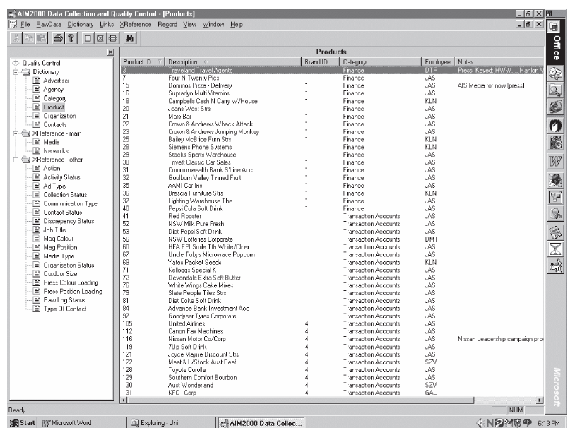

主窗口有一个边界（框架），框架包含窗口的标题栏、菜单栏、工具栏、状态栏以及窗体上可浏览或修改的内容区。

窗体可浏览和修改的内容可以组织成窗格。

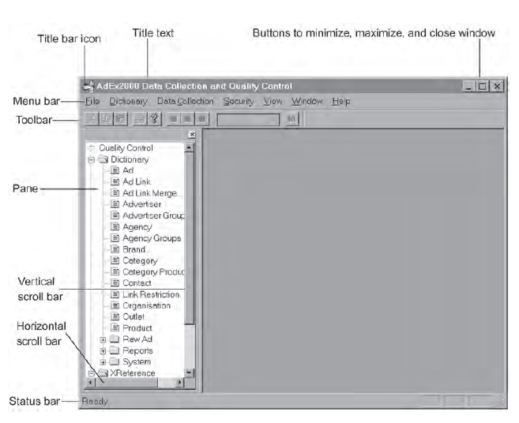

### 行浏览器

用户可以用垂直滚动条或键盘上的键向上向下浏览记录。

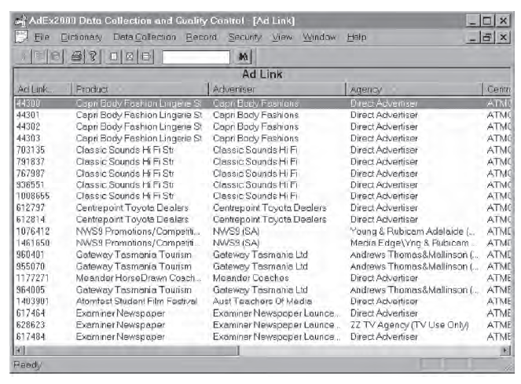

任何特定的时刻，浏览器中只有一行记录是活动的，在此活动记录上双击，一般会显示具有该记录详细信息的编辑窗口，此编辑窗口允许修改记录的内容。

可以用窗格在水平方向、垂直方向或者同时在两个方向上对窗口进行划分。

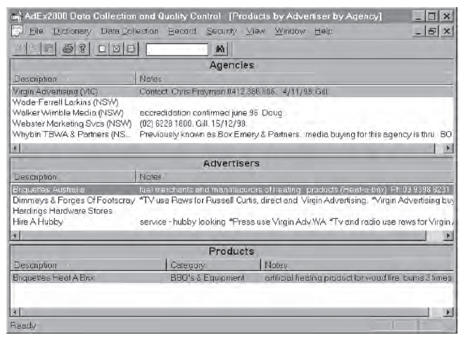

### 树型浏览器

树形浏览器用锯齿状的列表显示相关的记录，这个列表包含控件，允许展开或折叠树。

与航浏览器不同的是，树形浏览器允许在当前位置上修改，即它不用激活编辑窗口就可以修改窗口的内容，树形浏览器的修改通过拖拽操作完成。

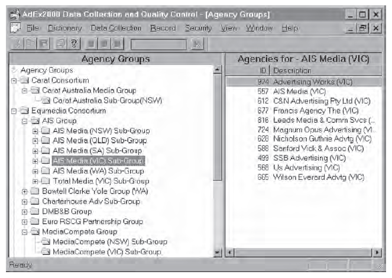

## 辅窗口

辅窗口忽略一些不重要的IS应用，对主窗口起补充的作用。

主窗口区别于辅窗口的一个典型特征是：主窗口有菜单栏和工具栏，而辅窗口没有。

相对于主窗口来说，辅窗口通常是[模态](https://blankspace.blog.csdn.net/article/details/105438466)的。用户在于其他的应用窗口交互之前必须相应并关闭辅窗口。

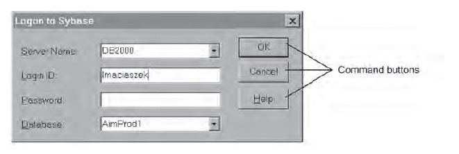

辅窗口可以采取各种形式和形状：
- 对话框
- 标签夹
- 下拉列表
- 消息框

### 对话框

对话框和辅窗口几乎是同义的，“对话”表示用户要输入的将在应用程序中考虑的信息。

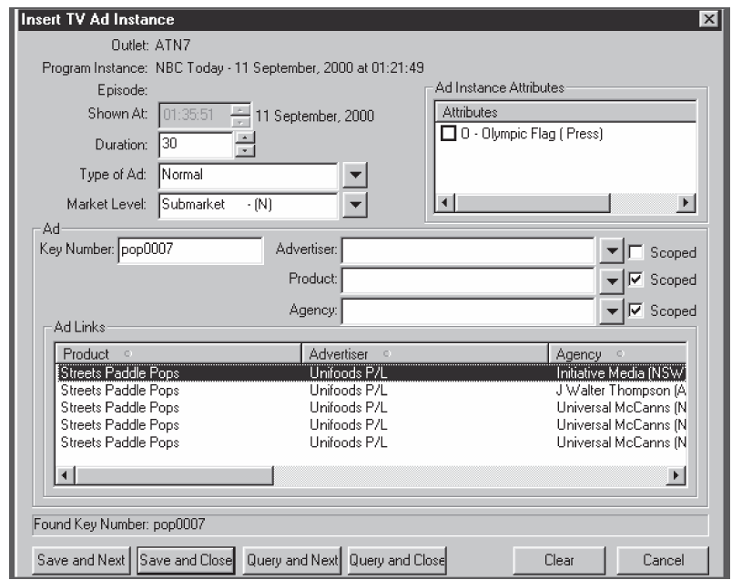

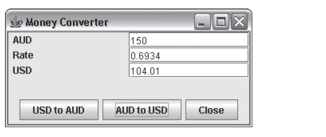

### 标签夹

当要在辅窗口中显示的信息数量超出了窗口的实际区域，并且信息的主题可以依据逻辑划分为信息组时，就可以用到标签夹。

任何时刻，标签页顶的标签信息的可见的。

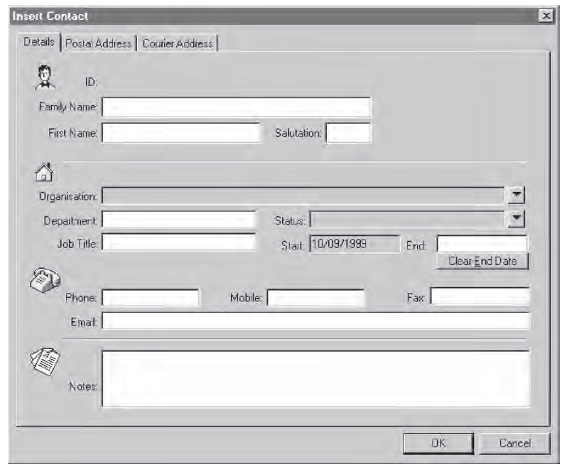

### 下拉列表

在某些情况下，下拉列表可以方便地代替标签页。

下拉列表提供了一个有候选值的选择列表，用户可以从中选择一个合适的选项。

对于插入操作，用户可以键入一个新值，下次打开下拉列表时，这个新值就被加进去了。

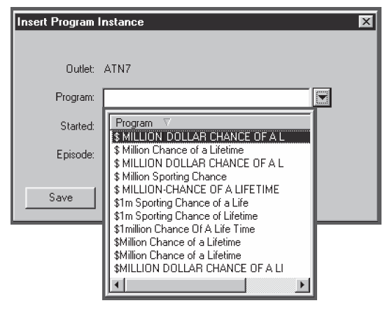

### 消息框

消息框是一个向用户显示消息的辅窗口。

消息可以是一条警告信息、一条解释、一个异常条件等。

消息框中的命令按钮给用户提供一个或多个回复选择。

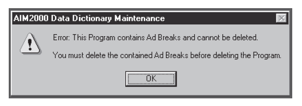

## 菜单和工具栏

菜单项被组织到列表中，列表通过下拉、级联或弹出（鼠标右键激活）动作打开。

菜单项有责任响应用户事件并做一些处理。
通常，菜单项通过鼠标点击触发事件，常用的菜单项可能还有快捷键，快捷键使得可以在不打开菜单列表的情况下从键盘触发菜单项。
在打开菜单项的情况下，通过菜单项首字母（带下划线）可以更快地使用菜单项。

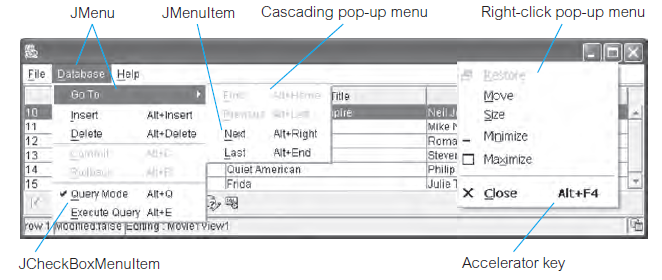

从菜单列表选择和使用快捷键仍然不是激活菜单动作的最有效方式。对于最常用的菜单项，GUI设计者必须提供工具栏按钮。

工具栏包含动作和控件，它们重复最常用的菜单项的功能。

工具栏可以放在窗口框架上的固定位置，也可以从框架中浮动出一个小的分离的窗口，并停放在屏幕上的任何地方。

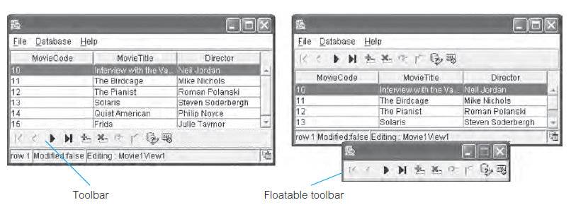

## 按钮及其他控件

菜单和工具栏是在用户界面中实现事件处理的表现形式，类似的事件处理表现形式由GUI控件提供。

控件被设计为拦截、理解和实现用户事件。

控件可分为以下类别：
- 动作按钮
- 其他控件

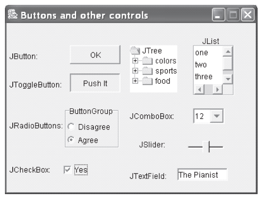

# Web应用GUI设计

## Web应用程序

Web应用程序是一种允许用户在Internet浏览器执行业务逻辑的Web（分布式C/S）系统，业务逻辑可以放在服务器和/或客户端。

当一个网页作为Web应用程序的入口时，可以将其看成是一种特殊的主窗口。

Web应用系统中的用户事件是通过菜单项、动作按钮、超链接实现的。

一个网页链接到其他网页的方式：
- 网页标题下的菜单栏
- 菜单栏下面的面包屑区域
- 左边和右边的菜单面板

## Web应用系统的使能技术

使能技术（Enabling Technology）是指一项或一系列的、应用面广、具有多学科特性、为完成任务，而实现目标的技术。

维基百科对使能技术的定义是：使能技术是指能够对用户的能力或文化产生根本性变化的发明或创新，其最明显的特征是一般会在不同领域快速形成衍生技术。

大多数Web应用系统的核心使能技术是Web服务器，它给浏览器提供网页，维护着应用系统的状态以跟踪在线用户的动作。

Cookie是应用服务器监控用户状态的一种简单技术。

Script和Applet用于创建动态的客户端页面，Script是一个由浏览器解释执行的程序，Applet是一个编译好的在浏览器沙盒环境中执行的组件。

服务器页中的脚本使用标准数据访问库，典型的使能技术包括ODBC、JDBC、RDO、ADO等。

Web服务器的使能技术一般有HTML、ASP、JSP等。

网页使能技术一般有客户端脚本、XML文档、JavaApplet、JavaBean、ActiveX控件等。

客户端通过HTTP从服务器获得网页，页面可以包含脚本，或是已经编译好的可执行的DLL模块，如ISAPI、NSAPI、CGI、Servlet等。

部署体系结构支持更先进的Web应用系统，包括四个层次的计算节点：
- 浏览器客户端：在客户端运行浏览器外的应用代码（脚本或小程序）。
- Web服务器：处理来自浏览器的页面请求，并动态生成页面和要在客户端执行和显示的代码。
- 应用服务器：在系统实现涉及分布式对象时，应用服务器不可或缺，它处理业务逻辑。
- 数据库服务器：业务构件封装存储在数据库中的持久数据。

## 内容设计

内容设计的目标：
- 如何将网站或Web应用系统的可视内容展现在用户的Web浏览器上。
- 设计必须具更具有适应性，并考虑到不同用户的需要、兴趣、技能和偏好。

Web应用系统是一个包含部分或全部未确定页面内容的网站。

静态网页和动态网页之间的区别原语Web服务器和应用服务器之间的区别。
Web服务器管理管理静态网页，而应用服务器管理动态网页。

表单在页面显示信息给用户，允许输入数据或发送信息组合给服务器处理并显示结果。

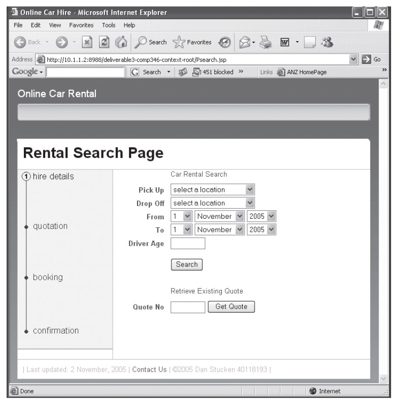

## 导航设计

导航风格依据Web应用系统的复杂性不同而不同。

### 菜单和链接

菜单和链接网页之间导航的两个主要工具。

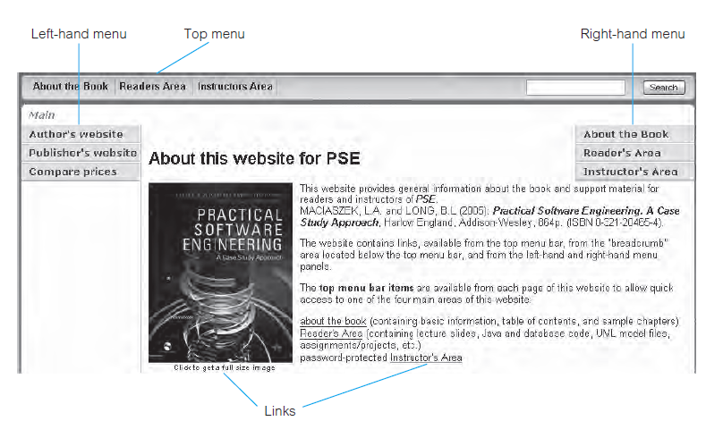

菜单和链接具有类似的功效（指用户期望GUI项具有的行为），链接的功效是进入另一个页面，菜单的功效也是移动到另一个页面，但偶尔菜单项可以在呈现另一个页面时做一些附加的处理。
菜单可以分层，一些菜单可以进入一个新的页面，另一些则是展示一个子菜单的下拉列表。

菜单可以分为：
- 顶部菜单用于整个网站的导航。
- 左手菜单用于导航到达网站控制以外的网页。
- 右手菜单用于显示网站范围内的网页。

### 面包屑和导航面板

面包屑和导航面板提供了当前页所在位置的可视化，并用于导航到此页。

面包屑区域通常放在页面的顶部，刚好在顶部菜单下面。该区域由一组超链接标签组成，用于告诉用户它们的当前位置。导航项随用户在页面之间的导航而改变。通常情况下，它们还允许用户后退到以前访问过的页面。

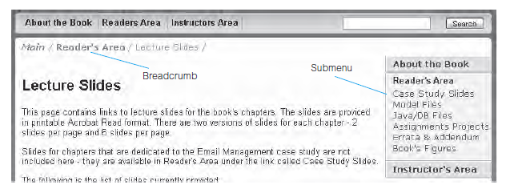

导航面板显示了一个工作流程的所有步骤，且除非取消工作，否则不允许返回以前的步骤。
导航面板在页面上的位置取决于设计师的判断，有可能不再页面的顶端。

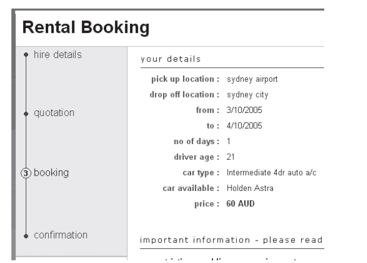

### 按钮

在Web应用系统中，按钮是调动动作的主要工具，而菜单项只用于导航目的。
按钮的功效是按下之后做一些事情。

按钮的设计原则如下：
- 如果按钮被放置在一个相关的按钮组中，且它们的文字数量没有明显不同，则它们的大小相同。
- 把它们一起放在页面的按钮区域上，与输入数据的区域分开。
- 如果网页比窗口长，则在顶部和底部重复放置相同的按钮。
- 谨慎放到框架标签上，区分应用于个别标签的动作和应用于整个框架标签的动作。
- 编程时忽略不耐心用户的多次点击。
- 准确命名以显示将触发的动作（某些动作会保存在数据库，而某些只是暂时保存，用户可以撤销）。
