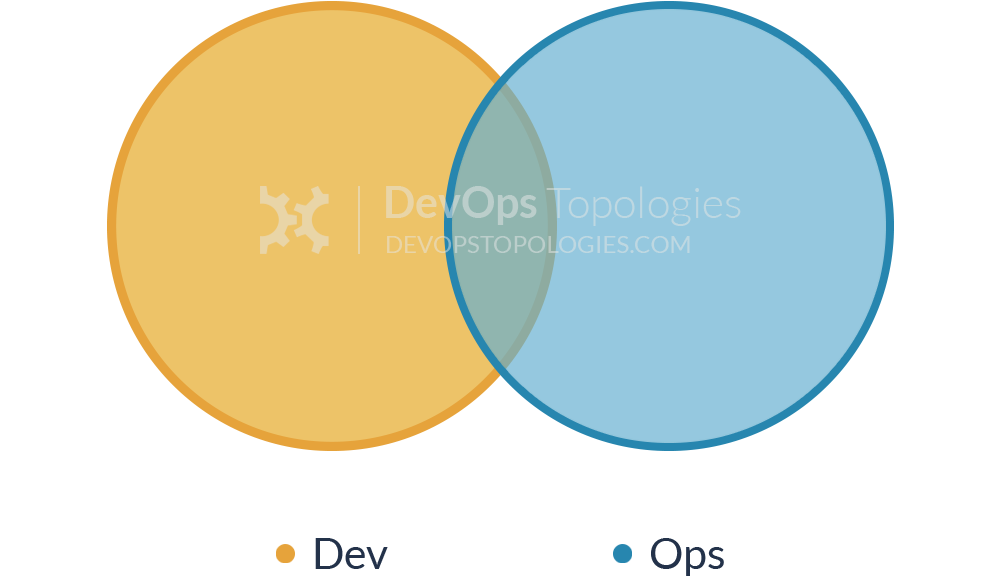
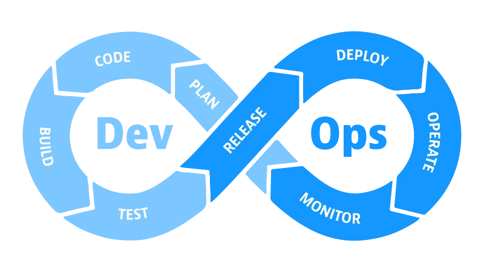
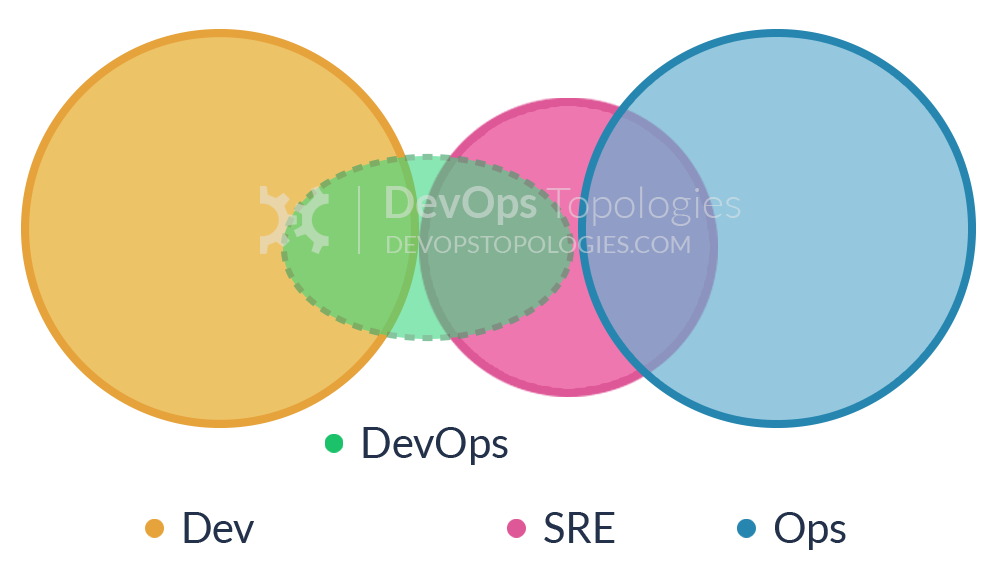

---
title: Oncall
date: 2023-02-04 14:05:35
summary: 本文从DevOps讨论到SRE，最后分享一些Oncall的相关内容。
tags:
- 软件工程
- DevOps
categories:
- 软件工程
---

# DevOps

从字面上，Development代表开发，Operations代表运维，但DevOps并不仅仅代表开发和运维的结合。

DevOps的核心是一套软件开发和交付的理念，它强调产品管理、软件开发和运维(或系统管理员)团队之间的沟通和协作，并且需要与业务目标紧密结合。

DevOps通过软件集成、软件测试、软件部署、基础设施变更等流程的自动化和实时性监控，建立一种实践方法，让开发者更快、更频繁、更可靠地构建、测试、发布软件。

DevOps的出现是由于软件组织越来越意识到如果要在保证质量的前提下尽可能地缩短产品交付的时间，开发和运维工作必须紧密结合。Devops软件开发模型如下图所示：

Devops涵盖了需求计划、开发、构建、测试、发布、运维等多个阶段，是敏捷开发的延续和精进，在敏捷开发的基础上进行了拓展和完善，增加了持续集成、部署和运维的流程，确保整个系统的稳定性，而并非局限于某个开发阶段。

DevOps实践主要体现在三个方面：
- 开发方法：主要是使用了哪种开发方法，开发过程中是否进行持续的项目计划和管理，主要涉及工作流中计划和编码两项工作，目前敏捷方法因为与DevOps在自动构建、自动测试、持续集成与持续交付等方面保持具备一致性而被广泛推荐和使用。
- 自动化：通过自动化构建、测试、发布、部署和运维实现持续集成和测试、持续交付和部署，打造自动化的交付流水线。
- 质量保证：在代码提交后进行集成和自动化测试，及时发现问题和缺陷，并在捕获错误时触发代码回滚。这是实现质量保证的有效的自动化机制。通过可视化将项目数据直观地呈现出来，加强软件开发人员、质量保障人员和运维人员的沟通合作。

# SRE

通常，一个SRE团队会负责可用性、延迟、性能、效率、变更管理、监控、紧急响应、容量规划等内容。

推荐阅读：[The Site Reliability Workbook](https://sre.google/workbook/table-of-contents/)

对于Google，SRE团队的每个工程师最多只负责50%的运维工作，其余时间都应该花在设计和构建各种自动化系统和配置工具上。

SRE支持三种有效的监控输出：
- 报警：故障正在发生时，必须有人立刻来改善情况和解决问题。
- 投票：需要一段时间内由人做出操作。
- 日志：可以用来进行诊断或取证。

随着DevOps、SRE的发展，开发人员已经不仅仅承担开发责任，还要和运维人员共享责任。开发人员应该努力保证代码的可持续测试能力和可观察能力。

# Oncall

Oncall(随叫随到)意味着在设定的时间段内可用，并准备好以适当的紧急程度响应该时间段内的生产事件。SRE工程师通常需要参加Oncall的轮换。在值班期间，SRE 会根据需要诊断、缓解、修复或升级事件。此外，SRE定期负责非紧急生产职责。

根据团队和业务系统所有者商定的寻呼响应时间，当值班时，工程师可以在几分钟内对生产系统执行操作。对于面向用户或时间要求严格的服务，5分钟内应该响应；对于时间敏感度较低的系统，30分钟内应该响应。Google拥有灵活的警报传递系统，可以通过多种机制（电子邮件、短信、机器人呼叫、应用程序）跨多个设备发送通知。

Oncall流程存在的价值主要有如下几点：
- 保障线上服务的稳定性，及时处理线上问题。
- 后端开发工程师可以通过Oncall来熟悉线上各系统的DevOps流程。
- Oncall工程师通过排查线上问题，来增加对系统的了解以及问题分析的能力。
- Oncall工作本身是有一定压力的，所以需要大家一起来分担。

Oncall工程师的主要职责：
- 负责组内API服务的发布。
- 负责核心系统监控指标的巡查，特别是每天的高峰期需要在线值守。
- 通过监控报警主动发现线上问题或者故障。
- 负责推进处理紧急的线上报警、bug和故障。
