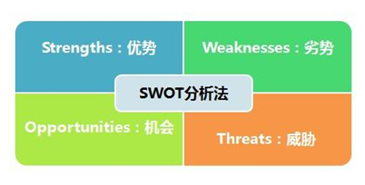
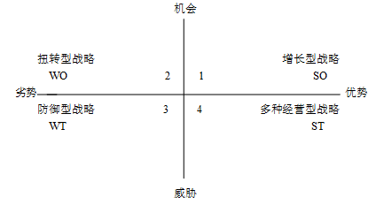
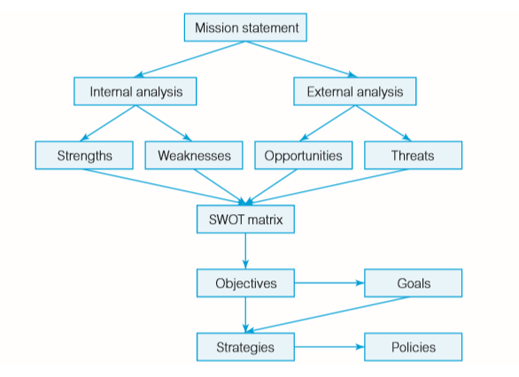

---
title: SWOT方法
date: 2020-09-26 21:11:58
summary: 本文分享用于信息系统规划的SWOT方法，涉及一些管理学的内容，也与软件工程息息相关。
tags:
- 软件工程
categories:
- 软件工程
---

# SWOT

开展外部环境分析时，许多企业通常在对上述四大环境进行分析的基础上积极开展SWOT分析。
具体内容可以看：[百度百科——SWOT分析法](https://baike.baidu.com/item/SWOT%E5%88%86%E6%9E%90%E6%B3%95)

# IS 与 SWOT

而对于IS（Information System）来说，SWOT方法以调整组织的优势、劣势、机会和威胁的方式来进行IS开发项目的识别、分类、排序和选择。这是一个从确定组织使命开始的、自顶向下的方法。

SWOT矩阵定义了组织在市场中的位置，并将组织的能力与组织所处的竞争环境相匹配，下图显示了SWOT分析中涉及的概念之间的关系和派生规则：

名词翻译：
- Mission statement：使命陈述
- Internal analysis：内部分析
- External analysis：外部分析
- Strengths：优势
- Weaknesses：劣势
- Opportunities：机会
- Threats：威胁
- SWOT matrix：SWOT矩阵
- Objectives：目标
- Goals：目标
- Strategies：策略
- Policies：政策

使命陈述抓住了组织的独特特征，并明确了其对未来的愿景。在良好的使命声明中，重点放在客户的需求上，而不是组织交付的产品或服务。

使命陈述和据此制定的业务战略考虑了公司在管理、生产、人力资源、财务、市场营销和研发等方面的内部优势和劣势。这些优点和缺点必须得到认可、同意并确定优先次序。一个成功的组织对指导其业务战略发展的当前优缺点有很好的了解。

下面是优势的示例：
- 品牌和专利的所有权
- 在客户和供应商中享有良好声誉和口碑
- 资源或技术的专有权
- 由于产量、专有技术、专有权或合伙关系而具有的成本优势

劣势通常是潜在优势的缺乏，下面是劣势的示例：
- 现金流量不可靠
- 工作人员的技能基础较差，过于依赖一些关键员工
- 欠佳的营业地点
 
识别公司内部的优势和劣势是成功进行业务计划的必要不充分条件。一个组织不能凭空运作——它依赖于外部经济、社会、政治和技术因素。组织必须了解可利用的外部机会和可避免的外部威胁。这些是组织无法控制的因素，但是对它们的了解对于确定组织的目标至关重要。

下面是机会的示例：
- 新的、限制性较小的法规，消除贸易壁垒
- 战略联盟、合资或合并
- 作为新市场的互联网
- 竞争对手的溃败以及由此导致的市场开放

对环境的任何潜在负面影响的改变都是威胁，下面是威胁的示例：
- 与竞争对手进行价格战的潜在性
- 技术变化超出了它们的吸收能力
- 产品或服务上新的税收壁垒

组织在任何指定时间内都追求一个或几个极少量的长远目标。目标通常是长期的（三至五年），甚至是“永恒的”。目标的典型示例是提高客户满意度、引入新服务、应对竞争威胁或增强对供应商的控制。每个战略目标都必须与具体目标相关联，通常表示为年度目标。例如，“提高客户满意度”这一目标可以得到更快（譬如两周之内）实现客户订单的目标的支持。

目标和目的要求管理策略和实施这些策略的具体政策。这种管理手段将调整组织结构，分配资源并确定包括信息系统在内的发展项目，包括IS。
