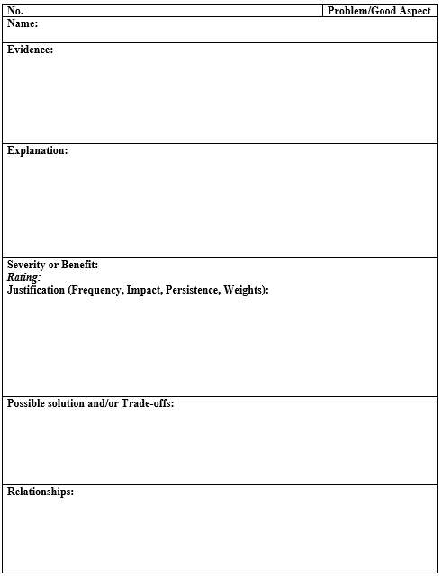

---
title: UAR报告
date: 2023-03-23 14:59:06
summary: 本文分享UAR报告的写法。
tags:
- 人机交互
- 软件工程
categories:
- 软件工程
---

# UAR首页

| 产品名称： \<或研究对象\> |
|:----|
| 研究日期： \<运行的时刻\> |
| 实验者姓名：  \<实验者的姓名\> |
| 主题ID： \<主题的匿名标识符，通常为数字，不适用于HE\> |

# UAR内容

| 编号： \<HE/UE + 唯一编号\> (HE=启发式评估; UE=用户评估) |
|:----|
| \<Problem/Good Aspect\> |
| 名称： \<对于问题/好的方面的简洁但具有描述性和独特性的名称\> |
| 证据： \<对于启发式评估，请列出启发式的名称(例如“一致性”)\> |
| 界面方面： \<问题出在哪里。包括有关交互的相关事实。除了交互事实以外，图片几乎是必需的，且通常比文字效果好，除非您非常熟练地提供单词图片\> |
| 说明： \<对界面方面的坏处的解释。对于启发式分析，请对启发式如何被满足/违反进行解释。如果应用启发式涉及对用户的猜想（如用户熟悉/不熟悉的事情），包括主张和支持这些主张的任何证据/理由。陈述恰当的例子如“ [专家/新手]用户可能…因为…”、或“用户不太可能…因为…”等等\> |
问题的严重性 / 良好特性的好处:
评分: <数字 + 描述 采用 Nielson's ratings：0 = 没问题：我完全不同意这是一个可用性 (usability) 问题；1 = 仅外观 (cosmetic) 问题：无需解决，除非该项目有额外的时间；2 = 较小的 (minor) 可用性问题：应以低优先级解决该问题；3 = 重大的 (major) 可用性问题：很重要，应以高优先级解决该问题；4 = 可用性灾难 (catastrophe)：必须在产品发布前接近该问题\> 合理的说明： 频率(frequency)：\<常见还是罕见? 为什么?多少用户 (新用户new、临时用户casual、高级用户experienced)可能遇到问题? 为什么? 这是大多数用户、一些用户、极少用户可能会想做的事吗? 为什么?\> 影响(impact)：\<对用户来说克服 (overcome) 它容易还是困难? 为什么? 若用户不太可能实现目标或可能浪费大量时间，是否难以克服\> 持久性(persistence)：\<问题是一次性的 (无论多难检测和克服，只要用户明白就能克服的问题) 还是会反复困扰的? 为什么? (若用户无法检测并克服的问题即为持久的问题)\> 为以上因素设定权重(weights)： \<提供以下所有方面的评估和论证来使评分合理：频率、影响、持久性、以及如何在总体严重程度评分中为这些因素设定权重。例如，一个相对罕见、易于克服、持久性低的问题可以评为2分(较小的可用性问题); 一个低频发生但很关键的问题 (如无法进行保存) 尽管发生频率低，也可以被评为高严重程度。如果这是一个好的方面, 则评分为 “NA”，但需描述其能给用户带来的好处\> |
| 可能的解决方案 (solution) 和 / 或 折衷 (trade-off)： \<如果是问题，请提出一个可能的解决方案。 必须包含折衷以确保可信度。果想不到一些不好的折衷，如实说明即可。 如果是好的方面, 折衷也是适当的\> |
| 关系： \<交叉引用其他相关的UAR (如果有) ，包含编号和名称. 如果与其他UAR关系不明显, 给出将其列在这里的理由 (因为…)\> |

## UAR标识符

UAR标识符应该是一个唯一的标识符，以便归档。

如果不止一个人在项目中工作或使用了不止一种分析技术，则此标识符可以包含字母和数字。

如果报告涉及到界面的可用性问题，则在唯一标识符后面加上“问题”，如果报告描述了界面的某个方面，则在重新设计时应保留“良好特性”。

## 问题的严重性或良好特性的好处

需要评估者进行推理：该问题或良好特性是多么重要，要么修复这个问题，要么保持这个良好的功能。

这包括用户体验这方面的频率，他们是否可能了解它的工作原理，它是否会影响新用户、临时用户、有经验的用户等。

## 可能的解决方案和潜在的权衡

这是提出解决办法的地方。不过，一旦发现问题，评估者不必给出解决方案。

# UAR模板

