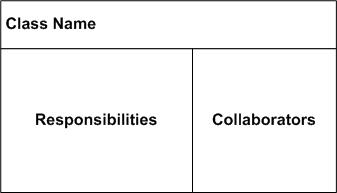
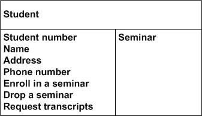

---
title: 发现类的方法
date: 2021-03-12 15:03:37
summary: 本文分享发现类的几种方法。
tags:
- 软件需求
- 软件工程
categories:
- 软件工程
---

# 发现类

指南：
- 系统中的每个类必须有清晰的目的陈述
- 每个类都是一组对象的模板描述
- 每个实体类必须拥有一组属性
- 每个类应该有区别于其他类的属性
- 类拥有一组操作

常用方法：
- 名词短语方法
- 公共类模式方法
- 用例驱动方法
- CRC方法
- 混合方法

# 名词短语方法

名词短语方法建议需求分析人员应该阅读需求文档中的陈述，从中寻找名词短语。每个名词都被认为是一个候选类，然后，将这些候选类分成3组：
- 相关类：相关类是指那些明显属于问题域的类，表示这些类名的名词在需求文档中频繁出现。另外，分析员能够从该应用领域的一般性知识中，从对相似系统、教科书、文档以及所拥有的软件包的研究中，来确认这些类的意义和目的。
- 无关类：无关类是指那些问题域之外的类，分析员无法明确地表达它们的目的。在有经验的实践者确定的候选类初始列表中，不太可能包含无关类。这样，识别和消除无关类的这个正式步骤就没有必要了。
- 模糊类：模糊类是指那些分析员还不能完全确定无疑地将其划归为相关类的类。它们是最大的问题，分析员要对它们做进一步的分析。要么将它们划为相关类，要么将它们作为无关类排除。这些类的最后分组结果正是类模型好与坏的区别所在。

名词短语方法看起来最简单最快捷，词汇工具支持在需求文档中搜索名词，但是过分依赖词汇表来挑选类可能具有欺骗性和不确定性。

# 公共类模式方法

公共类模式方法是根据通用的对象分类理论来导出候选类。分类理论是研究将对象世界划分成有用的组，以便更好地进行推理的相关科学的一部分。

一种发现候选类的模式：
- 概念类：概念是被绝大多数人认可并共享的一个想法。
- 组织类，组织是任何形式的、有目的性的团体，或者是事物的集合。
- 人员类：人员在这里理解为系统中由人担任的角色，而不是实际的人。
- 地点类：地点是与信息系统相关的物理位置。

另一种发现候选类的模式：
- 物理类
- 业务类
- 逻辑类
- 应用类
- 计算机类
- 行为类

当公共类模式方法与其他某种方法相结合时，是一种具有吸引力的选择，但是单独使用不太可能产生完整的结果。该方法似乎失去了系统的参考点，需要与需求列表（名词短语方法）、用例组（用例驱动方法）或用户研讨会（CRC方法）联合使用。

# 用例驱动方法

用例驱动方法需要前期投入到用例的开发上，通过分析用例模型来发现类，将来自所有用例的类合并，从而得到最终的类清单。

此方法只会考虑用例直接需要的类。由于类模型严格与目前用例表示的系统功能相匹配，这可能会妨碍系统将来的演化。

# CRC方法

类-责任-协作(CRC)卡是用于设计面向对象软件的头脑风暴工具。通过CRC卡可以快速设计出多种替代交互，因为它们避免了大量的绘制和擦除。CRC卡会话之后可能会创建序列图以捕获已识别的交互。

在系统和软件开发的设计阶段经常使用CRC卡，以将用例描述转换为类图，从而允许更平滑的转换和更大的概览，并允许开发人员实施低绑定和高内聚的解决方案。

CRC卡通常由索引卡创建。头脑风暴会议的成员将为他们设计的每个相关类/对象写一张 CRC 卡。该卡分为三个区域：
- 在卡片的顶部，班级名称
- 左边，类的职责‘’
- 右侧，该类与之交互以履行其职责的协作者（其他类）

使用CRC卡可以最大限度地降低设计的复杂性，减少类的责任，并让设计人员专注于类的本质，而无需探索实现细节。因为这些卡片是便携式的，所以可以很容易地把它们放在桌子上，并在讨论设计时重新排列。

CRC方法是四种方法中最面向对象的方法，该方法识别那些用于实现所讨论业务场景的类，重点是类的行为，这可能导致发现主要的行为类（行为类与静态的信息类相对应），它也能确定每个类的属性内容。从这种意义上说，CRC方法处于较低的抽象水平上，可以同前面三种方法联合使用。

# 混合方法
发现类的实际过程中，不同时期可能采用不同的方法，常常涉及所有上述四种方法的要素。分析员全面的知识、经验和直觉也是作用因素。这个过程既不是自顶向下的也不是自底向上的，而是从中间出发。
