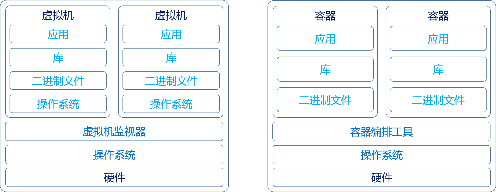
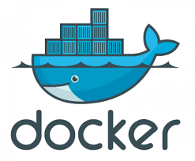
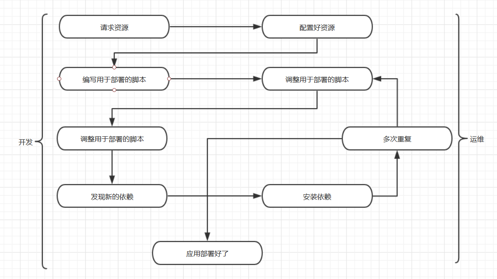
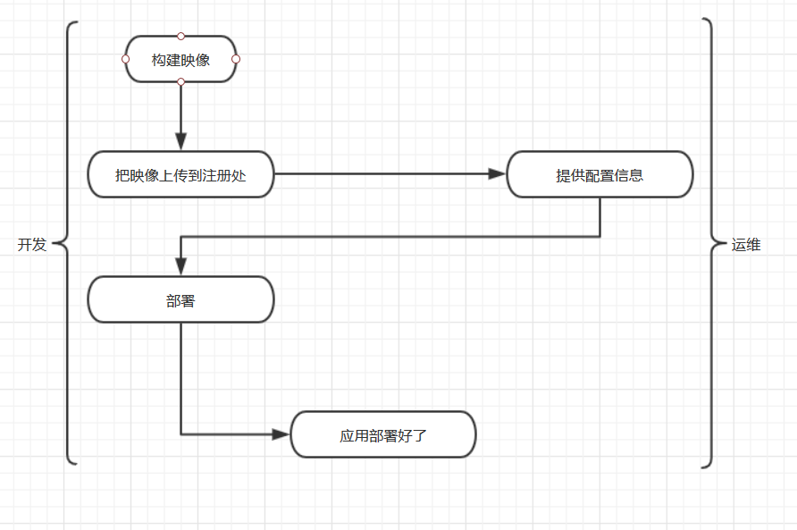

---
title: 容器技术
date: 2023-02-07 00:05:25
summary: 本文分享容器技术的相关内容。
tags:
- 软件工程
categories:
- 软件工程
---

# 容器

容器是操作系统虚拟化和进程隔离引出的概念。Docker不等价于容器，Docker只是实现容器化的一种技术。

容器和虚拟机的主要区别在于扩展性和可移植性：
- 容器通常以兆字节为度量单位。它们封装的内容大小不会超过一个应用及运行所需的所有文件，并且通常用于封装执行特定任务的单个任务(微服务)。容器因其轻量级特性及共享的操作系统，因此便于在多个环境之间移动。
- 虚拟机则一般以千兆字节为度量单位。它们通常包含自己的操作系统，因而能够一次执行多个资源密集型功能。由于虚拟机的可用资源大大增加，因此它们可以抽象、分离、复制和模拟整合服务器、操作系统、台式机、数据库和网络。

# 容器平台组件

一个经典的基于容器的部署平台应该包括：
- 容器技术：容器提供了操作系统级别的虚拟化，虽然一台机器上的所有容器都共享同一个操作系统内核，但每个容器都有独立的进程和网络命名空间用于分配和控制CPU和内存等资源的控制组(cgroup)、与底层主机rootfs不同的根文件系统。
- 容器调度器：容器调度器负责启动、停止和管理容器进程，通常使用Kubernates等。
- 存储：存储用来保存应用程序的数据，它可以是一个被映射到容器中的块存储，也可以是用来存储二进制或其他数据对象的对象存储，由容器调度器来管理。
- 网络：网络组件包括网络连接、路由器、防火墙和其他网络通信基础设施，由容器调度器来管理。
- 服务：由容器平台服务商托管的数据库和中间件服务。
- 持续交付服务：将代码从本地开发环境交付到生产环境的完整解决方案。

# 容器技术的利与弊

容器技术的核心优势是标准化的打包部署(容器镜像)和灵活执行。标准化的打包部署使得部署和运维平台变得更容易，因为容器镜像成为开发和运维之间新的抽象接口。只要可以在容器中打包代码，运维人员就可以在平台上运行它。

容器技术的主要问题：
- 隔离性问题：对于容器云主机，在特权模式下，用户可以设置云主机的任何内核参数，开启swap分区等等。但用户对内核态的操作同样会作用于宿主机以及宿主机上的其他云主机，导致一系列问题，影响宿主机及内核的稳定性，甚至宿主机宕机等。但如果关闭privileged权限，用户在云主机上的许多操作则受到限制，比如无法启动docker等。
- 系统环境丢失问题：对于容器云主机，在重启或者停止的时候，该容器会被删除，因此为避免系统盘环境丢失，需要先制作快照。虽然目前提供了一键快照重启，但是做快照需要耗费一定的时间。另外在云主机宿主机宕机或异常时，可能会导致云主机环境丢失。
- 镜像分发慢：对于容器云主机，尽管数据盘是远程挂载磁盘，但是用户在系统盘做了很多更改，做快照时会导致镜像变大。镜像变大会导致镜像分发慢，云主机启动慢。如果进行镜像压缩的话，虽然会使得镜像变小，但是使得docker无法复用之前的层级，会使得镜像分发时间更慢。

容器技术方兴未艾，新的研究成果和实践经验不断被提出，陡峭的学习路线是对开发人员提出了更高的要求。此外，一些过时的技术可能无法在容器中正常运行。

# Docker对业务流程的简化

Docker能简化业务流程，降低沟通成本。

下面用一个部署的过程来说明问题。

## 传统应用部署

一般来说，把应用部署到生产环境通常需要下面这几步：

 1. 应用开发者请求运维工程师提供资源。
 2. 运维工程师配置好资源以后，把资源交给开发者。
 3. 开发者编写用于部署的脚本和工具。
 4. 运维工程师和开发者一起反复调整部署工具。
 5. 开发者发现应用需要使用额外的依赖。
 6. 运维工程师安装额外的依赖。
 7. 多次重复第5步和第6步。
 8. 应用部署完毕。

由上图，根据开发的经验，把全新的应用部署到复杂的系统可能需要四五天的时间。这样的过程效率太低，就算开发运维人员不断练习，努力降低部署的难度，通常也需要投入很多精力，而且多个团队的人员之间要时常沟通。从专业角度看，这样的过程通常具有挑战性，而且浪费精力。更糟的是，这样的过程会降低开发团队日后的创新能力。如果部署软件很难、浪费时间、需要其他团队提供资源，开发者通常会吧所有东西都塞到现有的应用中，以此避免下次部署带来的痛苦。

## Docker应用部署

Docker的目标不是变成推送部署系统，不过Docker严格区分了各个团队的职责，能把依赖封装起来，这一样能提升效率。
Docker让开发者掌控一切，控制的粒度较细，连运行应用的操作系统发行版都能自行选择。
Docker公司推崇的是“功能内置但可换”的理念。也就是说，Docker公司希望推出的工具带有大多数人完成工作所需的各种功能，不过可以根据具体需求轻易更换各个功能模块。
Docker使用映像仓库作为中转站，把构建应用映像的职责与部署和操作容器的职责区分开了。
在实践中，这种处理方式意味着，开发团队可以连同应用的所有依赖一起构建应用，在开发环境和测试环境中运行以后，再把完全一样的应用和依赖构建包上传到生产环境。因为从外部看，所有构建包都一样，所以运维团队可以构建或安装标准的工具，用于部署和运行应用。

于是，Docker应用部署的流程是：

 1. 开发者构建Docker映像，然后将其上传到注册处。
 2. 运维工程师提供配置容器的详细信息，配置资源。
 3. 开发者部署应用。

这样的部署流程是可行的，因为使用Docker后所有的依赖问题都能在开发和测试的过程中发现。应用做好初次部署的准备之后，上述流程就完成了。而且，在这样的流程中不需要开发团队和运维团队多次交接工作。因此，使用这种流程部署更加简单，能节省很多时间。更好的一点是，在发布之前测试部署环境能让软件能健壮。

# Kubernates

Kubernates是流行的容器编排工具，最初由Google开发，用来部署容器化的应用程序，简称k8s。

Kubernates拥抱不可变基础设施，部署容器后无法通过登录和修改容器来改变容器的内容(Application)，只能部署新容器来改变容器的内容。

Kubernates的所有内容都通过声明方式来配置，开发人员和运维人员通过部署描述符和配置文件来指定系统的状态，中间步骤操作可以交给Kubernates操作。

pod是k8s中最小的部署单位，通常是一组容器。pod允许一个微服务应用程序与其他sidecar容器(提供日志、监控或通信管理之类的系统服务)组合在一起。pod中的容器共享一个文件系统和网络命名空间。即使只部署一个容器，它也会被部署在一个pod中。

k8s服务提供了负载均衡、命名和服务发现等功能，可以将各个微服务隔离开。服务由部署支持，负责维护一个pod运行所需的实例数量信息。k8s中，服务、部署和pod通过标签关联在一起。

Kubernates帮助处理容器中运行应用程序的许多困难，只需要声明应用程序如何由服务构成、服务组件的资源、在任何时刻应该运行的服务实例数量。
