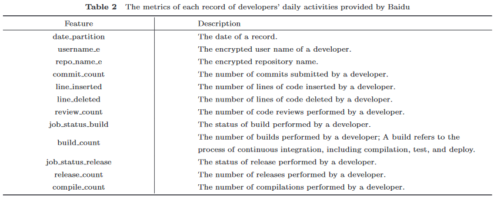
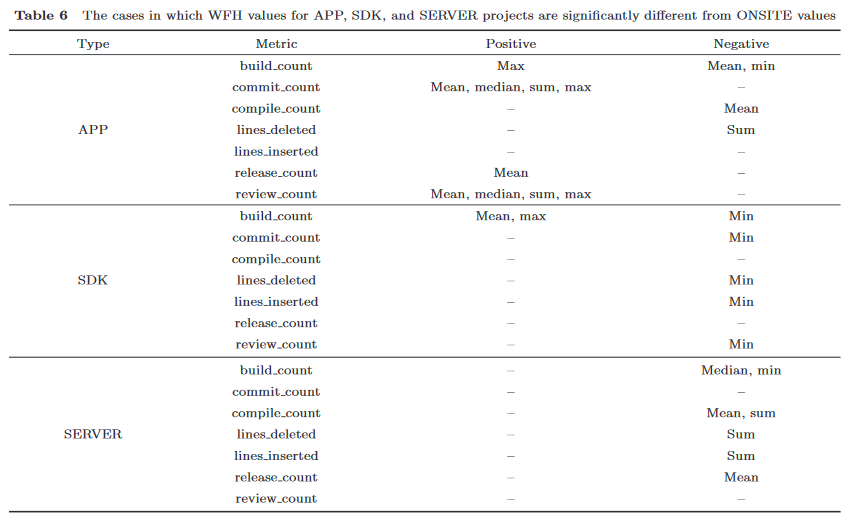
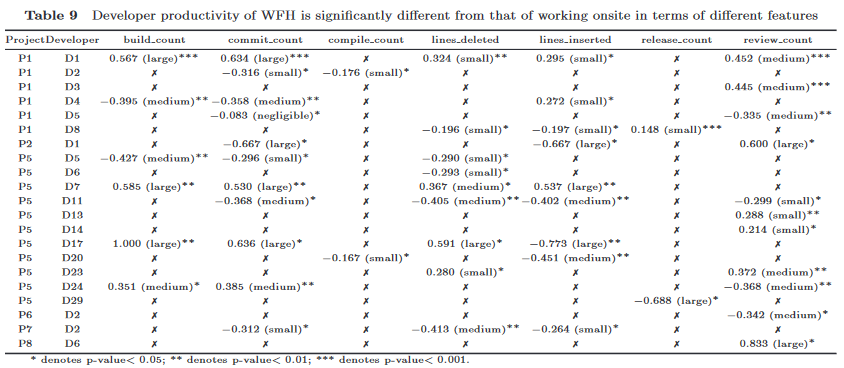

# 居家办公

WFH(Working From Home)是一种员工无需在中心位置工作的工作安排，可以翻译为在家工作、远程工作、远程办公或远程办公。虚拟专用网络、云计算和在线会议软件等许多工具促进了WFH，越来越多的公司允许员工WFH。

OWL实验室2018年的[一项调查](https://www.owllabs.com/state-of-remote-work/2018)显示，52%的员工每周至少在家工作一次，56%的公司允许远程工作。 WFH 可以为公司和员工提供一些好处，例如，当员工可以在家工作时，他们会感到更受信任，并且能够更好地平衡工作和生活责任(WLB)，这可以提高员工留存率，让他们工作地更快乐、更有效率。

WFH也被很多IT公司采用，例如2022年BBC的[一篇报道](https://www.bbc.com/news/technology-52628119)提到Twitter宣布员工可以永久继续WFH。开发人员在家中工作时，可以通过远程访问公司资源照常执行日常任务（例如，编写代码、调试、构建项目和代码审查）。

WFH可能会对生产效率产生不同的影响，这是软件开发组织的一个大问题。了解在家工作时开发人员生产力的差异及其背后的原因，有助于改善公司和项目的管理，提高开发人员的工作满意度，并使开发人员更有效率。 OWL实验室的调查报告称，每月至少远程工作一次的员工比不允许远程工作的员工在工作中更有效率的可能性要高24%。WFH也可能会对生产力产生负面影响，例如降低开发人员沟通的效率。

许多研究调查了WFH对生产效率的影响。然而，这些研究中的大多数使用基于一般工人（不仅是开发人员）的反馈的定性方法（例如调查或访谈）。此外，被研究的参与者通常不会长时间在家工作。

# 数据来源

本文的研究中，研究者们以定量的方式调查长时间WFH对开发人员生产力的影响。由于COVID-19的爆发，大量IT公司要求其员工WFH，这为研究者们提供了一个机会来研究如何长时间WFH会影响他们的工作效率。

在这项研究中，研究者们从百度公司收集了8个项目的107名开发人员在70个工作日内的开发活动数据，用来分析研究。

用作对比的数据分别称为2019年12月23日到2020年2月2日线下办公的DATA_ONSITE和2020年2月3日到2020年3月1日线上办公的DATA_ONSITE。

数据集中的每条记录都有一些个指标，代表一天内开发人员的活动。每条记录都有一个日期(date_partition)，据此报告开发人员的活动。由于百度的安全和隐私政策，记录中的开发者名称(username_e)和他们参演的项目(repo_name_e)被加密成唯一的ID。每条记录都有以下指标的数值：Git提交数(commit_count)、Git新增行数(line_inserted)、Git删除行数(line_deleted)、CodeReviews次数(review_count)、构建次数(build_count)、发布次数(release_count)、编译计数(compile_count)。由于百度的安全和隐私政策，上述数值需要进行标准化$z=\frac{X-\mu}{\sigma}$处理。指标数据的标准化处理不会影响指标的分布和此研究的结果。

此外，还有两个指标：开发人员执行的构建状态(job_status_build)、开发人员执行的发布状态(job_status_release)。这两个指标表示开发人员执行的build/release的状态。build/release的状态可能是success、failed、canceled、NULL四种枚举，研究者们认为success状态意味着开发人员当天的工作效率更高。

研究者们认为，尽管上述指标与开发人员的开发经验、所用编程语言和编程风格有关，但仍旧可以反映开发人员的开发效率。

开发人员参与的8个项目分别发起于2017年和2018年。8个项目分为3种类型：APP(客户端程序)、SERVER(Web服务端程序)、SDK(软件开发工具包)。8项目中，有4个项目采用C++开发，有4个项目采用Java开发。不同项目的参与人数也不同，项目P3最少，只有4位开发者，而项目P5最多，有53位开发者。

# 数据分析

## RQ1：开发人员WFH和ONSITE是否存在显著差异？

研究者们对数据集中的记录按天分组聚合，采用的聚合函数包括平均值(Mean)、中位数(Median)、和(Sum)、最大值(Max)、最小值(Min)。研究者们只考虑既有DATA_WFH也有DATA_ONSITE的记录的开发者。

由于数据经过标准化，数据指标甚至可能是负数取值，因此研究者们采用**小提琴图**(violin plots)来可视化WFH和ONSITE的指标分布。从这张图中可以看出，除了每天删除的代码行数(line_deleted)外，这些指标在开发人员WFH时的分布范围小于开发人员ONSITE时的分布范围。这表明**开发人员WFH时的工作效率可能比ONSITE时更稳定**。

下表显展示了DATA_WFH与DATA_ONSITE在一天内每个指标的聚合值的p值和Cliff's$δ$值。表中出现`-`的情况是由两个比较列表完全相同造成的。

总的来说，**WFH在不同的指标方面对开发人员的生产力有不同的影响**。

## RQ2：WFH时，不同的编程语言会影响开发人员的工作效率吗？

研究者们针对不同的项目所涉及的编程语言，分别对Java项目和C++项目采用了RQ1的研究方法。

下面的表格中，“正面(影响)”/“负面(影响)”列表示WFH在总体上对开发人员某一指标的生产效率有正面影响/负面影响。`-`表示是否WFH没有显著差异。对于C++项目，WFH既有正面影响也有负面影响；而对于Java项目，WFH只体现了负面影响。这表明WFH对Java项目的负面影响要大于C++项目。

总的来说，**WFH在不同指标方面对C++项目的开发人员生产效率既有正面影响也有负面影响，但对Java项目的开发人员生产效率只有负面影响**。

## RQ3：WFH时，不同的项目类型会影响开发人员的工作效率吗？

研究者们针对不同的项目类型，分别对APP项目、SERVER项目和SDK项目采用了RQ1和RQ2的研究方法。

WFH对APP项目的开发人员生产效率既有积极影响也有消极影响，但对于SERVER项目和SDK项目大多带来消极影响。这可能是因为SERVER项目和SDK项目通常比APP项目包含更多的组件，因此需要与其他开发人员进行更多的协作和沟通。根据百度对研究者们的反馈，WFH对协作和沟通有负面影响，会降低开发人员的工作效率。

总的来说，**WFH对APP项目的开发人员生产效率既有积极影响也有消极影响，但明显降低了SERVER项目和SDK项目的开发人员生产效率**。

## RQ4：WFH时，不同的项目年龄会影响开发人员的工作效率吗？

研究者们针对不同的项目年龄，分别对2017年开始的项目和2018年开始的项目采用了RQ1、RQ2、RQ3的研究方法。

WFH对2017年创建的项目的消极影响大于积极影响，但对2018年创建的项目的积极影响大于消极影响。根据百度对研究者们的反馈，相比2017年创建的项目，2018年创建的项目成熟度较低，任务和进度可能较多。项目WFH时完成某些任务或取得某些进展并不容易，例如，招募新开发人员通常需要更多时间，但较新的项目通常比较旧的项目需要更多的新开发人员。

总的来说，**WFH对2017年创建的项目的开发人员生产效率有积极影响，但对2018年创建的项目的开发人员生产效率有负面影响**。

## RQ5：WFH时，不同的项目规模是否会影响开发人员的工作效率？

根据百度的反馈，研究者们将P4、P5这两个开发者超过20人的项目视为大项目，其余6个项目视为小项目。研究者们针对不同的项目规模，分别对大项目和小项目采用了RQ1、RQ2、RQ3、RQ4的研究方法。

研究者们发现，WFH对小项目积极影响大于积极影响，对大项目的消极影响大于积极影响。其原因可能是，WFH后大型项目更难调整结构和进度，在家工作时大型项目的人际协作和沟通更困难。

总的来说，**WFH对大型项目的开发人员生产效率的影响大于对小型项目的开发人员生产效率的影响**。

## RQ6：WFH时，各个开发人员的工作效率是否不同？

在整个数据集中的139名开发人员中，有21名开发人员在WFH时的工作效率与在ONSITE时的工作效率存在显著差异，大多数(84.8%)开发人员在WFH时的工作效率与在ONSITE时的工作效率不存在显著差异。

对于不同的开发人员，公司可以根据其工作效率，对其居家办公或现场办公给出建议。

总的来说，**大多数WFH的开发人员的工作效率与ONSITE的工作效率基本相同。对于少数开发人员来说，WFH对他们的生产力有不同的影响(可能有积极影响也可能有消极影响)**。

# 公司反馈

研究者们总结了开发人员在家工作时生产效率不同的原因，并将他们的发现和百度的反馈进行了总结。

百度认为，WFH提高开发人员的工作效率的可能原因是：
- 对于一些开发者来说，这是第一次在家办公，所以他们感到非常兴奋，并且有很大的精力去做他们的工作。
- 开发者可以专注于自己的工作，不受同事打扰。
- 在家工作后，公司要求开发人员完成日报而不是周报。日报可以帮助开发人员回忆他们每天的工作，并在他们的任务未完成的情况下促使他们在第二天更加努力地工作。
- 开发人员不用在公司和家间往返，这为他们节省了大量上下班赶路时间。
- 因为工作场所和家庭之间没有切换，开发人员可以在清晨或晚上工作到很晚，可能会增加开发人员的实际工作时间。
- 为开发人员提供了更好的WLB，开发人员可以在更好的状态下工作。

百度认为，WFH降低开发人员的工作效率的可能原因是：
- 还有很多其他生活琐事打断开发人员的工作并占用他们大量时间。
- 一些缺乏自律能力的开发人员在家工作时无法专注于工作。他们可能在家里太放松了，因为周围没有同事。
- 虽然现在视频会议工具或者电话沟通很方便，但是协作效率还是会因为居家办公而降低。

百度认为，WFH不影响开发人员的工作效率的可能原因是：
- 许多开发人员在家工作时可以毫无障碍地完成日常任务。
- 开发人员可以使用在线项目进度工具了解和掌握进度。
- 目前的视频会议工具非常强大，在公司会议室开会和在网上开会区别不大。

# 文献来源

Bao, L., Li, T., Xia, X. et al. How does working from home affect developer productivity? — A case study of Baidu during the COVID-19 pandemic. Sci. China Inf. Sci. 65, 142102 (2022). https://doi.org/10.1007/s11432-020-3278-4
