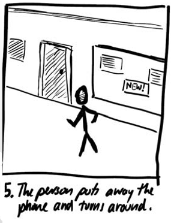

# 顺序故事板

- 视觉叙事
    - 一系列关键帧作为草图
    - 交互中各点的界面快照
- 刻画
    - 界面关键场景
    - 导致更改的转换

初始屏幕

扫描婴儿车

更改颜色

下订单

备用路径

扫描衬衫

触摸上一项

删除该项目

分支情节提要：从一个状态的多次转换的结果
- 用户操作
- 环境行动
- 系统配置

概览图：

# 叙事故事板

叙事故事板，也称叙述性故事板
- 讲个故事
- 用户体验
    - 界面只是故事的一部分
- 叙述的
    - 包括使用上下文
    - 更完整的故事

## 摄影术语

超远景(Extreme long short)/全景(wide shot)：包含环境、位置信息的镜头视角。

远景(long shot)：包含人的全身的镜头视角。

中景(medium shot)：包含人的头部和肩部的镜头视角。

过肩镜头(over-the-shoulder shot)：浏览人体肩膀以上的镜头视角。

主镜头(point-of-the-view shot)：揭示某个人能看到的一切事物的镜头视角。

近景(close-up shot)

## 大纲情节提要框架

五个方框足以说明一种情况：

## 发展故事情节

思考如下问题：
- 互动发生在哪里？
- 有什么问题？
- 一个人要做的任务是什么？
- 哪些人在场/他们的行动是什么？
- 他们使用什么对象/设备？
- 输入/输出是什么？
- 他们的行动如何解决问题？

案例故事背景：
- 弗雷德经过一个公告板。
- 他对1号公告的更多信息很感兴趣。
- 他用手机捕捉显示屏旁边的条形码。
- 他阅读手机上显示的详细信息。
- 他走开了。

故事情节：
1. 一个人经过广告牌。
2. 他注意到一则广告并对更多信息感兴趣。
3. 这个人为海报上的条形码拍照。
4. 移动电话下载有关该产品的详细信息。
5. 这个人把电话收起来，转过身来。

## 草图建立快照

使用适当的镜头：
- 超远景
- 强调上下文

## 继续故事情节

使用适当的镜头：
- 过肩镜头
- 强调某人在看感兴趣的东西

使用适当的镜头：
- 主镜头 
- 强调人的行为

使用适当的镜头：
- 特写镜头
- 显示详细信息

使用适当的镜头：
- 超远景
- 完成时显示上下文

## 强调动作和动作

用大箭头强调一个人走过：

旋转箭头强调运动：

问号揭示情感(兴趣)：

区域强调拍照行动：

重点强调收到的信息的作用：

箭头强调人走开：

## 演示和迭代

- 展示并接受批评(评论)
    - 现实吗？
    - 上下文可信吗？
    - 这个人的动机可信吗
    - 他们真的会这么做吗？
- 制定替代方案

# 中等逼真度原型

构建中等逼真度原型能够获得：
- 更真实的用户体验
- 更长的设计时间
- 更长的开发时间
- 夹杂某种程度的编程
- 幻灯片放映的感受

## 脚本化模拟

- 使用媒体工具创建情节提要
    - 由简单用户输入激活的场景转换
    - 一个简单的垂直原型
- 用户给出了一个非常紧凑的脚本/任务
    - 看起来像一个真实的系统
    - 脚本会破坏模拟

# 高保真原型

构建高保真原型能够获得：
- 更接近现实
- 更高的设计要求
- 更多开发时间
- 可作为其他团队(工程、质量保证、市场营销)的参考平台

