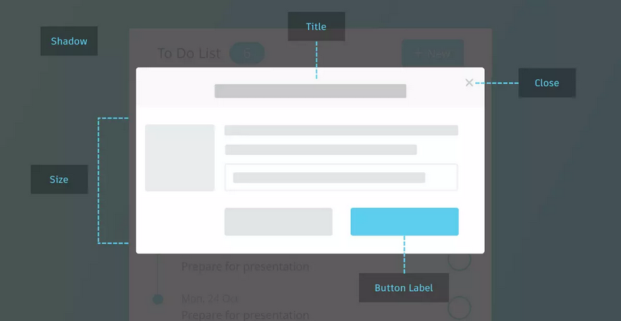
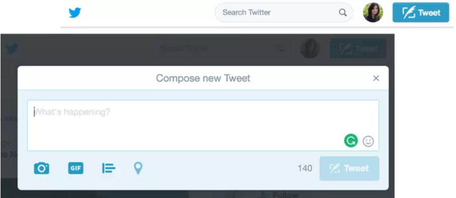
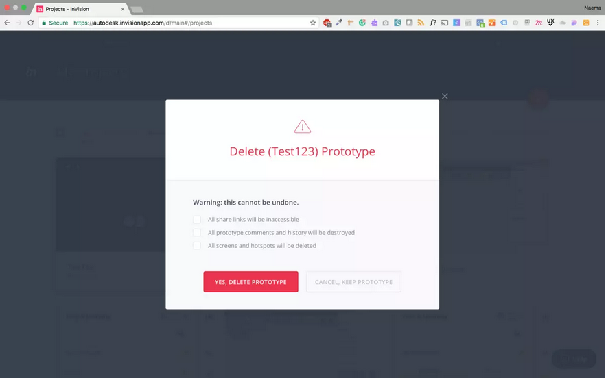
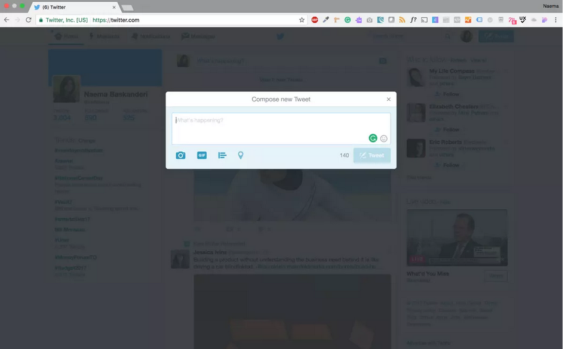
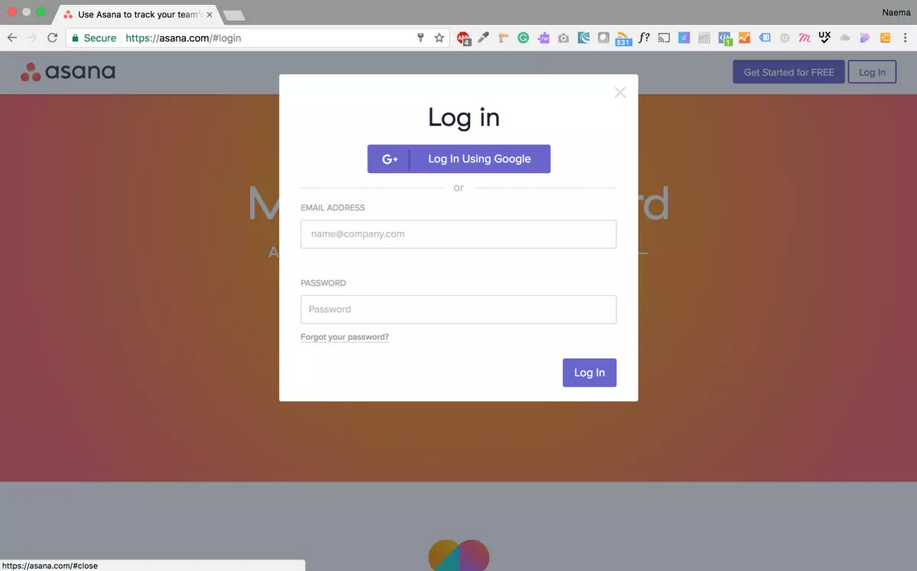
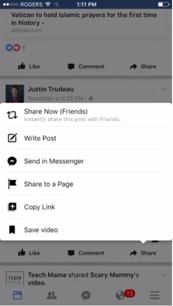
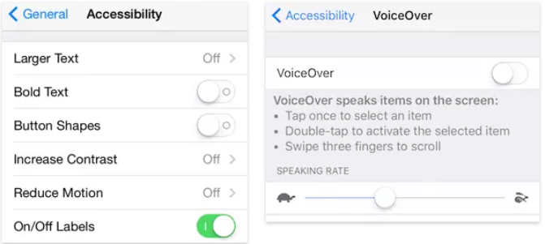

---
title: 模态窗口
date: 2020-09-26 19:41:51
summary: 本文解析模态窗口。
tags:
- 人机交互
- 软件工程
categories:
- 软件工程
---

# 前言

> 模态已成为今天的可怕的弹出窗口的版本。用户发现模态窗口很骚扰人，人们本能地自动关闭这些窗口。

模态窗口、叠加窗口、对话框、无论你叫它们什么，是时候重温这个UI模式了。当它们第一次来到现场，模态窗口是一个优雅的关于UI问题的解决方案。第一是它简化了UI，第二是它节省了屏幕空间。从那时起，设计师就已经采用了模态窗口，有些已经采取了极端方式。模态已成为今天的可怕的弹出窗口的版本。用户发现模态窗口很骚扰人，人们本能地自动关闭这些窗口。

# 定义

模态窗口是位于应用程序主窗口顶部的元素。它创建一个模态，该模态禁用于主窗口，但保持它与模态窗口可见作为它前面的子窗口。用户必须与模态窗口交互，才能返回到原有的应用程序。

# 用法

当你需要的时候，你可以考虑使用模态窗口。

## 吸引用户注意力

当你想要抓住用户对更重要的事情的注意力而打断用户当前的任务时，来使用模态窗口。

## 需要用户输入

当你想要从用户那里获取信息时使用。例如，用户注册和登录。

## 在界面环境中显示其他信息

当你想显示其他信息而不丢失父页面的环境时使用。例如，显示较大的图像或视频。

## 显示其他信息（不在界面环境中）

当你想要显示与父页面不直接相关的信息或与其他页面“独立”的选项时使用。例如，通知，但这可以通过“非阻塞”模态来完成。

注意：**不要使用显示错误，成功或警告的消息。要让它们在页面上**。

# 模态窗口的剖析

执行效果不佳的叠加可能会阻碍任务完成。为了确保你的模态不会妨碍你的方式，请务必包含以下内容：

## 逃生出口

给用户一种逃避方式，给他们一种方式来关闭模式。这可以通过以下方式实现：
- 取消按钮
- 关闭按钮
- 换码键
- 在窗口外单击

辅助功能提示;每个模态窗口必须具有一个键盘可访问控制以关闭该窗口。例如，换码键应该关闭窗口。

## 描述性标题

用模式标题向用户提供上下文。这能让用户知道他/她在哪里，因为他们没有离开原始页面。

提示：按钮标签（启动模态）和模态标题应该匹配。

## 按钮

按钮标签应该有可操作的，可理解的名称。这适用于任何情况下的按钮。对于模态，“关闭”按钮应以标记“关闭”的按钮或“X”的形式存在。

注意：不要让按钮标签混淆。如果用户正在尝试取消并且模态显现时出现另一个取消按钮，则会发生混乱。“我要取消删除吗？还是继续我的删除？”

## 尺寸和位置

模态窗口不应该太大或太小，你想要让它刚刚好。目标是协调好环境，因此模态不应该占据整个屏幕视图。内容应该适合模态。如果需要滚动条，你可以考虑创建一个新页面。

- 位置-上半部分的屏幕，由于如果放置较低的话在移动视图模态可能会丢失
- 尺寸-不要使用超过50%的屏幕覆盖

## 焦点

当你打开“封闭”模态（用户无法继续与模态交互）使用灯箱效果（使背景变暗）。这引起对模态的注意，并指示用户不能与父页面交互。

辅助功能提示：将键盘焦点放在模态上。

## 用户启动

弹出的模态不要让用户感到惊讶。让用户执行操作，如单击按钮，跟随链接或选项，触发模式。不请自来的模式可能会使用户感动惊讶，并导致快速解除窗口。

# 移动模式

模态和移动设备通常不能一起用。因为模态太大，查看内容很困难，占用太多或太小的屏幕空间。添加元素，如设备键盘和嵌套滚动条，用户左右捏和缩放试图捕捉模态窗口的字段。有更好的替代模态且不应该在移动设备上使用。

# 辅助功能

## 键盘

当创建模态时记得添加键盘辅助功能。考虑以下内容:

- 打开模态 —— 触发对话框的元素必须可以通过键盘访问。
- 将焦点移动到对话框 —— 一旦模态窗口打开，键盘焦点需要移动到顶部。
- 管理键盘焦点 —— 一旦焦点移动到对话框中，它应该被“捕获”在其中，直到对话框关闭。
- 关闭对话框 —— 每个叠加窗口必须具有键盘可访问控件才能关闭该窗口。

有关上面列表的更多信息，请查看Nomensa的博客文章

## ARIA

可访问的丰富网络应用程序（ARIA）定义了使万维网的内容和应用程序更容易访问的方法。

以下ARIA标签可以有助于创建可访问的模态：***Role = “dialog” , aria-hidden, aria-label***

有关ARIA的更多信息，请查阅Smashing杂志文章

此外，记住低视力用户。他们可以在显示器上使用屏幕放大镜来放大屏幕内容。一旦放大，用户只能看到部分屏幕。这里的模态将具有相同的效果，因为它们在移动。

# 结论

如果人们已经被训练成自动尝试关闭模态的话，为什么要使用它们呢？

获得用户的注意，保持环境和简化UI是模态的最佳优势。然而，也有一些缺点，因为它们中断了用户流，并且通过隐藏模态后面的内容使得不能与父页面交互。模态可能不总是答案。做出选择时请考虑以下事项：

## 清单

- 我们什么时候显示模态？
- 我们如何显示模态？
- 模态是什么样子的？
- 我们提供和收集什么信息？

有一个替代的UI组件模态：非模态或也叫作toast（谷歌在材料设计和微软中使用的术语）……

# 转载说明

文章链接：[《UI最佳实践：深度解析模态窗口》](http://www.woshipm.com/ucd/615277.html)
作者ID：[01实验室](http://www.woshipm.com/u/189989)
