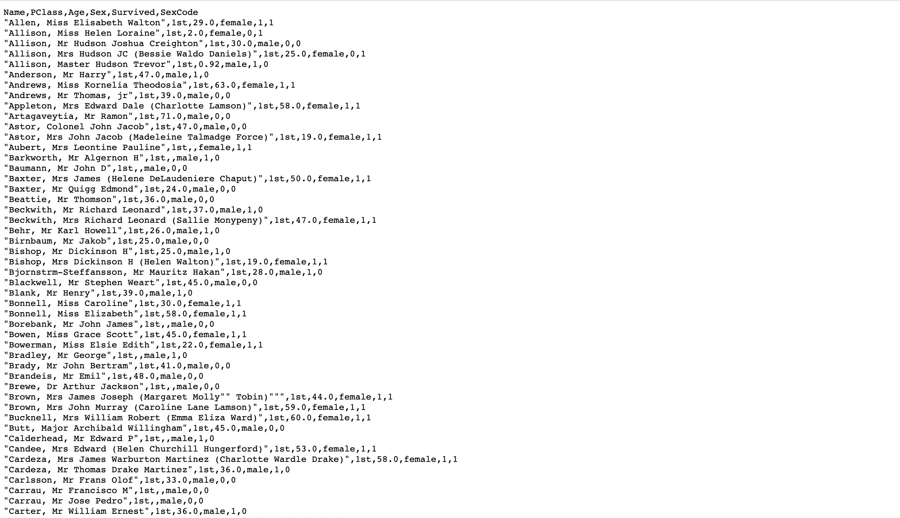
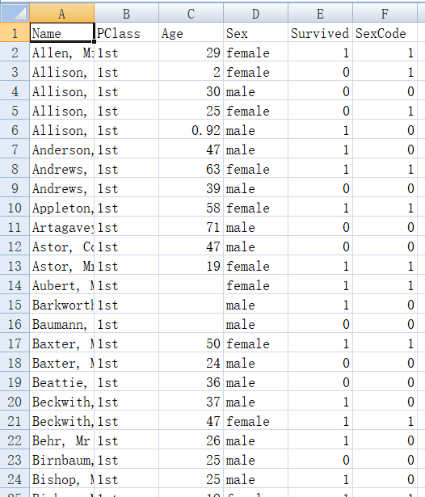
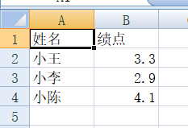
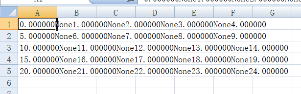
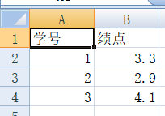

---
title: CSV必知必会
date: 2020-09-26 19:23:26
summary: 本文分享CSV的基础知识。
tags:
- CSV
categories:
- 程序设计
---

# CSV

逗号分隔值(Comma-Separated Values)，简称CSV，有时也称为字符分隔值，因为分隔字符也可以不是逗号。

CSV文件以纯文本形式存储表格数据，即数字和文本。纯文本意味着该文件是一个字符序列，不含必须像二进制数字那样被解读的数据。

CSV文件由任意数目的记录组成，记录间以某种换行符分隔。每条记录由字段组成，字段间的分隔符是其它字符或字符串，最常见的是逗号或制表符。通常，所有记录都有完全相同的字段序列。

CSV是一种通用的、相对简单的文件格式，被用户、商业和科学广泛应用。CSV最广泛的应用是在程序之间转移表格数据，而这些程序本身是在不兼容的(私有的和/或无规范的)格式上进行操作的。大量程序都支持某种CSV变体，至少将其作为一种可选择的输入/输出格式。

# TSV

制表符分隔值(Tab-Separated Values)，简称TSV。

TSV文件是一种用于储存数据的文本格式文件，其数据以表格结构(例如，数据库数据或电子表格数据)储存。每一行储存一条记录。每条记录的各个字段间以制表符(Tab)作为分隔。

TSV格式是一种被广泛支持的文件格式，它经常用来在不同的计算机程序之间传递数据，支持格式。 例如，TSV文件可以用来在数据库和电子表格之间传递数据。

TSV格式是CSV格式的一种变体。TSV格式以制表符作为字段间的分隔符号，CSV格式以逗号作为字段间的分隔符号。逗号本身是一种很常见的文本数据，因此常常会引起一些问题，而制表符在文本数据中相对少见。

# 浏览器下载CSV文件的方法

输入网址URL，打开CSV资源文件：



那么怎么下载这个csv文件呢？
- 方法一：直接保存网页就行，保存的不是.html而是.csv
- 方法二：复制全部文本，本地记事本保存temp.txt，转型.csv



如此，问题解决。

# Python处理CSV文件数据

```python
# -*- coding: utf-8 -*-

import csv

datas = [['姓名', '绩点'], ['小王', 3.3], ['小李', 2.9], ['小陈', 4.1]]
filename = 'csv1.csv'

with open('csv1.csv', 'w', newline='') as fw:
    w1 = csv.writer(fw)
    for row in datas:
        # 一次写一行
        w1.writerow(row)
        # 一次写多行
        # w1.writerows(datas)

with open(filename) as fr:
    r1 = csv.reader(fr)
    print(list(r1))
    for row in r1:
        # 逐行读取出来
        print(r1.line_num, row)
```

# Numpy处理CSV文件数据

```python
# -*- coding: utf-8 -*-

from numpy import loadtxt, dtype, genfromtxt, zeros
import numpy as np

a = np.arange(25).reshape(5, 5)
b = np.savetxt('csv2.csv', a, fmt='%f', delimiter=None)
print(a)

print('*'*10)

# 下面的代码会报错
# a1_array = loadtxt(filename)
# print(a1_array)

# print('*'*10)

a1_dtype = dtype([("学号", int), ("成绩", float)])
a1 = loadtxt('csv3.csv', dtype=a1_dtype, skiprows=1, delimiter=',')
print(a1)

print('*'*10)

data = np.loadtxt(r'csv1.csv', dtype='str', delimiter=',', skiprows=0)
print(type(data))
print(data)

print('*'*10)

data = genfromtxt('csv3.csv', delimiter=',', usecols=(0, 1))
print(data)
```

文件数据展示：




运行结果：
```
[[ 0  1  2  3  4]
 [ 5  6  7  8  9]
 [10 11 12 13 14]
 [15 16 17 18 19]
 [20 21 22 23 24]]
**********
[(1, 3.3) (2, 2.9) (3, 4.1)]
**********
<class 'numpy.ndarray'>
['姓名,绩点' '小王,3.3' '小李,2.9' '小陈,4.1']
**********
[[nan nan]
 [1.  3.3]
 [2.  2.9]
 [3.  4.1]]
```

# Pandas处理CSV文件数据

csv_test.csv数据：
```
1,2,3,4,5
2,3,4,5,6
3,4,5,6,7
4,5,6,7,8
5,6,7,8,9
```

Python编程实现：
```python
import pandas as pd

# 创建URL
url = 'csv_test.csv'

# 加载数据集
dataframe = pd.read_csv(url)

# 查看前三行数据
print(dataframe.head(3))
```

输出结果：
```
   1  2  3  4  5
0  2  3  4  5  6
1  3  4  5  6  7
2  4  5  6  7  8
```
