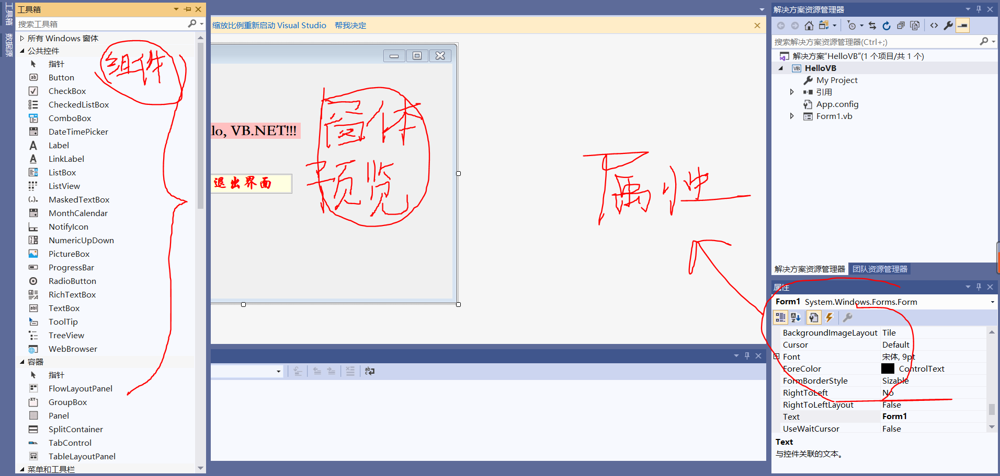
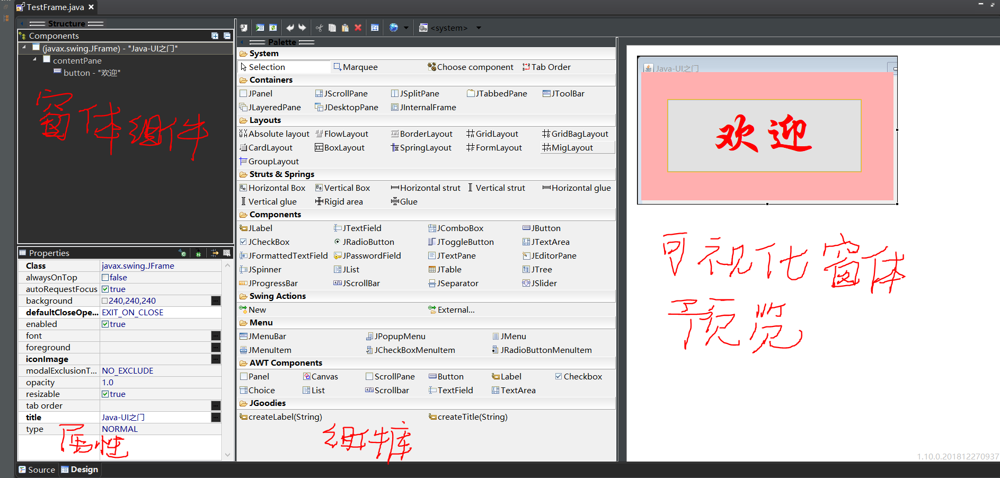

---
title: GUI
date: 2019-11-29 22:07:36
summary: 本文分享GUI开发技巧，以Java为例。
tags:
- GUI
categories:
- 程序设计
---

# GUI

图形用户界面（Graphical User Interface，简称 GUI，又称图形用户接口）是指采用图形方式显示的计算机操作用户界面。

图形用户界面是一种人与计算机通信的界面显示格式，允许用户使用鼠标等输入设备操纵屏幕上的图标或菜单选项，以选择命令、调用文件、启动程序或执行其它一些日常任务。与通过键盘输入文本或字符命令来完成例行任务的字符界面相比，图形用户界面有许多优点。图形用户界面由窗口、下拉菜单、对话框及其相应的控制机制构成，在各种新式应用程序中都是标准化的，即相同的操作总是以同样的方式来完成，在图形用户界面，用户看到和操作的都是图形对象，应用的是计算机图形学的技术。 

# Java的GUI支持

GUI方面的JFC（Java Foundation Classes，Java基础类库）包含AWT、Swing、辅助功能API、2D API以及拖放API。更强大JavaFX早已从JDK中剥离出去，下载JDK8以后的版本应该是不存在JavaFX的，而JavaFX甚至能提供给我们Web般的开发效果，比Swing视觉效果更好，开发起来也更复杂。

AWT(Abstract Window Toolkit)，中文译为抽象窗口工具包，该包提供了一套与本地图形界面进行交互的接口，是Java提供的用来建立和设置Java的图形用户界面的基本工具。AWT中的图形函数与操作系统所提供的图形函数之间有着一一对应的关系，称之为peers，当利用AWT编写图形用户界面时，实际上是在利用本地操作系统所提供的图形库。由于不同 操作系统的图形库所提供的样式和功能是不一样的，在一个平台上存在的功能在另一个平台上则可能不存在。为了实现Java语言所宣称的“一次编写，到处运行(write once, run anywhere)”的概念，AWT不得不通过牺牲功能来实现平台无关性，也即AWT所提供的图形功能是各种操作系统所提供的图形功能的交集。

Swing是一个用于开发Java应用程序用户界面的开发工具包。
以抽象窗口工具包（AWT）为基础使跨平台应用程序可以使用任何可插拔的外观风格。Swing开发人员只用很少的代码就可以利用Swing丰富、灵活的功能和模块化组件来创建优雅的用户界面。 工具包中所有的包都是以swing作为名称，例如javax.swing，javax.swing.event。

Sun公司已于2008年12月05日发布了JavaFX技术的正式版，它使开发者能利用 JavaFX 编程语言开发互联网应用程序(RIA）。该产品于2007年5月在JavaOne大会上首次对外公布。JavaFX技术主要应用于创建Rich Internet Applications（RIAs）。当前的JavaFX包括JavaFX脚本和JavaFX Mobile（一种运营于行动装置的操作系统），今后JavaFX将包括更多的产品。JavaFX Script编程语言（以下称为JavaFX）是一种declarative, statically typed（声明性的、静态类型）脚本语言。

# GUI开发学习方法

对于GUI的学习我有下面的看法：
 - 学习抓住核心三大核心内容：**组件与容器**、**布局设计与管理**、**事件监听与处理**。
 - 勤于动手，多写多练。不练习总是不能很好地掌握，这里代码动辄百行以上，凭空想象很难入门。
 - 养成**先做设计的**习惯，UI设计是学问，但我们即使是开发小的Demo也应该先画画图，进行调整以后再编码实现。
 - 学会看文档以及借助其他途径，自主的解决问题，因为很多问题的答案网上基本找不到。
 - 先学会自己写，但也要学会用插件工具加快开发速度（例如Window-Builder）。
 - 开发经验需要不断积累和总结。
 - 思维的转换很重要，要学习**MVC**设计模式（MVC模式和经典的23种设计模式不是一类东西），改变固有的命令行思维。

当理解和掌握了Java GUI的开发以后，就好比一个“搭积木”、“拼拼图”的游戏过程（虽然这个过程伴随着诸多令人头秃的不好体验），会渐至佳境。

# VB.NET开发工具与JavaGUI开发工具

先是看一下VB.NET开发工具——Visual Studio：

其实我们也都知道，VB.NET可以快速开发Windows环境下的GUI项目，VS的使用这里不加赘述，但看看它的开发方式，你可能就想：Java能不能也拖动生成然后再编码完善呢？

这里推荐Eclipse IDE + Window-Builder插件，开发视图如下：

左下角切换文本编辑器的视图和拖动窗体的视图，自己调节组件大小和进行布局管理，可以灵活添加事件监听器，从而大大简化了GUI的开发。

由于写过Window-Builder下的Swing代码，所以学VB.NET的时候上手很快。
