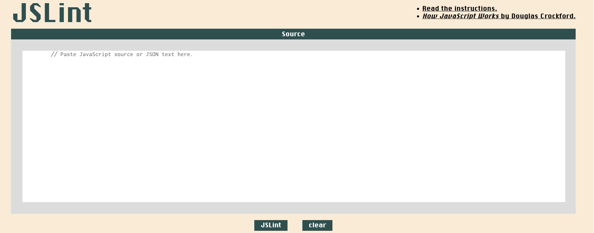
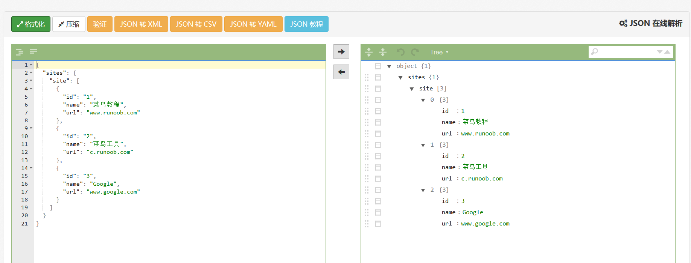

---
title: JSON必知必会
date: 2019-10-04 15:11:56
summary: 本文分享JSON的基础知识。
tags:
- JSON
categories:
- 程序设计
---

# JSON


原文(本人原创)：
- [JSON入门详解(一)-星拱北辰的CSDN博客](https://blog.csdn.net/weixin_43896318/article/details/102060462)
- [JSON入门详解(二)-星拱北辰的CSDN博客](https://blankspace.blog.csdn.net/article/details/104947854)

学习资料：
- [awesome-json](https://github.com/burningtree/awesome-json)
- [awesome-json-datasets](https://github.com/jdorfman/awesome-json-datasets)

## JSON简介

**JavaScript对象表示法**（JavaScript Object Notation，<font color="red">JSON</font>）由Douglas Crockford于2001年提出，已经成为RESTful接口设计中的事实标准，JSON数据格式使得应用程序可以通过RESTful API等方式在网络上进行数据通信，架构师和开发人员可以使用一整套现成的技术生态系统（鲜为人知的标准、工具和相关技术）来搭建设计精巧的应用程序。

JSON非常简单，由对象、数组、键值对这三种开发人员熟悉的结构体所组成。除了表现层状态转化（REpresentational State Transfer，REST），JSON在Node.js、MongoDB等NoSQL数据库、Kafka等消息平台等环境中也有应用。对于设计或实现Web移动端应用程序、RESTful API以及消息系统的架构师和开发人员，JSON都是有必要学习和研究的内容。

JSON不局限于某项技术，本身非私有，且可移植。对于产生（序列化）和读取（反序列化）JSON数据，绝大多数主流的现代编程语言和平台都可以提供优秀的JSON支持，如**JavaScript**、Ruby、**Java**、Groovy、**Go**、Scala、Perl、PHP、**Python**、Clojure、C#等等。

JSON是JavaScript对象字面量表示法的一个子集，因此可以无缝的与JavaScript开发融为一体。而JSON不仅仅是Ajax调用中**XML**的一个简单的替代品，它也日益成为互联网数据交换领域的骨干元素。严谨的标准和技术最佳实践加上对JSON的喜爱，有利于搭建一个真正优雅、有用而又高效的应用程序。事实上，现在能够用XML实现的功能都可以（也应当）用JSON实现。

JSON非常简洁，并且正在逐步替代XML成为互联网上主要的数据交换格式。它易于阅读，相关结构也很容易与软件开发人员所熟悉的概念对应起来，例如数组、对象和键值对。我们不用再挠头苦思某个东西应当是元素还是属性，也不用就这一点与人争论不休。与XML相比，对象及其数据成员这一组合**更适合面向对象的设计和开发**。由于节省了每个元素的开始标签与结束标签，JSON格式的额外开销更少、更为紧凑，所以JSON格式的文档一般比XML文档小。从企业级应用角度来看，与XML相比，JSON文档在网络上传递与处理更快，因此效率更高。

虽然JSON被设计为一种数据交换格式（通常用于REST），但如今JSON在**配置文件**中也占有一席之地，如Node.js和SublimeText等广泛应用的。Node.js使用package.json文件来定义其标准的npm包结构；SublimeText作为Web开发社区一款流行IDE，使用JSON来配置外观和包管理器。

总而言之，JSON广泛流行的主要原因有：
 - 基于JSON和RESTful API的爆发式增长
 - JSON基本数据结构的简洁性
 - JavaScript的日益流行

创始人Douglas Crockford认为JSON核心标准不会有新的版本，开发社区有新需要时，新的数据格式将直接替代JSON。<br>
事实上，JSON标准唯一化的目的是避免支持早期版本而在向后兼容的时候遇到陷阱（哪怕当前不是那么完美）。<br>
然而，“无版本”的理念仅适用于JSON核心数据格式，有些标准是JSON社区中其他人员提出的。

**[⬆ TOP](#json)**

## Demo

这里基于[jslint](http://www.jslint.com)工具校验JSON格式。

```javascript
{
  "description": "hello, json!"
}
```


```javascript
[
  "also",
  "a",
  "valid",
  "JSON",
  "doc"
]
```


**[⬆ TOP](#json)**

## JSON数据类型

JSON有六种数据类型：
- 对象（`{}`）：键值对的无序集合
- 数组（`[]`）：值的有序集合
- 字符串（`""`）
- 数值（整数 或 浮点数）
- 布尔值（`true` 或 `false`）
- 空（`null`）

### JSON对象

JSON本质上在键值对中存储数据，键值对中的数据用逗号（`,`）分隔，Key与Value之间用冒号（`:`）分隔。

每一个键名（如"name"）应该位于冒号（:）左边，而每一个键值（如"小明"）位于冒号的右边。

```javascript
{
  "name": "小明",
  "ID": "123456",
  "University": "Zhejiang University"
}
```

JSON对象由键值对组成，具有以下特征：
 - 由左大括号`{`和右大括号`}`括起来
 - 由一些无序的名称-值对构成，以逗号分隔
 - 可以是空对象`{}`
 - 可以内嵌在其他对象或者数组中

一个普通的JSON对象：

```javascript
{
  "address" : {
    "line1" : "555 Any Street",
    "city" : "Denver",
    "stateOrProvince" : "CO",
    "zipOrPostalCode" : "80202",
    "country" : "USA"
  }
}
```

一个带有内嵌数组的JSON对象：

```javascript
{
  "speaker" : {
    "firstName" : "Larson",
    "lastName" : "Richard",
    "topics" : ["JSON", "REST", "SOA"]
  }
}
```

一个内嵌其他JSON对象的JSON对象：

```javascript
{
  "speaker" : {
    "firstName" : "Larson",
    "lastName" : "Richard",
    "topics" : ["JSON", "REST", "SOA"],
    "address" : {
      "line1" : "555 Any Street",
      "city" : "Denver",
      "stateOrProvince" : "CO",
      "zipOrPostalCode" : "80202",
      "country" : "USA"
    }
  }
}
```
 
### JSON数组

JSON数组具有以下特征：
 - 由左中括号`[`和右中括号`]`括起来
 - 由一些有序的值构成，以逗号分隔
 - 可以是空数组`[]`
 - 可以内嵌在其他数组或者对象中
 - 具有以0或1开头的索引

一个内嵌其他对象和数组的数组：

```javascript
{
  "speakers": [
    {
      "firstName" : "Larson",
      "lastName" : "Richard",
      "topics" : ["JSON", "REST", "SOA"],
      "address" : {
        "line1" : "555 Any Street",
        "city" : "Denver",
        "stateOrProvince" : "CO",
        "country" : "USA"
      }
    },
    {
      "firstName" : "Tom",
      "lastName" : "Green",
      "topics" : ["JSON", "REST", "SOA"],
      "address" : {
        "line1" : "Fifth Avenue",
        "city" : "New York",
        "stateOrProvince" : "New York",
        "country" : "USA"
      }
    }
  ]
}
```

### JSON字符串

JSON字符串具有以下特征：
- JSON字符串由包含在双引号（" "）里面的零个或多个Unicode字符串组成。除此之外，还包括由反斜杠转义的字符：
    - `''`：双引号
    - `\\`：反斜杠
    - `\/`：斜杠
    - `\b`：退格
    - `\f`：换页
    - `\n`：换行
    - `\r`：回车
    - `\t`：Tab制表符
    - `\u`：后跟4位十六进制数字（表示一个Unicode字符）
- 由单引号(' ')引起来的JSON字符串是不合法的

```javascript
[
  "fred",
  "fred\t",
  "\b",
  "",
  "\t",
  "\u004A"
]
```

### JSON数值

JSON数值具有以下特征：
 - 数值永远是十进制数（只能出现数字0~9），不能以0开头
 - 数值可以存在由小数点（.）开头的小数部分
 - 数值可以是以10为底的指数，该指数用e或者E来表示，其后跟正号表示正指数幂（也可以不加），跟负号表示负指数幂
 - 数值不支持八进制数和十六进制数
 - 与JavaScript不同，数值不能是NaN后者Infinity
 - 浮点数值遵循JavaScript的双精度浮点数类型

```javascript
{
  "age" : 29,
  "cost" : 299.99,
  "temperature" : -10.5,
  "unitPrice" : 0.2,
  "speedOfLight1" : 1.23E11,
  "speedOfLight2" : 1.23e+11,
  "avogadro1" : 6.023e23,
  "avogadro2" : 6.023E+23,
  "oneHundredth" : 10e-3,
  "ontTenth" : 10E-2
}
```

### JSON布尔值

JSON布尔值存在以下特征：
 - 二值逻辑，只存在true或者false
 - 冒号（:）右边的true或者false不能用引号括起来

```javascript
{
  "isRegistered" : true,
  "emailValidated" : false
}
```

### null

严格意义上讲，null并不是一种类型，而是JSON中的一个特数值，表示数据缺失或无意义。

null具有以下特征：
 - 不能由括号括起来
 - 表示某个键或属性没有值或没有意义
 - 可用作占位符

```javascript
{
  "address" : {
    "line1" : "555 Any Street",
    "line2" : null,
    "city" : "Denver",
    "stateOrProvince" : "CO",
    "zipOrPostalCode" : "80202",
    "country" : "USA"
  }
}
```

 **[⬆ TOP](#json)**

## JSON注释

我们在开发中被强调注释的意义，然而JSON中根本就没有注释。

JSON在开始允许注释到移除注释，有下面原因：
 - 创始人认为注释没有用
 - JSON解释器在支持注释方面存在困难
 - 创始人发现有些注释被用于解析指令，这种对注释的滥用会彻底摧毁JSON的互操作性
 - 移除注释有利于JSON实现跨平台的可移植性

**[⬆ TOP](#json)**

## JSON文件及MIME类型

JSON文件的文件类型：`.json`

JSON文本的MIME类型：`application/json`


**[⬆ TOP](#json)**

## JSON编码规范

Google发布过JSON编码规范，比较详细，对API设计者和开发者最重要的是：
 - 属性名
 - 日期属性的值
 - 枚举值

### JSON属性名

属性名位于key-value对中间冒号的左侧（属性值位于右侧）。

JSON属性命名风格主要是有以下两种：
 - 小驼峰式命名法（lowerCamelCase）：除第一个词均为小写字母外，其余每个词均以大写字母开头
 - 以下划线分隔的短语（snake_case）：所有字母均小写，词与词之间用下划线（_）分隔

```javascript
{
  "firstName" : "John Smith"
}
```

### JSON日期值

Google的编码规范要求日期遵循RFC3339的格式。

```javascript
{
  "dateRegistered" : "2019-10-04T15:00:11-05:00"
}
```

### JSON经纬度值

Google建议遵循ISO6709标准。

```javascript
{
  "empireStateBilding" : "40.748747-73.985547"
}
```

### JSON编码缩进

JSON是序列化格式，不是呈现格式，缩进规则意义不大，两格缩进比较常用。此外，很多JSON格式化工具会让使用者自选具体缩进方案（两格、三格、四格等）。

**[⬆ TOP](#json)**

## JSON与XML

[完整Java代码链接](../../../java-gourmet-coffee)

下面是这里会用到的的部分类：

```java
public class Product {

    private String code;

    private String description;

    private double price;

    public Product(String code, String description, double price) {
        this.code = code;
        this.description = description;
        this.price = price;
    }

    public String getCode() {
        return this.code;
    }

    public String getDescription() {
        return this.description;
    }

    public double getPrice() {
        return this.price;
    }

    @Override
    public boolean equals(Object product) {
        return (product instanceof Product) && (this.getCode().equals(((Product)product).getCode()));
    }

    @Override
    public String toString() {
        return this.getCode() + "," + this.getDescription() + "," + this.getPrice();
    }

}
```

```java
public class OrderItem {

    private Product product;

    private int     quantity;

    public OrderItem(Product product, int quantity) {
        this.product = product;
        this.quantity = quantity;
    }

    public Product getProduct() {
        return this.product;
    }

    public void setQuantity(int quantity) {
        this.quantity = quantity;
    }

    public int getQuantity() {
        return this.quantity;
    }

    public double getValue() {
        return this.getProduct().getPrice() * this.getQuantity();
    }

    @Override
    public String toString() {
        return this.getQuantity() + "," + this.getProduct().getCode() + "," + this.getProduct().getPrice();
    }

}
```

```java
import java.util.ArrayList;
import java.util.List;

public class Order {

    private List<OrderItem> orderItemList = new ArrayList<>();

    public void addOrderItem(OrderItem orderItem) {
        this.orderItemList.add(orderItem);
    }

    public void removeOrderItem(OrderItem orderItem) {
        this.orderItemList.remove(orderItem);
    }

    public ArrayList<OrderItem> getAllOrderItem(){
        return this.orderItemList;
    }

    public OrderItem getOrderItem(Product product) {
        for (OrderItem orderItem : orderItemList) {
            if (orderItem.getProduct().equals(product)) {
                return orderItem;
            }
        }
        return null;
    }
    
    public int getNumberOfOrderItems() {
        return this.orderItemList.size();
    }

    public double getValue() {
        double value = 0.0;
        for (OrderItem orderItem : orderItemList) {
            value += orderItem.getValue();
        }
        return value;
    }

}
```

```java
import java.util.ArrayList;
import java.util.List;

public class Sales {

    private List<Order> orders = new ArrayList<>();

    public void addOrder(Order order) {
        this.orders.add(order);
    }

    public ArrayList<Order> getAllOrder(){
        return this.orders;
    }

    public int getNumberOfOrders() {
        return this.orders.size();
    }

}
```

XML格式的数据：

```xml
<?xml version="1.0" encoding="UTF-8" ?>
<SALES>
    <ORDER>
        <ORDERITEM>
            <PRODUCT>
                <CODE>A001</CODE>
                <DESCRIPTION>Almond Flavored Syrup</DESCRIPTION>
                <PRICE>9.0</PRICE>
            </PRODUCT>
            <QUANTITY>3</QUANTITY>
        </ORDERITEM>
        <ORDERITEM>
            <PRODUCT>
                <CODE>A002</CODE>
                <DESCRIPTION>Irish Creme Flavored Syrup</DESCRIPTION>
                <PRICE>9.0</PRICE>
            </PRODUCT>
            <QUANTITY>5</QUANTITY>
        </ORDERITEM>
    </ORDER>
    <ORDER>
        <ORDERITEM>
            <PRODUCT>
                <CODE>A001</CODE>
                <DESCRIPTION>Almond Flavored Syrup</DESCRIPTION>
                <PRICE>9.0</PRICE>
            </PRODUCT>
            <QUANTITY>1</QUANTITY>
        </ORDERITEM>
        <ORDERITEM>
            <PRODUCT>
                <CODE>A004</CODE>
                <DESCRIPTION>Caramel Flavored Syrup</DESCRIPTION>
                <PRICE>9.0</PRICE>
            </PRODUCT>
            <QUANTITY>2</QUANTITY>
        </ORDERITEM>
        <ORDERITEM>
            <PRODUCT>
                <CODE>A006</CODE>
                <DESCRIPTION>Gourmet Coffee Travel Thermo</DESCRIPTION>
                <PRICE>18.0</PRICE>
            </PRODUCT>
            <QUANTITY>3</QUANTITY>
        </ORDERITEM>
    </ORDER>
    <ORDER>
        <ORDERITEM>
            <PRODUCT>
                <CODE>A009</CODE>
                <DESCRIPTION>Gourmet Coffee 36 Cup Filters</DESCRIPTION>
                <PRICE>45.0</PRICE>
            </PRODUCT>
            <QUANTITY>100</QUANTITY>
        </ORDERITEM>
    </ORDER>
</SALES>
```

JSON格式的数据：

```json
[
    [
        {
            "product":{
                "code":"A001",
                "description":"Almond Flavored Syrup",
                "price":"9.0"
            },
            "quantity":"3"
        },
        {
            "product":{
                "code":"A002",
                "description":"Irish Creme Flavored Syrup",
                "price":"9.0"
            },
            "quantity":"5"
        }
    ],
    [
        {
            "product":{
                "code":"A001",
                "description":"Almond Flavored Syrup",
                "price":"9.0"
            },
            "quantity":"1"
        },
        {
            "product":{
                "code":"A004",
                "description":"Caramel Flavored Syrup",
                "price":"9.0"
            },
            "quantity":"2"
        },
        {
            "product":{
                "code":"A006",
                "description":"Gourmet Coffee Travel Thermo",
                "price":"18.0"
            },
            "quantity":"3"
        }
    ],
    [
        {
            "product":{
                "code":"A009",
                "description":"Gourmet Coffee 36 Cup Filters",
                "price":"45.0"
            },
            "quantity":"100"
        }
    ]
]
```

JSON与XML的相似之处：
- 都是纯文本
- 都具有自我描述性，我们能够理解其含义
- 都具有嵌套的层次结构
- 都可通过JavaScript进行解析，Java等语言也支持解析二者
- 包含的数据都可使用AJAX（Asynchronous Javascript And XML）进行传输

JSON与XML的不同之处：
- JSON没有结束标签，XML严格遵循格式化
- JSON更简洁
- JSON读写速度更快
- JSON可以使用标准的JavaScript函数来解析，而XML需要使用XML解析器来解析
- JSON能使用数组
- JSON不使用保留字

**[⬆ TOP](#json)**

## 高级编程语言操作JSON数据

### JavaScript操作JSON数据

```html
<!DOCTYPE html>
<html>
  <head>
    <meta charset="utf-8">
    <title>JSON</title>
  </head>
  <body>
    <h1>员工信息</h1>
    <p>
      ID: <span id="js_id"></span><br/>
      Name: <span id="js_name"></span><br/>
      Age: <span id="js_age"></span><br/>
      Email: <span id="js_email"></span><br/>
    </p>
    <script>
      var jsonObj= {
        "id":"1111",
        "name":"王富贵", 
        "age":"30",
        "email":"fugui@gmail.com"
      };
      document.getElementById("js_id").innerHTML=jsonObj.id 
      document.getElementById("js_name").innerHTML=jsonObj.name
      document.getElementById("js_age").innerHTML=jsonObj.age
      document.getElementById("js_email").innerHTML=jsonObj.email
    </script>
  </body>
</html>
```

JavaScript对JSON的核心操作：
- `JSON.parse()`：将JSON字符串转换为JavaScript对象
- `JSON.stringify()`：将JavaScript对象转换为JSON字符串

#### JSON.parse()

**语法格式：**

```javascript
JSON.parse(text[, reviver])
```
**参数说明：**

|参数名称|参数意义|是否必选|
|:---:|:---:|:---:|
|text | 有效的JSON字符串 |√ |
|reviver | 每个成员都会调用的、用于转换结果的函数 | × |

**实例：**

```javascript
var str = '{"id":"1111", "name":"王富贵", "age":"30", "email":"fugui@gmail.com"}';
var jsonObj = JSON.parse(str);
```

#### JSON.stringify()

**语法格式：**

```javascript
JSON.stringify(value[, replacer[, space]])
```

**参数说明：**

|参数名称|参数意义|是否必选|
|:---:|:---:|:---:|
| value | 要转换的JavaScript值（通常为对象或数组） | √ |
| replacer | 用于转换结果的函数或数组 | × |
| space | 文本添加缩进、空格和换行符 | × |

space参数：
- 值为10以下整数表示这么多空格
- 值为10以上整数表示10个空格
- 可以用其他分隔符表示比如"\t"

**实例：**

接收到数据：

```javascript
var jsonObj = {"id":"1111", "name":"王富贵", "age":"30", "email":"fugui@gmail.com"};
```
JSON.parse()：

```text
var str = JSON.stringify(jsonObj);
```

**注意事项：**

JSON不允许包含函数，JSON.stringify()会删除JavaScript对象的函数，包括key和value。不建议使用函数，如果非要用，也要先将函数转换为字符串再用。

#### JSON访问对象值

```html
<p>
  ID: <span id="js_id"></span><br/> 
  Name: <span id="js_name"></span><br/> 
  Age: <span id="js_age"></span><br/> 
  Email: <span id="js_email"></span><br/> 
</p>
```

读取id属性为例，还有如下两种写法：
- 使用点号（.）访问：
  ```javascript
  var a = jsonObj.id;
  ```
- 使用数组式方括号（[]）访问：
  ```javascript
  var a = jsonObj["id"];
  ```

#### JSON循环读取对象

可以使用`for-in`来循环对象读取对象属性和值（参考Java的`for-each`循环）：

```javascript
for (a in jsonObj) {
    document.getElementById("attribute").innerHTML += a + "：" + jsonObj[a]+ "<br>";
}
```

完整代码：
```html
<!DOCTYPE html>
<html>
  <head>
    <meta charset="utf-8">
    <title>JSON</title>
  </head>
  <body>
    <h1>员工信息</h1>
    <p id="attribute"></p>
    <script>
      var jsonObj= {
        "id":"1111",
        "name":"王富贵", 
        "age":"30",
        "email":"fugui@gmail.com"
      };
      for (a in jsonObj) {
        document.getElementById("attribute").innerHTML += a + "：" + jsonObj[a]+ "<br>";
      }
    </script>
  </body>
</html>
```

### JSON修改对象值

可以直接用点（.）运算符或者方括号（[]）来访问并修改对象的值。

下面的代码，把“王富贵”的名字，改成了“陈二狗”：

```javascript
jsonObj.name="陈二狗";
```

完整代码：
```html
<!DOCTYPE html>
<html>
  <head>
    <meta charset="utf-8">
    <title>JSON</title>
  </head>
  <body>
    <h1>员工信息</h1>
    <p id="attribute"></p>
    <script>
      var jsonObj= {
        "id":"1111",
        "name":"王富贵", 
        "age":"30",
        "email":"fugui@gmail.com"
      };
      jsonObj.name="陈二狗";
      for (a in jsonObj) {
        document.getElementById("attribute").innerHTML += a + "：" + jsonObj[a]+ "<br>";
      }
    </script>
  </body>
</html>
```

#### JSON删除对象值

可以使用`delete`关键词+点（.）运算符或者方括号（[]）来访问并删除对象的值。

下面的代码，删除了王富贵的年龄和Email：
```javascript
delete jsonObj.age;
delete jsonObj["email"];
```
完整代码：

```html
<!DOCTYPE html>
<html>
  <head>
    <meta charset="utf-8">
    <title>JSON</title>
  </head>
  <body>
    <h1>员工信息</h1>
    <p id="attribute"></p>
    <script>
      var jsonObj= {
        "id":"1111",
        "name":"王富贵", 
        "age":"30",
        "email":"fugui@gmail.com"
      };
      delete jsonObj.age;
      delete jsonObj["email"];
      for (a in jsonObj) {
        document.getElementById("attribute").innerHTML += a + "：" + jsonObj[a]+ "<br>";
      }
    </script>
  </body>
</html>
```

#### JSON访问数组元素

数组和对象相似，包括访问、修改、删除的点号（.）和删除的delete关键词。

不同的是，使用属性名+方括号的访问方式被换成了使用索引数字+方括号的访问方式（参考其他编程语言）。

### Python操作JSON数据

pandas库：
```python
import pandas as pd

# 创建一个URL
url = 'test.json'
# 加载数据
dataframe = pd.read_json(url, orient='columns')
# 查看前两行数据
print(dataframe.head(2))
```

### Java操作JSON数据

[jackson](http://www.tutorialspoint.com/jackson)框架：
```java
import com.fasterxml.jackson.databind.ObjectMapper;
import org.example.entity.Person;

import java.io.File;
import java.io.IOException;

public class JacksonDemo {
    public static void main(String[] args) throws IOException {
        ObjectMapper mapper = new ObjectMapper();
        Person obj = new Person(123, "Sam");
        // 写为字符串
        String text = mapper.writeValueAsString(obj);
        // 写入文件
        mapper.writeValue(new File("person.json"), obj);
        // 写入字节流
        byte[] bytes = mapper.writeValueAsBytes(obj);
        System.out.println(text);
        // 从字符串中读取
        Person p = mapper.readValue(text, Person.class);
        System.out.println(p);
        // 从字节流中读取
        p = mapper.readValue(bytes, Person.class);
        System.out.println(p);
        // 从文件中读取
        p = mapper.readValue(new File("person.json"), Person.class);
        System.out.println(p);
    }
}
```

gson框架：
```java
import com.google.gson.Gson;
import org.example.entity.Person;

public class GsonDemo {
    public static void main(String[] args) {
        Person person = new Person(123, "Sam");
        System.out.println(person);
        Gson gson = new Gson();
        String personJson = gson.toJson(person);
        System.out.println(personJson);
        Person p = gson.fromJson(personJson, Person.class);
        System.out.println(p);
    }
}
```

**[⬆ TOP](#json)**

## JSON工具

### JSON语法校验器

推荐[JSLint](http://www.jslint.com)工具校验JSON语法格式，[JSONLint](https://github.com/zaach/jsonlint)等工具也可以。



### JSON在线解析器

推荐[菜鸟教程的JSON在线解析器](http://c.runoob.com/front-end/53)，支持如下功能：
- **格式化**
- **压缩**
- **验证**
- **JSON→XML**
- **JSON→CSV**
- **JSON→YAML**



**[⬆ TOP](#json)**

## JSON注意事项

1. JSON不能存储Date对象。如果想要存储Date对象，需要将其转换为字符串，再将字符串转换为Date对象。

**[⬆ TOP](#json)**
