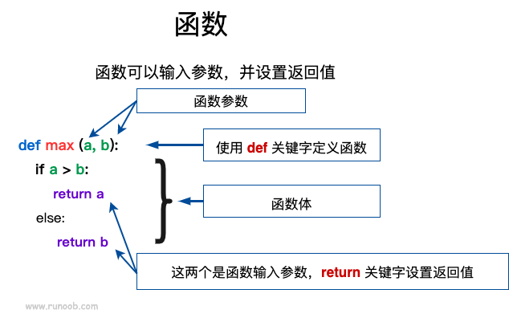

---
title: Lambda表达式
date: 2023-02-07 15:28:06
summary: 本文分享Java和Python的lambda表达式。
tags:
- 程序设计
categories:
- 程序设计
---

# Java的lambda表达式

Java支持Lambda表达式，用来部分替代繁琐的匿名内部类。Lambda表达式支持将代码作为方法参数，允许使用更简洁的代码来创建只有一个抽象方法的接口(函数式接口)。

Lambda表达式的目标类型必须是明确的函数式接口。Java的函数式接口可以包括多个default方法、static方法，但只能声明一个abstract方法。函数式接口通过注解@FunctionalInterface修饰，该注解会提示编译器在编译时检查目标接口是否是符合规范的函数式接口。

例如，以下接口都是函数式接口：
```java
@FunctionalInterface
interface ChatInterface {
    void chat(String sentence);
}
```

```java
@FunctionalInterface
interface GreetInterface {
    void greet();
}
```

```java
@FunctionalInterface
interface AddInterface {
    void add(int a, int b);
}
```

Lambda表达式的结果是一个对象或者基本类型变量，因此可以用Lambda表达式为变量赋值。

为了保证Lambda表达式语法正确性，它的正确使用场景有三种：
- 将Lambda表达式赋给函数式接口类型的变量。
- 将Lambda表达式作为函数式接口类型的参数传给某个方法。
- 使用函数式接口对Lambda表达式进行强制类型转换。

例如如下代码利用`java.lang.Runnable`这个函数式接口用Lambda表达式创建线程：
```java
Runnable r = () -> {
    System.out.println("线程已被创建");
}
```

但直接给Object类型变量赋值Lambda表达式是不可以的，因为Object不是函数接口：
```java
Object object = () -> {
    System.out.println("线程已被创建");
}
```

Lambda表达式的组成：
- 形参列表：方法存在形参列表，Lambda表达式自然也存在形参列表，形参列表用圆括号`()`括起来，允许省略形参类型。
    - 如果只有一个形参，形参列表的圆括号可以省略。
        ```java
        ChatInterface chat = sentence -> {
            System.out.println("Hello!");
            System.out.println(sentence);
        }
        ```
    - 如果没有任何形参，形参列表的圆括号不能省略。
        ````java
        GreetInterface greet = () -> System.out.println("Hello, World!");
        ````
- 箭头：`->`，不能省略。
- 代码块：抽象方法的实现，需要用花括号`{}`括起来。
    - 如果代码块只包含一条语句，则可以省略花括号。
        ````java
        GreetInterface greet = () -> System.out.println("Hello, World!");
        ````
    - 如果代码块只有一条return语句，可以省略`return`关键词。
        ````java
        AddInterface add = (a, b) -> a + b;
        ````

对于代码块只有一条语句的Lambda表达式，代码块还可以引用方法和构造方法，需要借助双英文冒号`::`。
- 引用static方法：`类名::类方法`，全部参数传递给方法，例如`Integer::valueOf`
- 引用特定实例的实例方法：`特定实例::实例方法`，全部参数传递给方法，例如`"hello"::length`
- 引用某类实例的实例方法：`类名::实例方法`，第一个参数是方法调用者，其余参数传递给方法，例如`String::substring`
- 引用某类的构造方法：`类名::new`，全部参数传递给构造方法，例如`String::new`

Lambda表达式与匿名内部类的区别：
- 匿名内部类可以为任意接口创建实例，而Lambda表达式只能为函数式接口创建实例。
- 匿名内部类可以为抽象类甚至普通类创建实例，而Lambda表达式只能为函数式接口创建实例。
- 匿名内部类实现的抽象方法的方法体中允许调用该接口定义的default方法，而Lambda表达式的代码块不允许调用接口中定义的default方法(但是Lambda表达式创建的对象可以调用函数式接口中定义的default方法)。

# Python的lambda表达式

引用菜鸟教程的图描述Python通常函数的语法：



Python支持不使用def语句这样标准的形式定义一个函数，而是使用lambda来创建匿名函数。

所谓匿名函数，不过是一个lambda表达式，其函数体比def简单很多。匿名函数的主体是一个表达式，而不是一个代码块，因此只能在lambda表达式中封装有限的逻辑进去。匿名函数拥有自己的命名空间，不能访问自己参数列表之外或全局命名空间里的参数。

虽然lambda函数看起来只能写一行，却不等同于C/C++的内联函数。C/C++的内联函数在调用小函数时不占用栈内存从而增加运行效率。

语法格式：
```python
lambda [arg1 [,arg2,.....argn]]:expression
```

参考代码：
```python
x = lambda a : a + 10
print(x(5))
```
