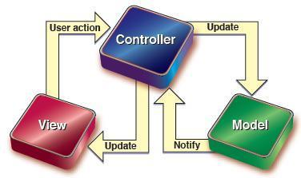

---
title: MVC模式
date: 2021-02-17 08:33:35
summary: 本文浅析Web开发的MVC模式。
tags:
- MVC
categories:
- 程序设计
---

# MVC

MVC全名是Model-View-Controller，是模型(Model)-视图(View)-控制器(Controller)的缩写，MVC是一种非常常见的三层架构模式，它把每个模块划分为模型层(Model Layer)、视图层(View Layer)、控制器层(Controller Layer)等部分。MVC结构的每个部分具有各自的功能与作用，并以最少的耦合协同工作，从而提高应用的可扩展性和可维护性。

MVC模式最主要精神之一就是Model与View的分离，这两者之间的分离可使网页设计人员和程序开发人员能够独立工作、互不影响，从而提高了开发效率和维护效率。除此之外，将模型层的数据处理建立成许多组件，增加了程序的可复用性、增进了系统功能的可扩展性；将业务流程集中在控制层，增强了程序流程的清晰度。

# MVC的结构

MVC模式结构：
- Model层
是应用系统的核心层，负责封装数据和业务逻辑操作，模型层可以分为数据模型和业务模型。数据模型用来对用户请求的数据和数据库查询的数据进行封装；业务模型用来对业务处理逻辑进行封装。
- View层
视图提供模型的表示，它是应用程序的外观，是直接和用户交互的界面。它一方面向用户显示相关的数据，另一方面用来接收用户的输入数据，提交给控制器处理。
- Controller层
主要的工作就是控制整个系统处理的流程，控制器对用户的请求做出处理。它创建并调用模型的相关数据业务处理方法，选择相应的视图返回给客户端。 

# MVC的流程

总的来说，MVC处理过程为：首先控制器接收用户的请求，并选择相应的模型去处理；模型根据控制器的调用进行相应的业务处理逻辑，并返回数据；最后控制器选择相应的视图将数据显示给客户端用户。 

# MVC的优点

1. 耦合性低：视图层和业务层分离，这样就允许更改视图层代码而不用重新编译模型和控制器代码，同样，一个应用的业务流程或者业务规则的改变只需要改动MVC的模型层即可。因为模型与控制器和视图相分离，所以很容易改变应用程序的数据层和业务规则。
2. 重用性高：MVC模式允许使用各种不同样式的视图来访问同一个服务器端的代码，因为多个视图能共享一个模型，它包括任何Web(HTTP)浏览器或者无线浏览器，比如，用户可以通过电脑也可通过手机来订购某样产品，虽然订购的方式不一样，但处理订购产品的方式是一样的。由于模型返回的数据没有进行格式化，所以同样的构件能被不同的界面使用。
3. 部署快，生命周期成本低：MVC使开发和维护用户接口的技术含量降低。使用MVC模式使开发时间得到相当大的缩减，它使程序员集中精力于业务逻辑，界面程序员集中精力于表现形式上。
4. 可维护性高：分离视图层和业务逻辑层也使得Web应用更易于维护和修改。

# MVC的缺点

1. 完全理解MVC比较复杂。由于MVC模式提出的时间不长，加上同学们的实践经验不足，所以完全理解并掌握MVC不是一个很容易的过程。
2. 调试困难。因为模型和视图要严格的分离，这样也给调试应用程序带来了一定的困难，每个构件在使用之前都需要经过彻底的测试。
3. 不适合小型、中等规模的应用程序。在一个中小型的应用程序中，强制性的使用MVC进行开发，往往会花费大量时间，并且不能体现MVC的优势，同时会使开发变得繁琐。
4. 增加系统结构和实现的复杂性。对于简单的界面，严格遵循MVC，使模型、视图与控制器分离，会增加结构的复杂性，并可能产生过多的更新操作，降低运行效率。
5. 视图与控制器间的过于紧密的连接并且降低了视图对模型数据的访问。视图与控制器是相互分离，但却是联系紧密的部件，视图没有控制器的存在，其应用是很有限的，反之亦然，这样就妨碍了他们的独立重用。依据模型操作接口的不同，视图可能需要多次调用才能获得足够的显示数据。对未变化数据的不必要的频繁访问，也将损害操作性能。
