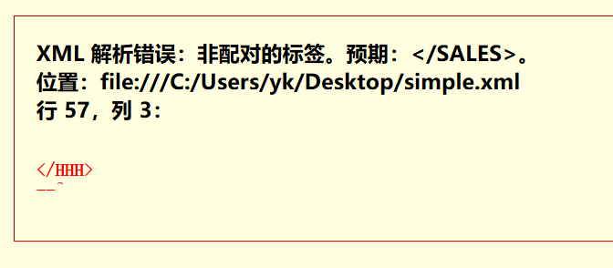

# XML

可扩展标记语言，简称<font color="red">XML</font>， 是一种标记语言，与<font color="orange">HTML</font>比较相似，被设计为具有自我描述性。

<font color="red">XML</font>是W3C的推荐标准，其设计宗旨是传输数据，而非显示数据。

<font color="orange">HTML</font>标签是预定义的，而<font color="red">XML</font>标签没有被预定义，开发者需要自行定义标签。

# XML语法规则纲要

- **XML文档必须有且只有一个根元素**
- **XML元素都必须有一个关闭标签**
- **XML标签对大小写敏感**
- **XML元素必须被正确的嵌套**
- **XML属性值必须加引号**

# XML文档必须有且只有一个根元素

对于下面的XML文档：
```xml
<?xml version="1.0" encoding="UTF-8" ?>
<SALES>
    <ORDER>
        <ORDERITEM>
            <PRODUCT>
                <CODE>A001</CODE>
                <DESCRIPTION>Almond Flavored Syrup</DESCRIPTION>
                <PRICE>9.0</PRICE>
            </PRODUCT>
            <QUANTITY>3</QUANTITY>
        </ORDERITEM>
        <ORDERITEM>
            <PRODUCT>
                <CODE>A002</CODE>
                <DESCRIPTION>Irish Creme Flavored Syrup</DESCRIPTION>
                <PRICE>9.0</PRICE>
            </PRODUCT>
            <QUANTITY>5</QUANTITY>
        </ORDERITEM>
    </ORDER>
    <ORDER>
        <ORDERITEM>
            <PRODUCT>
                <CODE>A001</CODE>
                <DESCRIPTION>Almond Flavored Syrup</DESCRIPTION>
                <PRICE>9.0</PRICE>
            </PRODUCT>
            <QUANTITY>1</QUANTITY>
        </ORDERITEM>
        <ORDERITEM>
            <PRODUCT>
                <CODE>A004</CODE>
                <DESCRIPTION>Caramel Flavored Syrup</DESCRIPTION>
                <PRICE>9.0</PRICE>
            </PRODUCT>
            <QUANTITY>2</QUANTITY>
        </ORDERITEM>
        <ORDERITEM>
            <PRODUCT>
                <CODE>A006</CODE>
                <DESCRIPTION>Gourmet Coffee Travel Thermo</DESCRIPTION>
                <PRICE>18.0</PRICE>
            </PRODUCT>
            <QUANTITY>3</QUANTITY>
        </ORDERITEM>
    </ORDER>
    <ORDER>
        <ORDERITEM>
            <PRODUCT>
                <CODE>A009</CODE>
                <DESCRIPTION>Gourmet Coffee 36 Cup Filters</DESCRIPTION>
                <PRICE>45.0</PRICE>
            </PRODUCT>
            <QUANTITY>100</QUANTITY>
        </ORDERITEM>
    </ORDER>
</SALES>
```

删去根元素\<SALES>：
```xml
<?xml version="1.0" encoding="UTF-8" ?>
<ORDER>
    <ORDERITEM>
        <PRODUCT>
            <CODE>A001</CODE>
            <DESCRIPTION>Almond Flavored Syrup</DESCRIPTION>
            <PRICE>9.0</PRICE>
        </PRODUCT>
        <QUANTITY>3</QUANTITY>
    </ORDERITEM>
    <ORDERITEM>
        <PRODUCT>
            <CODE>A002</CODE>
            <DESCRIPTION>Irish Creme Flavored Syrup</DESCRIPTION>
            <PRICE>9.0</PRICE>
        </PRODUCT>
        <QUANTITY>5</QUANTITY>
    </ORDERITEM>
</ORDER>
<ORDER>
    <ORDERITEM>
        <PRODUCT>
            <CODE>A001</CODE>
            <DESCRIPTION>Almond Flavored Syrup</DESCRIPTION>
            <PRICE>9.0</PRICE>
        </PRODUCT>
        <QUANTITY>1</QUANTITY>
    </ORDERITEM>
    <ORDERITEM>
        <PRODUCT>
            <CODE>A004</CODE>
            <DESCRIPTION>Caramel Flavored Syrup</DESCRIPTION>
            <PRICE>9.0</PRICE>
        </PRODUCT>
        <QUANTITY>2</QUANTITY>
    </ORDERITEM>
    <ORDERITEM>
        <PRODUCT>
            <CODE>A006</CODE>
            <DESCRIPTION>Gourmet Coffee Travel Thermo</DESCRIPTION>
            <PRICE>18.0</PRICE>
        </PRODUCT>
        <QUANTITY>3</QUANTITY>
    </ORDERITEM>
</ORDER>
<ORDER>
   <ORDERITEM>
        <PRODUCT>
            <CODE>A009</CODE>
            <DESCRIPTION>Gourmet Coffee 36 Cup Filters</DESCRIPTION>
            <PRICE>45.0</PRICE>
        </PRODUCT>
        <QUANTITY>100</QUANTITY>
    </ORDERITEM>
</ORDER>
```

就会解析错误：


错因在第20行的\<ORDER>上，也就是说，新的XML文档在被浏览器解析的时候默认了\<ORDER>是根元素，而第一次\<\ORDER>出现的时候，意味着整个XML文档的结束，后面仍有\<ORDER>就不合法，XML文档树可不是森林，必须单根。

# XML元素都必须有一个关闭标签

HTML中经常有不写关闭标签的情况而并不会解析错误。即使是HTML5，也被迫向某些陋习妥协了，比如\<p>等等。

但是XML语法要求严格，标签必须被关闭。

如果我们删去上面代码最后一行的\<\SALES>，就会解析错误：


当然了，我们这时以根元素举的例子，错误原因来自于文档解析到结尾仍没出现根元素\<SALES>的关闭标签\<\SALES>，这是不被允许的。

事实上，任何XML元素都是如此。

# XML标签对大小写敏感

一般的编程语言都对大小写敏感。XML虽不是编程语言，但也对大小写敏感。

也就是说\<SALES>与\<sales>是完全不同的标签。

我们将上面代码的最后一行的\<\SALES>换成\<\sales>：


显示解析错误：


再换成\<HHH>，看看解析情况：



都是“非配对的标签”。

# XML元素必须被正确的嵌套

这个问题是说，比如我们\<SALES>嵌套了\<ORDER>，收尾顺序就得是先\<\ORDER>后\<\SALES>，有栈的意味。

如果胆敢出现FIFO队列式的先\<\SALES>后\<\ORDER>，就算嵌套错误，导致解析错误。

# XML属性值必须加引号

有关属性的问题我在[这篇文章](https://blog.csdn.net/weixin_43896318/article/details/104585441)中已经讲过很详细了，就不再细说。

必须注意的一点是：XML属性值必须加引号。

XML属性其实换成JSON显得更直白，就和Python的字典一个样子，key:value式的KV对，只不过这个value不管是什么值，都必须加引号，就比如下面的例子：

```xml
<PRODUCT id="202003010001">
```

**不能**写成下面的样子：

```xml
<PRODUCT id=202003010001>
```

XML不管属性值是不是数值，反正必须加引号！！！

# Demo-XML文档

这份代码是自己以前写的[一篇博文](https://blankspace.blog.csdn.net/article/details/104575081)中的：

```xml
<?xml version="1.0" encoding="UTF-8" ?>
<SALES>
    <ORDER>
        <ORDERITEM>
            <PRODUCT>
                <CODE>A001</CODE>
                <DESCRIPTION>Almond Flavored Syrup</DESCRIPTION>
                <PRICE>9.0</PRICE>
            </PRODUCT>
            <QUANTITY>3</QUANTITY>
        </ORDERITEM>
        <ORDERITEM>
            <PRODUCT>
                <CODE>A002</CODE>
                <DESCRIPTION>Irish Creme Flavored Syrup</DESCRIPTION>
                <PRICE>9.0</PRICE>
            </PRODUCT>
            <QUANTITY>5</QUANTITY>
        </ORDERITEM>
    </ORDER>
    <ORDER>
        <ORDERITEM>
            <PRODUCT>
                <CODE>A001</CODE>
                <DESCRIPTION>Almond Flavored Syrup</DESCRIPTION>
                <PRICE>9.0</PRICE>
            </PRODUCT>
            <QUANTITY>1</QUANTITY>
        </ORDERITEM>
        <ORDERITEM>
            <PRODUCT>
                <CODE>A004</CODE>
                <DESCRIPTION>Caramel Flavored Syrup</DESCRIPTION>
                <PRICE>9.0</PRICE>
            </PRODUCT>
            <QUANTITY>2</QUANTITY>
        </ORDERITEM>
        <ORDERITEM>
            <PRODUCT>
                <CODE>A006</CODE>
                <DESCRIPTION>Gourmet Coffee Travel Thermo</DESCRIPTION>
                <PRICE>18.0</PRICE>
            </PRODUCT>
            <QUANTITY>3</QUANTITY>
        </ORDERITEM>
    </ORDER>
    <ORDER>
        <ORDERITEM>
            <PRODUCT>
                <CODE>A009</CODE>
                <DESCRIPTION>Gourmet Coffee 36 Cup Filters</DESCRIPTION>
                <PRICE>45.0</PRICE>
            </PRODUCT>
            <QUANTITY>100</QUANTITY>
        </ORDERITEM>
    </ORDER>
</SALES>
```

# 树形抽象


# XML与树形结构

XML文档**必须有一个根元素**，自己指定即可，在样例XML里是\<SALES>~\<\SALES>。

XML 文档中的元素形成了一棵**文档树**。这棵树从根部开始，并扩展到树的叶子结点。

以样例XML为例，树形结构如下：
- **\<SALES>**
  - **\<ORDER>**
    - **\<ORDERITEM>**
      - **\<PRODUCT>**
        - **\<CODE>**
        - **\<DESCRIPTION>**
        - **\<PRICE>**
      - **\<QUANTITY>**

我的XML文档就是按照Java代码中的依赖关系设计的。

父、子以及兄弟等术语用于描述XML元素之间的关系，类似于数据结构的树。
父元素下是子元素。
相同层上的子元素互为兄弟元素。

所有的XML元素都可以有文本内容和属性（类似 HTML）。

# XML属性

XML也可以指定属性的，比如[下面的代码](https://blankspace.blog.csdn.net/article/details/104575081)：

```xml
<?xml version="1.0" encoding="UTF-8" ?>
<SALES>
    <ORDER>
        <ORDERITEM>
            <PRODUCT>
                <CODE>A001</CODE>
                <DESCRIPTION>Almond Flavored Syrup</DESCRIPTION>
                <PRICE>9.0</PRICE>
            </PRODUCT>
            <QUANTITY>3</QUANTITY>
        </ORDERITEM>
        <ORDERITEM>
            <PRODUCT>
                <CODE>A002</CODE>
                <DESCRIPTION>Irish Creme Flavored Syrup</DESCRIPTION>
                <PRICE>9.0</PRICE>
            </PRODUCT>
            <QUANTITY>5</QUANTITY>
        </ORDERITEM>
    </ORDER>
    <ORDER>
        <ORDERITEM>
            <PRODUCT>
                <CODE>A001</CODE>
                <DESCRIPTION>Almond Flavored Syrup</DESCRIPTION>
                <PRICE>9.0</PRICE>
            </PRODUCT>
            <QUANTITY>1</QUANTITY>
        </ORDERITEM>
        <ORDERITEM>
            <PRODUCT>
                <CODE>A004</CODE>
                <DESCRIPTION>Caramel Flavored Syrup</DESCRIPTION>
                <PRICE>9.0</PRICE>
            </PRODUCT>
            <QUANTITY>2</QUANTITY>
        </ORDERITEM>
        <ORDERITEM>
            <PRODUCT>
                <CODE>A006</CODE>
                <DESCRIPTION>Gourmet Coffee Travel Thermo</DESCRIPTION>
                <PRICE>18.0</PRICE>
            </PRODUCT>
            <QUANTITY>3</QUANTITY>
        </ORDERITEM>
    </ORDER>
    <ORDER>
        <ORDERITEM>
            <PRODUCT>
                <CODE>A009</CODE>
                <DESCRIPTION>Gourmet Coffee 36 Cup Filters</DESCRIPTION>
                <PRICE>45.0</PRICE>
            </PRODUCT>
            <QUANTITY>100</QUANTITY>
        </ORDERITEM>
    </ORDER>
</SALES>
```

也可以改成：

```xml
<?xml version="1.0" encoding="UTF-8" ?>
<SALES>
    <ORDER>
        <ORDERITEM>
            <PRODUCT code="A001" description="Almond Flavored Syrup" price="9.0"></PRODUCT>
            <QUANTITY>3</QUANTITY>
        </ORDERITEM>
        <ORDERITEM>
            <PRODUCT code="A002" description="Irish Creme Flavored Syrup" price="9.0"></PRODUCT>
            <QUANTITY>5</QUANTITY>
        </ORDERITEM>
    </ORDER>
    <ORDER>
        <ORDERITEM>
            <PRODUCT code="A001" description="Almond Flavored Syrup" price="9.0"></PRODUCT>
            <QUANTITY>1</QUANTITY>
        </ORDERITEM>
        <ORDERITEM>
            <PRODUCT code="A004" description="Caramel Flavored Syrup" price="9.0"></PRODUCT>
            <QUANTITY>2</QUANTITY>
        </ORDERITEM>
        <ORDERITEM>
            <PRODUCT code="A006" description="Gourmet Coffee Travel Thermo" price="18.0"></PRODUCT>
            <QUANTITY>3</QUANTITY>
        </ORDERITEM>
    </ORDER>
    <ORDER>
        <ORDERITEM>
            <PRODUCT code="A009" description="Gourmet Coffee 36 Cup Filters" price="45.0"></PRODUCT>
            <QUANTITY>100</QUANTITY>
        </ORDERITEM>
    </ORDER>
</SALES>
```

# 浏览器解析


# 有关XML属性必知必会

- 元素的属性表示了元素的额外信息
- 元素的属性值要加引号，必须加引号
- 元素的多个属性之间使用空格（“ ”）来分隔
- 某个元素的某个属性只能有一个值
- ……

# XML属性要慎用

XML的属性不建议大量使用，因为这不是我们使用XML而想看到的。

列举三点因使用属性而可能引起的一些问题：

- 属性不能包含多个值（元素可以）
- 属性不能包含树结构（元素可以）
- 属性不容易扩展（难以应对未来的变化）

XML具有扩展性好的优点，但属性的滥用会带来XML文档的低可读性和低可维护性。
我们应该尽量使用元素来描述数据，而仅仅使用属性来提供与数据无关的信息。

特别是上面的例子，绝对不可取。这种用法，是典型的错误用法，我只是为了表示二者可以转化而已。。。

# XML属性的健康使用

有时候会向元素分配 id 引用。这些 id 索引可用于唯一标识 XML 元素，它起作用的方式与 HTML 中 id 属性是类似的。

比如下面的代码：

```xml
<?xml version="1.0" encoding="UTF-8" ?>
<SALES>
    <ORDER>
        <ORDERITEM>
            <PRODUCT id="202003010001">
                <CODE>A001</CODE>
                <DESCRIPTION>Almond Flavored Syrup</DESCRIPTION>
                <PRICE>9.0</PRICE>
            </PRODUCT>
            <QUANTITY>3</QUANTITY>
        </ORDERITEM>
        <ORDERITEM>
            <PRODUCT id="202003010002">
                <CODE>A002</CODE>
                <DESCRIPTION>Irish Creme Flavored Syrup</DESCRIPTION>
                <PRICE>9.0</PRICE>
            </PRODUCT>
            <QUANTITY>5</QUANTITY>
        </ORDERITEM>
    </ORDER>
    <ORDER>
        <ORDERITEM>
            <PRODUCT id="202003010003">
                <CODE>A001</CODE>
                <DESCRIPTION>Almond Flavored Syrup</DESCRIPTION>
                <PRICE>9.0</PRICE>
            </PRODUCT>
            <QUANTITY>1</QUANTITY>
        </ORDERITEM>
        <ORDERITEM>
            <PRODUCT id="202003010004">
                <CODE>A004</CODE>
                <DESCRIPTION>Caramel Flavored Syrup</DESCRIPTION>
                <PRICE>9.0</PRICE>
            </PRODUCT>
            <QUANTITY>2</QUANTITY>
        </ORDERITEM>
        <ORDERITEM>
            <PRODUCT id="202003010005">
                <CODE>A006</CODE>
                <DESCRIPTION>Gourmet Coffee Travel Thermo</DESCRIPTION>
                <PRICE>18.0</PRICE>
            </PRODUCT>
            <QUANTITY>3</QUANTITY>
        </ORDERITEM>
    </ORDER>
    <ORDER>
        <ORDERITEM>
            <PRODUCT id="202003010006">
                <CODE>A009</CODE>
                <DESCRIPTION>Gourmet Coffee 36 Cup Filters</DESCRIPTION>
                <PRICE>45.0</PRICE>
            </PRODUCT>
            <QUANTITY>100</QUANTITY>
        </ORDERITEM>
    </ORDER>
</SALES>
```

上面的 id 属性仅仅是一个标识符，用于标识不同的便签。它并不是便签数据的组成部分，所以不会有害，是XML属性的有益使用。
