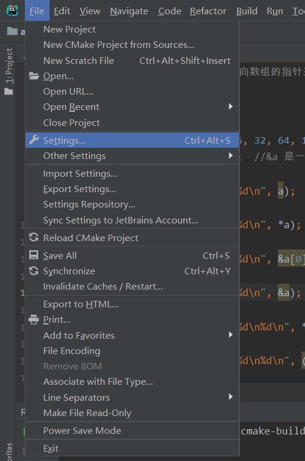

# HTTP请求乱码

在进行请求参数传递时，经常会遇到请求数据为中文时的乱码问题，当Form表单的文本域中输入中文时会产生乱码问题，出现乱码的原因与客户端的请求编码方式（GET请求或POST请求）以及服务器的处理编码方式有关。

## GET请求乱码

GET请求参数以“?”或“&”为连接字符附加在URL地址后，根据网络标准RFC1738规定，只有字母和数字以及一些特殊符号和某些保留字才可以不经过编码直接用于URL，因此在请求参数为中文时必须先由浏览器进行编码后才能发送给服务器，服务器端对GET请求参数依照服务器本身默认的字符集进行解码。

在服务器端，由于GET请求参数是作为请求行发送给服务器的，因此Servlet在通过getParameter()获取请求参数时，并不能使用setCharacterEncoding(charset)方法指定的字符集进行解码，而是依照服务器本身默认的字符集进行解码。

Tomcat服务器各版本中默认的URIEncoding字符集并不完全相同，例如，Tomcat6和Tomcat7都默认为“ISO-8859-1”，这类版本中，对于GET请求的中文参数必须经处理后才会避免乱码问题，因此在实际开发中尽量避免使用GET请求来传递中文参数。

## POST请求乱码

浏览器会按当前显示页面所采用的字符集对请求的中文数据进行编码，而后再以报文体的形式传送给服务器，Servlet在调用getParameter()方法获取参数时，会以HttpServletRequest对象的getCharacterEncoding()方法返回的字符集对其进行解码，而该方法的返回值在未经过setCharacterEncoding(charset)方法设置编码的情况下为null，这时getParameter()方法将以服务器默认的“ISO-8859-1”字符集对参数进行解码，而“ISO-8859-1”字符集并不包含中文，于是造成中文参数的乱码问题。

解决办法：
在调用getParameter()方法前先调用setCharacterEncoding(charset)方法设定与页面请求编码相同的解码字符集。

# Python跨OS移植乱码

Windows系统上能运行的Python程序，传到Linux系统上就无法运行，`python main.py`报错：<font color="red">SyntaxError: Non-ASCII character '\xe8' in file main.py on line 7, but no encoding declared; see http://python.org/dev/peps/pep-0263/ for details</font>

解决方法是：在文件头添加一行：`# -*- coding: utf-8 -*-`，即可正常运行。

如果解决不了，你要看看自己的编码，让二者匹配即可。有的时候应该这么写：
```python
# coding:gbk
```

# JMeter乱码

`/bin/jmeter.properties`文件搜到`sampleresult.default.encoding=ISO-8859-1`，更换成：

```shell
sampleresult.default.encoding=UTF-8
```

# BeautifulSoup解析数据乱码

<font color="red">Traceback (most recent call last):
  File "XXX.py", line 6, in \<module>
    lines = f.readlines()
UnicodeDecodeError: 'gbk' codec can't decode byte 0xa2 in position 216: illegal multibyte sequence</font>

遇到此情况，就是编码格式的问题了，我们应该设置编码格式为UTF-8：
`with open('test.html', 'r', encoding='UTF-8') as f:`

## bs4.FeatureNotFound

<font color="red">Traceback (most recent call last):
  File "XXX.py", line 11, in \<module>
    soup = BeautifulSoup(string, "lxml")
  File "...\venv\lib\site-packages\bs4\\_\_init\_\_.py", line 228, in \_\_init\_\_
    % ",".join(features))
bs4.FeatureNotFound: Couldn't find a tree builder with the features you requested: lxml. Do you need to install a parser library?</font>

这个问题的产生原因是缺少lxml库，可以`pip install lxml`：


测试代码：
```python
from bs4 import

string = ""

with open('test.html', 'r', encoding='UTF-8') as f:
    lines = f.readlines()
    for i in lines:
        string = '%s %s' % (string, i)

# 解析HTML
soup = BeautifulSoup(string, "lxml")

# 查找id为"b_id"的div标签，并查看文本
print(soup.find("div", {"id": "b_id"}).text)
```

```html
<!DOCTYPE html>
<html lang="ch">
<head>
    <meta charset="UTF-8">
    <title>测试页面</title>
</head>
<body>
    <div id="a_id">
        <div id="b_id">
            <div id="c_id">
                大碗宽面，真香！
            </div>
        </div>
    </div>
</body>
</html>
```

```


                 大碗宽面，真香！
             

```

```html
<!DOCTYPE html>
<html lang="ch">
<head>
    <meta charset="UTF-8">
    <title>测试页面</title>
</head>
<body>
    <div id="a_id">
        <div id="b_id">
            <div id="c_id">大碗宽面，真香！</div>
        </div>
    </div>
</body>
</html>
```

```

大碗宽面，真香！

```

```html
<!DOCTYPE html>
<html lang="ch">
<head>
    <meta charset="UTF-8">
    <title>测试页面</title>
</head>
<body>
    <div id="a_id">
        <div id="b_id"><div id="c_id">大碗宽面，真香！</div></div>
    </div>
</body>
</html>
```


```
大碗宽面，真香！
```

可见这东西与文档格式有关，它会关注到空白字符，和浏览器解析显示不同。

# Matplotlib绘图乱码

本图的坐标轴需要使用中文，我们按照库函数的使用方法，可能会写出这样的代码：

```python
import numpy as np
import matplotlib.pyplot as plt
import matplotlib as mpl

mu = 60.0
sigma = 2.0
x = mu + sigma*np.random.randn(500)

bins = 50

fig, ax = plt.subplots(1, 1)

n, bins, patches = ax.hist(x, bins, density=True, histtype="bar", facecolor="#99FF33", edgecolor="#00FF99", alpha=0.75)

y = ((1/(np.power(2*np.pi, 0.5)*sigma))*np.exp(-0.5*np.power((bins-mu)/sigma, 2)))

ax.plot(bins, y, color="#7744FF", ls="--", lw=2)

ax.grid(ls=":", lw=1, color="gray", alpha=0.2)

ax.text(54, 0.2, r"$y=\frac{1}{\sqrt{2\pi}\sigma}e^{-\frac{(x-\mu)^2}{2\sigma^2}}$", {"color":"#FF5511", "fontsize":20})

ax.set_xlabel("体重")
ax.set_ylabel("概率密度")
ax.set_title(r"体重的直方图：$\mu=60.0$, $\sigma=2.0$", fontsize=16)

plt.show()
```

完整代码：[Matplotlib在直方图中添加概率密度曲线和数学表达式](https://blankspace.blog.csdn.net/article/details/104328977)

接下来就会爆一堆“红字”（异常），制出的图是这样的：


红线围住的区域都是乱码。

## 解决方法

首先尝试加上utf-8题头注释：
```python
# -*- coding:utf-8 -*-
```

结果还是一样的，乱码。

正确的处理方式是在代码中加入这两行代码：
```python
mpl.rcParams["font.sans-serif"] = ["KaiTi"]
mpl.rcParams["axes.unicode_minus"] = False
```


# IDE文本编辑乱码

## CLion文本编辑乱码


### 解决方法1

打开 File → Settings...：


选择 Editor，再选中 File Encodings：


调一下UTF-8，完成设置，然后点OK：


底部还有UTF-8：


改成GBK：


还有个弹窗，点Convert即可完成设置。

重新运行：


### 解决方法2

文件是UTF-8格式，对于CLion命令行输出中文乱码的问题，解决方法是输入`Ctrl+Shift+Alt+/`：


修改后即可在命令行看到正确不乱码的输出！
