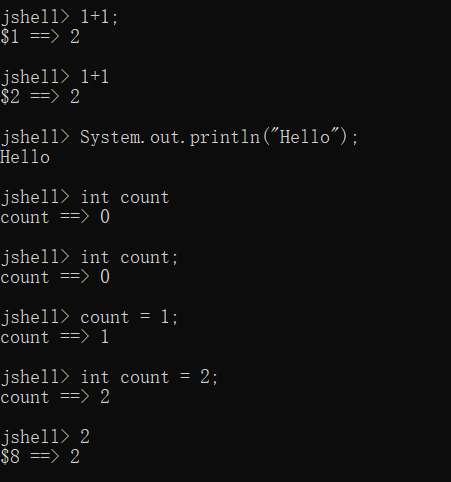
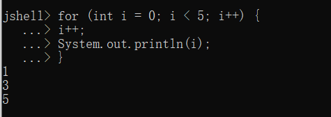
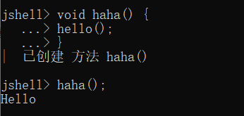
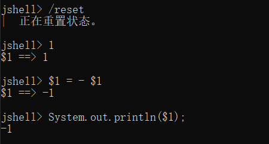

# 交互式编程

## Java交互式编程

Java9开始，Java推出JShell工具用于交互式编程。

JShell提供了一个交互式环境，允许快速、方便地尝试使用Java代码。JShell实现了所谓的“读取-执行-打印”循环（REPL）。使用这个机制，会提示用户输入一段代码。接着读取并执行它。然后JShell显示与代码相关的结果。接下来JShell会提示用户输入下一段代码，继续处理（如循环）。在JShell中，输入的每个代码段都被称为片段。

理解JShell的关键是使用它不需要输入完整的Java程序。每个输入的代码片段都能在输入的同时执行，这是可能的，因为JShell会自动处理与Java程序相关的许多信息，这允许用户只考虑具体功能，而不需要编写完整的程序。因此，JShell在初学Java的时候显得非常有用。

当然，JShell也可以供有经验的程序员使用。因为JShell存储了状态信息，所以可以在JShell中输入多行代码段，并运行它们。因此需要对某个概念建立起原型的时候，JShell是非常有用的，因为它允许以交互方式尝试使用代码，而不需要开发、编译完整的程序。

JShell中的所有命令都是以/开头。

| 命令 | 功能 |
|:----:|:----:|
| /! | 运行刚刚输入的代码段 |
| /n | 指定要运行的第n个代码段 |
| /exit | 退出JShell |
| /edit | 编辑一个代码段 |
| /list | 列出已输入的代码 |
| /list count | 列出已输入的count的声明 |
| /imports | 列出已导入的包名 |
| /save \*filename*  | 保存会话（当前源代码） |
| /save \*filename* -all | 保存会话（当前源代码），包括输入不正确的 |
| /save \*filename* -history | 保存会话的历史（例如输入的命令列表） |
| /open \*filename* | 加载保存过的会话 |
| /types | 显示类、接口和枚举 |
| /methods | 显示方法 |

1. 打开终端，输入`jshell`启动JShell。

2. JShell基本操作：
    - 输入一个表达式/算式进行运算。
    - 直接打印一个临时变量。
    - 运行一个Java语句（可以带结尾分号也可以不带）。
    - 定义变量。
    - 直接覆盖变量而不担心已定义而导致不能重新定义。
    - ……

3. JShell支持简单的代码块：
    - 没有大括号就等待分号结尾然后执行。


    - 有大括号就等待右大括号收尾。


4. JShell可以定义方法，基本相当于过程化的函数。JShell支持方法重载。

JShell支持方法间的调用。

JShell支持函数的向前引用，即支持一个函数调用其他哪怕暂时未被定义的函数，但不能直接调用。


未创建的方法可以随后补充。

补充方法后即可调用。
5. JShell支持面向对象，可以定义普通类并实例化。

JShell可以利用类的对象引用属性和方法，甚至null也不会出现空指针异常，只是显示null。JShell可以定义枚举。

JShell可以使用接口和注解。

6. JShell支持import、文件I/O与异常。

可见：上述包是除了lang包以外，JShell自动为我们导入的包。
JShell可处理异常，不需要catch。除了下面列出的包，其他的包需要自己导入。

7. JShell充分支持临时变量。

8. 退出JShell应该使用/exit而不是\exit。


## Python交互式编程

终端输入`python`或`python3`即可进入Python命令交互模式，输入`exit()`退出。

当键入一个多行结构时，续行是必须的。
例如：
```python
>>> flag = True
>>> if flag :
...     print("条件为真")
... 
```

## JavaScript交互式编程

键盘按下`F12`，开启浏览器Console：


可以直接在浏览器控制台输入JavaScript语句进行交互：


# 脚本式编程

## Python脚本式编程

Python脚本通常使用`python hello.py`执行，如果是python3则是`python3 hello.py`。

Linux/Unix系统中，开发者可以在脚本顶部添加`#! /usr/bin/env python3`，让Python脚本可以像Shell脚本一样可直接执行。随后可通过chmod命令`chmod +x hello.py`为脚本增加执行权限。再输入`./hello.py`即可运行脚本。

## JavaScript脚本式编程

推荐阅读：[Web网页脚本引入](https://blankspace.blog.csdn.net/article/details/129192846)

推荐阅读：[Web网页脚本执行](https://blankspace.blog.csdn.net/article/details/129373855)
